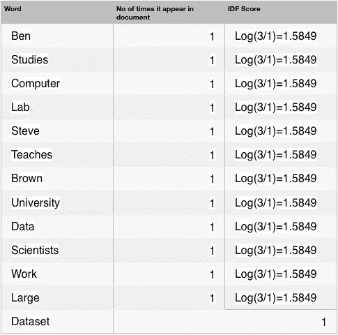
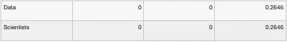

# TF-IDF 相似性得分

> 原文：<https://medium.datadriveninvestor.com/tf-idf-for-similarity-scores-391c3c8788e8?source=collection_archive---------1----------------------->

**什么是 TF-IDF？**

TF-IDF 是术语频率-逆文档频率的意思，是用于计算一个词对集合或语料库中的文档的重要性的数字统计方法。

当涉及到冠词(a，an，The)的重要性和没有被重复超过一次的单词的重要性时，传统的通过单词在文档中的频率来计算单词重要性的方法失效了。重要性与单词在文档中出现的次数成比例增加，但是被单词在语料库(数据集)中的频率抵消。

**如何计算 TF-IDF？**

## 检索词频率

假设我们有一组英文文本文档，并希望对与查询“the brown cow”最相关的文档进行排序。一种简单的方法是删除不包含所有三个单词“the”、“brown”和“cow”的文档，但是仍然会留下许多文档。为了进一步区分它们，我们可以计算每个术语在每个文档中出现的次数；一个术语在一个文档中出现的次数称为它的*词频*。但是，在文件长度变化很大的情况下，通常会进行调整(参见下面的定义)。术语加权的第一种形式可以概括为:

> 在文档中出现的术语的权重简单地与术语频率成比例。

## 逆文档频率

因为“the”这个词非常常见，所以“词频”往往会错误地强调那些碰巧更频繁使用“the”这个词的文档，而不会对更有意义的词“brown”和“cow”给予足够的重视。术语“The”不是区分相关和不相关文档和术语的好关键词，不像不太常用的词“brown”和“cow”。因此，结合了*逆文档频率*因子，该因子减少了在文档集中非常频繁出现的术语的权重，并增加了很少出现的术语的权重。

[](https://www.datadriveninvestor.com/2020/02/19/five-data-science-and-machine-learning-trends-that-will-define-job-prospects-in-2020/) [## 将定义 2020 年就业前景的五大数据科学和机器学习趋势|数据驱动…

### 数据科学和 ML 是 2019 年最受关注的趋势之一，毫无疑问，它们将继续发展…

www.datadriveninvestor.com](https://www.datadriveninvestor.com/2020/02/19/five-data-science-and-machine-learning-trends-that-will-define-job-prospects-in-2020/) 

因此，逆文档频率(idf)可以概括为:

> *术语的特异性可以被量化为其出现的文档数量的反函数。*

## 支持上述理论概念的例子

让我们用 3 个文档来说明这是如何工作的。

文档 1:本在计算机实验室研究计算机。文档 2: 史蒂夫在布朗大学教书。
**Doc 3:** 数据科学家研究大型数据集。

假设我们使用以下查询对这些文档进行搜索:**数据科学家**

该查询是自由文本查询。它是指在搜索界面中自由键入查询词的查询，没有任何连接搜索操作符。

## 步骤 1:计算术语频率(tf)

频率表示特定术语 *t* 在文档 *d* 中出现的次数。因此，

```
tf(t, d) = N(t, d), wherein tf(t, d) = term frequency for a term *t* in document *d*.N(t, d)  = number of times a term *t* occurs in document *d*
```

我们可以看到，随着一个术语在文档中出现得越多，它就变得越重要，这是合乎逻辑的。我们可以使用向量来表示单词袋模型中的文档，因为术语的顺序并不重要。文档中的每个唯一术语都有一个条目，其值是术语频率。

下面是每个文档中的术语及其出现频率。

[N(t，d)]

`**tf for document 1:**`

本->1，学习-> 1，计算机-> 2，实验室-> 1

文档 1 的向量空间表示:**【1，1，2，1】**

`**tf for document 2:**`

史蒂夫-> 1，教师-> 1，布朗-> 1，大学-> 1

文档 2 的向量空间表示:**【1，1，1，1】**

`**tf for document 3:**`

数据-> 1，科学家-> 1 工作-> 1，大型-> 1，数据集-> 1

文档 3 的向量空间表示:**【1，1，1，1，1】**

因此，将文档表示为公共向量空间中的向量被称为*向量空间模型*，这对信息检索非常重要。

由于我们处理的是依赖于出现次数的词频，因此，越长的文档越受青睐。为了避免这种情况，将 ***术语频率*** 正常化

```
tf(t, d) = N(t, d) / ||D||
wherein, ||D|| = Total number of term in the document
```

`**||D|| for each document:**`

单据||D||172536

下面给出了所有文档的归一化词频，即 **[N(t，d) / ||D||]**

`**Normalized TF for Document 1:**`

本-> 0.143，学-> 0.143，计算机-> 0.2860，实验室-> 0.143

文档 1 的向量空间表示:**【0.143，0.143，0.286，0.143】**

`**Normalized tf for document 2:**`

史蒂夫-> 0.2，教师-> 0.2，布朗-> 0.2，大学-> 0.2

文档 2 的向量空间表示:**【0.2，0.2，0.2，0.2】**

`**Normalized tf for document 3:**`

数据->0.167，科学家-> 0.167，工作-> 0.167，大型-> 0.167，数据集-> 0.167

文档 3 的向量空间表示:**【0.167，0.167，0.167，0.167，0.167】**

## 步骤 2:计算逆文档频率— idf

它通常衡量一个术语的重要性。进行搜索的主要目的是找出与查询匹配的相关文档。由于`tf` 认为所有术语同等重要，因此，我们不能只使用术语频率来计算文档中术语的权重。然而，众所周知，某些术语，如“是”、“的”和“那个”，可能会出现很多次，但并不重要。因此，我们需要减少频繁使用的术语，同时增加不常用的术语。对数帮助我们解决这个问题。

首先，通过统计包含一个术语 t 的文档数，找出该术语的文档频率:

```
**df(t) = N(t)**where-
df(t) = Document frequency of a term t
N(t) = Number of documents containing the term t
```

术语频率是术语仅在一个特定文档中出现的次数；而文档频率是该术语出现在不同文档中的数量，因此它取决于整个语料库。现在让我们看看逆文档频率的定义。术语的 idf 是语料库中的文档数量除以术语的文档频率。

```
idf(t) = N/ df(t) = N/N(t)
```

预计更频繁的术语被认为不太重要，但是因子(很可能是整数)似乎太苛刻了。因此，我们取逆文档频率的对数(以 2 为底)。因此，t 项的 idf 变为:

```
idf(t) = log(N/ df(t))
```

这更好，因为 *log* 是一个单调递增的函数，我们可以安全地使用它。让我们计算术语计算机的 IDF:

```
idf(computer) = log(Total Number Of Documents / Number Of Documents with term Computer in it)
```

总共有 3 个文档=文档 1、文档 2、文档 3

```
The term Computer appears in Document1

idf(computer) = log(3 / 1)
          = 1.5849
```

以下是所有文件中出现的术语的 **idf**



## 步骤 3: tf-idf 评分

现在我们已经定义了 tf 和 idf，并且现在我们可以将它们组合起来以产生文档 d 中术语 t 的最终得分。因此，

```
tf-idf(t, d) = tf(t, d)* idf(t, d)
```

对于查询中的每个术语，将其归一化的术语频率乘以其在每个文档上的 IDF。在文档 3 中，术语数据的归一化术语频率为 0.167，其 IDF 为 1.5849。将它们相乘得到 0.2646。下面给出的是所有文件中数据和科学家的 TF * IDF 计算。



我们将使用任何相似性度量(例如，余弦相似性方法)来查找查询和每个文档之间的相似性。例如，如果我们使用*余弦相似度*方法来寻找相似度，那么角度越小，相似度越大。

## 如何用 Python 编码？

```
**import** mathd = list()d.append('An apple a day keeps the doctor away'.lower().split(' '))d.append('Never compare an apple to an orange'.lower().split(' '))d.append('I prefer scikit-learn to orange'.lower().split(' '))compDoc = "I'd like an apple".split(' ')terms = set()tf = list()temp = dict()**for** doc **in** d: **for** item **in** doc: temp[item] = doc.count(item)/len(doc) terms.add(item) tf.append(temp) temp = dict()idf = dict()temp = dict()**for** term **in** terms: temp[term] = 0 **for** doc **in** d: **if** term **in** doc: temp[term]+=1 idf[term] = 1+math.log(3/temp[term])tfidf = [0, 0, 0]**for** term **in** compDoc: **for** i **in** range(len(d)): **if** term **in** d[i]: tfidf[i]+= tf[i][term]*idf[term]**print**(tfidf.index(max(tfidf))+2)
```

# 参考资料:

[TFIDF-GeeksForGeeks](https://www.geeksforgeeks.org/tf-idf-model-for-page-ranking/)

[TFIDF-wikipidea](https://en.wikipedia.org/wiki/Tf–idf)

感谢阅读。一定要鼓掌表示感谢，不要忘记给你反馈

你也可以雇佣我做自由职业者
Upwork[https://www.upwork.com/freelancers/~014f750462368afb57](https://www.upwork.com/freelancers/~014f750462368afb57)