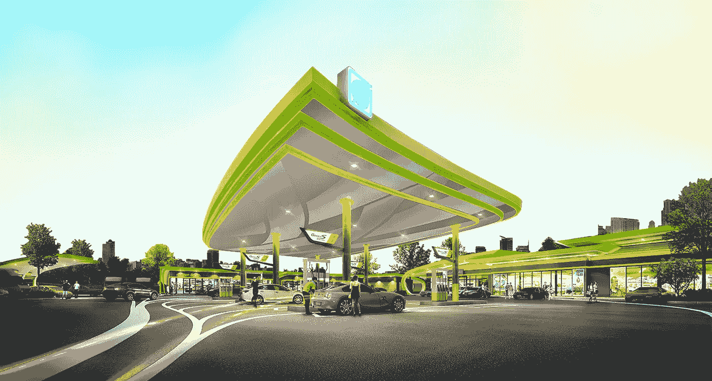

# 泰国石油公司试用区块链能源交易平台

> 原文：<https://medium.datadriveninvestor.com/thai-petroleum-co-trials-blockchain-energy-trading-platform-b562a38a87bb?source=collection_archive---------25----------------------->

根据分布式能源新闻网站 MicrogridKnowledge.com2019 年 3 月 7 日发布的一篇[文章，泰国石油公司和炼油商 bang chak Corporation Public co . Limited(BCP)正在曼谷社区购物中心测试和演示区块链能源交易平台和商业微电网(由 BCP 加油站锚定)。](https://microgridknowledge.com/commercial-microgrid-blockchain-thailand/)

 [## 十大区块链课程-数据驱动的投资者

### 渴望在区块链发展吗？你想知道区块链是如何工作的，但不知道在哪里？或者就是太多了…

www.datadriveninvestor.com](https://www.datadriveninvestor.com/2019/03/08/top-10-blockchain-courses/) 

据报道，该能源试点将结合 280.9 千瓦的商用屋顶和天篷太阳能光伏电池(PV)、913 千瓦时的锂离子、镍锰钴氧化物(NMC)和 92 千瓦时的磷酸铁锂(LiFePO4)电池储能容量，并满足 Bangchak 加油站的标准典型需求。此外，它还将产生、储存和分配多余的能量给购物中心的租户。

被称为“绿色社区能源管理系统(GEMS)”的 BCP 能源平台包含了一个基于以太坊的区块链，并被设置为 Bangchak 的“实验沙盒系统”。如果它产生积极的结果，Bangchak 很可能会看到它在泰国的商业地产和加油站的庞大网络中得到部署。

# BCP 绿色社区能源管理系统

BCP 的商业微电网与曼谷大都会电力局的公用电网协同运行，但在物理上也与它们隔离，其主要任务是为 BCP 的电站提供太阳能存储。最值得注意的是，“当系统中没有足够的太阳能时，GEMS 可以使用公用电力为 BCP 的站供电。”

微电网用户可以为早上 9:00 到晚上 10:00 消耗的公用电网电力支付相当于 0.14 美元/千瓦时的泰铢，为晚上 10:01 到 8:59 消耗的电力支付 0.085 美元/千瓦时。这个新系统不仅有助于减少碳排放和空气污染——一个在过去几年里在曼谷变得非常严重的[问题——客户将能够削减能源账单成本，并享受更高的能源安全和弹性。](https://aqicn.org/city/bangkok/)

通过 GEMS 的网络或移动应用程序，消费者将最终以他们想要的价格购买能源。而且，如果消费者不想从 GEMS 购买能源，他们仍然可以以 0.14 美元/千瓦时的价格从公用事业公司购买。

根据国际可再生能源机构(IRENA)的数据，迄今为止，进入泰国的太阳能发电容量(和安装的太阳能发电容量)超过了 9 个东盟国家中的任何一个。在过去的几年里，泰国已经迅速成为一个对区块链技术极其友好的国家(并且[正在完善关于加密](http://blockchainseo.net/thailand-issuance-scripless-tokenized-securities/)的法律法规)，我们很可能会看到越来越多的企业和公司寻求降低成本，同时使他们的传统系统更加高效和透明。

如果你有兴趣阅读另一个震撼可再生能源世界的区块链项目，看看我们过去的几篇详细介绍[电气化的文章。亚洲($ELEC)](http://blockchainseo.net/small-market-cap-cryptocurrencies-part-2/) —一个基于东南亚的零售电力交易平台和生态系统——和 [Power Ledger ($POWR)](http://blockchainseo.net/ultimate-guide-small-market-cap-cryptocurrencies-part-5/#Power_Ledger_POWR_32_Million) —一个基于澳大利亚的能源区块链应用平台。

最后，请务必[关注我们的区块链博客](http://blockchainseo.net/blog/)，了解所有最新的加密货币新闻文章、更新和信息指南！我们在这里帮助新手简化加密和区块链技术，所以请让我们知道你想看到的任何话题。另外，请确保[在 Twitter](https://twitter.com/BlockchainSeo) 和[媒体上关注我们，了解更多更新和文章](https://medium.com/@blockchainseo)！

-地下墓室

*原载于 2019 年 3 月 8 日*[*blockchainseo.net*](http://blockchainseo.net/thailand-petroleum-blockchain-energy-platform/)*。*