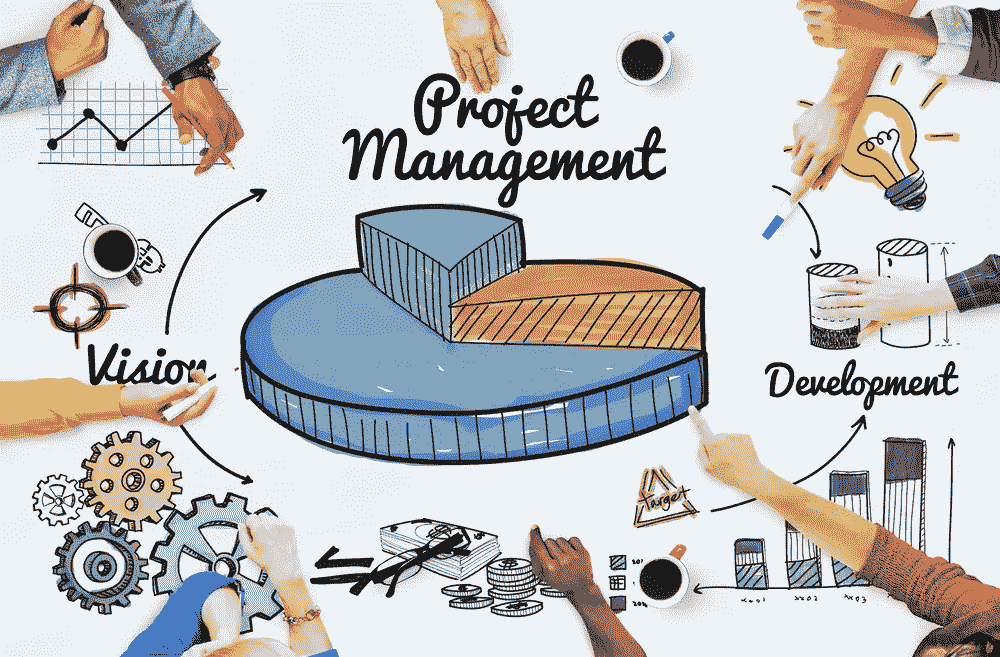

# 谢谢艾。现在，1650 万项目经理将在 48 个月内失业。

> 原文：<https://medium.datadriveninvestor.com/thanks-ai-now-16-5-million-project-managers-will-be-unemployed-inside-of-48-months-fd7ed010a8ae?source=collection_archive---------7----------------------->

## 妙语:机器学习非常擅长这类事情。

Change my mind…..

人工智能的应用有望做一些非常酷的事情。自动驾驶汽车，重塑医疗保健，改善网络安全，免提内容调节，以及一堆其他真正性感的应用。然后是人工智能应用的另一个领域，我称之为丑陋的人工智能。这是人工智能在繁重的工作业务流程中的应用，而这些工作与人们无关。做这些事情的人希望他们不必做这些事情，他们的企业希望有更好的解决方案，投入金钱和时间来解决这个问题。

项目管理是对成功至关重要的领域之一。但它也有点像热水器。只有当它不完美的时候你才会想到它。只有当项目管理不起作用时，公司才会投入大量的金钱和时间来培训员工，使用新的改进的跟踪工作流的 XYZ 方法来正确完成工作。

这种情况可能会停止，我预测它会在 48 个月内停止。在最近一份名为“[The Pulse of The Profession 2018:Success in Disruptive Times](https://www.pmi.org/-/media/pmi/documents/public/pdf/learning/thought-leadership/pulse/pulse-of-the-profession-2018.pdf)”的出版物中，他们指出，“每一美元中有 9.9%是由于糟糕的项目绩效而浪费的——也就是说，每 10 亿美元投资中就有 9900 万美元”。如果将全球资本投资总额考虑在内，每 20 秒钟就会浪费大约 100 万美元，即每年 2 万亿美元。那绝对是荒谬的，而且很有希望。对于追逐这个市场的团队来说，这是一个相当大的收入流，目前在这个市场上确实没有竞争对手。至少不会公开。

整个平台上公司的高层领导将拥有人工智能公共智能的优势，因为它与项目执行有关。一个不断变得越来越好的推荐引擎可能会使竞争对手在执行能力上不相上下，只剩下营销、价格和质量来竞争。想象它在第一年就有这种效果，可能有点异想天开。但是在深度学习运作的第三年或第五年。绝对的。

项目管理办公室将失败给一个人，随着时间的推移，他所需要的就业变得越来越有问题。因此，如果你现在是一名项目经理或者在这个领域工作，可能是时候开始寻找一份新的职业了。