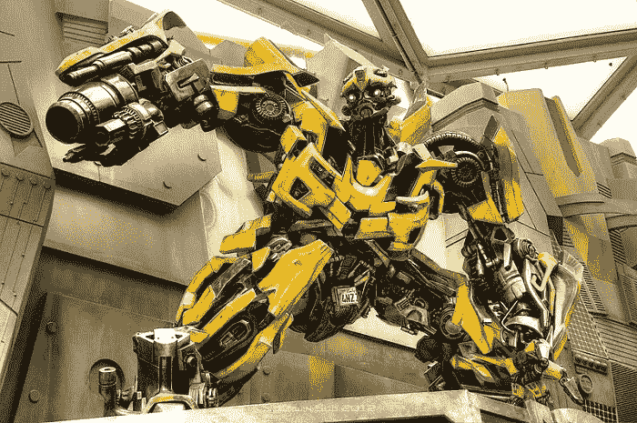

# 多亏了无人机技术，我们有了自己的汽车人变压器

> 原文：<https://medium.datadriveninvestor.com/thanks-to-drone-technology-we-have-our-very-own-autobot-transformer-e6347dde5a14?source=collection_archive---------16----------------------->

这个特殊的机器人在救援行动中运作。

我们很少看到流行文化渗透到真正的科学中。我们在《星际迷航》里看过。然后我们有像*少数派报告*这样的品牌带来了 X-BOX 和运动传感器技术的时代。虚拟现实和增强现实已经让我们离科幻小说中的*未来*更近了——但是谁会想到我们会有自己的**变形金刚**？？感谢无人机技术。

# 除了不是击退霸天虎和炸毁建筑物，这个小机器人只是拯救生命

方法如下:苏黎士大学和洛桑联邦理工学院(EPFL)一直在努力开发一种特殊类型的无人机，专为第一反应任务中的此类任务而设计:一种四轴飞行器，旨在实际上在飞行中转变和改变形状。相当漂亮。

这种无人机的目的是让它更容易穿透灾难现场难以到达的地方。更多的工业尺寸的无人机，虽然体积大，但耐用，似乎不能通过很多地方有很好的理由。现在，科学家们没有给这种机器人配备脉冲炮或任何东西，而是决定让它更加实用，并强调我们小时候最喜欢的变形金刚的一个特征。

# 通过机器学习传感器和控制系统，这种变形无人机可以变形为四种不同的形状和大小

令人印象深刻。*最令人印象深刻的*。这使得无人机在某些需要确定受害者位置或其他材料的救援任务中非常方便。这种设计使得无人机可以保持标准的 X 形编队，直到面对一条狭窄的通道，然后它可以变成一个类似盒子的形状，非常像一个 **H** 。

如果它面临更紧的前景，它可以压缩成更小的 **O** 形状。更好的是，万一裂缝变得更加狭窄，无人机可以变成一个 **T** 形状，在中央框架上安装一个机载摄像头，以增加视频覆盖范围。真正的技术科学来自于这样一个事实，即无人机通过计算机输入的高级机器学习指令数据操作，如*进入该建筑*或*检查每个房间并返回。*然而，这仍有待观察，但以目前的发展速度，随着自动化和智能技术如凤凰涅槃般继续崛起，毫无疑问…

# 无人机将处于技术前沿，因为它们将服务于生活的方方面面

而且很可能是生活中最重要的方面:在汽车人的帮助下获得安全和保障！让我们开始吧…说到技术和进步，这是无与伦比的。让我们知道你对技术的看法，并且 [**注册一个免费的 VIGYAA 账户！**](https://vigyaa.com/accounts/login/) 马上开始写潮流*！*

**原载于*[*vigyaa.com*](https://vigyaa.com/@pierre/thanks-to-drone-technology-we-have-our-very-own-autobot-transfor-284a6cc0/)*。**