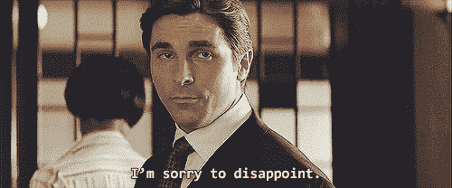
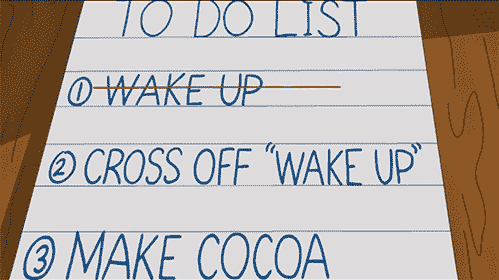
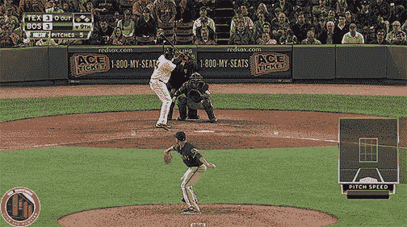

# 那不可能在一夜之间完成。

> 原文：<https://medium.datadriveninvestor.com/that-couldnt-have-been-done-overnight-dbd7a75ace36?source=collection_archive---------39----------------------->

一夜成功的故事都是扯淡。你不需要我告诉你，在之前[已经说过很多次了。然而，当你在工作时，也许这将有助于保持动力。](https://medium.com/@Tavrox/fuck-the-overnight-success-myth-2e662ba74e6a)

> **你不会马上大红大紫。你不会很快致富。你并没有特别到其他人会立刻注意到你。没人关心你。至少现在还没有。习惯就好。**
> 
> 杰森·弗里德的《返工》，一本很棒的书。

# 进步并不性感，也没有多少人看到它。

我在过去的三天里什么都没做…任何人都会看到。信任流程可能意味着进入您的业务并创建标准操作程序。这些东西只是给我的。也许其他一两个人会看到他们。就是这样。

不相信我？以下是其中的一些任务:

1.  与作家和客座博主合作时，创建*编辑指南*的标准。然而，当申请为我们写作时，人们会在我们的网站上看到像这样的页面。
2.  当*雇佣*自由职业者写作、设计或编辑时的期望框架。同样，这个框架不是公开的，但是人们会在我们的代理网站上看到这个页面。
3.  构建课程定价的分层捆绑模型，包括像这样的内容升级[使我的营销课程更具吸引力和互动性。](https://courses.chrismilton.ca/courses/building-blocks-of-a-strong-brand/lectures/6146703)

所有这些事情都需要我头脑中的想法被整理出来，以明确手头的任务。任何人都可以看到的最终结果不同于需要在幕后创建的结果，以促进所需的操作。

# 你要做的事情越来越多了

我讨厌这种情况发生，然而，我记得听到过几次(重复总是有帮助的)这通常意味着你跨越了一个里程碑。

从你的待办事项列表中去掉一件事，很容易意味着完成任务后的 2-3 件事。这里有一个简单的例子:

待办事项:*彼得潜在客户签署建议书*

搞定了。….但是

*   待办事项#1:发送初始存款的发票
*   待办事项#2:向团队介绍开始入职流程
*   待办事项 3:将项目经理介绍给*彼得潜在客户的团队*
*   待办事项#4:开始处理提案中的行动项目

任务是我们继续前进的一种方式，这个长长的清单从来都不是一个快速解决的办法。事实上，你有一个待办事项清单，这意味着你有很多事情要处理，你正在取得进展。不仅仅是在第九局末走到本垒板，打一个保送全垒打。

Walk-off Home Run by David “Big Papi” Ortiz of the Boston Red Sox

# 来得快，走得更快。

有没有意识到那些一夜成名的故事消失得有多快？当然，虽然一些公司可能会立即被收购，但大多数公司会淡出人们的视线。他们没有持久力。基础没建立，剩下的炒作就泡汤了。

事实上，很多时候，击出全垒打实际上杀死了公司——通常是因为他们不能扩大规模来支持大量涌入的注意力。明确地说，这意味着你还没有准备好这种程度的成功，这也是不明智的。

让我们把这个放在不同的背景下。就像检查 MacBook Pro 上的所有盒子一样。你真的需要吗？不。这是个好主意吗？没有，除非你还需要一个热盘子来做饭？而且成本…这是大多数人无法证明的。尤其是你的生意。

不是全规格的 Macbook，也不是“以防万一”你的公司明天成为独角兽。

# 记住，*你在退步。*

向前失败是进步的简单概念。我们必须练习和训练，为比赛做好准备。我们需要学习为考试做准备。

事情肯定会出错。指望它。

即使是保送全垒打也很少见。职业棒球的顶级击球手上垒的几率不到一半。那是其他很多方面的失败。如果你的平均击球率是一个测试结果，你就不能通过学校。

当一个重大的失败或障碍出现时，停下来看看情况。你可能正站在一个岔路口附近，这可能是转向的最佳时机。

一夜成功的故事旨在给你希望，明天你醒来时会得到你想要的一切。相反，相信这个过程，制定你的计划并坚持下去。

每一个小小的里程碑都值得从你的任务清单上划掉。

每次失败都不是停止的理由。这可能是你成为下一个一夜成功的关键。