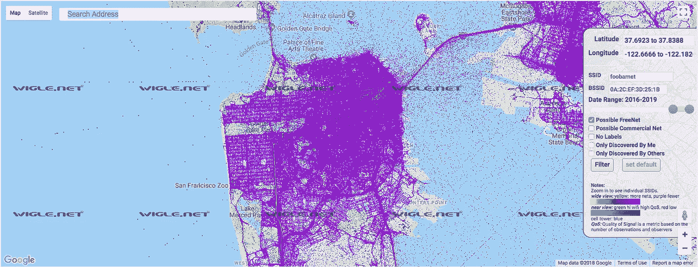
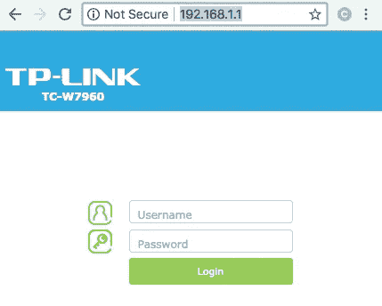
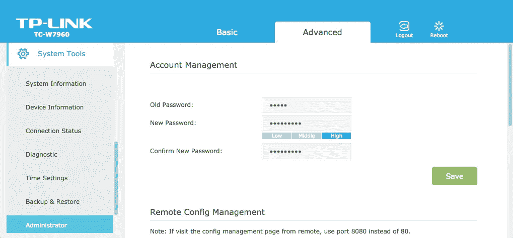
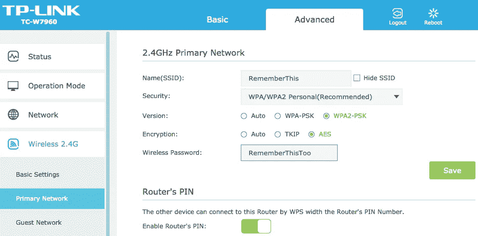
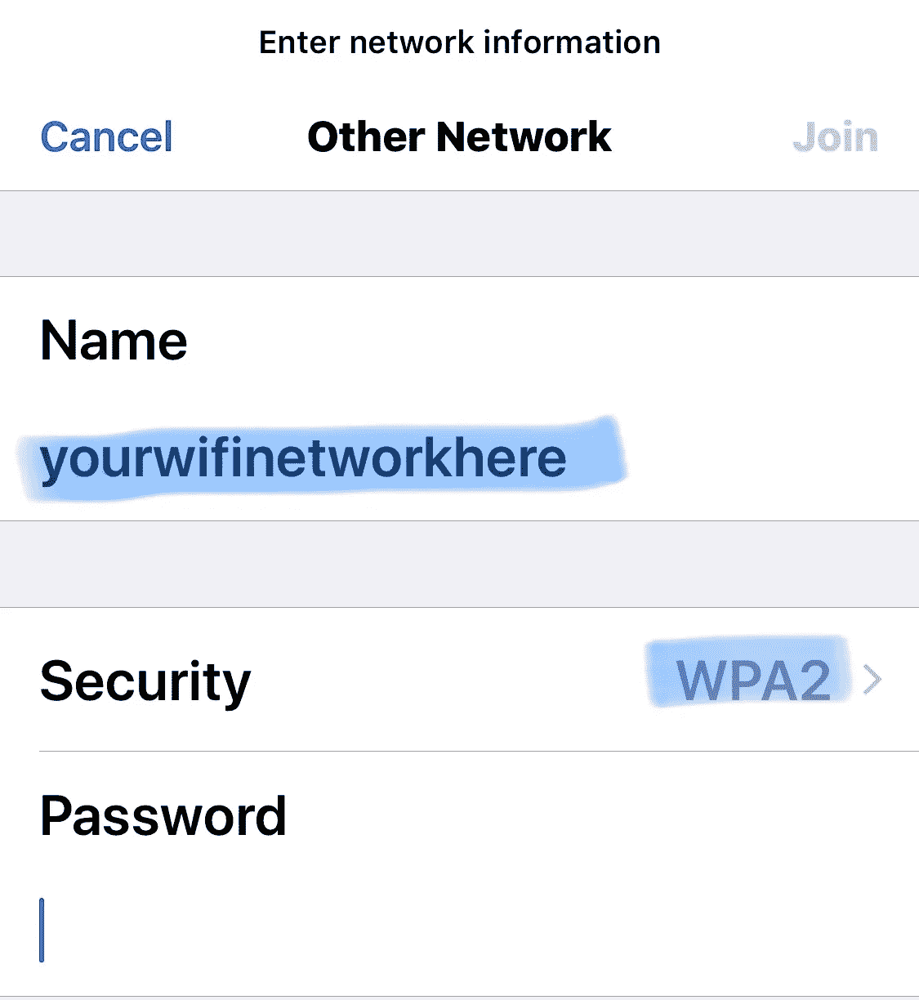
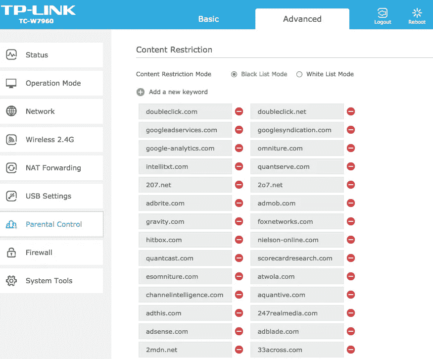

# 面向傻瓜的可操作家庭网络安全。礼貌:鲸鱼和奶奶。

> 原文：<https://medium.datadriveninvestor.com/that-dusty-box-loving-grandmas-and-whale-internet-5817fd6c51da?source=collection_archive---------1----------------------->

让我们来谈谈那个可怜的灵魂，他坐在角落里，拿着你不读的书，在你那花哨的 55 英寸电视下，在你的 Xbox 或 Apple TV 或 Amazon echo 或任何最近让你自我感觉良好的小玩具后面。这种电子产品很少出现在黑色星期五愿望清单上。它坐在角落里收集星尘，无情地在世界各地抽取 1 和 0，就像你狂看你心爱的节目一样。

甚至你亲爱的奶奶，她为随机的陌生人烘烤饼干，为女王的到来一丝不苟地保持房子的清洁，也不够尊重她的互联网盒子。今天我们要结束这种不公正。所以在我们开始之前，去找你被忽视的朋友，掸去灰尘。我是认真的。走吧。我们即将踏上一段可能演变成一场革命的旅程。请你奶奶也这样做。如果她能喜欢你在 facebook 上的照片，并从她的新 iPhone 上与你进行 FaceTime，她肯定能帮助我们完成这项任务。

接下来，我需要你打开存放所有废电池和电线网的抽屉，并寻找一根 [LAN 电缆](http://<a target="_blank" href="https://www.amazon.com/gp/product/B00EUHRLF6/ref=as_li_tl?ie=UTF8&camp=1789&creative=9325&creativeASIN=B00EUHRLF6&linkCode=as2&tag=bubbykins02-20&linkId=4230e1d52aeb7bb6a92d7761bfbd3267">LAN cable</a>)。鼓起所有的勇气和决心，我们将从外星人手中拯救互联网，一次一个盒子，没有你，你的祖母可能做不到。你找到电缆了吗？可能在我们朋友进来的包装里。

现在，随着友谊的恢复和新的尊重，互联网盒子，也被称为路由器，需要通过电脑与你交谈。当你把这两者联系起来时，我应该告诉你，外面有很多坏人在做令人毛骨悚然的事情。(也有很多好人，但我们将在另一个周末担心这个问题。)我们要让每个人都有点痛苦地偷听我们的谈话。看看下面我自称精通技术的邻居的地图。你可以跟踪你的邻居[这里](https://wigle.net/)，并缩小到任何一个街区。在你这样做之前，让我告诉你，这是不酷的，但更酷的是你在鸡尾酒会上谈论这个帖子。

(Potentially) open/free wifi networks in the San Francisco Bay Area. Source**: wigle.net**

现在如果你拿着我的柠檬水，我们将开始我们的回家之旅。在互联网世界里，家不是心之所在。如果路由器现在连接到一台机器上，它位于 *192.168.1.1* (或者最有可能是[这些](https://mywifipro.freshdesk.com/support/solutions/articles/1000052636-common-default-router-login-passwords)中的一个)。在浏览器的正确位置输入那个带三个点的神奇数字，然后按回车键。请不要在你讨厌的阿姨家或者你心爱的工作场所尝试这个。如果你是一个专业人士，你可能不用局域网电缆就能做到这一点。如果你不是专业人士，那就更好了，你是带着一个禅师的初学者心态来的。没有傲慢和无法抑制的好奇心，你今天更有可能做出改变，因为一些专家不情愿地坐在那里嘲笑这篇愚蠢的文章。他们活该被恶意软件把他们的纳税申报单发给远方的霸主。

如果你回到家(即 192.168.1.1 或这些中的一个)，你应该会看到这样的屏幕或要求输入密码的变体。如果你还没有回家，奋斗是值得的。我们不会丢下任何一个人(即使是我讨厌的邻居和讨厌我们阳光的人)。

Sample: Home is at 192.168.1.1 in TP-Link TC-W7960.

如果你有一个特定的 TP-LINK 路由器，默认用户名是 *admin* ，密码也是 *admin* (他们的创意得了 D-)。你可以在这里找到其他路由器的默认密码。既然你能查到这些，坏人也能查到。所以改变这些是个好主意。

对路由器进行更改可能会使互联网中断几分钟，因此，预计住在房子里的任何青少年都会发脾气。跟踪图片的变化是一个很好的做法。不要被吓倒，只是采取了大量的屏幕上的照片，而它。我向你保证这是值得的。还记得你的一个熟人吗？他希望你成为他们的旅行摄影师，只是因为你带着一个别致的相机(你带着去拍日落的相机)？这些截图比那些原始文件更有价值。

当您更改密码时，请记住有两个密码。一个用于连接路由器，另一个用于 wifi。下面是让您更改路由器密码的屏幕示例。我希望你的与众不同，这样你才能学到东西。

Ch@ngeThePassw0rd of the router

在我们开始改变 wi-fi 网络之前，让我们从鲸鱼身上了解一下。鲸鱼是优雅的生物。流线型，雄伟，富有音乐感。是的，音乐剧。他们在豆荚里闲逛，他们的朋友和阿尔法鲸一起哼唱。与人类不同的是，百头鲸*阿尔法鲸*不吃海洋中一半的浮游生物。而人类则倾向于相信自己超级聪明，超级强大。这两种说法似乎都不对。尤其是当你近距离观察这些水生哺乳动物的生活时。

说到力量，如果联合海洋(UO)决定，他们可以简单地通过选择吃掉海洋中的大部分浮游生物来协调对我们的毁灭性攻击，而浮游生物碰巧是地球上一半氧气的来源。如果他们选择这样做，他们可以通过窒息杀死每一种陆地动物，而联合国没有机会反对他们。但是鲸鱼绝不会做让我们窒息而死的事。鲸鱼观察它们的鲸脂、生态系统和它们的食物供应(浮游生物)，使得鲸鱼肥胖、鲸鱼饥饿和海洋污染成为一个无法想象的问题。另一方面，人类作为一个物种，在世界不同的地方倾向于肥胖和饥饿；他们一句鲸鱼诗也不懂，无知地认为自己是最聪明的生物。UO 最近因为联合国往海里扔塑料而变得超级生气。我们不想考验他们的耐心或力量。

地球上的哺乳动物可以从鲸鱼身上学到很多东西。现在，我们将只看他们如何保持他们的歌曲的秘密。鲸鱼使用一种**高级加密系统(AES)** ，这正是我们在配置 wifi 时要寻找的。我们也在寻找 wifi 保护访问(WPA2)。下面的例子。当你疯狂的时候，也请改变默认密码。

Change the SSID, Wireless Password and check the ‘Hide SSID’

现在，如果你真的想把自己从我们之前看到的地图上拉下来，你必须阻止你的 wifi 服务向经过它的每个人大喊它的名字(SSID)。你可以通过停止广播来做到这一点。但那会让你成为阿里巴巴，你必须走到互联网洞穴的门口，才能说出“芝麻开门”这个神奇的词。在 iPhone 或 iPad 中，你可以在 wifi 设置中实现这一点。蓝色的信息应该与您的设备要连接的路由器的信息完全匹配。

Neither Ali Baba nor the forty thieves will be able to get in

如果你玩得开心，那就把家庭和客人网络分开，通过屏蔽一些他们最喜欢的网站来表达你对不受欢迎的客人、讨厌的青少年或粘在手机屏幕上的购物狂配偶的消极攻击。或者，如果你没有心情钓鱼，你可以屏蔽一些向你发送烦人广告的网站。

You can blacklist all the websites that you wish to block.

我希望这篇文章能恢复你和你那位隐居朋友的关系。如果你因为工作太忙或试图寻找自我或赶看一整季你喜爱的节目而忽略了你的路由器，你会在不知不觉中失去你忠诚的朋友。我的直觉是你不喜欢失去朋友。请向上滚动并按照步骤操作。

保护好您的路由器后，您可以帮助奶奶保护她的路由器。你们两个，现在比我在硅谷的邻居更安全。也许下次我们会看到如何打败华尔街分析师。

最后，我们倾倒在海洋中的所有塑料和我们爆炸的声纳给联合海洋带来了很多麻烦。想象一下，一群讨厌的孩子在音乐会上到处拉屎，往你的食物里扔糖纸，反复尖叫着是和不是。这就是我们，在鲸鱼的世界里。

人们在世界各地的海滩上发现了许多鲸群，它们死于自身的重量，薄薄的皮肤在烈日下燃烧。没有人很明白为什么他们和他们的近亲海豚现在频繁地拜访我们。我们也不能让我们的近亲帮我们翻译。他们可能会做的只是把一些香蕉皮扔到海里，试图模仿我们。

然而，并非一切都失去了，正如你和你的祖母正在拯救互联网一样，一些人正在帮助联合海洋。[你也可以帮忙](http://adopt-us.whales.org/shop/donation/)。

现在，我能要回我的柠檬水了吗？如果你配置了路由器，你应该得到一个 cookie。如果你需要我，我会在角落里喝这个。别担心，我用的是玻璃吸管。

互相帮助。要善良。直到[下一次](https://medium.com/@bubbykins/securing-online-privacy-for-dummies-b2c8e80a2e01)...

点击这里阅读更多布比金[的文章](https://medium.com/@bubbykin)。也许在这里可以找到问题[的答案。](https://medium.com/@bubbykin/canadian-pr-application-for-dummies-93837fbdf972)

你可能还会喜欢一些即将到来的批评家们认为可以接受的帖子:

[什么造就了艺术家？](https://medium.com/@bubbykin/what-makes-an-artist-48752ae7699)

[那个妖孽司机。](https://medium.com/@bubbykin/the-uber-driver-2f4f2902faf0)

家在哪里？