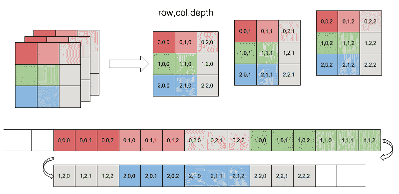
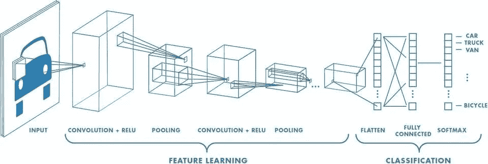
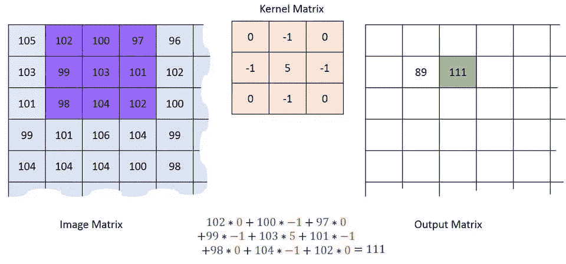
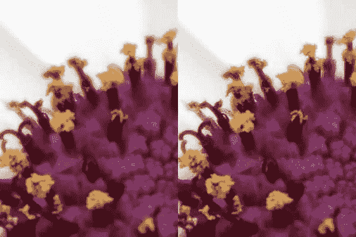
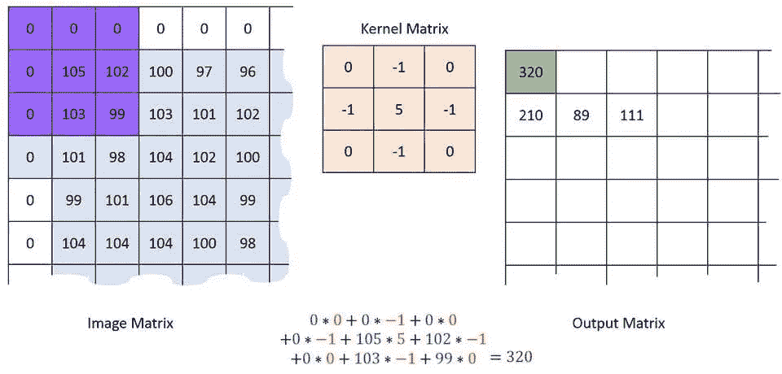
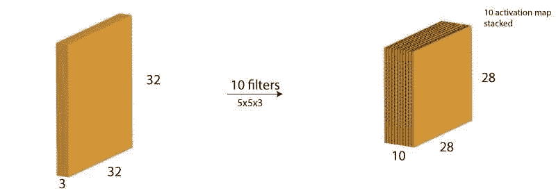
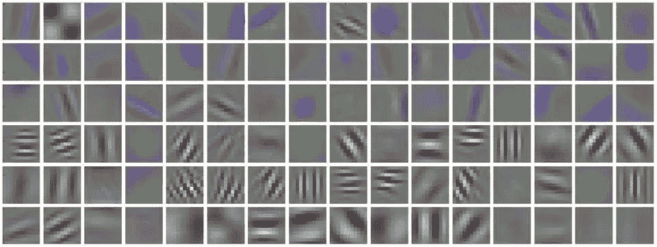
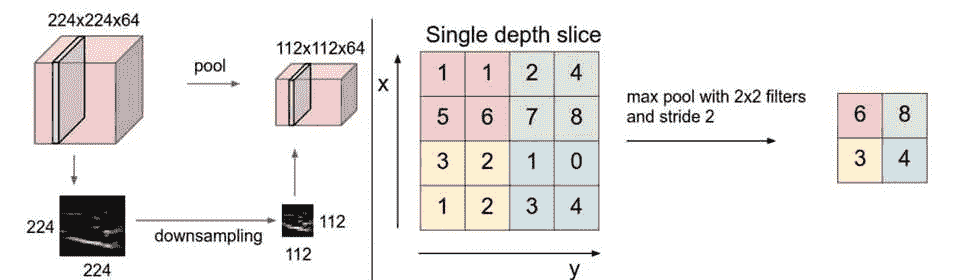
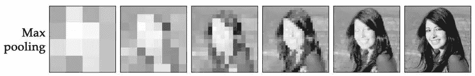
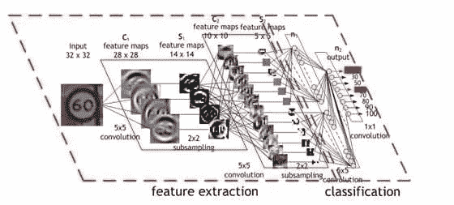

# 这还不够，我们必须更深入——深度学习

> 原文：<https://medium.datadriveninvestor.com/thats-not-enough-we-have-to-go-deeper-24dd16d85828?source=collection_archive---------0----------------------->

> “生活真的很简单，但我们坚持要把它变得复杂。”―孔子

当我开始学习机器学习、深度学习和神经网络时，就像在完全黑暗的洞中找到一束光，但你知道黑洞的科学。这是一个空间区域，奇点的引力如此之强，甚至连光都无法逃脱它的引力。

所以我完全走错了方向，而不是找到光，我需要看着*奇点的引力*。然后我决定先进入基础，而不是进入 T2 数学。

图片来源: [knowyourmeme](https://knowyourmeme.com/memes/we-need-to-go-deeper)

今天的文章是关于更深入的被称为“*卷积神经网络*的奇特的词，这里是我们的路线图。

1.  计算机是如何看到图像的？
2.  卷积神经网络(CNN)
3.  更深层次的理解

# 计算机是如何看到图像的？

图像是一个三维数组*,包含如下图所示的从 0 到 255 的像素值，其中行等于宽度，列等于高度，深度是强度，如 RGB、HSV 等。如图 1 所示。*

图 1(图像来源:[绿色位置](https://eli.thegreenplace.net/2015/memory-layout-of-multi-dimensional-arrays)

所以对于我们的 CPU / GPU，它是一串反映颜色强度的整数，这意味着在一天结束时，一切都只是光的反射。

# 卷积神经网络(CNN)

在机器学习中，*卷积神经网络(CNN，或 ConvNet)* 是一类深度前馈人工神经网络，最常用于分析视觉图像。— *维基百科*

我认为上面的定义是完美的，但更复杂的消化，所以这里是更简单的。CNN 非常类似于神经网络，但它以图像作为输入，并允许我们将某些属性编码到架构中。(如果你不了解神经网络，请阅读本文[证明人工神经网络的简化](https://arjun-kava.github.io/posts/prove-simplification-of-neural-network/))

换句话说，CNN 从图像中提取特征，并将其存储为权重，用于预测图像代表的目的。

从技术上来说，它是一个结构化的神经网络层堆栈，负责从图像中提取特征，并预测网络已经看到的未知图像的可能性。

图 2(图片来源: [mathworks](https://www.mathworks.com/content/mathworks/www/en/solutions/deep-learning/convolutional-neural-network/jcr:content/mainParsys/band_copy_copy_14735_1026954091/mainParsys/columns_1606542234_c/2/image.adapt.full.high.jpg/1530247928116.jpg) )

请看图 2，它准确描述了 *CNN* 从汽车图像中提取特征的工作方法。上图中的一些单词很难理解，但是在这篇文章的结尾，一切都会变得更有意义

# 更深层次的理解

CNN 是由层组成的。每一层通过一个可微分的函数将一个激活量转换成另一个激活量。CNN 主要使用三种类型层，它们负责从特定类别的图像中提取更深层次的特征:卷积层、池层和全连接层

让我们仔细看看每一层的功能:

## 卷积层

正如我们在上面看到的，图像是一个像素矩阵。卷积层操作这些像素。

卷积层对图像的多个通道即深度进行多次卷积运算。每个卷积运算都有一个核，该核可以是比原始图像的高度和宽度小的矩阵。每个内核都有其特定的任务，例如锐化、模糊、边缘检测等等

请看图 3，其中原始图像的每个通道被应用到一些核以生成另一个矩阵，该矩阵减少图像的参数并从中提取特征。

图 3(图片来源:[machinelinguru](http://machinelearninguru.com/computer_vision/basics/convolution/convolution_layer.html))

以下核通过将核的每个元素与其图像矩阵的对应元素相乘来锐化图像。

图 4(图片来源:[machinelinguru](http://machinelearninguru.com/_images/topics/computer_vision/basics/convolution/3.JPG))

如图 4 所示，具有相同宽度和高度的滑动窗口乘以核，并将乘法放置在原始图像的相同对应元素上。

通过比较左图(原始图像)和右图(变形图像)，可以很容易地从图 5 中看到滤波器的输出。

图 5(图片来源: [fotokto](http://fotokto.ru/blogs/3-krutih-sposoba-ispolzovat-filtr-v-fotoshope-pod-nazvaniem-cvetovoi-kontrast-high-pass-23193.html) )

现在问题出现了，这些内核操作从原始矩阵中清除了边界行值，这可能导致数据丢失。为了克服这个问题，步长参数引入了填充参数。

填充参数将另一个边界行和列添加到初始化为零的实际矩阵，这使得填充空的边界行和列成为可能，并且也不会对实际图像添加任何干扰。步幅参数意味着用于乘法的滑动窗口的强度，例如 2 个像素，即每次两列和两行移动。如图 6 所示

图 6(图片来源:[machinelinguru](http://machinelearninguru.com/_images/topics/computer_vision/basics/convolution/6.JPG))

通常，我们使用多个过滤器栈来最小化称为“激活图”的输出的数量。

例如，我们有一个大小为 32*32*3 的输入图像。并且我们应用 10 个具有有效填充的大小为 5*5*35 的过滤器。输出的尺寸为 28 * 28 * 1028∫28∫10。(图 7)

图 7(图片来源: [analyticsvidhya](https://www.analyticsvidhya.com/blog/2017/06/architecture-of-convolutional-neural-networks-simplified-demystified/)

多个卷积滤波器堆栈的输出可能如下图所示(图 8 ),人眼无法理解！

图 8(图片来源: [jhui.github.io](https://jhui.github.io/2017/03/16/CNN-Convolutional-neural-network/) )

每个卷积通常都有激活函数，它通过保持每个神经元的权重具有指定的偏差来确保一些正能量进入网络。从技术上来说，激活函数基于权重的总和来决定神经元是否应该触发。激活函数例子是 Relu、Sigmoid 等。(了解更多信息。阅读[证明神经网络的简化](https://arjun-kava.github.io/posts/prove-simplification-of-neural-network/)

## 汇集层

汇集层负责减小图像的*空间尺寸，该尺寸独立于每个深度尺寸，即图像的*深度*保持不变。*

如下图所示，在 224 \224 \64 维图像上使用最大池将其转换为 112*112*64 维，其中*深度保持不变*，这里我们将步幅设为 2，池大小也设为 2(图 9)。

图 9(图片来源: [leonardoaraujosantos](https://leonardoaraujosantos.gitbooks.io/artificial-inteligence/content/pooling_layer.html) )

从右边的*到左边的*，池化的输出可能如下图 10 所示。

图 10(图片来源: [tomaszgolan](http://tomaszgolan.github.io/reveal_talks/html/mlmpr_warsaw17.html) )

# 输出层/全连接层

在多重卷积+激活和填充的结尾，它可能以实体或类的形式输出。卷积层和池层仅负责提取特征并减少原始图像的参数数量。然而，最终的输出是由完全连接的层生成的，这在某些情况下等于类的数量，在另一些情况下等于可能性的数量。

卷积层完成前向传递，但输出层有一个损失函数，负责后向传递和更新权重以及偏差，以减少误差和损失。

在输出可能性的末尾，CNN 应用逻辑回归，该逻辑回归负责将概率分配给二元或多类问题中的每个类，例如 *Softmax*

图 11 描述了分类问题的整个过程。称为“特征提取”的红色部分是我们的卷积+池层，负责通过对网络进行下采样来提取参数，而称为“分类”的紫色部分是与逻辑回归完全连接的层，负责预测标签。

图 11(图片来源:【developer.nvidia.com】T2

# 脚注

我希望你不需要进入复杂的数学领域就能理解卷积神经网络背后的思想。此外，在下一篇文章中，我将讨论神经网络的实现细节，届时敬请关注。

# 参考

1.  [cs231n.github.io](http://cs231n.github.io/convolutional-networks/)
2.  [machinelearninguru.com](http://machinelearninguru.com/computer_vision/basics/convolution/convolution_layer.html)
3.  [www.analyticsvidhya.com](https://www.analyticsvidhya.com/blog/2017/06/architecture-of-convolutional-neural-networks-simplified-demystified/)

最初发布于:[https://Arjun-kava . github . io](https://arjun-kava.github.io/posts/thats-not-enough-we-have-to-go-deeper/)