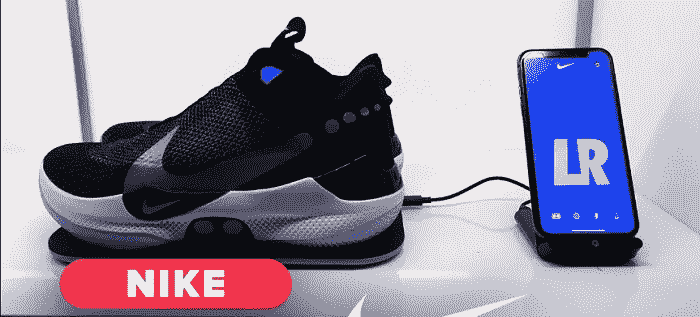
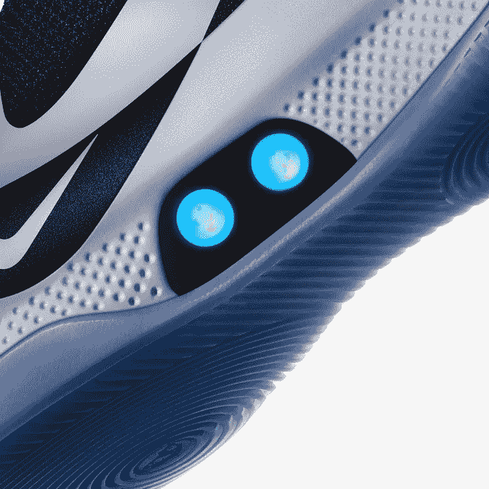

# 这是人类的一小步，智能运动鞋的一大步

> 原文：<https://medium.datadriveninvestor.com/thats-one-small-step-for-man-one-giant-leap-for-smart-sneakers-d569e7bb1b87?source=collection_archive---------17----------------------->

除了(信仰的)巨大飞跃可能会引起一些隐私问题。

技术意味着敢于梦想的日子已经一去不复返了——触摸星星，当然还有在月球上漫步。如今，当我们追求疯狂的[区块链](https://vigyaa.com/@pierre/thats-one-small-step-for-man-one-giant-leap-for-smart-sneakers-c138565f/#)，疯狂的[人工智能](https://vigyaa.com/@pierre/3-main-reasons-why-ai-technology-shouldnt-be-a-religion-c138565f/)，敬畏的[智能技术](https://vigyaa.com/@pierre/beware-as-the-city-you-live-in-might-get-smarter-than-you-c7d8fe7b/)时，我们对*隐私*——也就是**数据隐私**感到好奇。我们相信你已经看到了很多关于隐私的趋势，以及公司可以从智能设备中收集多少信息。这个特别的消息会让你大吃一惊:智能运动鞋的出现。

# 信不信由你，我们以前见过那些智能运动鞋！

可能是每一个篮球运动员在标志性续集**回到未来 II** 中最喜欢的场景，直到今天，当自我系带鞋的想法还是一件事的时候，它仍然让人们神魂颠倒。够疯狂的是，耐克公司甚至设计了确切的品牌与“自我系带技术”的乐趣，作为对马蒂小飞侠和他的未来之旅的敬意，但你难道不知道吗…

*耐克将发布一款* ***蓝牙连接的*** *产品，该产品将做几乎同样的事情*。这不是简单的娱乐或致敬:而是真正的适销对路的产品。

## 他们被称为适应 BB 运动鞋

这双鞋很快就会上市销售——就在本周内。没错:外面的篮球运动员可以花 350 美元买一双自己的鞋带鞋，可以通过智能手机应用程序控制，将鞋带系紧或保持宽松，以便穿着。听起来很有趣。但是正如我们看到的大多数技术趋势一样，令人担忧的是数据隐私。

问题是我们应该如此担心自系带运动鞋吗？也许是，也许不是。事情是这样的:

## 当然，这种情况下的问题是黑客和网络恐怖主义

诚然，这种破坏不会与生物恐怖主义或奥萨马·本·拉登处于同一水平，但智能运动鞋失控肯定会引起很多沮丧。毕竟，“设备”(或鞋子)越智能，就越容易被黑客攻击。

当然，耐克和其他品牌，如安德玛和彪马，可能会面临很多审查，在他们的产品中注入那种听起来像 DeLorean 时代的智能技术，以 88 英里的时速观看小熊队赢得世界大赛(他们大约一年半前就这样做了)。

## 老实说，令人担忧的原因是健身应用程序和追踪器发挥了更大的作用

考虑分享你的跑步路线和健康日常信息。这更多的是你的身份被分解成黑客和身份窃贼喜欢得到的粒度数字细节，只需稍微调整一下就能侵入耐克的主机，你自己的鞋子就成了罪犯的鹰眼。

知道我们最喜欢的品牌正在采取必要的措施来保护你的脚和你的数字个性，这是一件好事。毕竟，甚至安德玛和彪马已经为他们的智能运动鞋提供了安全保障，可以防止有人控制你的鞋子，让你在不想跳舞的时候跳舞。

## 但是怎么做呢？很简单…双因素认证

你见过社交网络:他们也有这样的系统。蓝牙安全层包括最简单的方法让主人成为他们鞋子的唯一控制者——然而，这回避了一个明显的问题…

*如果有人劫持* ***你的智能手机*** *怎么办？然后呢？你有麻烦了。*

蓝牙有这样一个特点:它有一个严格的结构。你只能通过你的*物理*手机控制其他设备，这意味着即使有人有你的账户信息，他们也不能通过另一个设备控制你的智能运动鞋。必须是最初和他们配对的手机。

这意味着，要想真正侵入你的智能运动鞋，他们必须偷你的手机，并在合理的距离内进行一些破坏。不太可能…但有可能。

## 事实上，就连耐克公司也表示，只有当其他供应商试图加入蓝牙潮流时，才会有担心的理由

这是一个数字游戏:市场上的智能运动鞋越多，其中一款被黑客攻击的可能性就越大。如果较小的品牌试图模仿该产品，但可用的资源较少，情况尤其如此。耐克有勇气和影响力来管理所有的安全和技术，但其他品牌呢？也许没有那么多。

不过，别搞错了:耐克并非对这种痛苦无动于衷。尽管被称为**低能耗**的特殊蓝牙技术允许更长的电池寿命，加上用于额外保护的直接加密，但事实是安全研究人员仍然找到了黑客传播恶意软件的方法，这无疑会让你的智能运动鞋变得疯狂。

# 但那是假设。好消息是，品牌意识到了这些趋势，并会采取相应的行动。

由于这些与健身、训练和锻炼相关的特定公司不一定专注于收集你的个人数据，因为他们只是利用更多的基本指标来帮助你的日常健身活动。换句话说，他们不会用从你鞋子里收集到的信息来宣传你。数据只会真正让你受益，而不是让 T2 受益。

当然，这只是我们的观点，我们坚持这一观点。你怎么想呢?我们要带着强力鞋带回到未来吗？或者这是时空连续体中灾难的一个配方？你是评委: [**注册一个 VIGYAA 账号，让我们听听你的想法吧！**](https://vigyaa.com/accounts/login/)

*最初发表于*[*vigyaa.com*](https://vigyaa.com/@pierre/thats-one-small-step-for-man-one-giant-leap-for-smart-sneakers-c138565f/)*。*