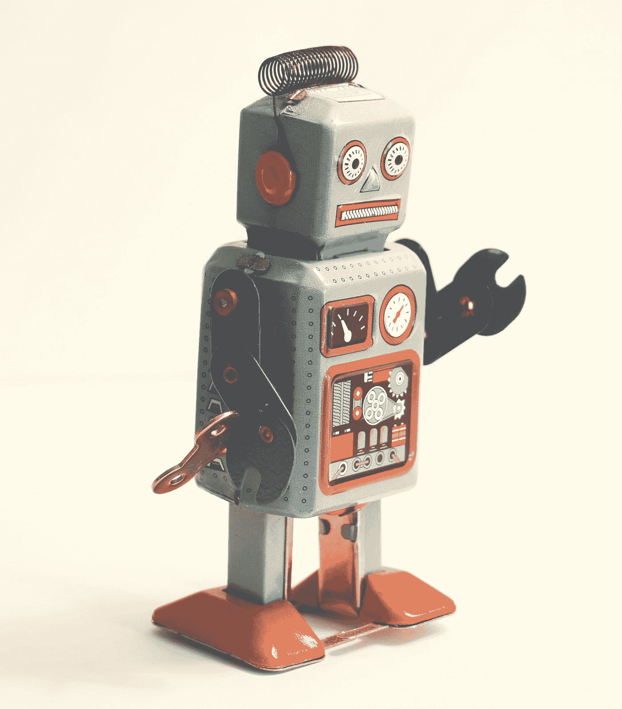

# 机器人技术的 10 大技术障碍

> 原文：<https://medium.datadriveninvestor.com/the-10-biggest-technical-hurdles-in-robotics-2c83881d1e3e?source=collection_archive---------9----------------------->

Photo by [Rock'n Roll Monkey](https://unsplash.com/@rocknrollmonkey?utm_source=medium&utm_medium=referral) on [Unsplash](https://unsplash.com?utm_source=medium&utm_medium=referral)

在过去的几十年里，机器人技术取得了巨大的进步，许多技术大师预测，一场规模堪比个人电脑革命的机器人革命即将到来。机器人开始在工厂自动化的传统领域之外的领域取得经济上的成功，如家庭、医学、太空、环境和军事应用。大公司，如谷歌、亚马逊、丰田和软银，以及政府资助机构，如 NSF、DARPA 和欧盟委员会，都寄希望于未来的增长，在过去几年中，机器人领域投资了数十亿美元。技术大师们正在描绘一个更方便、更安全、更健康的机器人增强的未来，充满了自动驾驶汽车、送货无人机、家务助理、医疗助理、环境清理人员和紧急急救人员。有了这么多宣传，一个外行人完全有权利问，“他们怎么花了这么长时间？”(或者更直白地说，“我那该死的机器人仆人已经在哪儿了？”)

> [DDI 编辑推荐—电学&电子学—机器人学，通过构建学习](http://go.datadriveninvestor.com/robo1)

这个问题不仅对外行人，而且对需要做出严肃经济决策的融资机构、投资者、教育工作者和政策制定者来说都是非常合理和重要的。机器人是真货，还是炒作？经济影响将在何时、何地以及有多大？

下面我将介绍机器人技术进步的几个主要技术障碍。我不会讨论这个领域的经济前景及其对社会的影响……让我们把这个留到下次吧。很难预测当前的机器人热潮将如何发展，因为它将涉及技术进步、科学研究、行业商业决策、技术采用或技术恐惧症的行为影响、对劳动实践的影响以及进入监管和法律未知领域的风险。我对任何声称能预测这样一个未来的人都持怀疑态度。

## 十大跨栏

*   **超长续航**。移动机械手仍然无法在不充电的情况下工作超过几个小时，无人机只能持续几十分钟。
*   **坚固、安全、精确、轻便的执行器。**执行器的功率密度远不及生物肌肉。
*   **类似人类的触觉。触觉感知很挑剔，分辨率低，即使有好的传感器，我们也不知道如何做出正确的反应。**
*   **操纵东西:不只是抓**。机器人应该处理衣服、包和成堆的物品，并擦洗东西。(请不要在桌子上放杯子。)
*   **实时最优控制/运动规划**。非线性动态和复杂障碍的快速优化可以在严格的控制回路中运行，或者使任务和运动规划变得现实。
*   **易处理的概率规划。**在连续空间中应对运动和观测的不确定性仍然是棘手的。
*   **对世界的准确理解。**机器人需要包含物体的物理(物体形状)、语义(身份)和动态属性(运动预测)的 3D 地图。
*   预测人类对机器人行为的反应。HRI 的算法需要理解邻近性、时间和主体间的可变性。
*   **让强化学习精准可靠。**尽管最近取得了进步，但 RL 导致了比传统技术更“不稳定”的控制器。
*   **“小数据”学习。**在机器人领域，数据是昂贵的，我们希望从少数例子中学习，比如人类。
*   (+1 额外障碍)**可靠系统的集成。**面对如此多复杂的软件和硬件组件，我们如何设计和认证一个达到 99.99%可靠性的系统？

通过对每个问题进行适当的集中努力，我希望每个项目都可以在十年左右的研发时间内得到解决并成为可行的产品。

## 什么不再是技术上的障碍？

在过去的几十年里，机器人技术取得了巨大的进步。十年前，当我在研究生院时，你甚至不用接触机器人就可以获得机器人学博士学位(甚至是一个令人垂涎的教职)。任何严肃的系统实现工作都需要多年的团队努力，而系统是如此的脆弱，以至于你祈祷相机在它工作的时候一直在转动。今天，**系统集成已经变得容易多了**，因此，如果不在真实系统上展示你的想法，很难进行高影响力的研究。机器人比以往任何时候都更便宜、更可靠、更容易使用(对研究人员来说)。然而，正如我上面提到的，从实验室演示到接近 100%的可靠性是一个漫长而充满危险的过程。

机器人技术继续从计算机、互联网和移动设备中借鉴许多进步。计算机便宜、体积小、功能强大，降低了准入门槛，允许运行更强大的算法。高带宽网络和专用芯片帮助我们处理大量数据，例如高分辨率视频。存储非常便宜，让我们可以存储巨大的地图和经验数据库。当我们现有的 CPU 和 GPU 都不够强大时，将计算卸载到场外资源(如无线和云计算)的基础设施开始被利用。

传感器变得越来越小，越来越可靠，也越来越便宜。机器人技术的一个重大转变来自 Kinect 等可靠廉价的深度传感器以及手机摄像头和加速度计等 MEMS 传感器的开发。

在过去的 20 年左右的时间里，**在算法方面也取得了突破，**比如在同步定位和地图绘制(SLAM)、3D 地图绘制和运动规划方面。然而，这些问题的更复杂的形式仍未解决。

**随着深度学习技术的使用，计算机视觉已经取得了显著的进步**。能够让一个视觉系统在演示中“相当好地”工作，这是令人惊讶的。达到 100%仍然是一个挑战，在受控条件之外，视觉仍然有些不可靠。

随着 3D 打印和更易于使用的 CAD 软件的出现，制作新机器人设计原型也变得更加容易。