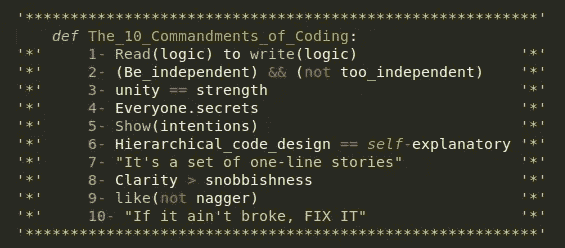

# 编码的 10 条戒律

> 原文：<https://medium.datadriveninvestor.com/the-10-commandments-of-coding-49cfc97e8443?source=collection_archive---------5----------------------->

编程在不断发展，越来越多的人把时间投入其中。这种巨大的增长导致了编码实践中的差异，这已经被证明是有益的，因为它通常会导致同一组问题的多个解决方案。然而，在管理这种增长并使新来者在获得这种可识别的解决问题的技能时更容易遵循最佳实践和方法方面，总有一些改进的空间。

# 1-读取逻辑到写入逻辑

编程的列车一直开得很快。为了以最有效的方式赶上进度，阅读他人的代码是必须的。检查解决同一问题的多种方法总是更好。这让你可以从不同的角度看待特定的问题——这正是优秀的程序员所做的。

# 2-独立，但不要太独立

不要试图重新发明轮子。如果有一个直接可行的解决问题的方法，学习它，使用它，然后尝试解决更重要的问题。如果你想做的事情有一个库或 API，那就使用它。这不仅节省了时间，还教会了你如何处理阅读代码文档和将黑盒概念集成到你的代码中，这也是业内程序员正在做的事情。

# 团结就是力量

把你的代码想象成*小人物*一起工作来解决一个问题。每个人都有一个明确的责任。你的主算法应该只指定他们工作的顺序，以及一个*小人*应该如何获取另一个*小人*的工作结果，并在其上执行他们的工作。您可以通过将代码(如果足够大的话)分解成多个文件/脚本，并将这些文件分解成简短的、集中的函数来实现这一点。这就是所谓的模块化编程原理。

# 4-每个人都有秘密

上一节每一个小人物都有自己的秘密。他们不会告诉任何人。然而，有些事情是他们都应该知道的，这样才能共同发挥作用。在现实中，这被称为封装的概念，其中每个代码块都有自己的变量和子算法，通过它们来实践自己的职责。

# 5-表明你的意图

未记录的代码是不可用的代码。记录代码的最简单形式是通过代码内注释。这并不意味着注释每一行代码，而是在每一行相关代码的开始表达算法意图。

# 6-分层代码设计是不言自明的

遵循到目前为止所列出的不同原则将会使您的代码相当分段。然而，我们可以以这样的方式构建代码，使得每个块标题(即函数定义)解释接下来的子部分。这可以通过根据代码在程序中的位置和角色缩进每一行代码来实现。一些编程语言强迫程序员缩进他们的代码(例如 Python、Haskell 等)，而另一些语言(例如 C++、JavaScript 等)则不这样做。原则上，所有代码都必须分段。

# 这是一系列单行故事

谈到代码可重用性，最重要的实践之一是命名约定。这应该以这样一种方式工作，如果一个随机的人查看代码中的任意一行，他们应该能够对该特定行正在做什么有某种形式的想法，而不必查看整个代码块。每个变量名应该描述变量本身包含的内容。每个函数名都应该表明该函数在程序中的职责。

# 8-超越势利的清晰

关于编程的一个重要事实是，在任何给定的时间点，都有不止一种方法来编写做同样事情的代码段。这使得一些程序员在以显示他们经验水平的方式写代码和以相当直接的方式写代码之间进行权衡。永远保持简单！如果你的代码不可读，那么你在风格上的*假定的复杂性*就浪费了。

# 没有人喜欢爱唠叨的人

不要重复自己。在任何给定的时刻，如果你意识到你正在从程序的另一部分复制你自己的代码，停下来重新评估手边代码块的存在。你的程序应该总是没有任何的*复制粘贴*

# 10-如果它没坏，修好它

没有完美的代码。即使你的代码完成了它的工作，仍然有一些提高效率的空间。从最小化全局变量的数量到使用不同的、更有效的数据结构。归根结底，区分优秀程序员和平庸程序员的不仅仅是解决问题的能力，还有他们的算法在时间和空间复杂性方面的效率。

每个程序员都应该在他们所做的事情上变得更好。这使得技术制造社区更容易相互交流，从而更好、更快地解决现实生活中的问题。