# 数据可视化的三条戒律

> 原文：<https://medium.datadriveninvestor.com/the-10-commandments-of-data-science-visualization-d9cdea950b74?source=collection_archive---------1----------------------->

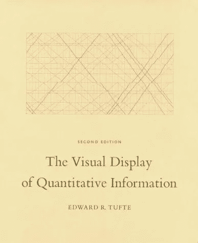

[The Bible.](https://www.edwardtufte.com/tufte/)

*我从爱德华·塔福特的*中学到了定量信息的可视化显示

众所周知，数据科学家面临的最大障碍之一是有效的沟通。事实上，这个问题如此普遍，以至于《哈佛商业评论》(HBR)最近发表了一篇题为 [*数据科学和说服艺术*](https://hbr.org/2019/01/data-science-and-the-art-of-persuasion) 的文章，其中他们探讨了如何缩小利益相关者期望(非技术性解释和可行建议)和数据科学家产出之间的差距。剧透警告——作者 Scott Berinato 建议建立一个拥有不同但互补的技能的团队，包括精通设计和讲故事

 [## 成为数据科学家所需的 8 项技能|数据驱动型投资者

### 数字吓不倒你？没有什么比一张漂亮的 excel 表更令人满意的了？你会说几种语言…

www.datadriveninvestor.com](https://www.datadriveninvestor.com/2019/02/07/8-skills-you-need-to-become-a-data-scientist/) 

如果您的组织在数据科学等非创收领域有足够的人力资源，这是一个非常好的建议。不幸的是，许多组织仍然期待“独角兽”——不仅可以争论和模拟数据，还可以有效地交流数据的雇员。

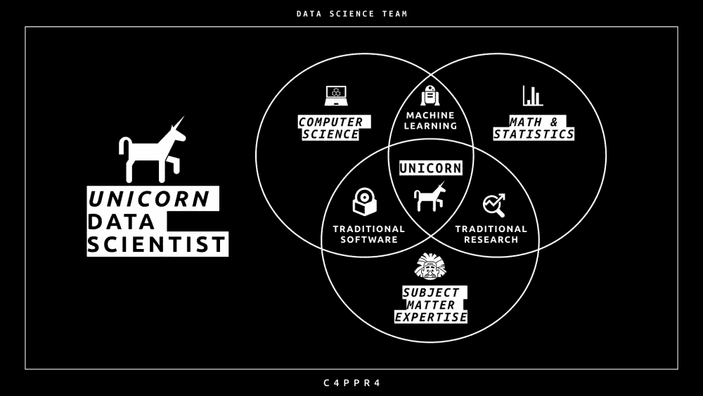

The data science trifecta. Do you have what it takes to be a data science unicorn? (Side note — interestingly, none of the circles in this Venn diagram contain “Data Visualization.” Is that because it’s [hard to draw a Venn diagram with 4 or more sets](http://www.brynmawr.edu/math/people/anmyers/PAPERS/Venn.pdf)?)

虽然关于数据可视化的文章和书籍层出不穷，但其中一本仍然是数据科学家事实上的圣经——爱德华·塔夫特的《量化信息的可视化显示》。与任何数据科学家交谈，他们要么读过这本书，要么被推荐过这本书。

虽然我肯定所有目前在职的和有抱负的数据科学家都想说他们已经从头到尾读完了这本书，但你可能没有。我们被期望成为独角兽*，*但是学习新技能的时间是有限的。因此，我想总结 3 条数据可视化戒律，让你在下一次社交活动中显得博学多闻！

# **1。显示数据**

我相信你听说过这个术语，**数据-墨水比率**。对于外行人来说，它指的是在给定所用墨水量的情况下，有多少数据被传达给了观众。现代最畅销的数据可视化指南，如 [*用数据讲故事:商务人士数据可视化指南*](http://www.storytellingwithdata.com/)*Cole Nuss baumer Knaflic 大量利用了这一思想，即只使用传达观点所需的墨水。*

*如果你只学到了一件关于数据可视化的事情，那就是最大化你的数据与墨迹的比率，并在可行的地方删除非数据墨迹。谁提出了这个流行的观点？数据可视化之父爱德华·塔夫特。*

*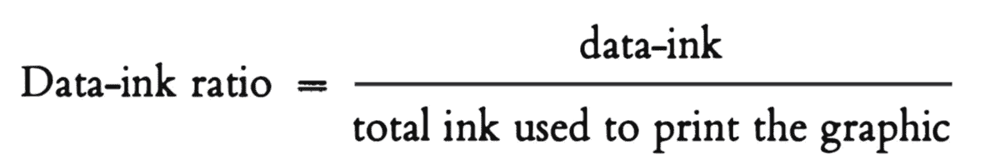*

*Less is more.*

*[黑马分析](https://www.darkhorseanalytics.com/blog/data-looks-better-naked/)出色地诠释了这一概念:*

**

*Tufte 甚至创造了一个词 *chartjunk* ，这是当你试图创建一个图表时，Excel 及其同类软件产生的可怕模式。Chartjunk 也指出版商用来使他们的图表尽可能华丽的图像。给你一句忠告——不要这样做。当使用 chartjunk 时，不仅数据-墨水比率本来就低，它还会扭曲数据并分散观众的注意力。*

*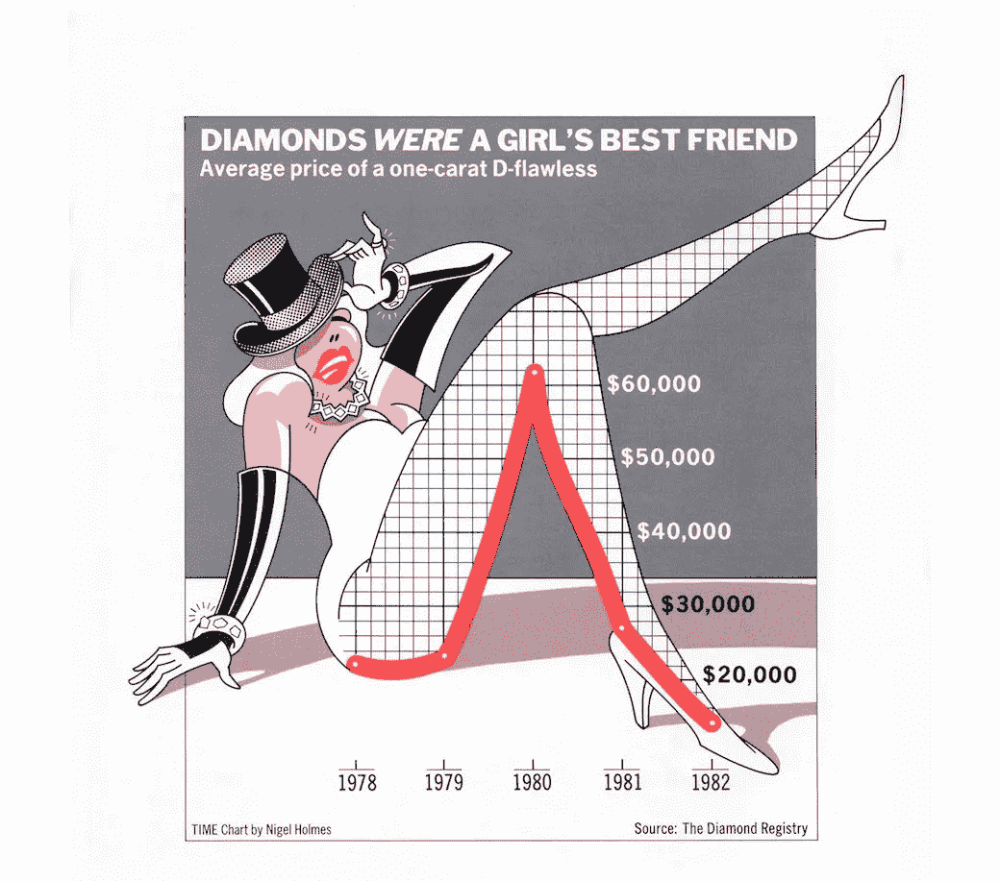*

*I don’t know about you, but I retain exactly zero information every time I look at this graph. Sex sells, but it also distracts. Nigel Holmes, TIME magazine.*

> *优秀的图形是在最短的时间内，用最少的笔墨，在最小的空间里，向浏览者传达最多的思想——爱德华·塔夫特*

# *2.避免歪曲数据所要表达的内容*

*“但是数据会说谎！”反对者大声说道。“你不能相信图表！”*

*你也不能相信别人说的话。任何媒介中的交流都可能具有欺骗性，无论是口头的还是视觉的。你怎么知道你的图表扭曲了信息？塔夫特对此也有一个数学比率，它被称为**谎言因子**:*

*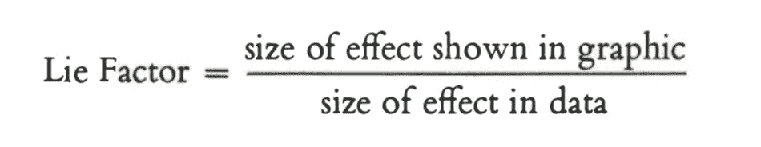*

*Rihanna might love the way you lie, but I hate the way you misinform me*

*Tufte 进行计算的一个特别突出的例子是下图所示的“汽车燃油经济性标准”:*

*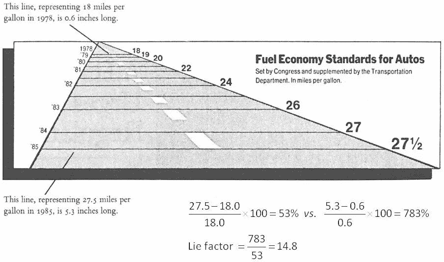*

*This graphic from the New York Times August 9, 1978 issue shows a Lie Factor of 14.8 times!*

*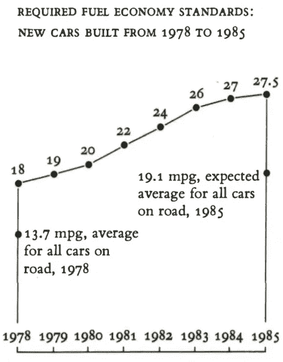*

*The same information, redesigned by Tufte. Much more informative at a glance.*

*您不需要到处搜索来找到使用不一致的比例或不是从零开始的轴的数据可视化。例如，印度的 Bhartiya Janta 党(BJP)于 2018 年 9 月 10 日在推特上发布了下图，以阻止对油价的抗议。2018 年的油价低于 2014 年，但价格更高(80.73 印尼盾对 71.41 印尼盾)。*

*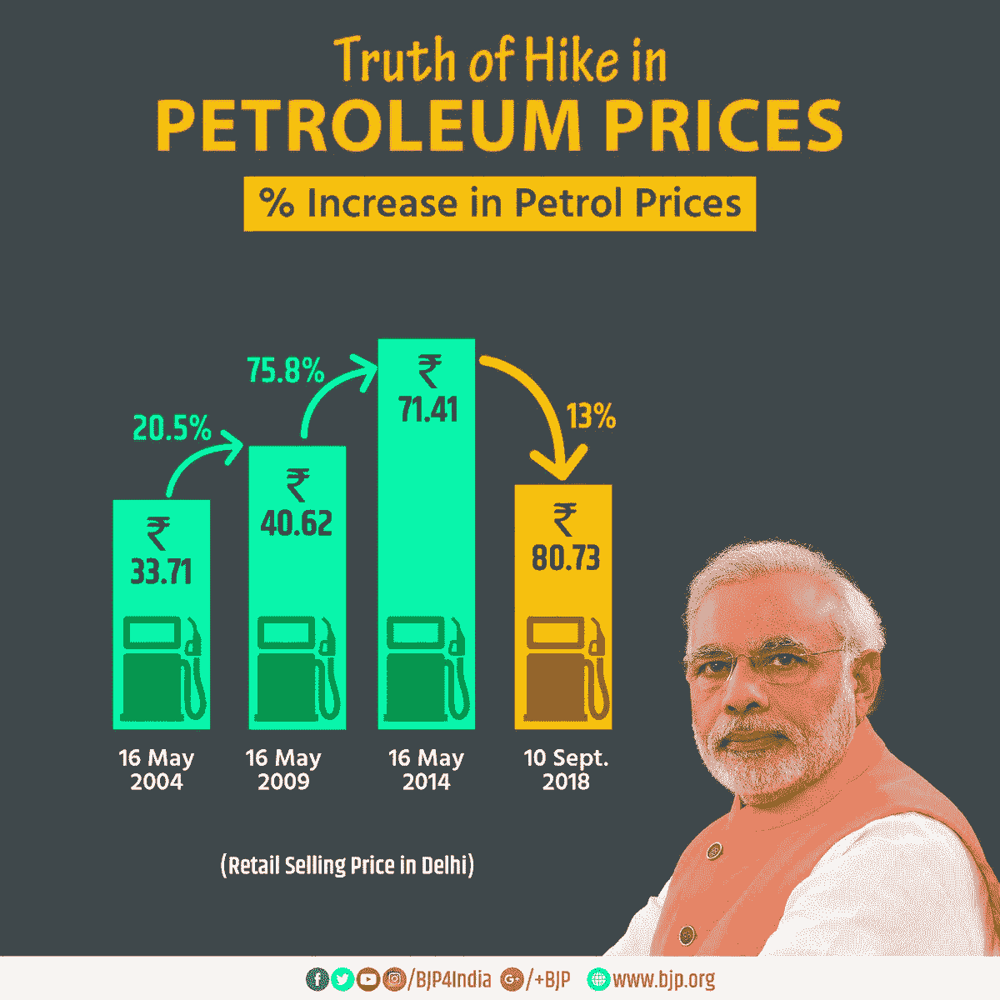*

*The 13% refers to the percentage increase in domestic oil prices, but the chart makes it seem like a decrease. Sneaky, sneaky, @BJP4India.*

*当然，没有人上当。*

*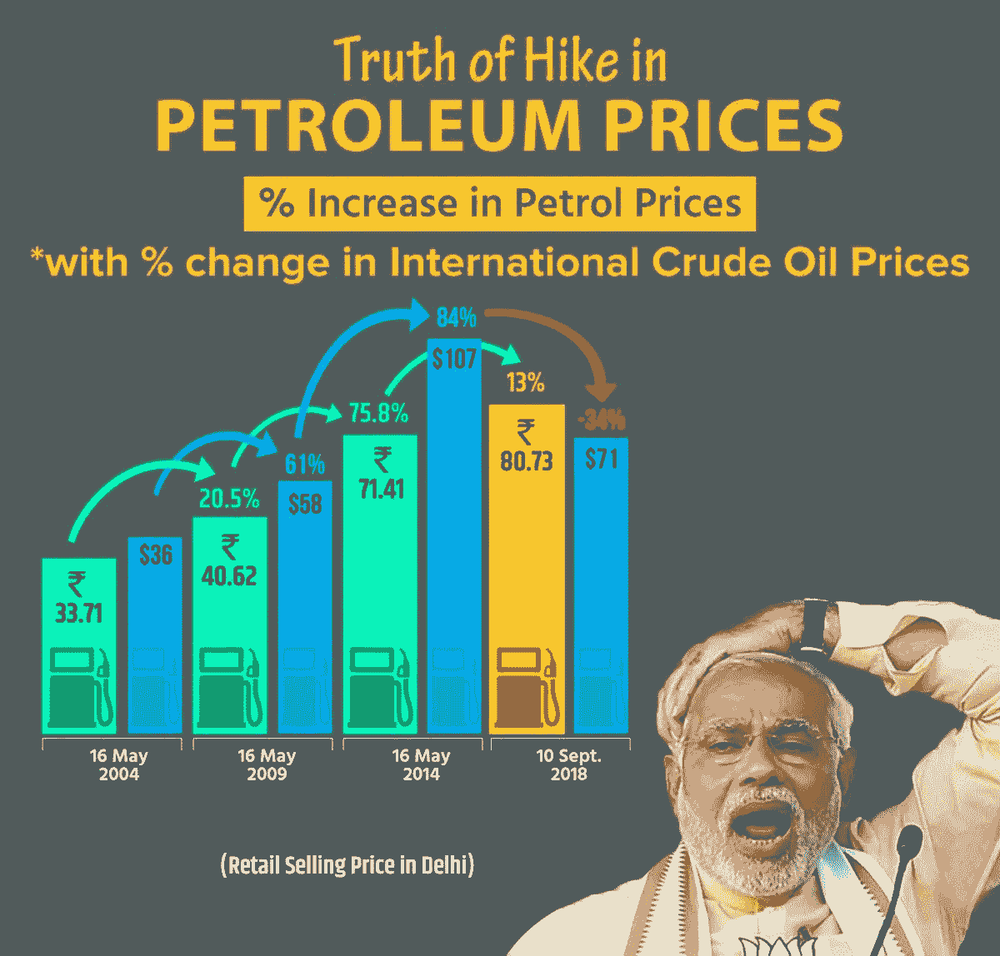*

*A response by Congress @INCIndia showing the TRUE change, with a comparison to International oil prices.*

*如果你想要更多的笑声(和警示故事)，我强烈推荐《商业内幕》的 [27 个史上最差排行榜](https://www.businessinsider.com/the-27-worst-charts-of-all-time-2013-6)。*

> *卓越的图形需要讲述数据的真相。—爱德华·塔夫特*

# *3.在一个小空间里呈现许多数字*

*与 Tufte 关于数据-油墨比和寿命因子的大满贯想法相比，更不受欢迎的是图形的数据密度:*

*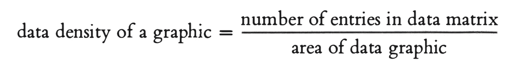*

*More *is* more, at least when it comes to data density.*

*数据密度低意味着什么？当你没有很多话要说，但你花了很长时间(或者用了很多空间，在可视化的情况下)来说的时候。*

*例如，下面的条形图在一个数据矩阵中仅包含 4 个条目(2 个产品名称和 2 个受访者数量)，但大约为 6 x 4 英寸(假定分辨率为 100 DPI)。这给了我们每平方英寸 0.17 个数据点。*

*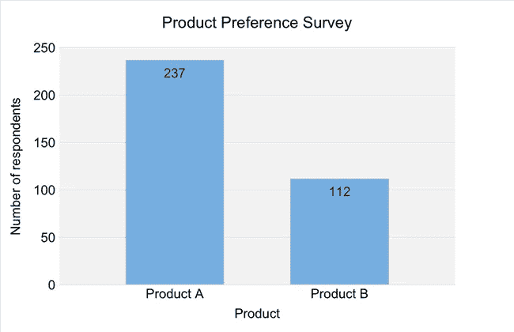*

*Example of a graph with poor data density from [this article](https://www.infragistics.com/community/blogs/b/tim_brock/posts/some-thoughts-on-data-density) by Tim Brock, who suggests we consider whether graphing data will convey any additional information beyond a simple table*

*可视化数据的目的不一定是打破文本的单调(尽管它们确实有所帮助)，而是增加理解和价值。具有高数据密度的图表允许我们梳理出关于我们的数据的洞察力，否则我们不能。*

*例如，从下图中很容易看出，自 2010 年以来，餐馆和酒吧行业的就业机会一直在增加。数据密度这么高，我就懒得算了。*

*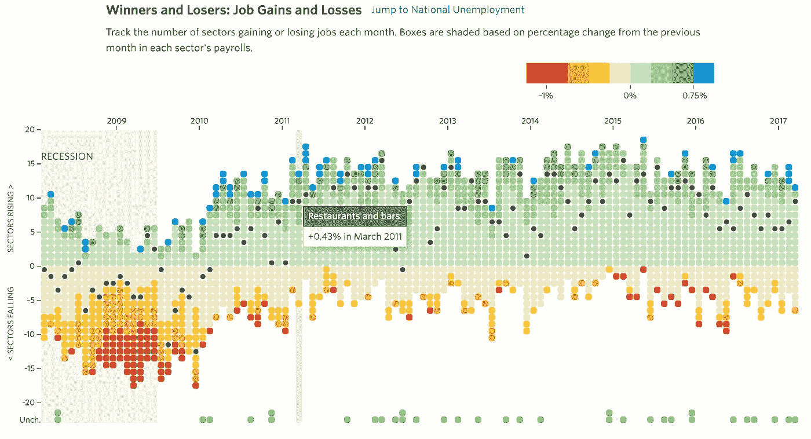*

*Interactive graphic from the [WSJ](http://graphics.wsj.com/job-market-tracker/) with a high data density. Each data point represents an industry, with the x-axis representing time, the y-axis representing job gains/loses, and the color of each data point showing the severity of loss or gain.*

> *优秀的图形几乎总是多元的。—爱德华·塔夫特*

# *根据爱德华·塔夫特的说法，这是有史以来最好的统计图表*

*留给您的最后一点是——很有可能在可下载的 Python 库中不存在传达您观点的最佳图形。也许通过将不同的视觉效果巧妙地结合在一个共享的变量上，如位置或时间，我们也许能够达到下面 Minard 地图的清晰和巧妙的程度:*

*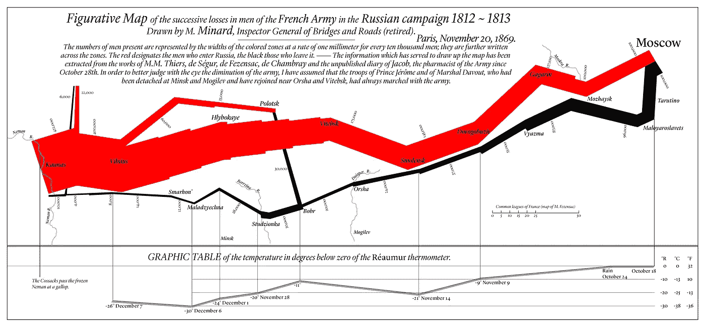*

*Modern redrawing of [Charles Joseph Minard’s](https://en.wikipedia.org/wiki/Charles_Joseph_Minard) figurative map of the 1812 French invasion of Russia.*

> *“密纳德的图表通过其多元数据讲述了一个丰富、连贯的故事，远比只是一个随时间跳跃的单一数字更具启发性。绘制了六个变量:军队的规模、在二维平面上的位置、军队移动的方向以及从莫斯科撤退期间不同日期的温度……这很可能是有史以来绘制的最好的统计图形。”*
> 
> *—爱德华·塔夫特*