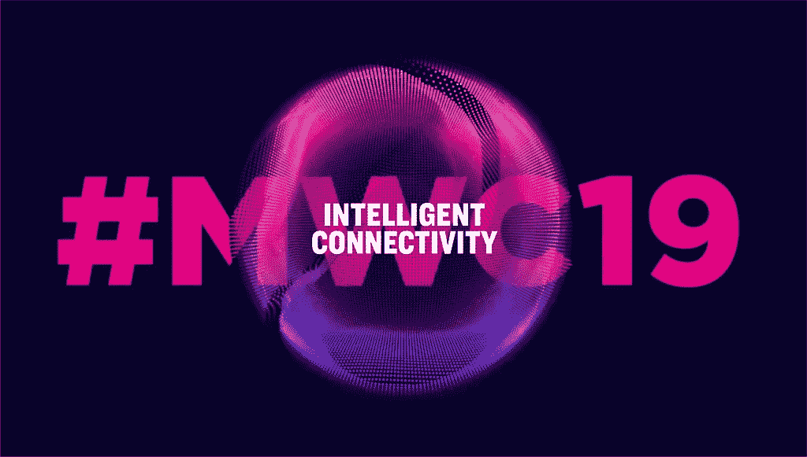

# 新兴技术和超人类主义的 12 个关键 MWC 会议

> 原文：<https://medium.datadriveninvestor.com/the-12-key-mwc-sessions-for-emerging-tech-and-transhumanism-aacdb0b61f75?source=collection_archive---------14----------------------->

## AI，AR/VR 和生物黑客的所有最佳会议

Source: MWC

WC，原名世界移动通信大会，是世界上最大的移动技术会议。它每年在巴塞罗那举行。今年，它从 2 月 25 日开始，到 2 月 28 日结束。MWC 也有一个单独的会外活动，名为 4 年后(4YFN)，更侧重于创业公司和新兴技术。

许多公司在此次活动中推出新手机，包括 LG、Oppo、索尼和华为。然而，对于那些对新兴技术更感兴趣的人来说，你可能会很高兴地知道，有许多精彩的会议专注于人工智能、AR/VR 和生物黑客。在这里，我分享来自 MWC 和 4YFN 的伟大会议。

# 这是第一天发生的事情:

**艾:超越歇斯底里和炒作(MWC)**

讨论了我们今天看到的狭义人工智能(IBM Watson 等)和人工通用智能(AGI)之间的差异，以及人工智能最终是造福社会还是毁灭社会。演讲者来自阿里云、巴比伦健康和 Orange Labs。

**超越硅:探索极端的未来场景(4YFN)**

生物电信和超越硅互动会议重点介绍了德国电信集团作为使用硅的替代方案正在开展的项目。其中一个包括使用 minION 的个人便携式实验室，充当传感器的植物，由细菌和土壤制成的电池，导电蘑菇网络和 DIY metalink 肢体接口，在那里你可以为自己 3D 打印额外的肢体。本次会议由科学伙伴关系经理 Michal Dunaj 和生物黑客和生物学家 Alesssandro Volpato 主持。

**生物黑客登台:真人芯片植入秀(4YFN)**

一个机器人在舞台上被现场创造出来。一个人在现场观众面前被植入了 RFID 微芯片。另一个人也在舞台上通过手动植入进行了银行支付。还有一个关于人体微芯片在欧洲变得越来越主流的简短讨论，人们举行芯片派对，公司向员工提供芯片植入代替办公室刷卡。

**未来主义:身体互联网(4YFN)**

着眼于虚拟和物理身体的融合，Ghislaine Boddington 谈到了一个未来，在这个未来中，我们将自己连接到一个网络化的多重自我，一个身体的互联网，通过感官和远程直觉的超级增强来实现，我们身体中的植入物可能会成为 VR，AR 和物联网的传感器，这样我们甚至可以通过挥动我们的手来移动物体。

**人工智能创新、伦理和多样性(MWC)**

讨论集中在避免算法偏差的关键，即避免使用的数据中的歧视。人工智能需要一种新的技术和市政基础设施，一种开展业务的新方式，一种在社区中团结的新方式。该演讲还关注了如果人工智能将成为人与关键服务之间的接口，我们如何才能使它公平和包容。

**沉浸式内容(MWC)**

HTC 的创始人兼首席执行官 Cher Wang 讨论了他们将如何继续推动虚拟现实创新，而 Vimeo 的首席执行官 Anjali Sud 则谈到了 Vimeo 如何将自己定位为创作者和创意人员托管、分发和货币化其内容的最终平台。Lucien Grainge 爵士谈到了他如何通过 UMG 和 Spotify 之间的交易，带领音乐行业度过了一段异常的市场变化和混乱的时期。

**Magic Leap 主题演讲(4YFN)**

Magic Leap 的首席产品官奥马尔·可汗谈到了网络和计算的融合，以及 Magic Leap 的技术如何让你置身于现实世界，让你无论身在何处，都能与人、地点和物体实时互动。有人提到了在虚拟环境中观看篮球比赛的例子，因为混合现实可以让你无限扩展。

**全民智能未来(MWC)**

在这个主题会议上，塞特亚·纳德拉概述了边缘计算，人工智能和混合现实是颠覆性的大驱动力。他和其他科技名人一起发表了主题演讲。在主题演讲的第一部分，戴姆勒、梅赛德斯-奔驰和微软讨论了他们的创新艺术和科学。在第二部分，讨论了技术作为一种民主化力量，为数百万人提供经济和社会机会，同时扩大数字鸿沟。

# 这是第二天要期待的:

**虚拟现实:未来的愿景(4YFN)**

Antiloop 的创始人兼互动总监大卫·巴尔多斯(David Bardos)将谈论营销、广告、建筑和设计的虚拟现实解决方案，而 Broomx 的联合创始人伊格纳西·五车二(Ignasi Schmidt)将根据他在沉浸式投影系统方面的工作经验发表看法，在不使用虚拟现实耳机的情况下分享虚拟现实/360 度/互动内容。而 Muki Kulhan 分享了她创建沉浸式内容的经验。

**智能移动的未来:与空客 Bizlab (4YFN)的对话**

空中客车公司讨论了他们如何推动人工智能和自动驾驶汽车的极限，以影响和推动智能移动系统的发展。他们讨论了空客 Bizlab Aerospace Accelerator 与其初创合作伙伴 Humanising Autonomy、Boni Loudsteps 和 Indiego by 10Xbeta 之间的合作。

**目的驱动的改变世界的企业家精神(4YFN)**

创始人研究所(Founder Institute)是一家在全球近 200 个城市开展业务的创业加速器，创始人研究所的连续创业者兼首席执行官 Adeo Ressi 谈到了他对目标驱动型创业的热情、激励人类成就的技巧以及激励人们实现伟大的方法。

如果你不到 50 岁，你会长生不老:你好超人类主义(4YFN)

来自阿尔法的斯蒂芬·邓恩、超人类主义作家本·默南博士和世界经济论坛全球未来理事会成员 A·罗德里格兹·维特洛将谈论超人类主义，这是通过科学和技术超越生物学的限制。

【我写的是艾与****。如果你也想了解一个受新兴技术影响的世界，请跟随我。****

**最初发表于[数据驱动投资者。](https://www.datadriveninvestor.com/2019/02/25/the-12-key-mwc-sessions-for-emerging-tech-and-transhumanism/)**