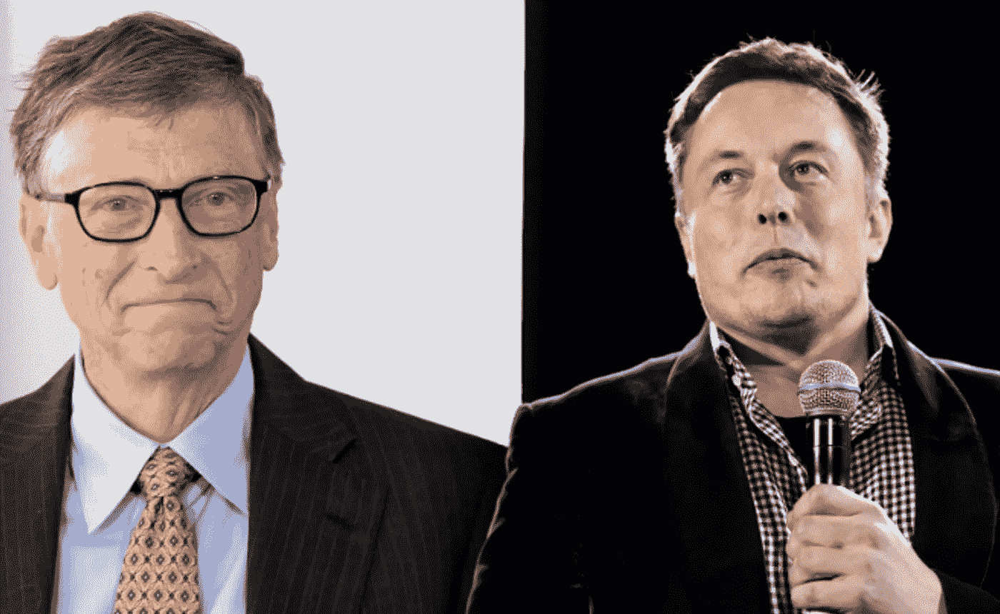
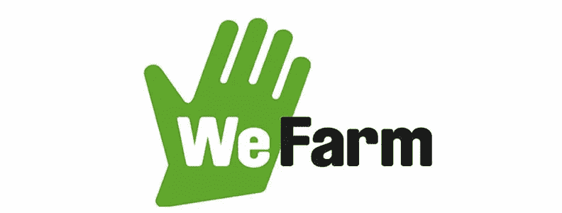

# 12 万亿美元的机会。

> 原文：<https://medium.datadriveninvestor.com/the-12-trillion-dollar-opportunity-17477d8bcbc3?source=collection_archive---------4----------------------->

## 我们需要更多的女老板。

当我们想到老板这个词时，我们会立即想到首席执行官或大公司的创始人，如比尔盖茨、埃隆马斯克，也许还有你的工作经理。

> *你要记住的第一个问题:* **“老板娘”都去哪了？**

成为一个**老板**，并不需要成为亿万富翁或者公司的首席执行官。事实上，如果我告诉你**任何人都可以成为老板呢？**

> *第二个问题:* **是什么阻碍了女性成为老板娘？**

过去十年技术进步的速度太疯狂了！我们可以使用人工智能来开发自动驾驶汽车，脑机接口来帮助四肢瘫痪的人重新行走，CRISPR 来编辑我们的基因组，等等！

然而，尽管有这些疯狂的进步，女性仍然只占财富 500 强首席执行官的 6.6%！如果有一件事我可以肯定的话，那么那就是除非我们吸纳更多女性，否则下一波创新不会发生。

> *第三个问题:* ***那么为什么不能用技术来弥合性别差距呢？***

这是一场 12 万亿美元的危机，我们需要解决它。根据麦肯锡公司的研究，到 2025 年，推进女性平等可以为全球创造 12 万亿美元的 GDP。

> *第四个问题:* **为什么一个 16 岁的 AI +生物技术爱好者甚至试图提供这些问题的答案？**(放心吧，不用黑我脑子也能发现！)

# 问题 1:

## **现在**是扶植老板娘时代的最好时机

传统观念认为，女性善良、深情、甜美、乐于助人，是“好”的一方。这些通常是与女性相关的特征。

当然，生活在 21 世纪，我们都本能地同意，我们不应该将任何一群人束缚在一个固定的定义中。我们都是独一无二的，应该有探索自我的自由。

如今，我们都在为女性赋权。有大量的商业活动专注于促进妇女赋权，更多的妇女比以往任何时候都活跃在劳动力市场上，男女之间的教育差距正在明显缩小，这样的例子不胜枚举。

但是，为什么尽管女性占专业劳动力的 50%以上，但在财富 500 强公司的首席执行官中，女性仅占 6%？为什么女性占了全球 66%的工作时间，却只产生了全球 10%的收入？

有些人可能会说，女性从事科技行业存在外部障碍，比如反对女性的有毒工作文化，或者育儿问题；这些是我们应该解决的重要问题，但不是全部。而且说实话，我也不知道*【真】*的答案是什么。

 [## 在创业之旅中，拥抱学习|数据驱动的投资者

### 好像建立一个数百万美元的公司还不够困难，企业家必须额外照顾他们的…

www.datadriveninvestor.com](https://www.datadriveninvestor.com/2018/10/16/on-the-entrepreneurial-trek-embrace-the-learning/) 

我认为正确的是，我们不应该把障碍放在外部障碍相遇的地方，相反，进步应该从内部开始。我们不应该把我们的身份与外在因素联系起来，它应该是围绕内在因素的**。**

正如我之前所说，并不是说你必须成为一家公司的首席执行官才能成为女老板，只是先成为一名女老板，然后想出如何成为一家公司的首席执行官(如果这是你的目标)。

Ok 牛逼，**但是当老板娘意味着什么？**

## “女老板”的定义

成为一名女老板并不意味着“专横”，也不意味着成为一名挑别人毛病、让所有男生都站在她一边的高中女老大。不是那样的。**这不是关于任何外在的**，事实上，**这完全是内在的。**没有什么壁垒阻止女人成为老板娘，除了你自己。但是我不得不说，*过老板夫人的生活是艰难的*，这不是一件容易的事情。

> *做老板娘就是做自己，对做自己有自信。* ***都是权力凌驾于自己之上。***

而“老板”的传统定义通常与获得对他人的某种权力有关，比如晋升到某个管理职位。但是，仅仅因为你处于首席执行官的位置，并不意味着你就自动成为“女老板”。

我认为做“女老板”有两个秘密秘诀:

> 第一个秘方是关于掌控你自己的生活。

掌控自己的生活意味着为自己的价值观、目标、使命和愿景而活！大多数时候，我们做事情是为了让别人满意。如果让别人满意与你的愿景相关，这没什么，作为一个母亲通常是这样的(特别感谢世界上所有的母亲，❤️)，但通常情况并非如此。

## 行动项目:掌控你的生活

1.  反思你的价值观是什么。如果你甚至不知道自己想过什么样的生活，你就无法掌控自己的生活。每周至少花 10 分钟深刻反思。注意:你不可能在一天之内解决这个问题。
2.  **学会说不！**尤其是在女性的阴柔天性中，我们有时会太过仁慈，同意了成百上千的恩惠，但下一次，问问你自己这样做是否符合你的使命？如果不行，*不干。不要让自己被一堆不重要的任务压得喘不过气来，这些任务没有任何价值，只会增加压力。接受有时候自私是可以的。*
3.  **围绕你的价值观对你的生活进行逆向工程。**基于你的价值观，培养身边的习惯。从小做起，从不到 10 分钟就能做到的习惯做起，但是要持之以恒！

> 第二个秘笈是老板心态。

**拥有老板心态，本质上就是自信。相信自己，不要羞于认为自己低人一等，因为你并不低人一等。**

奥运选手从来不知道他们有一天会真正成为奥运选手，但他们相信他们是奥运选手，甚至在他们接近奥运选手之前。*老板心态就是全部相信自己，坚持到底。*

要认识到下一个史蒂夫·乔布斯曾经处在你的位置上。认识到那些创造下一波创新或打破下一个奥运会记录的人曾经和你有同样的潜力。

> “你周围的一切你称之为生活的东西都是由不比你聪明的人组成的，你可以改变它，你可以影响它，你可以建造你自己的东西供其他人使用。”—史蒂夫·乔布斯

是的，所有你认为很酷或者很棒的东西，都是由和你有 99%基因相似的人创造的。

我只是一个普通的 16 岁高中生，但我在课堂上遇到的很多人都害怕问问题，好像这会毁了他们的整个学校生涯。

事实是，这正是我们所想的。我们认为与陌生人开始新的对话可能会破坏我们的社会声誉，或者不管怎样。但事实并非如此，与陌生人交谈实际上没有什么坏处。一天后，他们可能甚至不会记得那次谈话，生活只是继续。

这并不是什么令人惊讶的发现，你可能会对此产生共鸣，目睹过它，或者以前听说过它——根据惠普的说法，女性只有在符合 100%的资格条件时才会申请工作，而男性只有在符合 60%的资格条件时才会申请。

申请就好，申请没有坏处。相信你能胜任这份工作，即使你可能达不到书面上的要求。**这个故事的寓意:不要被一张纸定义！**

## 行动项目:老板心态

1.  **相信自己。**每次你觉得自己做不到的时候，至少告诉自己 10 次你能做到。
2.  **练习不自在。**下次你想做某事，但又觉得自己不够资格时，不要犹豫，只管去做。

# 问题 2

## 不安全感是我们最大的敌人

战胜你的不安全感，就像你必须为你的生活而战一样，因为不安全感正在慢慢地从你的生活中消失。

缺乏安全感与老板心态完全相反。我认为这是反老板心态。

我们被外在因素束缚，我们被别人对我们的看法束缚，但这些都不重要。**你的身份不是别人，而是你自己，*这不是对他人看法的构建。***

随着社交媒体成为我们日常生活的一部分，我们变得过于担心最琐碎的事情。每个评论都很重要，每个喜欢都很重要，突然，如果你最近的帖子没有获得 1000 个喜欢或什么的，你会觉得瞬间被打败了。

**不安全感的根本原因是过度思考。**

我们想得太多了，问题是我们不能光靠思考得出新的结论。

你必须开始实践和探索。你不可能通过一遍又一遍地检查相同的数据点来实现创新。你必须开始做并获得新的数据点，以获得新的见解，然后得出新的结论。这就像试图驾驶一辆比飞机更快的汽车。你不能指望造出比飞机还快的汽车。**你要造火箭。**

The art of overthinking (spoiler: it’s not an art 🎨)

要做到这一点，首先要改变你的观念。如果有人批评你的工作，不要觉得糟糕，认为你的工作很糟糕，而是想想如何利用别人的批评。思考如何在他人的批评中找到真理，并*运用它们*。但是，如果你碰巧发现其中没有价值和真理，那就忘掉它，继续前进。

你不可能让每个人都喜欢你。在某种环境下，你可能会被很多人喜欢，但在其他环境下，你可能会被很多人讨厌。接受这一点，明白你不可能让每个人都满意，所以不要因此而失望。

在我们能够克服我们的不安全感之前，我们必须首先学会如何忘却你生活中与负面情绪无关的负面结果。如果回到一张白纸上，重构东西很容易，但是改变一张已经写满一堆笔记的纸就很难了。

你可以控制自己的情绪，你可以选择感受这种自信并震撼你的生活，或者失去这种自信。开始改变你能控制的东西，这从内在因素开始。

## 行动项目:消除不安全感

1.  **要忘却事物，先减少事物。当你因为大量的决策、信息、知识和观点而陷入困境时，你就会失去自我。找到自己，然后相信自己，是成为“老板娘”的关键。如果你有社交媒体应用，而且它并不重要，我建议你删除它一周，然后看看会发生什么。(我知道，这个很难)**
2.  **为自己开发精神触发器。**如果你发现自己想多了什么，而不是去做什么，那就进入调试模式。重新规划自己，停止过度思考，开始行动。

解决了我们的内部结构后，是时候转向外部变化了。*永远记住:在改变世界之前，先改变自己。*

# 问题 3

## 利用技术促进妇女平等

不在女人身上投资只会伤害，没有任何好处。如果我们人口的一半，即妇女，被剥夺了充分发挥其潜力的机会，我们的社会在经济和社会方面将处于难以置信的不利地位。

根据联合国的报告，以我们目前在赋予妇女权力方面的进展速度，要弥合性别平等差距还需要 100 年。这太疯狂了，我们不能再等一个世纪来解决这个问题，我们必须现在就开始行动。女性需要更少的争论，我们需要更多的行动。这不是一个严重的问题，而是切实解决这个问题的紧迫性。

## 问题 1:

我们认为很多事情都是理所当然的，包括互联网和移动设备。在发展中国家，妇女不太可能使用互联网，因为据估计，拥有移动设备的妇女比男子少 1 . 84 亿。这转化为女性信息匮乏的更大问题。

作为“农业企业家”的妇女可以真正从使用互联网中受益。即时获取新闻和信息对农民来说是一个巨大的改变！妇女是农业产业的重要参与者，占发展中国家农业领域的 43%,但几乎没有为妇女弥合信息差距。

## **解决方案#1:**

**当前方法:** WeFarm 成立的目的是帮助“农业企业家”绕过互联网获取信息。他们的平台是一个点对点信息共享系统，允许农民提问，回答他人的问题，并通过短信分享农业信息/技巧。此外，WeFarm 的平台特别强调增强女农民的权能。

WeFarm 👩

**长期方法:**向全世界提供无线互联网的答案是向太空发送更多的卫星！更多的卫星=更多的互联网。

但是没那么简单，卫星贵啊！

传统的卫星在 22，000 英里的高空绕地球运行。然而，OneWeb 和 SpaceX 正在提议采取一种不同的方法:发射 moonshot 卫星——在大约 100-1250 英里的较低高度绕地球轨道运行的卫星，以无线信号覆盖地球！

如果卫星以更近的距离绕地球运行，这将导致更短的延迟，因此从发送响应到接收响应所需的时间也更短。低轨道卫星可能比我们传统的卫星快得多！

## 问题 2:

作为一个社会，我们有偏见。在劳动力中也是如此，他们有偏见。雇主通常对有孩子的女性持有某种负面看法。

根据这项研究，与男性相比，女性在生育第一个孩子后，收入会有所下降。此外，雇主不太可能向“职场妈妈”提供更长的假期和更灵活的工作时间，因为他们通常不相信自己有能力完成高质量的工作。

从来没有人问过男人他们会如何照顾孩子，但女人似乎总是会被问到这个问题。这说不通。

所有这些都迫使女性去寻找更灵活、最好是偏远的工作。

## 解决方案 2:

SheWorks 是一个数字平台，旨在通过将妇女与提供灵活和远程选择的机会联系起来，增强她们的权能。每年，他们将成千上万的女性联系到令人兴奋和灵活的工作岗位。此外，SheWorks 是一个一体化平台，包括培训课程、无缝远程劳动力管理系统、分析等！

## 问题 3:

这听起来有点疯狂:我们都知道人类有偏见，但机器也有偏见！

人工智能是一个蓬勃发展的行业。它可以用于诊断癌症，识别人脸，通过电话为我们预约，当然，它们可以比人类下得更好！

几乎每个科技巨头都以这样或那样的方式应用了人工智能。但是，人工智能有时会很有偏见。

例如，就在几周前，许多人声称苹果负责为申请信用卡的个人分配信用额度的人工智能算法偏向女性。尽管男性和女性的财务状况可能相似，但女性获得的信贷额度要低得多。

更具破坏性的情况:医疗保健中的性别偏见。与男性健康相比，关于女性健康的数据要少得多。传统上，临床试验包括很少的女性受试者，动物研究也主要由男性物种主导。

与男性相比，女性经历药物副作用的可能性高出 75%,这并不令人惊讶。

这意味着，由于我们用来训练 AI 算法的数据主要由男性数据主导，因此在评估女性患者时，这可能会导致不准确和偏见。

## 解决方案 3:

弥合医疗保健中男性和女性之间的差距不是一件容易的事情，但这是可能的！

1.  我们需要更多关于女性的数据。
2.  我们需要更多的女性在这个领域工作。妇女增强妇女权能💪
3.  在女性科技领域，我们需要更多创新

AI 之所以有偏差，是因为我们训练它的数据有偏差。如今，大多数医学数据都来自男性患者，尤其是临床试验数据。我们需要更多来自女性的医学数据，但我们如何获得呢？

**可能的解决方案:用人工智能解决人工智能中的偏见。**

通过利用生成式机器学习模型，如生成式对抗网络(GANs)或变分自动编码器(VAEs)，我们可以生成与训练数据集相似的数据变体。例如，研究人员可以使用 GANs 生成合成乳房 x 光照片！

FemTech 中的大数据结合 AI =疯狂创新！

[Celmatix](https://celmatix.com) 是一家公司，其愿景是利用 FemTech 中的大数据来改善女性的生殖健康。他们的产品包括通过让妇女更好地了解自己的生育能力来增强妇女权能的 My Fertility Compass、为医生提供的分析平台 Polaris 以及世界上第一个揭示针对妇女生殖健康的信息的基因测试 Fertilome。

利用 FemTech 数据，Celmatix 已经训练了几种算法来预测个性化的生育可能性。

围绕“生殖健康”或“月经”这个词有很多污名。消除围绕这些词的污名并从今天开始创新是极其重要的。

# 问题 4

## 年龄只是一个数字

我只是一个普通的 16 岁女孩，我并不特别，但我绝对是独一无二的😁。

我是独一无二的:

在夜里，我试图理解这个破碎的世界。我尝试做一些事情，因为我认识到我的年龄不应该成为我所能做的事情的限制，其次，我认识到我是有特权的。事实上，如果你现在能上网阅读这篇文章，你是有特权的，要认识到这一点。

白天，我只是一个普通的高中生，像其他人一样去上学😅。

16 岁的孩子一定要等到你大学毕业才去做某事，或者你为自己设定的时间表，这是没有意义的。开始永远不会太晚，但开始也永远不会太早。

事实上，我真的很幸运，因为至少我不用走几英里路就能喝到干净的水。如果弱势群体可以应付，我可以做些事情。

这就是为什么我试图提出女性赋权的话题，以及作为“女老板”意味着什么。

最后，我将留给你们这个:

> 为了抓住这个 120 亿美元的机会，我们需要更多的“女老板”。

*如果你喜欢这篇文章，如果你留下一些掌声，我会很感激👏在灵媒上跟着我！随时和我联系* [*LinkedIn*](https://www.linkedin.com/in/joey-mach-6293b1175/?originalSubdomain=ca) *！*