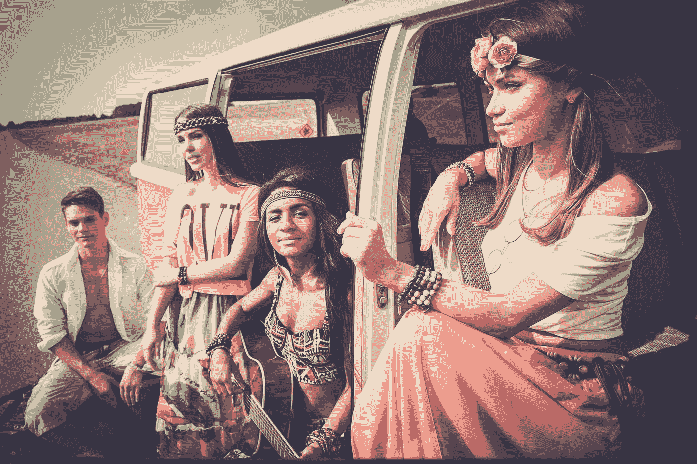
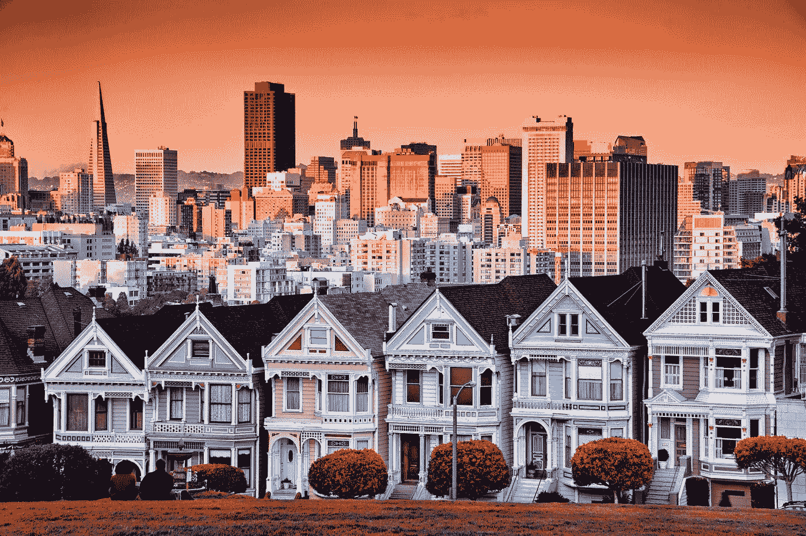

# 20 世纪 60 年代的嬉皮士运动及其如何催生了硅谷

> 原文：<https://medium.datadriveninvestor.com/the-1960s-hippie-movement-and-how-it-gave-rise-to-silicon-valley-b0c54090792e?source=collection_archive---------2----------------------->

世界上可能没有一个人不会将硅谷与大型科技企业联系在一起——我们大多数人都会将该地区与谷歌和苹果这样的一流科技开发商联系在一起。

但是，在上世纪 90 年代和 21 世纪初，以商业为重点的科技繁荣使其成为如此多活动的沃土之前，发生了什么？在这里，我们将探索一点这个时代的历史，以及它是如何成为创新的温床的。

# 爱情的夏天

60 年代末，三藩市不仅仅是性、毒品和摇滚乐的天下。这是一个关于抗议和革命、音乐大爆发和新艺术形式的时代，所有这些都代表了极端自由的思维和存在方式。这是关于打破现状，寻找新形式的自由和自力更生。

但这不仅仅是反叛；整个嬉皮士运动是出于脱离工业资本主义美国的需要而诞生的，工业资本主义已经主宰了生活的方方面面，尤其是在过去的几个世纪里。在这一点上，言论自由与民权联系在一起，随着越南战争的开始，反战抗议盛行。

# 反文化影响

从表面上看，嬉皮士运动似乎是享乐主义，但其核心是创造新的生活方式。这包括创造你自己的工具和生活系统，不依赖于资本主义制度。

这种对自力更生和言论自由的关注采取了各种形式:它可能采取了创造一个公共生活空间的形式；这可能看起来像是一次迷幻剂之旅中逃到沙漠中，或者可能涉及到用拾荒者的材料拼凑出古怪的车辆。DIY 技术是其中的一部分，无障碍数字技术和社区的概念开始被来自伯克利和斯坦福的当地人讨论。

20 世纪 70 年代，一群技术爱好者专注于创造他们自己的电脑。[家酿计算机俱乐部](http://www.computerhistory.org/revolution/personal-computers/17/312)定期聚会，讨论这种 DIY 技术以及如何让大众接触到计算机。这些会议最终促成了沃兹尼亚克-乔布斯发明第一台苹果电脑。

第一台个人电脑是为了解放和自由而开发的，当时乔布斯和沃兹尼亚克也致力于让其他人参与到 DIY 文化中来。

# DIY 文化

20 世纪 60 年代和 70 年代催生了新的思维方式，其中一部分也是关于新的生活方式，包括社区生活和乌托邦。

有时，这些想法包括不寻常的建筑结构，如巴克明斯特富勒的短程线穹顶，开始在北加州出现。这种“泡沫状”的有机结构是 DIY 的概念，意在支持一种更具群体性和游牧性的生活方式。这个时代的许多旧金山人确实搬到了农村公社，尝试新的生活方式。

今天，苹果和谷歌都有圆形的有机建筑，让人想起 60 年代的科幻电影。圆形和“气泡”在当时是反资本主义的象征，这在许多设计元素中都可以看到。这只是一种象征性的方式，人们开始以不同的方式思考，融入更多的生态原则和整体设计，这反映在建筑和艺术中。

史蒂夫·乔布斯就是其中之一，他是《T2 全球目录》的粉丝，这是一份在 1968 年至 1972 年间发行的反主流文化出版物。乔布斯在他的[斯坦福 2005 年毕业演讲](https://www.ted.com/talks/steve_jobs_how_to_live_before_you_die)中引用了上一期的话——“保持饥渴。呆傻。”创办该杂志的斯图尔特·布兰德(Stewart Brand)是本着一种更具社会和有机凝聚力的美国文化的精神，包括设计。这句话的意思是推动创新，永远不要怀疑你的想法，不管它们当时看起来有多奇怪或古怪。

# 破坏性思维

湾区现在充满了创业公司和世界上最好的技术专家，以及一些世界上最富有的人。虽然这可以追溯到 20 世纪 60 年代开始的对创新和冒险的关注。这也让位于共享经济和众包，这两个概念是在 20 世纪 60 年代和 70 年代从这个领域产生的。

这个地区被认为是一个欢迎不同寻常的想法的地方——这一点一直没有改变。

在 20 世纪 60 年代的硅谷，有许多其他科技公司在廉价的仓库里做着自己的事情，旁边还有风险投资家，他们很容易就资助了计算机行业，直到 20 世纪 80 年代，软件也随之出现。拥有像斯坦福大学和伯克利大学这样的知名学校，是让智力人才成为源源不断的最聪明的头脑的核心的关键。

一般来说，硅谷一开始是一个欢迎那些热衷于冒险和尝试不同生活方式的人的地方。相比之下，美国其他著名的商业中心(如华尔街)更倾向于保持现状。因此，即使现在的加州比起嬉皮士时代要富裕得多，居住在那里的人们仍然以不同的方式做事。

如果我们想到当前公司打破现状的方式——比如脸书如何改变了通信的面貌，或者 Salesforce 如何打破了客户关系技术的现状——我们仍然可以看到这种情况发生。

# 还有反主流文化吗？

进入 20 世纪 90 年代和 21 世纪初，硅谷见证了互联网以及亚马逊和 Craigslist 等相关初创公司的诞生。上世纪 90 年代末的网络泡沫吸引了投资者，并将房地产价格推至普遍难以承受的水平。尽管当时经历了繁荣-萧条周期，但它仍然是 R&D 和创业公司的丰富中心。

史蒂夫·乔布斯最初显然受到了反主流文化的影响，虽然他的意图可能是启发社会，让他们更加独立地生活，但事实是，现在我们过度依赖这些机器。关于他们是否真的提供了最初想要的自由，或者我们是否更加沉浸和依赖外部力量的争论仍在继续。

*原载于 2018 年 5 月 28 日*[*【www.datadriveninvestor.com】*](http://www.datadriveninvestor.com/2018/05/28/the-1960s-hippie-movement-and-how-it-gave-rise-to-silicon-valley/)*。*