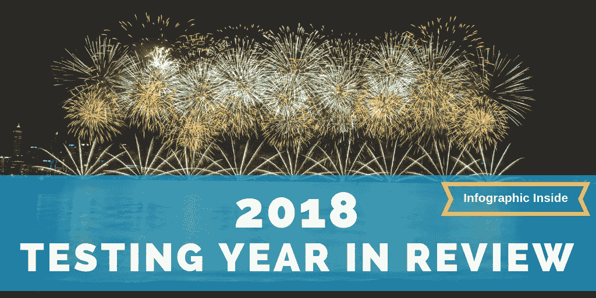
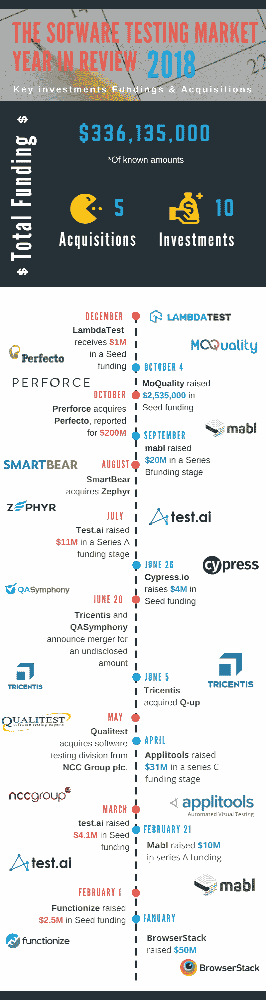

# 2018 软件测试年回顾

> 原文：<https://medium.datadriveninvestor.com/the-2018-software-testing-year-in-review-200b2fe99d6b?source=collection_archive---------31----------------------->

## 软件测试行业 2018 年回顾

好了，又一年过去了。是时候回顾过去，发现我们的成就了。我们，软件测试行业，有一个充满新的和加强的趋势、成功的收购和大量资金的繁荣的一年。在下面我们专门为您制作的信息图表中，查看今年的融资和收购情况。

2018 年的测试竞技场获得了价值超过 3 亿美元的资金。下面的时间表显示了今年宣布的投资和收购。给出的所有信息都是披露的金额和新闻。

## 2018 年软件测试趋势

我们行业最大的变化是基于人工智能和人工智能技术的实现，随后是测试自动化的正常化。让我们回顾一下那些席卷 2018 年的趋势。

## 测试中的机器学习和人工智能

AI 和 ML 是任何行业几乎每天都会听到的名词。无论是在医疗保健、零售、运输还是测试领域，人工智能要么令人恐惧，要么令人崇拜。这种现象显然有助于各行各业。虽然说到软件测试领域，还是有些犹豫和顾虑。测试不再像以前那样简单了，因为在过去的几年里，这个行业的步伐越来越敏捷。要处理的数据量成倍增加，发布时间也缩短了。这是一种全新的方法，允许现代测试人员处理基于 ml 工具的连续工作负载。

人工智能和机器学习正在缓慢但肯定地成为 QA 和整个软件测试世界的关键部分。机器学习为测试人员带来了更准确的结果，并将创建和管理测试用例的时间减半。例如， [TestCraft 基于 ML 的算法](https://www.testcraft.io/machine-learning-used-test-automation/)能够自动克服应用程序中的变化，并防止测试失败。这使得我们的平台能够克服应用程序中 97.4%的更改(不是由应用程序逻辑或流程的更改引起的更改)。现在，测试人员正在追随这一趋势，并开始关注基于 ML 的软件。

## 测试自动化作为标准

近年来，我们都听说过测试自动化对于持续集成至关重要。尽管测试自动化一直是讨论的一部分，但它从未被所有人真正接受，类似于现在基于 ML/AI 的工具，直到现在。2018 年是测试自动化成为新规范的一年。根据 [Gartner 的软件测试自动化魔力象限](https://www.gartner.com/doc/reprints?id=1-5V82COP&ct=181128&st=sb?mkt_tok=eyJpIjoiTnpCbU9EWmxORGxqTURCaiIsInQiOiJ5TW4zdUQ2VTlVbkZIXC9qS2J2eUxcL3RcL0pcL1RQKzJPK1hpV0w5b1RrdUtVVVR2S01cLytFRnZnems5alNocllcL3dmUUZkdUJnRUZwa1BaNHhUVkxYVEU0VUlYa1RXUitpejZ5OWpmVnhBeGdxbmMyVmZqRDNkVjlzUUh3Sk9NbkZVUSJ9)报告，“2017 年，57%的受访者在被问及“考虑了哪些其他供应商”时，选择了惠普企业(HPE)？，“其次是硒。2018 年，Selenium 以 43%的份额位居榜首，接下来的四家供应商的份额在 18%至 24%之间。”这表明更多的组织倾向于 Selenium，测试自动化，作为他们测试团队最可行的解决方案。

由于上市时间的因素，对[测试自动化](https://www.testcraft.io/)的需求呈指数级增长。出于同样的原因，人工智能和机器学习正在获得牵引力，测试自动化是新的常见做法。Gartner 说，“在接下来的三年中，(他们)预计人工智能、人工智能、预测分析和 RPA 将在软件测试和自动化中发挥越来越大的作用”，我们对此深表赞同！

如果你在我们的社交媒体网站上有其他值得一提的趋势，请告诉我们。

节日快乐，新年快乐！

以下是我们用来寻找测试世界的数据和投资的来源: [Gartner 软件测试自动化魔力象限](https://www.gartner.com/doc/reprints?id=1-5V82COP&ct=181128&st=sb?mkt_tok=eyJpIjoiTnpCbU9EWmxORGxqTURCaiIsInQiOiJ5TW4zdUQ2VTlVbkZIXC9qS2J2eUxcL3RcL0pcL1RQKzJPK1hpV0w5b1RrdUtVVVR2S01cLytFRnZnems5alNocllcL3dmUUZkdUJnRUZwa1BaNHhUVkxYVEU0VUlYa1RXUitpejZ5OWpmVnhBeGdxbmMyVmZqRDNkVjlzUUh3Sk9NbkZVUSJ9)、 [Globes](https://en.globes.co.il/en/article-application-visual-management-co-applitools-raises-31m-1001232260) 和 [Crunchbase](https://www.crunchbase.com/) 。

*原载于 2018 年 12 月 19 日*[*www . test craft . io*](https://www.testcraft.io/2018-software-testing-year-review/)*，作者劳伦·穆勒。*