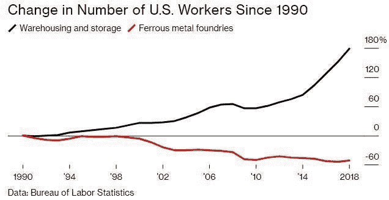

# 21 世纪的工作是在物流，而不是钢铁|数据驱动的投资者

> 原文：<https://medium.datadriveninvestor.com/the-21st-century-jobs-are-in-logistics-not-steel-data-driven-investor-bf6e7a8fbd68?source=collection_archive---------10----------------------->

## 2020 年总统候选人应该做些什么来促进就业

由[本杰明·戈登](https://medium.com/authority-magazine/5-things-i-wish-someone-told-me-before-i-became-the-ceo-of-cambridge-capital-9d97d1b93cfa)

昨晚我在听民主党总统候选人辩论。在我看来，当谈到创造就业机会时，两个政党都忽略了一个关键问题。

在民主党方面，伊丽莎白·沃伦和伯尼·桑德斯等候选人提出了昂贵的医疗保健和监管政府支出项目。然而，没有证据表明这些项目会推动就业增长。

 [## 零工经济如何改变未来的就业前景|数据驱动的投资者

### 随着自动化的发展和 Z 世代的出现，劳动力的构成和动态正在发生变化…

www.datadriveninvestor.com](https://www.datadriveninvestor.com/2018/12/19/how-is-the-gig-economy-changing-the-future-jobs-landscape/) 

在共和党方面，特朗普总统谈到了恢复钢铁。最近[的一条推特](https://twitter.com/realdonaldtrump/status/1041631817697251328?lang=en)断言，“我们的钢铁工业是全世界谈论的话题。它被赋予了新的生命，正在蓬勃发展。数十亿美元正被用于全国各地的新工厂！”

事实上，在过去的三十年里，钢铁行业的就业机会一直在减少。最近《T4》《彭博》的一篇文章指出，自 1990 年以来，黑色金属铸造工作已经下降了 60%。

Logistics jobs are driving growth

工作去哪里了？一句话:物流。同期，仓储和储存工作飙升了 180%。

这种转变的一个案例是[麻雀点](https://en.wikipedia.org/wiki/Sparrows_Point,_Maryland)的故事。正如《彭博》的文章所示，麻雀角是巴尔的摩的钢铁工业中心。麻雀角一度号称拥有世界上最大的钢铁厂，还有一个造船厂，占地 3100 英亩。当它的所有者 RG 钢铁公司申请破产时，麻雀角变成了一片工业荒地。现场散落着废金属、废弃的机器和毒素。这似乎是对美国工业主义的隐喻。

但是后来事情发生了变化。当 Hilco Global 买下这个网站时，他们决定通过改变它的焦点来重振它。新的重点？物流。

今天，麻雀角是许多大公司的仓储和[电子商务](https://www.datadriveninvestor.com/glossary/e-commerce/)履行地点的所在地。[亚马逊](http://www.amazon.com/)、[安德玛](http://www.underarmour.com/)、[联邦快递](http://www.fedex.com/)、[大众](http://www.vw.com/)、[哈雷](https://www.harley-davidson.com/us/en/index.html)等纷纷开店。麻雀角预计将创造 17，000 个就业机会。

教训是，物流正在蓬勃发展。这可能是我们经济增长的最重要的引擎之一。如今，仓储行业雇佣了 140 万美国人，并且还在继续扩张。

随着美国经济继续从制造业转向服务业，就业岗位会在哪里？我相信答案会是物流。如果我们想适应 21 世纪的经济，我们应该做更多的工作来培训我们国家的物流劳动力。

因此，在 2020 年，我希望特朗普总统和他的民主党挑战者能够讨论如何确保美国的竞争力——不是通过打 20 世纪的钢铁之战，而是通过关注 21 世纪的物流机会。

*原载* [*本杰明·戈登*](https://medium.com/authority-magazine/5-things-i-wish-someone-told-me-before-i-became-the-ceo-of-cambridge-capital-9d97d1b93cfa) *于 2019 年 9 月 13 日*[*www.datadriveninvestor.com*](https://www.datadriveninvestor.com/2019/09/13/the-21st-century-jobs-are-in-logistics-not-steel/)*。*