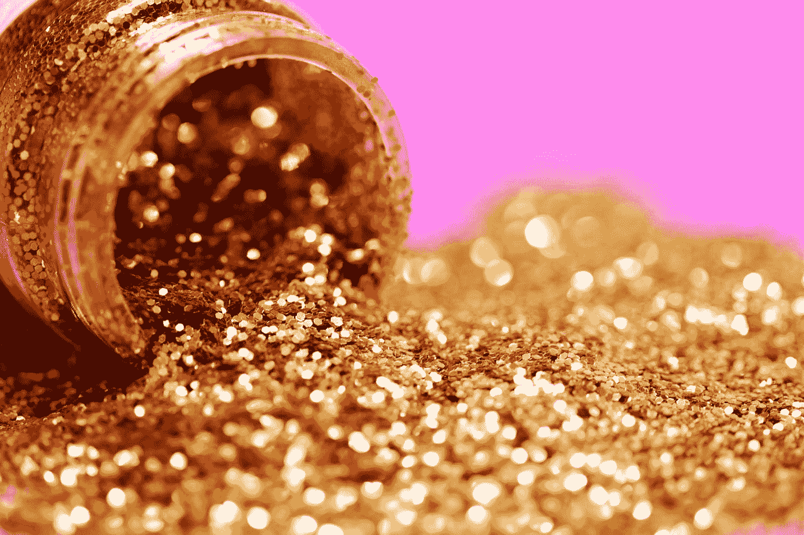

# 投资黄金的三步指南

> 原文：<https://medium.datadriveninvestor.com/the-3-step-guide-to-investing-in-gold-eadb35d847a7?source=collection_archive---------35----------------------->

Photo by [Sharon McCutcheon](https://unsplash.com/@sharonmccutcheon?utm_source=medium&utm_medium=referral) on [Unsplash](https://unsplash.com?utm_source=medium&utm_medium=referral)

**第一步**

你为什么要这么做？

好吧——这听起来有点奇怪，但这是一个非常明智的问题。

你希望 T2 保护 T3 还是 T4 赚钱？

我可以向你保证，有很多人希望保护他们已经拥有的东西，而不是赚很多钱。

如果你想赚钱，请进入第二步。但是如果你想保护它，那就继续读下去。

**保护我的钱？**

你可能担心市场调整…..甚至是撞车。如果发生这种情况，你希望你和你的黄金之间的联系越短越好——这意味着交易对手的风险越小越好。

你不想问别人，而别人必须问你的黄金。你必须有一条直接的路线。

就保护而言，我想不出什么比存放在一家声誉良好的交易商那里的实物黄金更好的了。

“声誉好”这个词在这里很重要，因为你需要把你的黄金当成一瓶好酒。如果它是从一个知名品牌那里收购并储存的，那么销售起来会容易得多。要问的问题少了。

我还想说，你应该以一种既可携带又可分割的方式持有你的黄金。我最近在 IG Index 上做了一个节目，Sharps Pixley 的首席执行官生产了一公斤的金条。虽然它很小，但即使以今天的黄金价格来看，它也值 3 万多英镑。如果你需要在紧急情况下“花掉它”，那就不太实际了。值得思考的事情。

做你自己的研究，和一个明显被高度重视的人一起去。是的，可能会贵一些。但是你为你在生活中得到的付出。

你最不需要的就是有人质疑你黄金的完整性。

**第二步**

让我们假设你想赚钱。

现在就看你愿意冒多大的风险了。

如果答案是不多，那么购买实物硬币(可以免税)或 ETF 是常见的途径。但是，再次，做你自己的尽职调查，只使用声誉好的名字。

虽然 ETF 有费用，但这些费用通常低于存储成本，所以根据你走这条路的理由，它们可能是有意义的。但请记住，它们可能不是由实物黄金支持，而是由跟踪金价的衍生品支持。

因此，如果市场崩溃，其中一个交易对手破产，你可能会有麻烦。

交易所交易基金和实物黄金都可能波动——请记住这一点。

实物资金也可以，但是要带大的，保证流动性。

如果你想要更多的风险…参见第三步

**第三步**

我们现在谈论的是矿工。但是我把它分成了两组。已经在开采、加工和销售黄金的低风险生产商，以及风险可能非常高的勘探商。

让我通过一个制片人告诉你。

生产成本差异很大，但让我们以每盎司 1100 美元的总可持续成本(AISC)为例，这是相当普遍的。以目前的黄金价格，比如说每盎司 1220 美元，你就有每盎司 120 美元的利润空间。但如果黄金价格上涨 10%至 1342 美元，那么由于你的成本不太可能变化太大，你的利润率现在是每盎司 242 美元。超过 100%的增长。

这就是为什么这些股票相对于黄金价格如此不稳定。

请记住，如果黄金价格跌破 AISC，那么你的保证金就会被抹去。许多生产商有不同的矿山，所以这可能不是你投资的终点。但这是你需要考虑的事情。

我应该补充一点，你还需要考虑政治风险，因为一些国家将一项特别有吸引力的资产国有化也不是没有过。我更喜欢在我认为更安全的管辖区采矿的一个原因，比如澳大利亚和加拿大。

如果你喜欢冒险，想要真正尝试一下，你可能会想看看探险者。尽管这些可以产生一些惊人的回报——有些已经翻了 10 倍甚至 100 倍。

它们也可以归零。

因此，如果你打算在这个池塘里玩，你需要得到一些建议，并建立一个广泛的投资组合，所以如果一个“流行”——你不要把所有的鸡蛋放在一个篮子里。

投资基金是降低这种风险的一种方式，但是请记住运行这些基金的绩效费和持续成本。在投入任何资金之前，确保你能接受他们。

重要的是要记住，这个市场是关于时机的。

金子在那里已经有几千年了。在此期间，拥有它有好有坏。

我个人认为现在是个好时机。