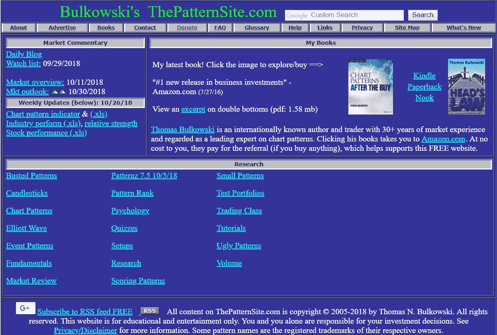
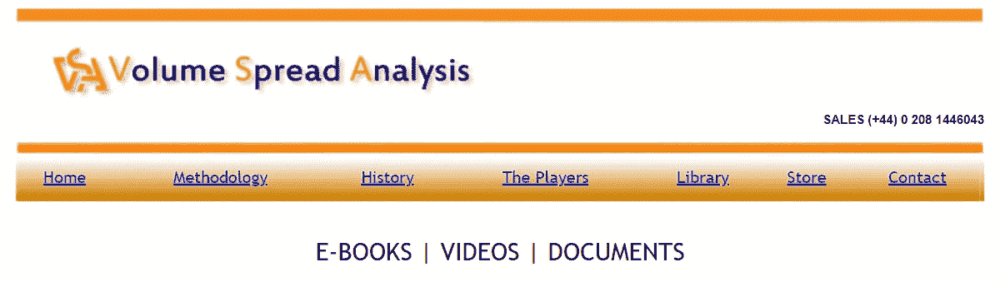
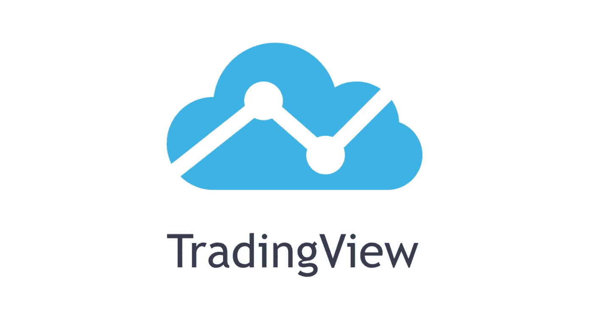
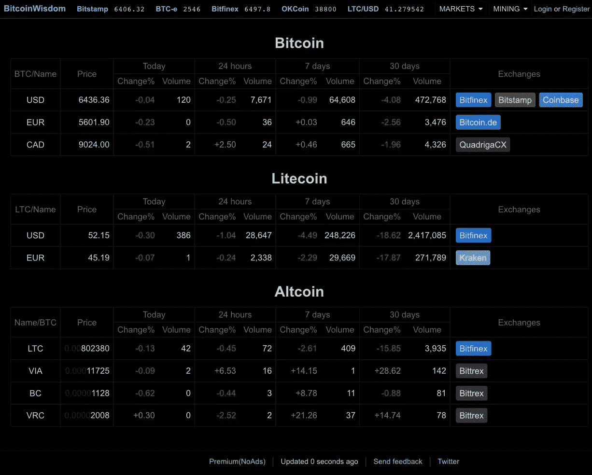

# 学习交易加密的 5 个最佳指南、顶级教程和免费工具

> 原文：<https://medium.datadriveninvestor.com/the-5-best-guides-top-tutorials-free-tools-to-learn-how-to-trade-crypto-f4ebce6e5b1b?source=collection_archive---------8----------------------->

## 使用排名前五的免费资源，像专业人士一样或更好地开始 swing 和日间交易加密货币

Photo Credit: [Andre Francois](https://unsplash.com/@silverhousehd)

# 交易密码没有“正确”或“完美”的方式

或股票，或外汇(外汇市场)，或任何与此相关的东西。不存在“终极指南”。没有捷径是有效的。没有保证盈利的方法。正如商品交易商 Roy L. Smith 曾经说过的，“T2，完美的策略每次都有效，直到你开始使用它”

## **学习加密市场有点像跳进一个球坑……**

A brand new Bitcoin trader opening [CoinMarketCap](https://coinmarketcap.com/) for the first time

> 要找到那个绿色的球，你必须翻遍成堆的红色的球，一把丢失的鞋子，可能还有一些随机的儿童固定器。

# 那么，我从哪里开始学习交易呢？

虽然它肯定不是“成为全部，结束全部”…这个简单而全面的在线课程、教程视频和(令人惊讶的)免费工具的精选集合是开始你的交易之旅的好地方。正如大多数资深外汇交易员(无论是加密还是其他)所知道的，****错误路径*** 在这个领域很容易找到，但是 ***正确路径*** 通常以…*

# *1.)总体而言，最好的免费在线课程:*

## *[BabyPips 外汇交易课程](https://www.babypips.com/learn/forex)*

**

*BabyPips 的“外汇交易入门指南”是迄今为止最好的免费在线课程，可以帮助你学习基础知识和更多内容。如果你没有使用列表中的其他内容，请从头到尾完成这条学习路线。*

*你将从“什么是外汇”等基础知识开始，熟悉不同的图表类型，但很快进入基本的图表分析(支撑位/阻力位、移动平均线、斐波纳契线等)。)一旦你熟悉了振荡指标和动量指标，你将学会如何利用这些信息交易突破、伪造和背离。*

*虽然你最喜欢的加密推特交易者可能就到此为止了，但如果你坚持，你会发现这门课程有 ***所以*** 可以提供更多。从判断市场情绪到“交易新闻”，到制定自己的交易计划，再到风险管理……这真的是一个完整的交易过程。*

*虽然在 BabyPips 课程中学到的知识是针对外汇的，但你会很快发现你的知识会溢出到你交易的所有东西中。无论是加密货币、股票、商品还是外汇，完成本课程后，你将成为更好的交易者。老实说，尽管它变得如此受欢迎(尤其是对有抱负的加密交易者来说)，但我很惊讶也很感激它仍然是免费的。*

# *2.)深入研究交易模式的最佳方法是:*

## *[布尔考斯基的《模式现场》](http://thepatternsite.com/)*

**

*不要让“这个网站是 1997 年制作的吗？”外表欺骗你… *模式网站*是一个 30 多年市场分析和模式交易经验的丰富知识。关注“研究”部分，从基本面和蜡烛图到更高级的主题，如设置交易信号，甚至丑陋的模式...是的，你读对了…*‘丑陋的图案’*。*

# *3.)了解成交量和掌握价差的最佳资源*

## *[成交量价差分析](http://www.volumespreadanalysis.com/library.asp)*

**

*理解货币交易的交易量与掌握交易模式同等重要，如果不是更重要的话。加密往往是一个非常低的交易量/高波动性的市场，特别是与外汇、[股票](https://mbv3.co/Robinhood)和商品等其他市场相比。一定要使用像 [CoinMarketCap](https://coinmarketcap.com/exchanges/volume/24-hour/) 这样的关注市值的网站，找出你选择的交易对的最高交易量*(见下面我的个人建议)*。注册*交易量差价分析*是免费的，但是必须的，它会给你提供每一个训练视频(外加两本电子书)来粉碎交易量。*

> *流动性(即交易量)在所有市场中都至关重要，尤其是加密货币。如果没有人购买你出售的数字资产，你很快就会发现自己处境艰难。实际上有数以千计的密码交易所可供选择，所以，一如既往地，做你自己的研究。我个人倾向于使用像[【币安】](https://mbv3.co/Binance) & [Bibox](http://bit.ly/MBv3Bibox) 这样交易量较高的网站进行我的 altcoin 交易& [比特币基地。Pro](http://bit.ly/MBv3Coinbase) 用于免费(当您发出做市商订单时)购买比特币、以太坊、莱特币、以太坊经典和比特币现金。就像我说的，这些只是我的偏好。严肃地说……接受建议去研究它们，但是最终，你要自己做决定。*

# *4.)开始真正使用图表*

## *[交易视图](https://www.tradingview.com/)*

**

*现在，您实际上已经知道了一些关于绘制加密令牌的知识，是时候开始做了！ [Coinigy](https://www.coinigy.com/) 是一个 ***杰出的*** 图表和交易平台 ***如果*** 你是；a .)只有 trading crypto 和 b .)愿意支付会员费。Coinigy 的好处是可以获得更多种类的代币和交换。*

*然而， [TradingView](https://www.tradingview.com/) 却是应用最广泛的 ***免费*** 制图平台(和 app)原因很多。大多数功能，以及访问所有资产和交易(密码、股票等。)，是完全免费的。稍后，您可以决定是否需要付费订阅带来的额外好处。使用您熟悉的功能开始，但您会很快发现它的功能如此丰富，值得拥有自己的教程(您会发现周围有很多)。就我个人而言，我整天都在使用这个应用程序，因为它有我需要的 90%。然而，当你正在寻找下一个交易对手或者正在积极进行日内交易时，这个仅在**网站上提供的“** [**密码筛选程序**](https://www.tradingview.com/crypto-screener/) **”非常有用。***

# *5.)也使用订单簿*

## *[BitcoinWisdom.com](https://bitcoinwisdom.com/)*

**

*TradingView 中缺失的一个非常重要的数据是订单簿。难道你不想知道谁在买卖比特币，什么价格，什么数量？比特币智慧就是为了这个。*

*布局直截了当。没有华而不实的标志…没有不必要的附加产品…只有数据。虽然不是很令人兴奋，但“坚持基本”的设计使它非常容易使用。被跟踪的加密交换的数量是有限的，但是这仍然比单独登录每一个要容易得多。*

*我希望你发现这些加密交易工具有用！如果是这样，请查看我在 Medium 上最受欢迎的文章；*

* [## 用 100 美元或更少的钱下注的前 5 名加密者(2018 年 8 月)|最佳红利/奖励支付代币

### 不需要像凯文·奥利里这样的“鲨鱼”来理解红利的价值。为什么加密货币应该是任何…

cryptocurrencyhub.io](https://cryptocurrencyhub.io/top-5-reward-dividend-staking-cryptocurrencies-for-hodlers-on-a-budget-august-2018-2abcd1eee0de)  [## 2018 年前 5 大加密交易所的采用率不断上升…迄今为止[ +4 名亚军]

### 密码交换像俚语的趋势一样来来去去(显然“黑幕”让我现在听起来很老…我不得不说…

cryptocurrencyhub.io](https://cryptocurrencyhub.io/the-top-5-crypto-exchanges-growing-adoption-in-2018-so-far-4b8c116c02a) 

( **E *dit***

Please remember to hold ‘clap’ to 50, follow and share… THANK YOU so much!!!

## [连接&与我合作！](https://mattbardeleben.wordpress.com/contact/social-media/)

**商业:**[LinkedIn](https://www.linkedin.com/in/m-bardel/)|[Upwork](https://www.upwork.com/o/profiles/users/_~01578e4e301ac41eb1/)|[AngelList](https://angel.co/matthew-bardeleben)|[认证](https://mattbardeleben.wordpress.com/certifications-all-matthew-bardeleben/)|**社交:** [Twitter](https://twitter.com/@mattybv3) | [脸书](https://www.facebook.com/LearnDisruptProfitRepeat/)|[Reddit](https://www.reddit.com/user/MattyBv3)|[insta gram](https://www.instagram.com/mattybv3/)
技术: [堆栈溢出](https://stackoverflow.com/users/9948932/matty-b) | [GitHub 【T27](https://github.com/MattyBv3)

[**LearnDisruptProfitRepeat.com**](https://learndisruptprofitrepeat.com)
***免费*** *技术培训，合法认证&转行指导由 Matthew 'Matty Bv3' Bardeleben 策划。*

 [## 学习。扰乱。利润。重复一遍。|全民创新技术教育

### 面向未来的自我、技能和职业。关于区块链、人工智能的免费在线课程、指南和教程…

learndisruptprofitrepeat.com](https://learndisruptprofitrepeat.com) 

[**MatthewBardeleben.com**](https://matthewbardeleben.com)
*马修·巴德莱本的个人作品集*

 [## 我的数字化转型

### 数字达尔文主义不仅限于消费者或企业…它适用于每个人。为了茁壮成长，更别说…

mattbardeleben.wordpress.com](https://mattbardeleben.wordpress.com/)*