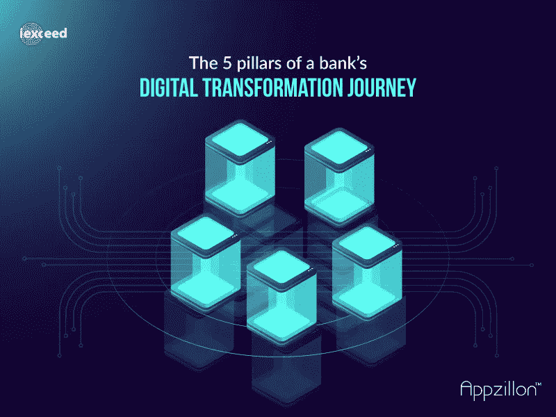

# 银行数字化转型之旅的五大支柱

> 原文：<https://medium.datadriveninvestor.com/the-5-pillars-of-a-banks-digital-transformation-journey-7d2381fc892d?source=collection_archive---------9----------------------->

如今，银行和金融服务业正在经历一场历史性变革，这一变革是由现代消费者不断变化的偏好所推动的。新设备和数字银行工具为消费者提供了移动银行的便利，这导致银行调整其产品以满足“永不停机”客户需求的期望呈指数级增长。一个曾经以遗留系统闻名的行业，最近经历了快速转型，以降低运营成本、增加收入、降低风险，并在一场被各种规模的参与者打乱的竞争中保持竞争力。“数字优先”不再是一个“最好拥有”的概念，而是一个生存的“必须拥有”的概念。事实上，埃森哲最近的一项研究显示，78%的消费者愿意向亚马逊或谷歌这样的科技公司存款。这表明，不愿意或不能采用数字化服务的银行可能会将客户流失到新时代的非银行竞争对手手中。

数字化转型不是一次性的工作，也不是一个被动的过程。这是一个持续的过程，已经成为每家银行在当今不断变化的金融服务环境中保持相关性的基本练习。

成功的数字化转型取决于 5 个基本要素:

1.  ***高级管理层:*** *从赞助商那里直接获得项目目标的认可是非常必要的，因为赞助商已经对所涉及的利益、风险和预算有了全面而现实的了解。高级管理层的参与包括 CXO 级别的每个人和关键业务负责人。*
2.  ***可持续目标:*** *预算超支通常会破坏数字化转型项目，项目团队必须节约成本以实现既定目标。”*
3.  ***风险管理:*** *任何数字化转型之旅的进展都有可能带来各种风险，从 IT 安全到法规遵从性和运营风险。这是由于交互渠道、故障点、运营规模、IT 硬件的快速增长、不断发展的监管要求，甚至是对开源软件和云计算的依赖的突然增加。需要建设性地将这些风险视为加强流程和运营的途径。通过数字化转型实践获得的收益很可能远远超过这些风险。但是，必须考虑到所有风险，在旅程的早期制定具体的风险管理战略，并实施减轻风险所需的措施。*
4.  ***强大的治理:*** *强大的 effective 治理模式对于数字化转型之旅的连续性和成功至关重要。一些关键的治理准则包括:*

*   *成立由发起人、CTO、业务主管、IT 主管和技术合作伙伴组成的指导委员会*
*   *在创新和用户体验团队的帮助下，使项目与新技术和用户体验开发实践保持同步*
*   *共享数字资产，如可跨项目重用的微应用程序，以避免冗余和重复工作*
*   *维持强大的变更控制委员会，以管理与任何变更相关的利益、成本、风险和时间表之间的平衡。由技术和业务人员组成的早期采用团队为计划奠定基础，然后培训追随者并分享最佳实践*
*   *effectively 的产品负责人和 scrum 经理实践敏捷方法，管理冲刺和积压工作*

***5。敏捷结构:*** *最后，应该有一个基于组件化架构的稳定且可扩展的低代码数字体验平台，该平台支持数字解决方案的快速开发和增强，同时使用敏捷方法提供持续开发和无缝集成能力。这种方法还需要包括跨组织的人员和流程，这些组织将其工作建立在强大的反馈机制上，以确保成功和及时纠正过程。*

随着改进的数字银行应用的出现，消费者现在可以选择只需在智能手机上轻点几下，就可以获得引人入胜的数字用户体验。显然，“数字优先”是银行的前进方向，因为它提供了速度、移动性和实时可访问性。此外，在变化是唯一不变因素的动态商业环境中，数字化转型是保持竞争优势的最可靠方式。

*作者-S. Sundararajan 执行董事*

[*i-exceed 技术方案*](https://i-exceed.com/)