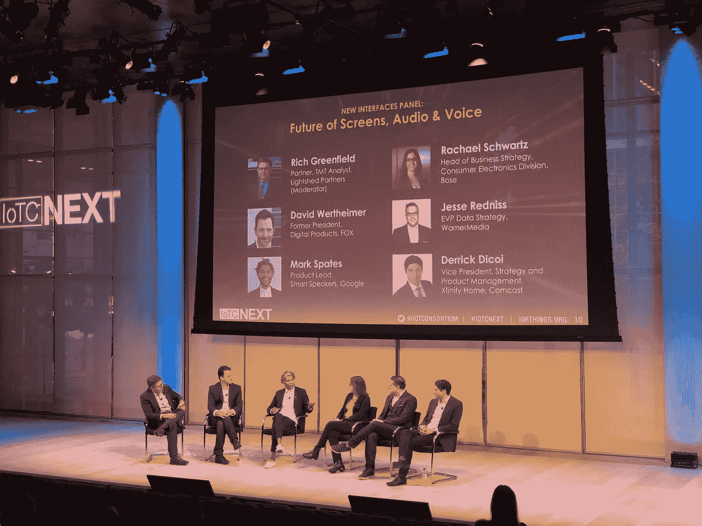
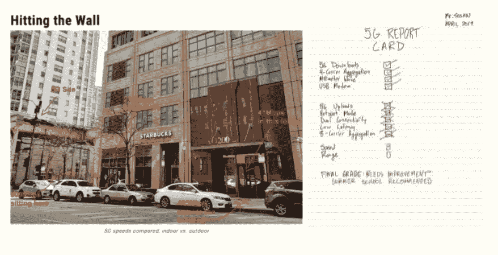
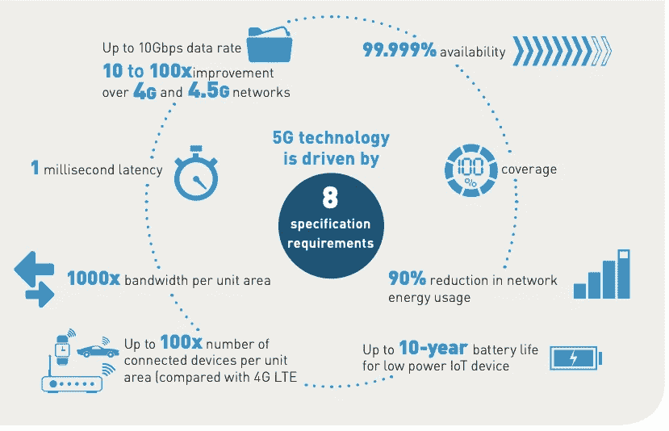
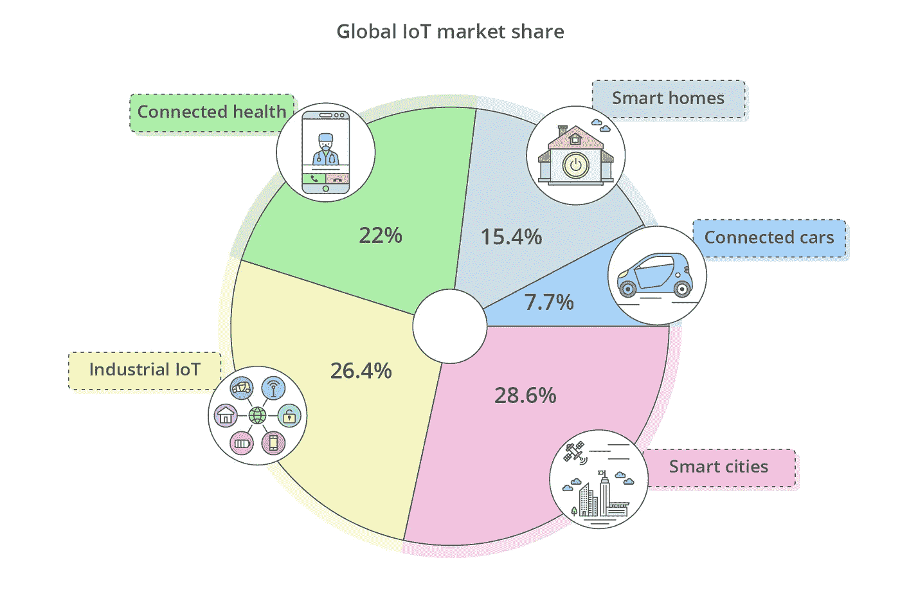
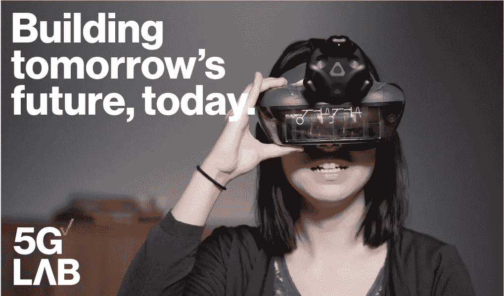

# The 5G Report Card, Building Today’s Smart IoT Ecosystem

> 原文：<https://medium.datadriveninvestor.com/the-5g-report-card-building-todays-smart-iot-ecosystem-5b50cd32f358?source=collection_archive---------18----------------------->

The elephant in the room loomed large two weeks ago at the inaugural [Internet of Things Consortium](https://iofthings.org/) (IoTC) Summit in New York City. Almost every presentation began apologetically with the refrain, “In a 5G world…” practically challenging the industry’s rollout goals. At one point Brigitte Daniel-Corbin, IoT Strategist with Wilco Electronic Systems, sensed the need to reassure the audience by exclaiming, ‘its not a matter of if, but when 5G will happen!’ [Frontier Tech](https://www.cbinsights.com/research/frontier-tech/) pundits too often prematurely predict hyperbolic adoption cycles, falling into the trap of most soothsaying visions. The IoTC Summit’s ability to pull back the curtain left its audience empowered with a sober roadmap forward that will ultimately drive greater innovation and profit.

The industry frustration is understandable as China [announced](https://www.washingtonpost.com/world/asia_pacific/showing-that-the-us-wont-hold-it-back-china-launches-commercial-5g-service/2019/10/31/4f2e64da-fb16-11e9-9e02-1d45cb3dfa8f_story.html) earlier this month that 5G is now commercially available in 50 cities, including: Beijing, Shanghai and Shenzhen. In fact, the communist state beat its own 2020 objectives by rolling out the technology months ahead of plan. Already more than 10 million cellular customers have signed up for the service. China has made upgrading its cellular communications a national priority with more than 86,000 5G base stations installed to date and another 130,000 5G base stations to go live by the end of the year. In the words Wang Xiaochu, president of China Unicom, “The commercialization of 5G technology is a great measure of [President] Xi Jinping’s strategic aim of turning China into a cyber power, as well as an important milestone in China’s information communication industry development.” By contrast the United States is still testing the technology in a number of urban zones. If a recent [PC Magazine](https://www.pcmag.com/news/367659/heres-the-real-truth-about-verizons-5g-network) review of Verizon’s Chicago pilot is any indication of the state of the technology, the United States is very far from catching up. As one reporter complains, “I walked around for three hours and found that coverage is very spotty.”

 [## Making Sense of IoT | Data Driven Investor

### The more open a system is, the more it enables innovation and engenders trust. Yet, when it comes to open systems, the…

www.datadriveninvestor.com](https://www.datadriveninvestor.com/2019/09/28/making-sense-of-iot/) 

去年，特朗普总统戴着安全帽宣布，“我的政府专注于释放尽可能多的无线频谱(以使 5G 成为可能)。”特朗普 4 月份宣传活动的重要性不能再低估了，因为自动驾驶、增材制造、协作机器人、航运和物流、智能城市基础设施、物联网(IoT)以及虚拟和增强现实的未来在很大程度上依赖于更大的带宽。大多数专家预测，5G 将比第四代无线技术提高 10 到 100 倍。NetComm 的 Els Baert 解释说:“5G 相对于 4G LTE 的主要优势是更快的速度——主要是因为 5G 将有更多的频谱可用，并且它使用更先进的无线电技术。它还将提供比 4G 低得多的延迟，这将在[物联网]领域实现新的应用。”不幸的是，自特朗普的照片曝光以来，与中国的关系严重恶化，美国运营商现在被禁止与最大的 5G 设备供应商[华为](https://robotrabbi.com/2019/11/04/china/)做生意。这使得美国只有少数供应商，包括市场领导者诺基亚和爱立信。德勤(Deloitte)表示，有限的供应链对美国在升级电信方面的支出如此之少感到恼火。“我们得出结论，自 2015 年以来，美国在无线基础设施方面的支出每年比中国少 80 亿至 100 亿美元。”

忽略这些令人不快的问题，当前的技术状态(障碍和所有问题)要求今天培育一个创新生态系统，与 5G 经济的新服务爆炸并行。据[麦肯锡](https://ipropertymanagement.com/iot-statistics?u=/iot-%20statistics)报道，目前有超过 250 亿台联网设备，随着第五代无线技术的出现，预计到 2025 年将超过 750 亿台。该研究进一步指出，“通用电气预计，到 2030 年，物联网将为全球国内生产总值(GDP)增长增加 10 至 15 万亿美元。客观来看，这个数字相当于中国目前的整个经济。”遗憾的是，美国大多数可用的 5G 加速器都是为了展示虚拟和增强现实而构建的，而不是为了促进企业对企业服务的更大机会而开发应用。据 Business Insider 称，“到 2021 年，物联网解决方案将达到 6 万亿美元”，涵盖广泛的行业，包括:医疗保健、制造、物流、能源、智能家居、交通和城市发展。事实上，硬件将只占新收入的三分之一左右(VR/AR 头戴设备所占比例要小得多)。

对于上市公司(如 T-Mobile、威瑞森和美国电话电报公司)来说，这是一个挑战，因为它们的股票表现与下一代无线网络的未来息息相关。显然，比起用于机器人回收的物联网传感器、农业无人机和节能反应器，做市商对 Oculus(2014 年被脸书以 20 亿美元收购)和 T2(2016 年估值 45 亿美元)的独角兽过于兴奋。然而，根据现有数据，5G 的杀手级应用将出现在工业领域，而不是数字剧院。这种对戏剧效果的关注体现在威瑞森 5G 实验室主任克里斯蒂安·吉纳尔达(Christian Guirnalda)在网上发表的几份声明中，他夸口说，“我们在一个立体捕捉工作室里使用十几台不同的相机制作全息图，以创建人和产品的近乎实时的 3D 图像。”在威瑞森 5G 实验室以北几英里处，纽约市的医院人满为患，患者和数据导致了物理和虚拟延迟问题。威瑞森可以让纽约的医院以更快的网络速度远程治疗更多经济困难社区的病人。5G 已经威胁要通过针对富裕社区的首次推出来加剧美国的数字鸿沟。通过投资更多的高速远程医疗应用，这家电信巨头可能会使特权较少的患者获得更好的护理，这证明了增加政府支出的必要性。Guirnalda 的实验室可以通过应用 5G 的承诺来解决这些现实生活中的城市挑战，从公共交通到食品短缺到医疗保健，从而得到更好的服务。

大多数企业 5G 孵化器的缺点是它们的窗户不透明——迫使发明者在里面进行实验，而真正的实验室在外面熙熙攘攘。联合国估计，到 2050 年，世界人口的 70%将是城市人口。虽然大部分增长将发生在发展中国家(即非洲和亚洲)，但全球 80%的 GDP 来自城市。21 世纪最大的挑战将是管理这些人口的可持续发展。在上个月的联合国“世界城市日”上，该外交机构表示，5G“大数据技术和云计算提供了增强城市运营、功能、服务、设计、战略和政策的潜力。”联合国的声明没有被置若罔闻，甚至特朗普总统上个月也竭力安慰他的选民，“我问蒂姆·库克，看他能否让苹果参与在美国建设 5G。他们拥有一切——金钱、技术、愿景&库克！”

*要去 CES？1 月 8 日上午 10 点，在拉斯维加斯会议中心，加入我关于* [*零售机器人*](https://hightechretailing.com/2020-agenda-2/) *的小组讨论。*