# 将改变世界的 6 项新兴技术

> 原文：<https://medium.datadriveninvestor.com/the-6-emerging-technologies-that-will-change-the-world-d9d9d1196b1?source=collection_archive---------0----------------------->

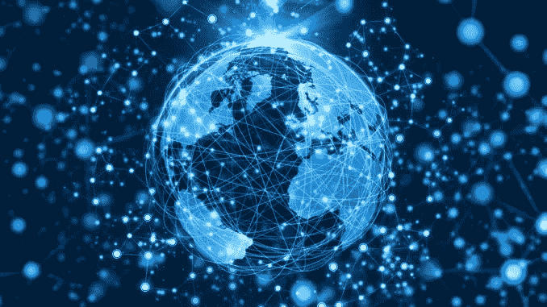

未来几十年将会出现许多技术，这些技术将会深刻地影响我们的日常生活。在它的所有技术中，有 6 项技术我想提一下，因为我认为这些技术在未来有很大的潜力，发展很快，可能会在未来几十年影响我们的世界。

对于这 6 项技术中的每一项，我都解释了为什么在我看来，这些技术肯定会在不久的将来改变我们的世界。这是 6 项技术:

1.  **大数据**
2.  **人工智能**
3.  **自动驾驶汽车**
4.  **区块链**
5.  **虚拟现实和增强现实**
6.  **3D 打印机**

# 大数据

大数据是指非常大的数据集或海量数据。每天我们都会产生大量数据，比如电子邮件、社交媒体帖子、在线文章和视频、GPS 信号等等。因此，这个数据集是大数据。

面对如此庞大的数据，我们必须能够导航和处理这些数据。大数据实际上是用越来越多的标准计算手段处理大量信息的能力。这些大量的信息或数据是许多部门感兴趣的，如旅游、商业、广告、遗传学、天文学或人力资源。大数据可以被认为是数字时代的新黑金。

为了管理大数据，有必要收集、处理、分析这些数据，并在分析这些数据后采取所有相关措施。

我们通常使用比传统 SQL 数据库(键/值、列、行、表)更高效的 NoSQL 数据库来处理大数据。

大数据现象的特征是 5 个 v:

1.  **卷**
2.  **速度**
3.  **品种**
4.  **准确性**
5.  **值**

**1)体积**

容量是每秒产生的信息量。2000 年，20%的数据是数字的，其余是模拟的。2015 年，98%的数据是数字的，其余是模拟的。这些数据是由个人电脑、智能手机、平板电脑和其他设备产生的。

我们每一分钟都在生产:

*   instagram 上有 216000 张照片
*   27 万条推文
*   300 亿条即时消息
*   2 亿封电子邮件

这些数据大部分由两家公司收集，它们是:

*   谷歌与 Gmail、谷歌搜索引擎、安卓和 Youtube
*   **脸书**用 instagram 和 WhatsApp

这两家公司积累这些数据是为了处理这些数据，目的是留住用户，以便积累最大数量的数据，从他们的广告商那里赚钱。

**2)速度**

速度是指开发和部署新数据的速度。

**3)品种**

多样性指的是不同类型的数据，如图像、视频、文本、语音等。在所有这些数据中，80%是非结构化数据，其余 20%是存储在关系数据表中的结构化数据。

**4)大实话**

准确性代表所收集数据的可信度和可靠性。由于收集了大量数据，因此并非所有内容都是真实可信的。例如，在 Twitter 上，一些消息可能包含技术错误、印刷错误、缩写或熟悉的语言。

**5)值**

价值是使用大数据可以获得的利润。

为了说明大数据，我们可以提到像优步和网飞这样的两家公司，它们将在大量数据中只选择正确的数据。

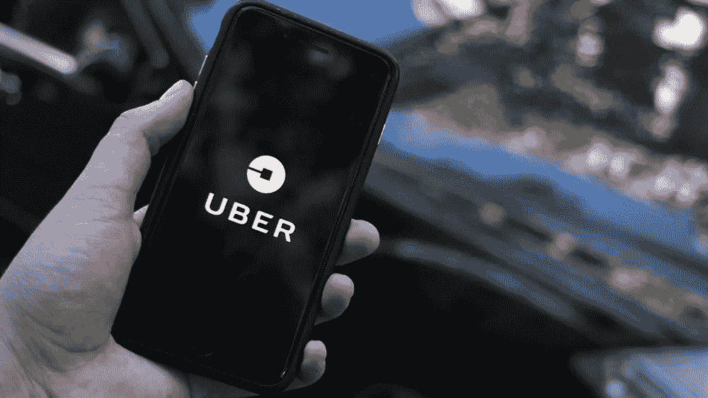

优步是一家美国公司，开发移动应用程序来连接用户和司机，以提供运输服务。优步从他们的司机和客户使用的移动应用程序中收集了大量数据，但它不仅收集数据，还收集最相关的数据，使其能够连接客户(消费者)和司机(服务提供商)。确定客户的需求(拥有一辆车)和客户需求的地理位置(在那里寻找客户)是让优步淘汰出租车的两个数据。

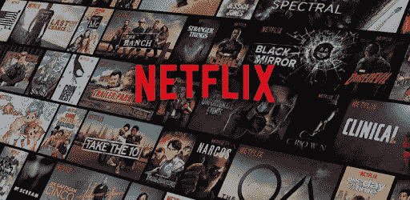

网飞是一家美国公司，在互联网上提供电影和电视剧流媒体平台。2016 年，7100 万人使用了网飞流媒体服务，这数百万用户产生的数据将被收集和分析，以更好地了解观众的习惯。用户对该类型影片的偏好是网飞数据好，为每部电视剧设置了推荐引擎和关键词。基于用户最喜欢的，基于关键字的建议将被提供给用户。

在未来，大数据可以通过创造新的治疗方法用于医疗领域，在人道主义领域，它还可以用于管理自然灾害和管理战争的后果。大数据当然会被用于商业目的，比如为广告商锁定最佳客户，或者提供更好的促销优惠。

与机器学习相关的大数据允许进行预测分析，这将用于各个领域，如卫生、农业、社区管理，尤其是营销。另一个例子是与深度学习相关的大数据，它有助于区分不同类型的数据，包括形状、颜色以及图像或视频上的指示。此外，物联网的兴起提供了非常大量的信息，使得大数据的发展成为可能。

这就是为什么我认为大数据将在未来几年越来越多地影响我们的日常生活。

# 人工智能

人工智能(AI)的历史很短，并且表明该领域在六十年中已经取得了很大进展。事实上，我们从第一台可以进行一些计算的计算机发展到非常复杂的机器。第一台展示其人工智能能力的机器是深蓝，一台 IBM 的超级计算机，它在 1997 年击败了国际象棋世界冠军加里·卡斯帕罗夫。然后是 IBM 开发的沃森 AI，它赢得了一个游戏节目“Jeopardy！”用自然语言回答问题。最后，谷歌 DeepMind 的人工智能 AlphaGo 击败了围棋世界冠军，Lee Sedol 知道围棋比国际象棋复杂得多。

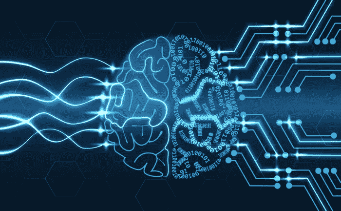

近年来，算法、计算能力和数据科学的进步有助于人工智能的发展。这就是为什么我们最近听到很多关于 AI 的事情。人工智能可以被定义为一套理论和技术，用于实现具有高级过程的计算机程序，如感知学习、记忆组织和批判性推理。其实我们可以把 AI 分为两部分，强 AI 部分和弱 AI 部分。

“强”的 IA 是基于学习的，也就是说，它存储新的数据并改变自己的功能。“弱”人工智能不同于“强”人工智能，因为计算机程序模拟智能。因此，人工智能是一个非常全球化的术语，我认为人工智能的科学术语是机器学习，因为人工智能中使用的大多数技术都来自机器学习，特别是深度学习(机器学习的一个分支)，它广泛用于图像识别，如卷积神经网络(CNN)。

人工智能已经在几个领域得到应用，例如在医疗领域，沃森可以帮助医生进行诊断。也有自动驾驶汽车使用 AI 在道路上获得一定程度的自主。智能手机、个人电脑或联网家庭扬声器中的虚拟助手，如苹果的 Siri、微软的 Cortana、谷歌的 Google Now、三星的 Galaxy S8 的 Bixby 和亚马逊的 Alexa，也使用基于学习我们习惯的人工智能，以便根据上下文提供相关信息。

人工智能的应用如此之多，并呈现出许多市场，以至于 GAFAM(谷歌、苹果、脸书、亚马逊和微软)和 BATX(百度、阿里巴巴、腾讯和小米)等网络巨头都试图征服这些市场。

人工智能的应用和市场:

*   **静态图像的识别、分类和标记**

网络巨头希望使用人工智能来收集和分析服务器上的图像，以便更容易地找到它们。

*   **利用交易算法提高财务绩效**

金融部门对人工智能感兴趣，它可以利用处理股票指数和地缘政治因素的交易算法来预测金融机会和风险。

*   **物体检测和分类以避免碰撞和导航**

自动驾驶汽车需要识别、检测障碍物并跟踪物体，才能在道路上行驶。

*   **患者医疗数据的处理**

在医学领域，这将在某些患者出现疾病之前检测出这些疾病

*   **机器人学习一些任务**

一些任务可以由机器人学习，而不需要为它们编写程序。

*   **IT 和行业中的预测性维护**

预测可能的计算机故障或工业产品可以为公司节省时间和金钱。

*   **通过文本请求识别图像**

通过文本查询查找图像。

*   **地球物理特征的自动检测**

这种探测可以预测恶劣天气，如风暴、飓风、海啸或地震。

*   **社交网络上的内容分发**

适应用户偏好的内容显示。

*   **物体识别、检测和跟踪**
*   **防范与网络安全相关的攻击**

军事部门也对人工智能感兴趣，将其集成到武器和无人机中，这引发了许多关于自主武器的争议，可能会加速冲突。

简单地说，人工智能有很多应用，所以我认为在未来的几年里，人工智能将越来越成为日常生活的一部分。AI 有很多优势，但一切也将取决于 AI 将如何被使用。

# 自动驾驶汽车和 6 个自动驾驶级别(0 到 5)

电气化、自动驾驶和互联是塑造汽车未来的三个因素，也就是说，自主和互联电动汽车。

汽车的电气化将解决目前汽车的污染和噪音问题。自动驾驶，会大大减少事故数量。该连接将允许乘客查询信息(天气、道路交通等)。)并在旅途中小心。

在继续之前，我先定义一下什么是自动驾驶汽车。自动驾驶汽车(无人驾驶汽车或自动驾驶汽车)是一种能够在没有驾驶员干预的情况下在道路上行驶的车辆。这是一种配备了许多传感器的车辆，如超声波传感器、摄像头和激光雷达，以感知其环境。传感器收集的数据由软件和处理器进行处理，以进行数据融合，从而观察其环境并检测其他车辆、障碍物、标志和路面限制。然后，人工智能算法将决定对车辆控制装置(方向盘、油门、刹车等)执行的操作。).

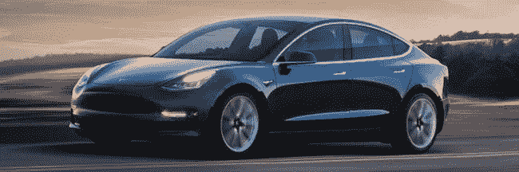

在我参观世界巴黎车展期间，我可以看到电动汽车的这种趋势，因为大多数汽车制造商都推出了电动汽车，因此车辆的电气化进展良好。一些制造商也推出了半自动驾驶汽车，这证实了自动驾驶的趋势。连接技术已经存在，我们都使用互联网，智能手机和平板电脑的触摸屏。因此，我们发现了三个因素，这三个因素将允许自动驾驶汽车在我们的生活方式中发展。

在我看来，我认为人工智能取得的进步将有利于自动驾驶汽车的发展。这当然会扰乱交通部门和流动性的日常工作。此外，大多数汽车制造商和许多网络、软件和电子公司都在研究自动驾驶汽车。

面对自主车辆的发展，已经创建了标准来根据车辆的自主程度对其进行分类。有 6 个自动驾驶级别:

*   **0 级:无援助**

驾驶员保持对所有车辆功能(控制、刹车、加速、转向)的完全控制。然而，车载计算机可以通过发出声音警报来帮助驾驶员过线。

*   **第一级:驾驶辅助**

车载计算机可以支持速度或方向，因此不能同时支持两者。驾驶员始终保持对其他功能(速度或方向)的控制，以及对车辆的完全控制。

例如:巡航控制、车道偏离雷达、紧急自动制动、碰撞警告。

*   **第二级:部分自动化**

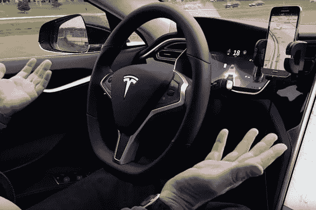

车载电脑可以控制速度和方向。驾驶员监督操作，但必须始终保持注意力集中，监控车辆环境，并在故障情况下重新获得对车辆的完全控制，因为驾驶员的责任是完全投入的。

例如:交通堵塞时的驾驶助手(自适应巡航控制)或泊车助手。

*   **第三级:条件自动化**

在这一级，驾驶可以完全委托给车载计算机，但是仅用于预定义的情况，例如在高速公路上。因此，车载计算机能够通过物体检测功能(道路、线路、车辆)监控车辆环境。当他无法处理这种情况时，他也能够认识到自己的极限，并通过提前几秒钟发送的听觉或视觉警报邀请驾驶员重新控制车辆。

例子:高速公路试点，自动泊车，排队。

*   **第四级:强自动化**

计算机只在预先确定的区域，如高速公路或停车场，控制整个车辆。司机可以阅读报纸或他的信息，而不用担心道路。然而，一旦车辆离开这个预定义的自动驾驶区域，驾驶员必须重新获得控制，但是如果驾驶员没有重新获得控制，车辆能够通过安全位置自己做出反应。

*   **第五级:全自动化**

该车辆能够在任何情况下行驶。因此，车载计算机可以控制车辆的所有功能。方向盘或踏板等控制元件可以拆卸。

自动驾驶汽车的开发甚至可能涉及出租车机器人的开发，也就是说，一个自动驾驶汽车车队。汽车行业将因此从货物行业转移到服务行业，知道车辆将仍然是运输公司的财产。

无人驾驶汽车也将联网，并将拥有互联网连接。他们将能够通知用户和他的乘客，天气，道路交通和交通堵塞的形成。他们还会给乘客时间，这将是谷歌和苹果在自动驾驶汽车中引入信息娱乐等嵌入式服务的机会。

总之，我认为自动驾驶汽车将是人工智能的第一批具体应用之一，它将颠覆交通行业，改变我们的习惯。

# 区块链

区块链是一种用于存储和传输信息的技术，透明、安全、分散，并且在没有中央机构的情况下运行。简而言之，它是一种数字数据管理协议，一个大型安全透明的数据库。区块链可以被看作是一种账簿或登记簿，它包含了用户之间所有交易的清单。

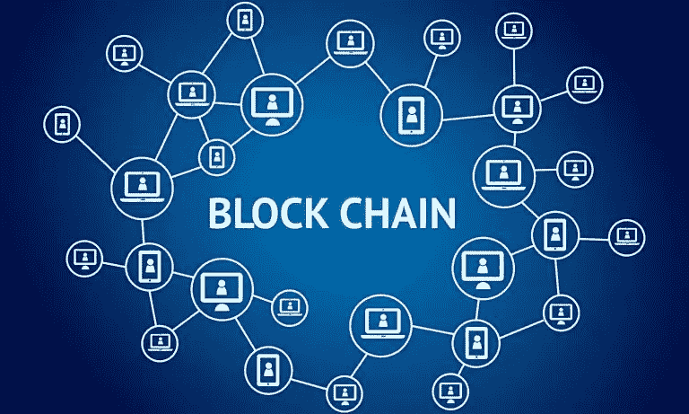

由于这个注册表是分散的，所以它存储在用户的服务器上。该寄存器实时更新，并且是防篡改的，因为它依赖于用户对每笔交易进行验证的加密系统。这些事务集(寄存器的行)在确认后按数据块写入帐簿，从而形成一串不可更改的块:区块链。

区块链经常被错误地与比特币混淆，但比特币是一种加密货币，它使用区块链来确保交易的可追溯性，因为每个比特币都有自己的加密代码。因此，用户只能与对应于单笔交易的单个接收者一起使用他的比特币。

在参观微软体验展期间，我参加了一个关于区块链的会议，结果发现区块链可以用于三个不同的类别:

*   资产的转移:货币、证券、股票、债券、选票等。
*   注册:产品和资产更好的可追溯性。
*   智能合同:自动执行合同条款和条件的自主程序，一旦启动就不需要人工干预。

我还去了 Futur en Seine 展览，该展览组织了关于创新的实验、会议和研讨会，汇集了许多初创公司，包括使用区块链投票系统作为内部选举一部分的初创公司。总的来说，区块链可以取代大多数中央集权的“可信第三方”(银行交易、公证、土地注册等)。)通过分布式计算机系统。

因此，区块链可以取代 Airbnb、优步和 BlablaCar 使用的中介平台，这些中介机构将用户之间的信息和互动集中起来，收取佣金，这是通过他们的平台传递的价值的一部分。

有了区块链技术，就不需要中间人，用户可以直接与司机或出租人进行点对点交易，几乎没有佣金或中间人。因此，这项区块链技术或多或少会威胁到 Airbnb、优步和 BlablaCar 的业务。

因此，这种区块链技术可以找到许多具体的应用，例如:

*   在线投票系统:例如，在内部选举期间，使用区块链可以进行安全的投票，并以透明的方式快速公布结果。应用于在线投票系统的区块链因此避免了任何欺诈和对投票结果的质疑，并因此可能引起有时难以计票和欺诈问题的政党或国家的兴趣。
*   在航班延误或取消的情况下自动补偿:例如，旅行保险计划可以使用智能合同的原则，该原则基于自动启动合同条件的自主程序，而无需个人填写任何表格。
*   汇款平台:在这类平台中使用区块链的优势是汇款速度快(一些国外汇款只需几分钟而不是几天),而且通过可转换成传统货币的加密货币汇款的成本低(每次交易只需几美分)。

因此，区块链可以在诸如银行、保险、房地产、健康、能源、运输、在线投票等各个部门中有许多应用，并因此找到除货币领域之外的其他应用。

我个人认为，区块链是一项有前途的技术，因为它似乎有许多优势，如智能合同的自动化，在没有中介平台的情况下在双方之间建立信任，一种新的治理模式(防篡改和符合人体工程学的投票系统)和大幅降低交易成本(财务)。

事实上，在区块链的大多数潜在应用中，挑战在于建立用户体验，尤其是赢得用户的信任，让他们愿意使用这项新技术。

# 虚拟现实和增强现实

随着许多虚拟现实耳机的发布，虚拟现实和增强现实的进步已经使它们的使用大众化。为了避免这两种技术之间的任何混淆，我将回忆一下什么是虚拟现实和增强现实。

虚拟现实意味着让用户沉浸在一个三维虚拟世界中，在这个世界中他可以移动和互动。

增强现实是利用现实世界来显示 2D 或 3D 信息，如图像、数字和文本，用户也可以与之互动。这种增强现实技术实际上是将虚拟元素叠加到现实世界中，因此现实世界是用数字信息增强的，以向用户提供关于他的环境的更多细节。

还有混合现实，它实际上是前两种技术之间的混合，也就是说虚拟现实和增强现实之间的混合，这反映在现实世界中诸如图像、数字和文本的数字信息的叠加以及对象或移动元素的叠加。

尤其有很多虚拟现实头戴设备和一些增强现实或混合现实头戴设备。

**增强现实耳机:**

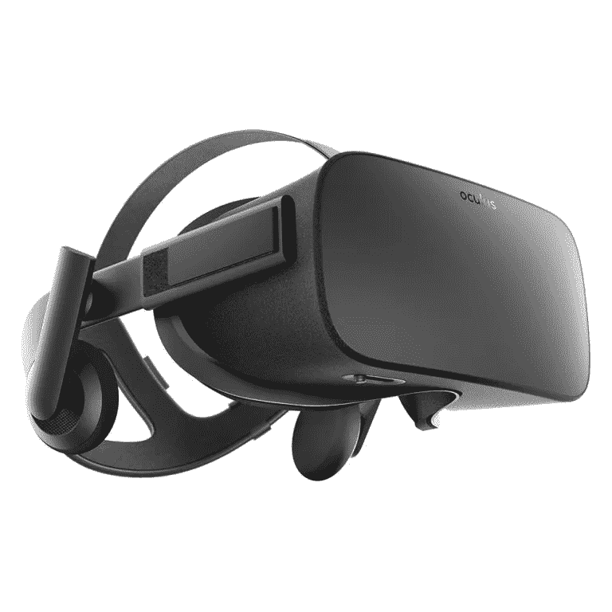

*   Oculus Rift 是脸书为个人电脑设计的虚拟现实耳机
*   索尼的 Morpheus 项目
*   HTC 的生命力&电脑阀门
*   三星手机的 Gear VR
*   手机版谷歌纸板

**增强现实耳机:**

*   微软的 Hololens

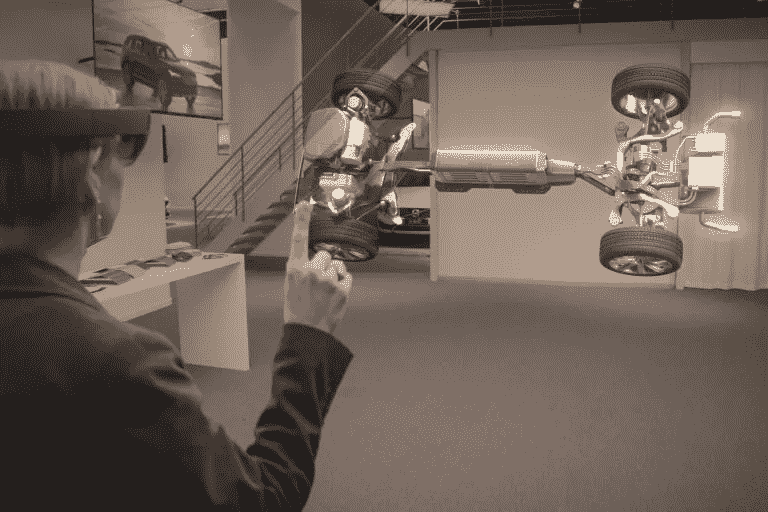

**混合现实耳机:**

*   宏碁 Windows 混合现实开发版耳机

几个月前，我去了巴黎的虚拟现实展，Virtuality 2017，有超过 110 家创业公司展示了他们的虚拟现实产品。这场虚拟现实秀是测试最新虚拟现实技术的绝佳机会。我能够测试大多数虚拟现实耳机，如 HTC Vive、Oculus Rift、三星 Gear VR 和微软 Hololens 增强现实耳机。在这次展览中，还可以测试飞行模拟器和沉浸式房间。在参观这个虚拟现实节目时，我注意到虚拟现实主要用于娱乐和视频游戏行业。

例如，Hypersuit 初创公司介绍了他们将虚拟现实耳机和外骨骼相结合的技术，以模拟空气运动。这项新技术特别适用于将角色定位在空中的游戏。然而，我也注意到虚拟现实也被应用于医疗、航空、铁路维修、石化或核工业的人员培训。例如，医生或外科医生可以使用虚拟现实进行培训，以虚拟操作患者。我还看到虚拟现实也用于产品营销，许多虚拟现实动画已经开发出来，以推广产品，如饮料或香水。

在这次活动中也有许多会议，我能够参加一些会议，似乎不同行业的许多初创公司都依赖虚拟现实技术。这场虚拟现实秀吸引了超过 15，000 名参观者。

作为一个结论，我认为虚拟现实才刚刚开始，例如，目前的虚拟现实耳机戴起来可能会很笨重，而且耳机有可能被眼镜镜片取代。例如，谷歌在其 I/O 2017 大会上宣布，他们将与 HTC 和联想合作推出独立的 VR 耳机，即在没有智能手机、PC 或电缆的情况下工作的耳机。所有的电子设备都将集成在耳机内部。

增强现实的进步也将加速这一技术的部署，特别是智能手机中的增强现实，它带有 3D 摄像头，可以在订购之前可视化他客厅中的虚拟家具，或者通过智能手机的 3D 摄像头定制服装。3D 相机也将成为一种新的人机界面，具有手势或面部识别功能。因此，增强现实将比虚拟现实更容易被采用，因为它没有将用户与现实世界分开。

# 3D 打印革命

近年来，多亏了 3D 打印机，3D 打印才成为可能。3D 打印机遵循与 2D 打印机相同的原理，但 3D 打印机不是在纸张上打印墨水，而是通过叠加塑料、粘土、树脂等材料的薄层来打印物体。通过 3D 软件或 3D 扫描仪，可以对物体进行建模，然后用 3D 打印机进行打印。3D 打印机的打印可能性是巨大的，几乎可以打印所有可能的形式。唯一的限制是打印机的尺寸和用户的想象力。

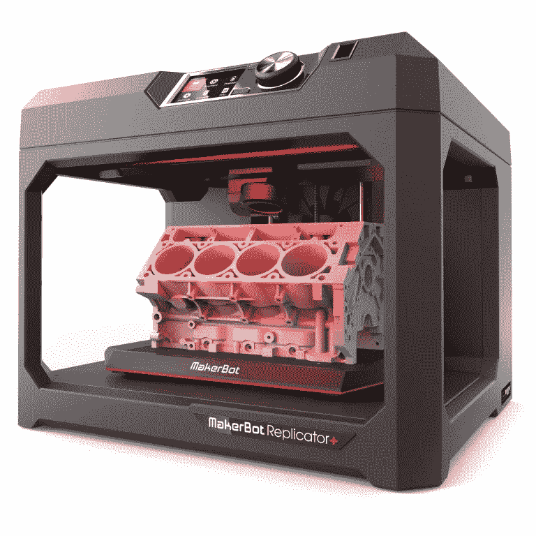

3D 打印机可用于许多应用领域，如工业、机器人、珠宝、医药、食品、时尚、军备、DIY、建筑、设计、卫生、航空和营销。甚至还有 3D 纳米打印机，如 Nanoscribe，它可以打印几微米的尺寸。基于航天器的 CAD 模型，3D 纳米打印机 Nanoscribe 使用激光和旋转镜来引导光束，以便通过聚合创建多层结构。

一些 3D 打印机可以打印几米长的物体。例如，这允许打印一些木头来组装房子。WikiHouse 项目是一个开源项目，它提供房屋模型，让人们用 3D 打印的模型组装自己。然而，打印一个木制的房子带来了保险问题和法律规定，以及阻力和绝缘问题。这些家园尤其是为数百万无家可归者提供庇护的机会。在阿姆斯特丹，建筑师使用 3D 打印机打印他们的模型，也可以直接打印他们的房子。在上海，基于汽车和飞机被大规模生产的假设，一位企业家想对房屋做同样的事情，因此创建了一家公司，通过将混凝土与其他材料混合来固化房屋，从而用 3D 打印机制造系列房屋。人们还可以想象，家具也可以从 3D 模型中打印出来。

3D 打印机的使用允许你打印你想要的所有形式的物体。在航空航天和汽车行业，这种 3D 打印机技术使廉价制造零件和节省生产成本成为可能。汽车甚至可以被打印出来，这是 Divergent Microfactories 公司的案例，他们用 3D 打印设计了一辆跑车，这就是 Balde。

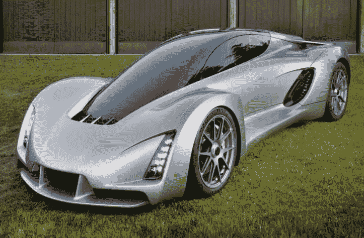

我认为 3D 打印是一场技术革命，因为它彻底改变了工业生产模式，发明了将构建明天世界的新产品。

例如，像 PSA、空客和赛峰这样的公司现在正在使用 3D 打印机来制造汽车和飞机。

汽车和航空航天领域非常关注这场 3D 打印革命。3D 打印对这些部门有两个优势，即节省时间和定制零件。事实上，对于竞争激烈的汽车和航空航天等市场来说，时间至关重要，在制作零件原型方面节省的时间是真正的优势。同样，在不增加制造时间的情况下个性化飞机或汽车零件是一个真正的优势。然而，在私人方面，3D 打印机与工业无关，但它们允许个人构建自己的物体或部件，例如制造机器人。3D 打印机对于个人的优势在于，他们可以根据自己的想象，对任何形式的物体进行建模。

总结一下 3D 打印，3D 打印机是一场真正的技术革命，因为它们将允许公司快速准确地创建他们的产品，也允许个人建造他们自己的物品，或许成为他们自己家的建筑师。