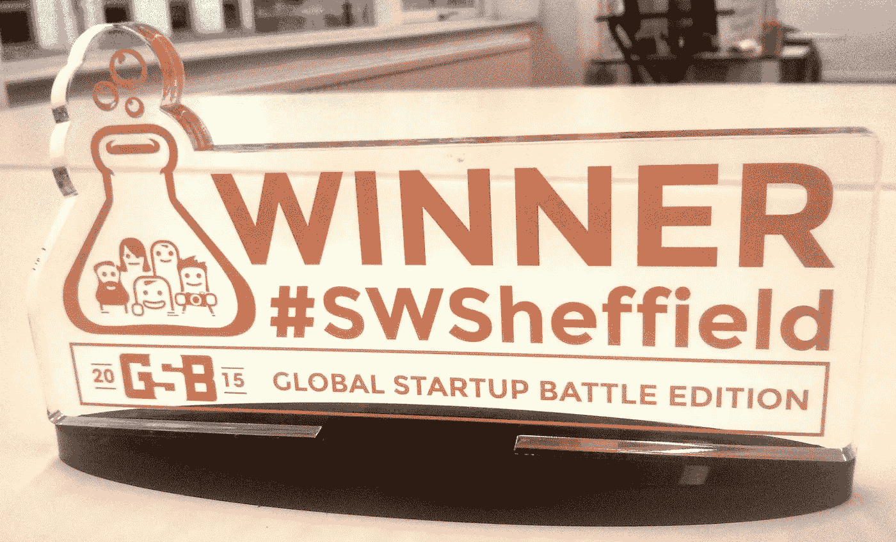

# 我从“创业周末”中学到的 6 条最重要的创业经验

> 原文：<https://medium.datadriveninvestor.com/the-6-most-important-entrepreneurial-lessons-i-learned-from-doing-startup-weekends-7bd6c324ad38?source=collection_archive---------19----------------------->

You can get way more than a trophy out of a [Startup Weekend](http://global.startupweekend.org/)

## 现在是全球创业周末时间！

当我第一次告诉人们我想结束职业生涯，成为一名企业家时，有人建议我参加一个创业周末。

他们说，这是一个很好的方式来学习一些创业经验，并结识其他对创业感兴趣的人。

由于我不得不查找“创业”是什么，所以说我持怀疑态度甚至还不足以涵盖它。我参加专门为他们举办的整个周末的信心几乎不存在。

当我在那个周五晚上出现在我的第一个创业周末时，我松了一口气，认出了我最近在社交活动中认识的几个人，包括坚持让我参加其中一个活动的那个人。

但是我不知道会发生什么。我没有真正做好我的功课，我想我应该坐下来，享受免费的食物，通过观察来学习。

没有。

那个周末，我发现自己带领着一个团队，我们赢得了最高奖项。这就是在创业周末你全身心地投入并与其他渴望创业的人合作时可能发生的事情。

我接着又做了一个，也赢了。

从那以后，我指导并志愿参加了许多创业周末活动，因为我总能学到一些新东西，对我的创业之旅有所帮助。我也从每个参与者群体的能量和富有感染力的动机中获益良多。

## 以下是我从“创业周末”中学到的 6 条基本经验，它们给我和我的创业公司带来了很大的不同，也是为什么我认为每个人都应该至少做一件事:

## 1.[球场艺术](https://medium.com/swlh/forget-what-youve-learned-about-the-perfect-pitch-deck-69349683574b)

在创业周末，你有机会在开始时进行 60 秒钟的电梯推销，试图吸引其他人加入你的团队，并在接下来的 54 小时内实现你的想法。

你必须快速、清晰、有说服力。

然后，在周末结束时，你有 5 分钟时间向评委小组推销。你必须讲述一个令人信服的故事，证明你的团队已经完成了测试你的想法的工作。你必须证明你已经完成了这些数字，你的产品或服务有一个可行的市场。

一个好的推销是有诀窍的，作为一个企业家，你会有很多机会“推销”你的业务，你必须兑现。

你可能会发现自己有一个即兴的机会去争取客户或投资者。或者你可能会遇到一些人，他们拥有你在创业中需要的技能，可以让你的创业更上一层楼，你需要说服他们加入进来。

## 2.组建一个稳固团队的重要性

在创业周末组建一个团队向我展示了建立一个能够将想法付诸实践的团队所需的技能和才能。在第一个周末，我也很快了解到有人不真正相信你的想法的危险。

我意识到，多年的经验加上年轻人无畏的创业精神和活力，可以创造出一个潜力巨大的团队。添加一点技术和商业技能，可能性是无穷无尽的。

创业周末也是结识想加入你的[现实创业团队](https://medium.com/swlh/culture-defeats-strategy-every-time-db279fce1918)的人的好地方，他们正好拥有你正在寻找的技能。

## 3.如果你想玩游戏，去玩游戏的地方，想办法进去。当你进入游戏，事情就会发生。—贾马尔·爱德华兹

通过参加第一个创业周末，我在创业社区获得了很多关注。我获胜的消息很快就传开了。

然后有人对我说“初学者的运气。打赌你不会再做了。”

几个月后，我听说邻近的一个城市即将迎来另一个创业周末，于是我报名参加了。我想向自己证明(当然，也向怀疑者证明),我的第一次胜利不仅仅是新手的运气。当然也是为了在游戏中得到更多的练习。

我参加了那场比赛，也赢了。那个周末我的想法变成了我自己的创业公司，直到今天我还在为之努力。

当你进入游戏，事情就会发生。

你学习，你创造，你甚至可能为某些事情打下基础，这些事情会成为你创业之旅的重要组成部分。

## 4.不要放弃，或者屈服。坚持你的信念并实现它。

当你把一个想法带到创业周末时，你可能会听到反对者和怀疑者的声音。不要让这些疑虑进来。这神奇的 54 小时是你测试它的机会，与真实的人谈论你试图用它解决的问题，并运行一些数字。

这是一个罕见的快速完成大量高强度工作的受保护环境。你可能会在中途发现，你需要把你的想法转向一些稍微不同甚至非常不同的东西。或者你可能会学到一些东西，让你知道你一开始就错了。

没关系。这就是创业周末的好处。你可以很快学会，而不是浪费六个月或一年的时间。但是要听从哨声，这样你就能在短时间内获得尽可能多的东西。

## 5.没有一个完美的问题/解决方案，世界上所有的高科技都救不了你

根据上面的第四点，如果你的产品或服务没有市场，你就没有创业。

我在很多创业周末看到过一些最犀利、最好看的 MVP(最小可行产品)。我看到过由设计师和开发人员组成的团队，他们从来没有走出过大楼去和一个可能是他们产品潜在买家的真实的人交谈。

但是天啊，天啊，他们能不能造出一个看起来很棒的小玩意。

我还没有看到有谁能说服评委团，他们的产品值得获奖。

我用一个简单的模型赢得了我的第二个创业周末。从字面上看，这是一张纸上的画。但是，我有一个明确的问题，良好的市场调查，以及一个关于该产品如何解决真正客户痛点的令人信服的故事。

你可以在 54 小时内搞清楚这一切，至少足以知道在“现实生活”中是否值得一试。

## 6.经验会带来很多好处；如果你的创业公司没有，那就找一个有这个能力的人

我多年的经验和对实际问题的第一手知识意味着法官们可以看到我的解决方案实际上是可行的，并做需要做的事情。我可以展示出我已经考虑过这种商业模式以及它是如何赚钱的，并且我非常了解我的目标市场的规模和潜在收入。我创建了实体模型来展示它是如何真正工作的。

当然，我需要一个拥有技术技能和其他技能的团队。但是经验带来了优化你的问题/解决方案/市场契合度的机会，所以你可以制造和销售人们真正想要或需要的东西。

如果可以，去找那个有经验的人；它们可能会帮你省去很多错误的开始，还能帮你避免“虚荣心”和浪费金钱。

我从我的创业周末经历中得到了很多，它们也很有趣。尝一个！

我的第一本书 [*成为一名无畏的领导者:掌控和建立快乐、高效、高绩效团队的简单指南*](https://www.amazon.co.uk/Becoming-Fearless-Leader-productive-performing-ebook/dp/B07B4HBYQQ/ref=sr_1_1?ie=UTF8&qid=1520359967&sr=8-1&keywords=shassere) 已经出版了。你可以在[我的网站](https://www.elizabethshassere.com/)上找到附带的免费 pdf 工作簿。如果你真的读了我的书，我很想听听你的评论。

我写了我 20 多年的领导和管理经验，以及我作为一个没有创业经验的 40 多岁女性，作为一个非技术人员的科技创业公司的创始人所学到的一切。更多 [*这里可以看到*](https://medium.com/@eshassere) *。* *如果你认为这可能对其他人的领导或创业之旅有所帮助，请推荐并分享。*