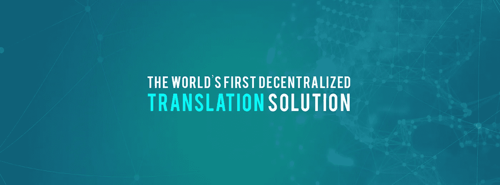

# 我们用 TranslateMe 解决的 6 个翻译问题

> 原文：<https://medium.datadriveninvestor.com/the-6-translation-issues-that-we-aim-to-solve-with-translateme-129c98d6f158?source=collection_archive---------9----------------------->

TranslateMe 是一个新的 ICO，旨在解决当前许多与语言翻译相关的问题。我们热衷于连接世界各地的人们，通过使用区块链技术，我们为所有参与者创造了一个双赢的解决方案。

我们希望通过 ICO 和终端应用解决的一些问题包括:

**高额费用**

目前可用的许多翻译解决方案都很昂贵，尤其是对较贫穷国家的人们而言。我们的目标是降低最终用户的翻译成本，我们甚至为用户提供机会来获得我们自己的令牌(TMN ),以纠正和提供准确的翻译。

**缺乏协作**

你今天发现的翻译系统通常是完全独立的，并且已经开发了它们自己的算法。TranslateMe 的目标是通过尽可能多的合作，将各种努力和数据汇集在一起，创建最有效的翻译解决方案。

**乏善可陈的各种语言**

你知道像脸书和谷歌这样的大型网络公司只支持世界上一小部分口语吗？虽然有许多语言的翻译选项，如英语，法语和西班牙语；陶希罗语、利其语和翁古塔语几乎没有翻译解决方案。有超过 6500 种语言需要翻译，我们希望将每一种语言都包含在我们的项目中，并为最晦涩的语言提供翻译。

**最少的人工输入**

大多数在线翻译服务都利用了神经机器学习和人工智能。虽然这些方法可能非常有效，但它们往往缺乏人情味的细微差别和微妙之处。相比之下，人类翻译给出正确的幽默和习语语的使用，但是不能期望他们像计算机一样知道那么多的单词和语言。所以我们要做的就是合并这两个解！我们利用神经机器学习，但也利用人类输入进行最精确的翻译。

**集中式系统**

慢慢地，世界开始厌倦完全集中的系统。有了一个中心点，就有了一个转折点，它可以在一瞬间全部倒塌。TranslateMe 使用去中心化的区块链技术来确保我们的风险被平均分散。区块链还提供了极高的安全性，您可以放心，提交到平台的所有信息都是 100%安全的。

**24/7 不活动**

虽然其他翻译服务可能会受到世界各地正常工作时间的限制，但我们的国际社区将随时为您提供方便。我们的客户将能够全天候访问我们的服务。

**结论**

TranslateMe 的团队一直致力于以最具创新性的方式解决与翻译服务相关的典型问题。我们相信我们的 ICO 和最终产品具有令人印象深刻的高品质，我们迫不及待地想与世界分享它！

有问题吗？欢迎在下面发表评论——我们希望听到您的意见。在各种社交平台上关注我们，及时了解我们的 ICO。

Translateme.network ICO 即将推出。