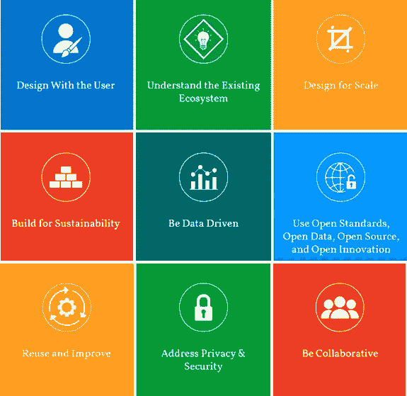
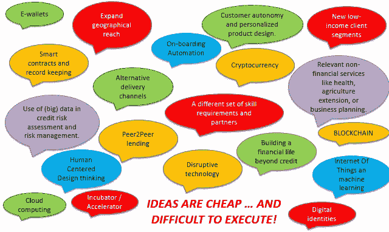

# 数字化发展的 9 个原则

> 原文：<https://medium.datadriveninvestor.com/the-9-principles-of-digital-development-38e05962777c?source=collection_archive---------0----------------------->

[https://digitalprinciples.org/](https://digitalprinciples.org/)

[在讨论了小额信贷行业为何正在走向数字化](https://medium.com/@chrisstatham_13858/digital-transformation-the-how-why-when-808a7bc244ef)(在第 1 部分)之后，提醒一下从业者应该遵循的数字化发展/转型的指导原则是有好处的。这很重要，原因有二。首先，在一个组织内，每个人在组织的愿景上保持一致是至关重要的。其次，遵循最佳实践。

为了解决第一个原因，如果你问同事们他们认为“数字化转型”意味着什么，你可能会收到 101 个答案。

Own quotes from research

这种差异是完全可以理解的。我们都来自不同的背景，有不同的职业经历，有不同的侧重点。然而，在讨论组织转型时，差异并不是必需的，相反，愿景必须非常清晰，整个组织都可以朝着这个目标努力。

“有时**小额金融机构可以在没有一致的数字战略的情况下启动特别项目**。小额金融机构需要建立一个统一的愿景，整合所有金融科技举措，并考虑如何提供足够的运营、技术、法律和人员支持。”迈克尔·施莱因，Accion 总裁兼首席执行官

我建议召开研讨会，以确保执行管理层在数字化转型愿景和流程中保持一致，并为支持变革管理流程奠定基础和建立适当的项目/转型管理结构。

研讨会最好由小额金融机构的非雇员主持，因为他们可以更加客观，不必考虑日常业务。然而，它们应当始终是适当的，并解决小额金融机构面临的现实问题。

通过拥有直面转型挑战的领导层，it 也可以开始建立灵活性和文化，对不断变化的市场采取主动而非被动的态度*。*

拥有一个不断发展的工作环境，而不是认为今天完成的工作对明天的每个人都有好处，这很好。创新文化和从失败中学习的意愿将使一个组织更好地成长和应对新趋势的演变。

这让我想到了第二点，遵循数字原则和最佳实践。

“数字原则是在社区推动下制定的，是通过在开发项目中使用技术获得的许多经验教训的结果。它们是发展实践者之间共享知识和支持持续学习的持续努力的一部分。”[https://digitalprinciples.org/](https://digitalprinciples.org/)

MicroSave 创始人兼总经理 Graham Wright 很好地总结了小额金融机构拥有独特愿景和遵循最佳做法的重要性

“很快，**如果小额金融机构不制定一项战略，并在该战略背后实施金融科技，我认为它们将变得无关紧要，缓慢但肯定会萎缩并消亡**。”

[既然第 1 部分已经探讨了数字化转型的原因，](https://medium.com/@chrisstatham_13858/digital-transformation-the-how-why-when-808a7bc244ef)以及本帖中“如何”(开始)的开头，接下来我将探讨为什么理解国家背景很重要，因为在 A 国可能正确的东西在 b 国可能不合适

[你可以点击这里关注我的 13 部分转化系列](https://medium.com/series/digital-transformation-99b424533220)

