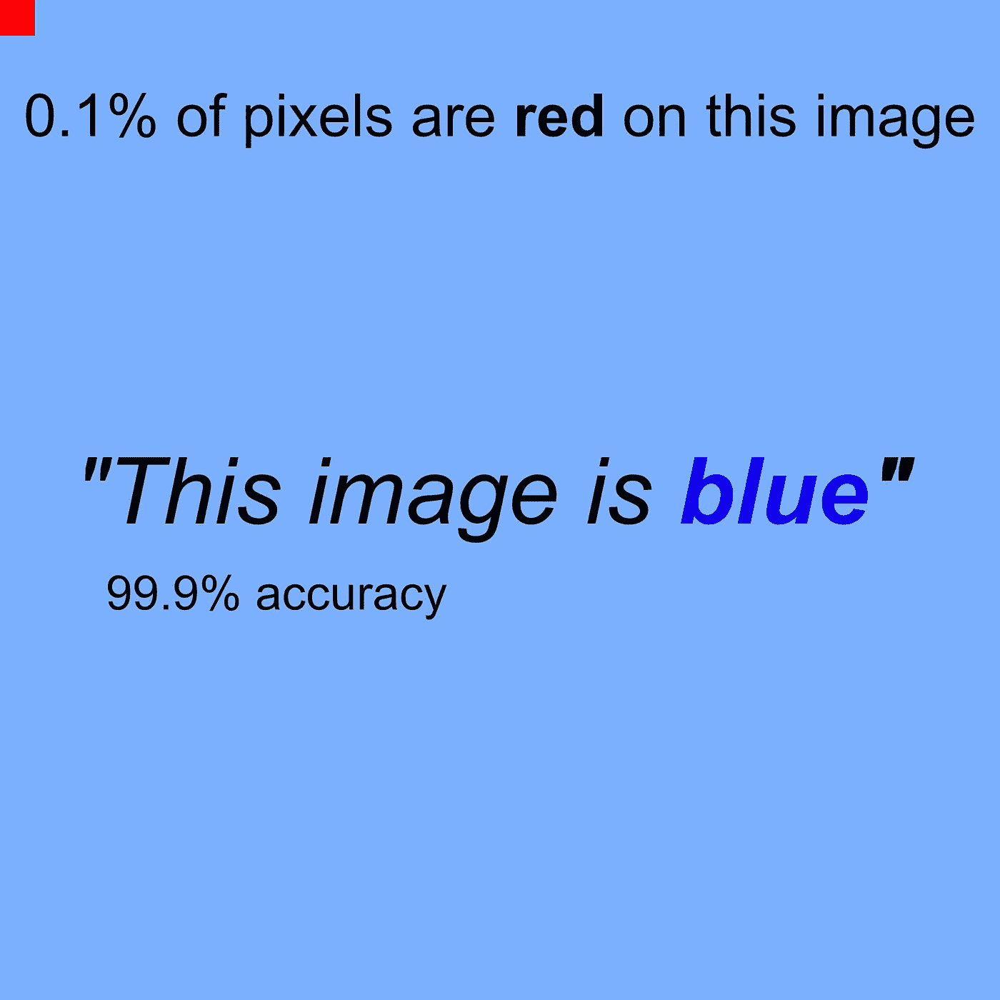
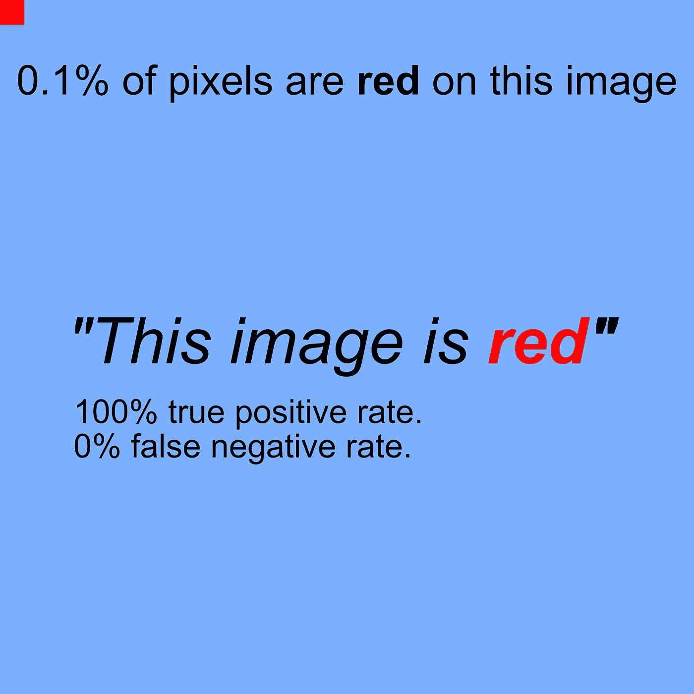
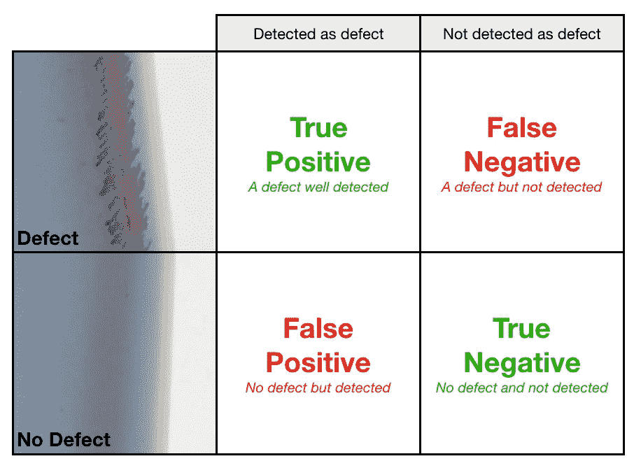
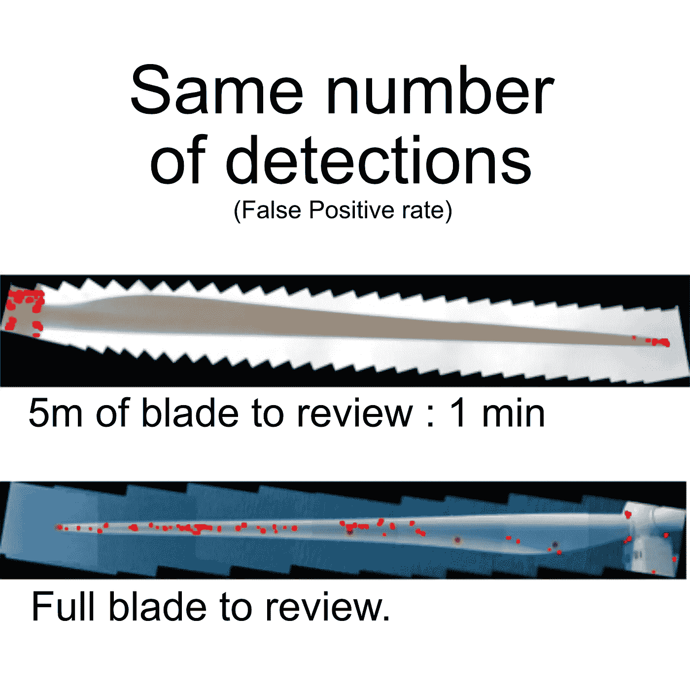

# 你不该买的 99%准确的机器学习算法

> 原文：<https://medium.datadriveninvestor.com/the-99-accurate-machine-learning-algorithms-you-shouldnt-buy-77fb6a86b436?source=collection_archive---------2----------------------->

机器学习现在无处不在，似乎能够解决大多数问题。但是没有合适的数据科学团队，运行神经网络并不是一件容易的事情。因此，越来越多的公司发出以人工智能为重点的招标

> 一个主要的挑战是:如何衡量算法的准确性？

我们经常看到对一个精度指标的要求:

> 你的机器学习算法需要有 90%以上的准确率。
> -又一次人工智能招标

本文将展示高分可以隐藏糟糕的业务表现。

 [## DDI 编辑推荐:5 本让你从新手变成专家的机器学习书籍|数据驱动…

### 机器学习行业的蓬勃发展重新引起了人们对人工智能的兴趣

www.datadriveninvestor.com](https://www.datadriveninvestor.com/2019/03/03/editors-pick-5-machine-learning-books/) 

**发现罕见问题**

[康尼斯](http://home.cornis.fr)从 2011 年开始检查风力涡轮机。到 2019 年，我们已经获得了 400 万张图片。在同一时期，我们的专家只注释了 6000 个严重缺陷。

> 平均而言，只有 0.1%的图片包含高批判性缺陷。

最差的*缺陷检测算法*将是预测没有缺陷的系统。这样一个荒谬的系统在这个数据库上仍然有 99.9%的准确率(6000 个缺陷只是 400 万张图像的 0.1%)。

## 假阴性

其他指标可以为您提供更好的性能信息。由于关键缺陷是我们不想错过的，所以我们可以计算算法检测到多少缺陷。我们称这个指标为**真阳性**率。

如果一个算法很好地检测出我们数据库中的 6000 个缺陷，它就有 100%的正确率。如果它遗漏了 600 个缺陷，它有 90%的正确率。

*这是你要的分数吗？完美的 100%真阳性率说明每个检测都是缺陷吗？一点也不。*

这个分数只是告诉你这个解决方案没有遗漏任何缺陷。但是漏掉很少的缺陷是有代价的:错误检测的数量。

让我们想象一下这个愚蠢的算法，它说每一张图像都包含一个缺陷。它将很好地检测 100%的缺陷，但也 100%的图像没有缺陷…

要判断一个机器学习算法，你至少需要检查四个指标:

*   **真阳性**率:检测到缺陷
*   **假阴性**率:缺陷遗漏
*   **真阴性**率:无缺陷，未检出
*   **假阳性**率:无缺陷但检测到

即使这四个指标是强制性的，它们也可能根本不能反映任何商业价值。您仍然需要使用它们来计算业务 KPI。

## 回去工作

为了鉴定一个风力涡轮机，我们处理 3 个叶片的 4 个面的图像。我们在 256x256 像素的小图像上对叶片全景进行切片，以检测缺陷。我们统计每个风力涡轮机平均 150000 张图像进行分析。

如果该涡轮机上没有缺陷，99%精确的算法仍将检测平均 1500 幅图像。

主要的专业 KPI 是每个涡轮机所花费的时间。仅在涡轮机上保留 1500 张图像可以节省多少时间？我们艰难地发现，答案可以从 99%的专业时间变成根本没有时间。

如果所有的探测都在同一个区域内，专家只能持续几分钟。

如果检测发生在刀片的任何地方，专业知识将比没有人工智能更长。

## 好于 99%的分数，KPI 改善。

2019 年，Cornis 宣布专业知识的速度提高了一倍，这要归功于 A.I.
这种算法远没有 99%的误报性能。但是有了我们的工具，您可以在过去一半的时间内完成质量专家鉴定。

> 当你想判断一个机器学习算法的质量**时，不要问一个神奇的 99%的数字**。要求一些评估，并关注它将如何改善你的过程。