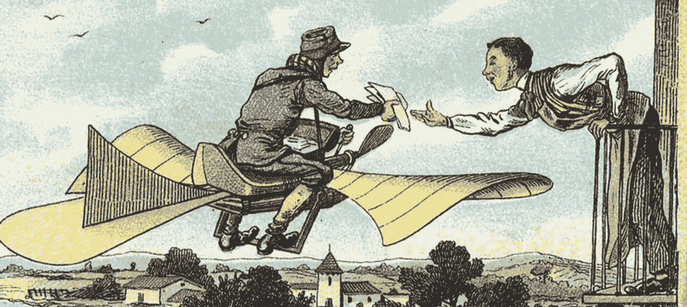

# 人工智能错觉:营销自动化的反动状态

> 原文：<https://medium.datadriveninvestor.com/the-a-i-illusion-the-reactionary-state-of-marketing-automation-c5d9c268461e?source=collection_archive---------4----------------------->

Photo: The Rural Postman by Jean-Marc Côté (via The Public Domain Review)

有时候，我在参加或听 TED 准备好的主题演讲时，感觉肾上腺素在涌动，这预示着又一项“这就是未来”的技术。我有时甚至会随大流，点头附和。在我目前工作的地方，AI 不可避免地抢了风头。我很欣赏主持人的活力、积极性和灵感。我还利用了与客户分析师和数据科学家交往的机会，钦佩他们为构建严谨的模型所付出的努力，以及他们一旦接触到新的资源密集型实验就立即张开双臂的方式。

然而，在这些简洁的研讨会上，人工智能经常被曲解，或者这个术语与数据分析 101 互换使用。不需要博士后研究就能发现这种偏离。另一种不准确，也是这里的重点，是当普通的人工智能被夸大为“一个全新的时代”，而它们一直在我们的课程文献中。那么，有什么大惊小怪的？

让友好的人工智能成为一个令人鼓舞的想法的专家埃利泽·尤德科夫斯基(Eliezer Yudkowsky)在他的论文《人工智能作为全球风险中的积极和消极因素》中写道，“迄今为止，人工智能最大的危险是，人们过早地得出结论，认为他们理解它。”然后，他接着定义了两种不同类别的尝试友好人工智能的失败:技术和哲学。

“技术上的失败是当你试图构建一个人工智能，但它并没有按照你想象的方式工作——你没有理解自己代码的真正工作方式。哲学上的失败是试图建造错误的东西，这样即使你成功了，你仍然无法帮助任何人或造福人类。”这两个类别有很多共同之处。然而，我们的主题不属于这两者。我们已经知道，恒温器可能是智能代理的最基本形式。但我怀疑是否有任何恒温器供应商会投资一毛钱来称他提供的东西为人工智能。

说实话，那些主题幻灯片并不完全是骗人的。自动化、顾客之旅或学习者/推荐者机器人最有可能在人工智能主题公园的某个地方着陆。不再回避逻辑可以节省很多时间。毕竟从石头剪子布机器人的沙砾到混沌变量的山谷是有路可走的。把每一个放在它们所属的架子上有助于产生一个进步的对话。

一个程序或智能体何时变得智能，有教科书式的清单:它应该学习、反应灵敏、享有高度的自主性并有目标。当暴露在外部世界时，它应该能够交流、合作、移动(无论是物理上还是虚拟地在网络之间)，甚至像我们一样思考。令我们惊讶的是，就营销自动化的现状而言，学习的概念已经简化为收获更多的数据。当一个 API 调用被触发时，有足够的反应能力。预定的工作非常舒适地满足了自主性。鉴于迄今为止市场营销的历史，这一点几乎没有人会受到指责。

几周前与一位前同事——一位在私人银行工作的数据科学家——交谈时，他描述了他最近参加的一门人工智能课程。没过多久，他就明白了这门课所指的人工智能实际上是决策树的实践演练。给定一个事件发生的次数及其结果，决策树将告诉我们下一个可能的结果是什么。因此，如果我们有一个包含星期几、天气、湿度和温度的记录表，并且我们还知道某个特定的球员是否在这些条件下打过高尔夫球，我们就可以预测下次我们的数据与我们观察到的记录之一匹配时的结果。构建这个树并生成输出的算法是递归的，但不是智能的。它预测，但它确实如此。一切都在那里。一步，二步，三步。如果这样，去这里！如果没有，重复！

但有一些方法可以提升对话，而不一定要重新发明轮子。我应该事先强调，这篇文章的背景主要是数字营销和自动化。我很确定我们在游戏开发行业的力量，他们根据我们在游戏中的动作动态地产生等级，这肯定是领先的，至少在这个领域是这样。

我可以想到三个不同的层面——即数据、实施和品牌，在这里以略微不同的标题出现——在这些层面上，我们的人工智能战略可以通过石蕊测试，并摆脱目前僵化的反动茧。当我们从第一层到第三层时，复杂性增加了，更多的问题出现了。我从直言不讳地开出我在某种程度上经历的处方，到简单而过早地开出处方，大声地思考。尽管如此，我可以保证的是，除了两门大学课程、一篇学士论文和一些关于这个主题的在线教程之外，我已经在营销部门花了一段时间做白日梦，幻想什么可以实际实现，而不是我们声称已经实现的。

# 清理和征服

如果这些年来你有时也变得对伪未来主义敏感，一旦听到“机器学习”和“大数据”就跳过一拍，现在大多对它们不屑一顾，等待笑点处的一撮常识，那么我们两人都会全神贯注，只是偶尔做出承诺。我希望我没有被误解。这两项改变游戏规则的技术仍然存在，并且正在发挥巨大的作用。然而他们大多是为企业服务的。网飞强大的[推荐算法](https://www.wired.co.uk/article/how-do-netflixs-algorithms-work-machine-learning-helps-to-predict-what-viewers-will-like)由 Apache Spark 或 Spotify 授权，它查看邻居播放列表，每周给你[两小时你最有可能与之相关的音乐](https://www.theverge.com/ad/14887516/go-inside-the-algorithm-that-knows-all-the-embarrassing-things-you-listen-to-on-spotify)，这只是创新成功故事的冰山一角。然而，较低层次的人得到了薄荷棒，他们必然要花几个月的时间来过度规划和磨练前瞻的艺术。

正如我们所说的，营销自动化系统的大部分通过老化的 FTP 服务器和计划的作业来处理数据的添加和更新，在此之前和之后，系统仍然分别不知道和无法进行灵活的编排。Segment 和 Funnel.io 等有前途的数据集成服务不容易投资，因为公司会更快地使用“工作”解决方案。

底线和最大的差距是机器学习和人工智能的无准备数据，在那个悬崖上有一个陡峭的学习曲线。可以理解的对大数据的痴迷使得向前迈进既昂贵又耗时。这是可以理解的，因为“数据越多，能力越强”的口号听起来仍然很真实。但是更大更复杂的数据不一定能建立有效的模型；相反，高质量的数据才是。高质量的数据被整理和优化以供非人类实体学习。为此，它首先必须不带偏见。

在缺乏正确的随机化的情况下，选择偏差会导致错误乐观的竞选效果。例如，在活动期间，控制组中超过一半的客户可以共享未观察到的属性，如“互联网接入困难”。但是如果拥有 thisdomain.com 电子邮件在同一个控制组中占主导地位；它很容易掩盖隐藏的现实。

当我们在没有正确洞察力的情况下移除一小部分有贡献的受众时，排斥偏见就会发生。如果我们的下一个活动针对的是对你之前的 Instagram 故事做出积极表情反应的人，因此排除了没有查看它的粉丝，那么我们忽略了一个事实，即葡萄牙语 Instagram 故事对生活在葡萄牙或巴西的人来说有更高的转化前景。第一次 Insta-campaign 受到了热烈欢迎，部分原因是它因一个穿着冰淇淋蛋卷服装的孩子的出现而像病毒一样传播开来。

这种敏锐的发现目前是可以获得的，这要感谢车轮后面有才华和好奇的数据科学家，这是一个负担得起的职位…目前。但手动从仓库中扔出坏苹果只能为我们服务这么久。将我们的数据从有偏见的记录和噪音中清理出来，从而使其对人工智能来说更具可读性，将无形的模式带入光中，并更加关注和意识到我们的营销系统，使我们的战略更加圆滑和更加防错。

# 懒散地走向主动

我无意将读者拖入 51 区。出售 DeepMind 超级智能恐惧不是我的目标。作家兼企业家雷·津恩在《福布斯》杂志上发表了一篇名为《主动的人工智能》的文章，他试图缓解科幻小说的担忧，并为希望而努力，声称“……”解决方案已经到位。人类是逐步学习的。一种方法是通过计量尝试来扩展流程。我们目前不会让无人驾驶汽车在没有人类副驾驶的情况下行驶。我们不让反应式人工智能系统做出重大决定，但它们目前做出许多小决定。随着流程中每一个成熟阶段的到来，我们都会确认成功，并慢慢地释放下一个程度的自主行动。”

因此，让我们来看看一个想象的和过时的(但仍在使用)自动化，以提高三个月内的转化率。为此，我们通过三封电子邮件与选择了解更多信息的人沟通，以及对优惠券代码的小额投资，鼓励人们注册并进行首次购买。我们创建的自动化完全反映了我们的计划，并且运行完美。

1.  向目标群体发送电子邮件 1。
2.  等待 1 个月。
3.  向那些没有购买的人发送电子邮件 2，并排除选择退出。
4.  等待 1 个月。
5.  向那些没有购买的人发送电子邮件 3，并排除选择退出。
6.  等待 1 个月。
7.  报告转化率。

手指交叉！你可能会很好地达到你的目标，并放心你在旅程画布上的微妙管道比上面缺乏想象力的计划要复杂得多。然而，一个流程只能容纳这么多叉和开关。此外，自动化工具上那幅如画的画布只有一个观众。从客户体验的角度来看，沟通尝试的次数很少会受到关注。我们的活动可以享受一些封装，最终扩展开来，让可重用性进来。但是让我们看看是否可以通过使用一些基本的设计模式来修饰这种陈腐的命令序列。

我们的自动化在两个关键要素上过于严格:通道和时间。

## 频道

在缺乏客户行为模式和他们选择的渠道的情况下，电子邮件是必不可少的。倒回一步，目标名单很可能是拥有有效电子邮件地址的人。一个很好的飞跃是使渠道变得抽象。因此，客户的默认渠道隐藏在一个外观中，人工智能负责在电子邮件、短信、社交应用上同意的人的推送消息或任何其他即将到来的消息调度程序之间进行选择。这需要一个适当的抽象工厂，同步消息内容并将它们注入相应的通道。一旦该说的都说了，该做的都做了，“发送邮件”就简化为“发送”。一个词消失了，走了很长一段路。

## 时间

当我们这样做的时候，我们也可以把发送时间放在一个黑盒里。邮件阅读有平均高峰时间，但只有一次是在 17:35，莫莉查看她的收件箱。还有，她去上海出差了。尽管有钟形曲线，我们在不同的时间打开我们的信息(精确到分钟)。电子邮件更有可能被推迟，而推送通知很快就会被看到和回复。抽象发送时间需要大量的消息历史和消息打开时间戳。我们还应该记住时区。在正确的时间照顾每个接受者是一个需要保持的人工智能。我们越不像对待蚂蚁一样对待我们的客户，用大量的导入和发送队列堵塞网络服务，他们的反应就越理性。发的慢，稳，绝对接近一对一！

到目前为止，即使我们已经提高了反应能力，也没有太多的主动法术在起作用。我们抽象了频道和时间。但是我们的人工智能仍然不是一个动态的战略家。这个里程碑稍微有点难爬。我们需要一个(良性的)面向目标的代理，一旦预测分析显示前面有一堵砖墙，它就可以执行一些安全的允许动作。如果转换率与更高的点击率相关联，并且如果第一批前往特定 IP 范围内的目标群体的人没有获得太多回报，则主动人工智能会及时检测到这一点并采取行动。或者选择另一个 IP 范围，将频道从电子邮件更改为推送，或者稍后重试发送。乍一看可能不相关的外部源和元数据可以训练算法来预热异常。所有这些都不能通过传统工作流中的连接活动来实现。此外，应该向代理提供我们之前讨论过的大量标准化的干净数据。

# 品牌感知人工智能

通过这个浮夸的标题，我可能会冒险进入一个危险的区域，期待一个认知行为治疗师而不是人工智能。我承认我在这里如履薄冰，知道我的知识有限。然而，迷恋滋生贪婪。然而，我保留权利，认为你的营销人工智能解决方案，不仅应该识别模式，逐渐变得更加积极主动，而且还应该努力反映你的品牌。

大约两年前，一群受人尊敬的数据分析师同事开始研究一家瑞典公司客户流失率的上升。案例演示最后一张奇特的幻灯片让我好奇了一会儿。很快，喝咖啡的时间就花在了和小组成员热烈讨论这个问题上。该案例始于该小组为防止流失而采取的方法，其细节非常详细。不过，这并不是让我难忘的部分。这是我们与会者没有预见到的虎头蛇尾。这一裁决与数字和图表没有什么关系。这些细致的防流失技术似乎都没有取得成效。最终，首席分析师需要一些信心，才能转向客户说:“我认为你的组织需要向内看。”坦率地说，也就是糟糕或糟糕的品牌。

别忘了！在我们活动的接收端，人们不知道我们做了多少努力来让他们高兴并回来。数字营销不是相互欣赏的乒乓球。通过巧妙而频繁的交流、会员专属优惠和对比测试，肯定能达到满意的效果。但是，如果我们头脑中的品牌角色和我们的受众通过各种数字渠道看到的品牌角色是不同类型的生物，那么其中哪个才是真正的“我们”？如果“我们”是他们的总和，我们如何激发这种分离的身份？

就拿你最喜欢的设计师背包制造商，或者任何散发着优雅气质的产品来说:我们不必深入了解它们为什么吸引我们。除了良好的客户服务、退货政策、多样性和无处不在，魔鬼就在我们期望的地方。品牌光环通过其他平凡的参数来施展其魅力，如深灰色和蓝绿色调色板、间隔宽敞的 Times New Roman 块、首字下沉、标志的位置、不可抗拒的精品店氛围以及信息的温和基调。

这里有一个警告。如果我们钟爱的品牌正在拥抱人工智能，建议营销部门机智应对。在完全否认品牌身份的情况下，将决策权委托给不受约束的算法，注定会成为一只未经测试的人工合成手，它会在认为合适的时候表现出兴趣。增加一个新的电子邮件沟通渠道标志着一个岔路口，这个渠道会发垃圾邮件、打断别人、乞求别人的注意，并在一封电子邮件中叠加 24 种新产品。

一个有品牌意识的人工智能可以作为统一性和一致性的催化剂。它确保使用默认音调传递消息。它知道如何在保持黄金比例的同时切换频道和策略。在利用及时的人工干预来接收内容的同时，它还监督和保护品牌指南。它还主动跟踪通信频率。这不仅是从品牌角色中获得的，也是从单个客户行为中收集的。具有品牌意识的人工智能是一把伞，运行在其他智能子组件之上，它会在需要时干预，并阻止无关的噪音。更多的是一个方面而不是一个接口。

***

现在，这三个水平用于发现我们是否已经跨越了老派数字营销的门槛，进入了人工智能的领域，无论如何，都不会构建一个通过/失败的评级来作为判断的基础。但它们合在一起，对我们这些营销人员来说，就像是一个自我提醒，让我们在感觉自己已经达到顶峰之前，加快自己的步伐。如果我策划的一份“因为你买了”清单把我放在了我们这个时代的先驱者的行列中，那么我为之如此兴奋的未来似乎已经过时了。我们这些没有做好准备的人，通常会忘记潮流是如何通过颠覆者而不是到处的小调整来改变科技市场的。我敢打赌真正的智能“这是下一个”与我在屏幕上看到的很少相似。我不认为这是件坏事。

## 来自 DDI 的相关故事:

 [## 用 7 个步骤解释深度学习——数据驱动投资者

### 在深度学习的帮助下，自动驾驶汽车、Alexa、医学成像-小工具正在我们周围变得超级智能…

www.datadriveninvestor.com](https://www.datadriveninvestor.com/2019/01/23/deep-learning-explained-in-7-steps/)  [## 成为数据科学家所需的 8 项技能——数据驱动型投资者

### 数字吓不倒你？没有什么比一张漂亮的 excel 表更令人满意的了？你会说几种语言…

www.datadriveninvestor.com](https://www.datadriveninvestor.com/2019/02/07/8-skills-you-need-to-become-a-data-scientist/)