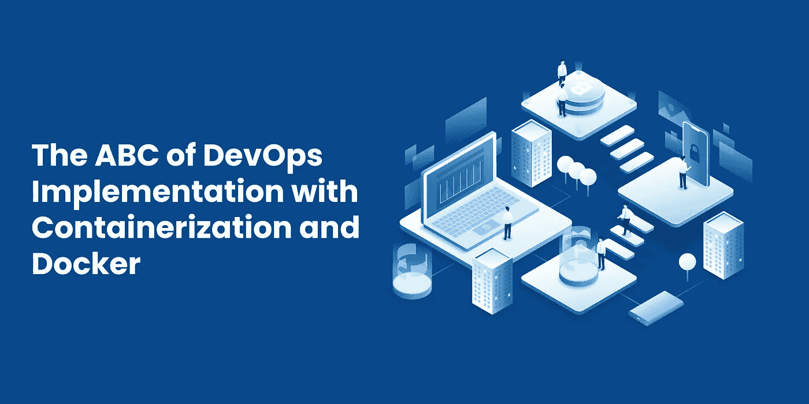
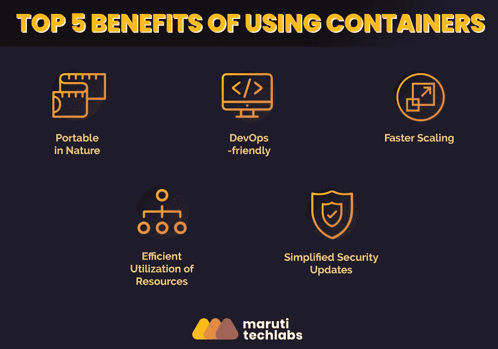
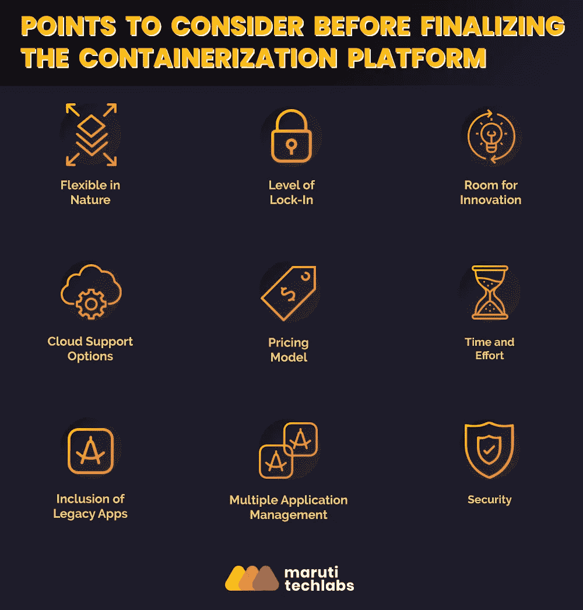

# 码头工人和集装箱化的 DevOps 实施 ABC

> 原文：<https://medium.datadriveninvestor.com/the-abc-of-devops-implementation-with-dockers-and-containerization-d62eb8895fff?source=collection_archive---------5----------------------->

DevOps 在 IT 行业风靡一时。根据[维基百科的](https://en.wikipedia.org/wiki/DevOps)定义，DevOps 是一套结合了软件开发(Dev)和信息技术运营(Ops)的实践，旨在缩短系统开发生命周期并提供高质量的持续交付。DevOps，DevOps 受欢迎的主要原因是，它允许企业以比传统软件开发方法更快的速度开发和改进产品。

> 随着我们不断变化的工作环境变得越来越快，软件开发市场对更快交付和修复的需求也在增加。因此，在短时间内以有限的后期制作误差生产高质量产品的需求催生了 DevOps。

正如我们在我们的一个博客中讨论的，转移到软件开发的 [DevOps 方式](https://marutitech.com/what-is-devops-transition-to-devops/)的重要性，我们现在将话题转移到容器化，这是一种容易使用的技术，经常被用来使 DevOps 的实现更加平滑和方便。集装箱化是一种更容易遵循 DevOps 实践的技术。但是到底什么是集装箱化呢？让我们来了解一下！

# 什么是集装箱化？

> 容器化是将应用程序及其所需的库、框架和配置文件打包在一起的过程，以便它可以在各种计算环境中高效运行。简而言之，容器化是对应用程序及其所需环境的封装。

随着它克服了运行虚拟机带来的挑战，它最近获得了很多关注。虚拟机在主机操作系统内部模拟整个操作系统。它需要固定百分比的硬件分配来运行操作系统的所有进程。因此，由于巨大的开销，这导致了计算资源的不必要浪费。

 [## 信息图:云之旅|数据驱动的投资者

### 聪明的企业领导者了解利用云的价值。随着数据存储需求的增长，他们已经…

www.datadriveninvestor.com](https://www.datadriveninvestor.com/2018/09/22/infographic-journey-to-the-clouds/) 

此外，设置虚拟机需要时间，在每个虚拟机中设置特定应用程序的过程也是如此。这导致仅设置环境就要花费大量的时间和精力。由开源项目“Docker”推广的容器化解决了这些问题，并通过将所有必需的依赖项与软件一起打包在一个可移植的映像文件中，提供了更高的可移植性。

让我们更深入地了解容器化，它的好处，它是如何工作的，选择容器化工具的方法，以及它如何胜过虚拟机(VM)的使用。

一些流行的容器提供商有:

*   像 LXC 和 LCD 这样的 Linux 容器
*   码头工人
*   Windows 服务器容器

# DOCKER 是什么？

> Docker 已经成为 IT 行业的一个流行术语，这是理所当然的。Docker 可以被定义为一个开源软件平台，它提供了一种在容器中构建、测试、保护和部署应用程序的简单方法。Docker 鼓励软件开发人员与云、Linux 和 Windows 操作系统协作，以便轻松、快速地交付服务。

Docker 是一个提供容器化的平台。它允许将应用程序及其依赖项打包到一个容器中，从而有助于简化开发并加速软件的部署。它有助于最大限度地提高产出，因为它不需要在每台测试解决方案的机器上复制本地环境，从而节省了宝贵的时间和精力。

Docker 文件可以在工人之间快速传递和测试。Docker 还简化了容器映像管理的过程，并迅速革新了我们大规模开发和测试应用程序的方式。

# 集装箱化—实施 DEVOPS

让我们来看看为什么容器慢慢成为标准 DevOps 架构的一个组成部分。

码头工人普及了集装箱化的概念。Docker 容器中的应用程序能够在多个操作系统和云环境上运行，比如 Amazon ECS 等等。因此，不存在技术或供应商锁定。

让我们理解用容器化实现 DevOps 的必要性。

> 最初，软件开发、测试、部署和所需的监督是分阶段一个接一个进行的，其中一个阶段的完成将导致另一个阶段的开始。

像 AWS ECR 一样，DevOps 和 Docker 映像管理技术使软件开发人员可以轻松地执行 it 操作、共享软件和协作，并提高工作效率。除了鼓励开发人员一起工作，他们还成功地消除了以前影响应用程序的不同工作环境的冲突。简而言之，容器本质上是动态的，允许 it 专业人员构建、测试和部署管道，而没有任何复杂性，同时，弥合基础设施和操作系统发行版之间的差距，这概括了 DevOps 文化。

容器在以下几个方面给软件开发人员带来了好处:

*   可以更改容器的环境，以便更好地进行生产部署。
*   快速启动和轻松访问操作系统资源。
*   与传统系统不同，为一台机器提供了足够的空间来容纳多个应用程序。
*   它为 DevOps 提供了灵活性，这有助于在多个框架之间轻松切换。
*   它有助于更有效地运行工作流程。

以下阐明了使用 Docker 成功实施集装箱化应遵循的步骤:

1.  开发人员应该确保代码在库中，比如 Docker Hub。
2.  代码应该被正确编译。
3.  确保正确包装。
4.  确保满足所有插件要求和依赖性。
5.  使用 Docker 创建容器图像。
6.  将其转移到您选择的任何环境中。
7.  为了便于部署，使用像 Rackspace 或 AWS 或 Azure 这样的云。

# 使用容器的好处

由于集装箱化带来的各种好处，一些公司选择了集装箱化。以下是使用集装箱化技术的优势:

# 1.DevOps 友好型

容器化将应用程序及其环境依赖项打包在一起，确保在一个环境中开发的应用程序可以在另一个环境中工作。这有助于开发人员和测试人员在应用程序上协同工作，这正是 DevOps 文化的全部内容。

# 2.多重云平台

容器可以运行在多个云平台上，如 GCS、Amazon ECS(弹性容器服务)、Amazon DevOps 服务器。

# 3.本质上是便携式的

容器便于携带。容器映像可以很容易地部署到新系统，然后以文件的形式共享。

# 4.更快的可扩展性

由于环境被打包到隔离的容器中，它们可以更快地扩展，这对分布式应用程序非常有帮助。

# 5.不需要单独的操作系统

在虚拟机系统中，裸机服务器的主机操作系统与虚拟机不同。相反，在容器中，Docker 映像可以利用裸机物理服务器的主机操作系统的内核。因此，相对而言，容器比虚拟机工作效率更高。

# 6.最大限度地利用资源

容器化最大限度地利用了内存和 CPU 等计算资源，并且使用的资源比虚拟机少得多。

# 7.应用程序的快速旋转

随着应用程序的快速旋转，交付在更短的时间内发生，使平台便于执行更多的系统开发。机器不需要重启来改变资源。

在容器的自动扩展的帮助下，考虑到当前的负载，可以完成 CPU 使用和机器内存的优化。与虚拟机的扩展不同，修改资源限制不需要重启机器。

# 8.简化的安全更新

由于容器提供了进程隔离，维护应用程序的安全性变得更加方便。

# 9.等值

就在单一基础设施上支持多个容器而言，集装箱化是有利的。因此，尽管在工具、CPU、内存和存储方面进行了投资，但对于许多企业来说，这仍然是一个经济高效的解决方案。

实现了容器的完整 DevOps 工作流在以下方面对软件开发团队有利:

*   它在检测错误的每一个小步骤中都提供了自动化测试，因此最终产品中出现缺陷的机会更少。
*   更快、更方便地交付特性和变更。
*   该软件的本质比基于虚拟机的解决方案更加用户友好。
*   可靠多变的环境。
*   促进团队成员之间的协作和透明度。
*   本质上是划算的。
*   确保资源的合理利用并限制浪费。

# 容器和虚拟机(VM)之间的区别

虚拟机能够在主机上运行多个操作系统的多个实例，而不会相互重叠。主机系统允许客户操作系统作为单个实体运行。docker 容器不会像虚拟机那样给系统增加负担，因为运行操作系统需要额外的资源，这会降低机器的效率。

Docker 容器不会对系统造成负担，并且只使用运行解决方案所需的最少量的资源，而不需要模拟整个操作系统。由于运行 Docker 应用程序所需的资源更少，因此可以在相同的硬件上运行更多的应用程序，从而降低成本。

但是，它降低了虚拟机提供的隔离性。它还增加了同质性，因为如果一个应用程序在一个系统上的 Docker 上运行，那么它在其他系统上的 Docker 上也不会出现任何问题。

> 容器和虚拟机都有虚拟化机制。但是对于容器，操作系统的虚拟化发生，而在后者中，硬件的虚拟化发生。

虚拟机表现出有限的性能，而具有 Docker 的紧凑和动态容器表现出高级性能。

虚拟机需要更多的内存，因此有更多的开销，与 Docker 容器相比，计算量更大。

# 码头术语

一些常用的 Docker 术语如下:

*   依赖项—包含形成环境所需的库、框架和软件，可以模拟执行应用程序的介质。
*   容器映像—提供创建容器所需的所有依赖项和信息的包。
*   docker Hub——一个公共的图片托管注册中心，你可以在这里上传图片并对其进行处理。
*   Dockerfile —包含如何构建 Docker 映像的说明的文本文件。
*   存储库—一种基于网络或互联网的服务，用于存储 Docker 图像。有私有的和公共的 Docker 存储库。
*   注册中心—存储来自多个来源的存储库的服务。它可以是公有的，也可以是私有的。
*   compose——一个帮助定义和运行多个容器 Docker 应用程序的工具。
*   Docker Swarm——为运行 Docker 而创建的机器集群。
*   azure Container Registry——用于存储 Docker 图像的注册提供者。
*   Orchestrator —帮助简化集群和 Docker 主机管理的工具。
*   Docker 社区版(CE)——为 Linux 和 Windows 容器提供开发环境的工具。
*   Docker 企业版(EE)——另一套用于 Linux 和 Windows 开发的工具。

# DOCKER 容器、图像和注册表

使用 Docker 创建一个服务，然后将其打包到一个容器映像中。Docker 映像是服务及其依赖项的虚拟表示。

该映像的一个实例用于创建一个在 Docker 主机上运行的容器。然后，图像被存储在注册表中。部署到生产流程编排器需要一个注册中心。Docker Hub 用于将其存储在框架级别的公共注册表中。然后，将映像及其依赖项部署到用户选择的环境中。值得注意的是，一些公司也提供私人注册。

商业组织也可以创建自己的私有注册表来存储 Docker 图像。如果映像是机密的，并且组织希望限制映像与其部署环境之间的延迟，则提供私有注册表。

# DOCKER 是如何进行集装箱化的？

Docker 图像容器或应用程序可以在 Windows 和 Linux 上本地运行。这可以通过 Docker 引擎直接与操作系统接口，利用系统资源来实现。

为了管理集群和组合，Docker 提供了 Docker Compose，它有助于运行多个容器应用程序而不会相互重叠。开发者进一步通过 Docker Swarm 模式将所有 Docker 主机连接到一台虚拟主机上。此后，Docker Swarm 用于将应用程序扩展到多个主机。

多亏了 Docker 容器，开发人员可以访问容器的组件，比如应用程序和依赖项。开发人员还拥有应用程序的框架。单一平台上的多个容器相互依赖，称为部署清单。然而，与此同时，专业人员可以更加注意选择合适的环境来进行部署、扩展和监控。Docker 有助于减少应用程序传输过程中出现错误的几率。

在本地部署完成后，它们被进一步发送到代码仓库，如 Git 仓库。代码存储库中的 Docker 文件用于构建持续集成(CI)管道，这些管道提取基本容器映像并构建 Docker 映像。

在 DevOps 机制中，开发人员负责将文件传输到多个环境中，而管理人员则负责检查环境中的缺陷并向开发人员发送反馈。

# 面向未来的集装箱化战略

在决定项目的需求后，预测未来并为可伸缩性做好准备总是一个好主意。随着时间的推移，项目变得越来越复杂，因此，有必要实现大规模的自动化并提供更快的交付。

密集而复杂的集装箱化环境需要适当的处理。在这种情况下，软件开发人员可以采用 PaaS 解决方案，将更多精力放在编码上。在选择最方便的平台来提供更好、更先进的服务时，有多种选择。因此，根据应用程序为组织确定合适的平台是相当费力的。

为了方便您，我们列出了在选择最佳集装箱化平台之前需要考虑的一些参数:

# 1.本质上灵活

为了实现流畅的性能，根据需求的性质，选择一个可以轻松调整或更改的自动化平台非常重要。

# 2.锁定水平

由于本质上主要是专有的，PaaS 解决方案供应商倾向于将您限制在一个基础架构中。

# 3.创新空间

选择一个具有大量内置工具和第三方集成技术的平台，以鼓励开发人员为进一步创新让路。

# 4.云支持选项

选择合适的平台时，找到一个支持私有云、公共云和混合云部署的平台以应对新的变化至关重要。

# 5.定价模型

因为选择一个能够支持长期承诺的集装箱化平台是很自然的，所以了解提供什么样的定价模式很重要。有很多平台在不同的运营规模下提供不同的定价模式。

# 6.时间和努力

要记住的另一个重要方面是，集装箱化不是一夜之间发生的。专业人员需要投入时间来重新构建架构基础设施。应该鼓励他们经营微服务。

为了摆脱传统的结构，大型应用程序需要分解成小部分，这些小部分进一步分布到多个连接的容器中。因此，建议聘请专家，他们可以投入必要的努力，找到一种方便的解决方案，在单一平台上处理虚拟机和容器，因为让一个组织完全依赖于容器需要时间。

# 7.包含传统应用

谈到现代化，不应忽视传统 it 应用程序。在容器化的帮助下，IT 专业人员可以获得这些经典应用程序的好处，以正确利用遗留框架中的投资。

# 8.多应用程序管理

通过在容器平台上运行多个应用程序来充分利用容器化。以最低的成本投资新的应用程序，并修改每个平台，使其对当前和传统应用程序都友好。

# 9.安全性

由于集装箱化环境比传统环境变化更快，因此它存在一些重大的安全风险。这种敏捷性可以通过提供快速访问而使开发人员受益。然而，如果不能确保所需的安全水平，它将无法完成任务。

在处理容器时遇到的一个主要问题是，处理由第三方或不可信来源打包的容器模板可能非常危险。因此，最好在使用公开可用的模板之前对其进行验证。

组织需要增强和集成其安全流程，以便轻松开发和交付应用和服务。随着平台和应用程序的现代化，安全性应该成为企业的重中之重。

# 结论

到为了与不断变化的 IT 行业保持同步，专业人员应该不断追求更好，因此，利用市场上可用的新工具来增强安全性。

这标志着第 2 部分的结束！在[第 3 部分，](https://marutitech.com/devops-implementation-devops-tools/)我们将讨论 DevOps 的关键工具&devo PS 的实施策略。