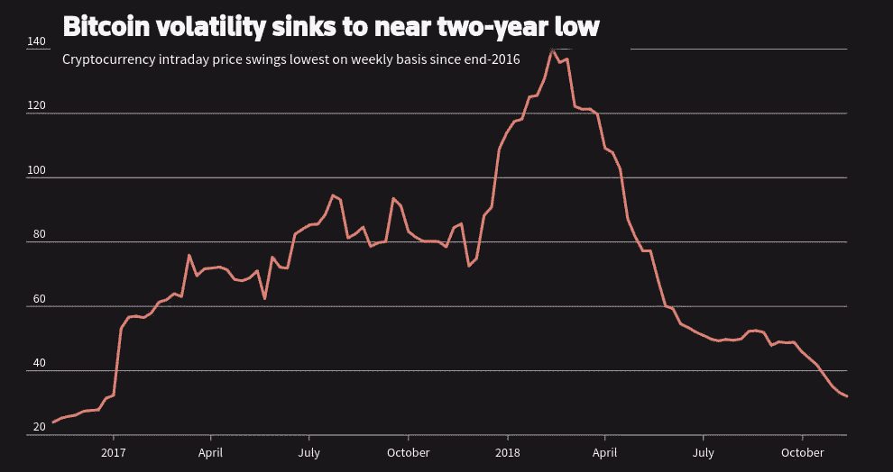

# 加密货币的实际成本

> 原文：<https://medium.datadriveninvestor.com/the-actual-cost-of-cryptocurrencies-f3c6882cb905?source=collection_archive---------10----------------------->

你必须挖掘数据才能看到实际成本。

Cryptocurrencies

任何人，当他们听到比特币或加密货币这个词时，都会想到“假钞”。他们可能会从朋友那里听说或在新闻上读到关于加密作为一种投资的消息，或者想知道如果他们买了一个比特币，他们会怎么花，但这是他们的想法。今天，大多数人都过着非常忙碌的生活:许多人做两份工作，在一个费用不断上涨的时代，一起抚养孩子和维持家庭生活。他们可能会花几分钟看看一枚比特币的成本，并想知道它是否可以成为他们投资组合的一部分。我接触过的一些保守投资者看了一眼 crypto 的波动性后会说不，谢谢。

今天一枚比特币的货币成本是 9331 美元。2017 年 12 月，一枚比特币的价格接近 2 万美元，创下历史新高。是什么造成了当时和现在的价格差异？在 2017 年的高点之后，比特币在短短 24 小时内损失了三分之一的价值，跌至 14000 美元以下。为什么？没有人确切知道，但有传言称，比特币的突然抛售是由比特币“鲸鱼”引起的，因此抛售了大量比特币货币，然后在市场下跌后又买了回来。这与股票市场的做空没有什么不同。高卖低买，差价就是利润。知情的比特币交易者在这个过程中赚了数百万美元。

 [## 气候变化、ESG 和对更好数据的追求|数据驱动的投资者

### 在地球上许多地方经历了另一个令人难以置信的炎热夏季后，来自 S&P 的最新发现…

www.datadriveninvestor.com](https://www.datadriveninvestor.com/2018/08/24/climate-change-esg-and-the-quest-for-better-data/) 

Reddit 用户 **u/makoveli** 在热门加密货币论坛的一篇帖子中写道:“如果你做一点数学计算并遵循时间线，就不难发现有人以 2.15 亿美元的价格抛售了 25000 个比特币，并在不久后以 2 亿美元的价格买回了它。”。“通过这样做，他们获得了 1500 万美元，并带走了与开始时相同数量的比特币。”

在市场顶部买入的比特币买家付出了什么代价？看看今天 9000 美元的市场价格，他们要收回投资的原始成本还有很长的路要走。而且，这还没有考虑投资的持有成本。这些钱是他们无法从其他投资中获得回报的。如果他们使用了信用额度，他们也要支付利息。**三重打击！**

简单回顾一下比特币的历史，在 2011 年 2 月至 2011 年 4 月期间，它与美元实现了平价——一比一。到 2017 年 1 月，它突破了 1000 美元大关，到 2017 年 11 月达到了 10000 美元的基准。到 2017 年 12 月 17 日，达到 19783 美元的峰值。五天后，它的“价值”损失了 6000 美元，到 2018 年 10 月底，几乎跌至 2017 年 10 月 17 日的 6200 美元。对于胆小的人来说，这不是一个好的投资工具。

到目前为止，我一直在处理投资比特币的货币成本。投资加密货币的其他成本是什么？据美国有线电视新闻网(CNN)报道，挖掘比特币和其他数字货币的方式需要巨大的能量。据估计，到 2018 年，加密采矿所使用的能量可以为美国超过 300 万个家庭提供电力。

对于每年数十亿次的 Visa 卡交易，比特币需要的能源远远超过 Visa 使用的能源，这相当于 5 万个家庭的用电量。

环保人士的一个担忧是，随着比特币和其他加密货币越来越受欢迎，它们需要越来越多的能源。在比特币的情况下，随着货币价值的上升，加密矿工需要解决的数学难题变得更加困难。这需要更多的计算能力，进而需要更多的能量。

如今，比特币的开采大多发生在中国，剑桥大学的研究人员表示，这些开采作业中使用的电力大多来自效率低下、二氧化碳排放量高的煤电厂。这些工厂建在该国许多农村地区，用于从未实现的大型建筑项目。最近的一份报告称，内蒙古一个比特币采矿项目的能源需求与一架波音 747 飞机每年飞行所需的能源需求相同。随着世界许多地方试图通过转向可再生能源和规划更多的能效计划来减少二氧化碳排放，加密货币的开采与这些举措背道而驰。

荷兰比特币分析师 Alex de Vries 认为这些数字不是好兆头。截至 2018 年 1 月，德弗里斯表示，即使是最节能的采矿钻机也仍将使用 13 太瓦(13，000，000 兆瓦)小时的电力。

为了分解这种电力使用，1 太瓦时的电能消耗相当于一小时消耗一万亿瓦。北美普通家庭平均每年消耗 7200 千瓦或 7200000 瓦。因此，13 太瓦一年可以为 1，857，141 个家庭供电。

这种做法提供了开采加密货币所涉及的一些隐藏成本，当化石燃料能源用于产生采矿所用的电力时，这种成本会增加。转换成温室气体或二氧化碳，一个效率为 34%的燃煤发电站每发电 1 千瓦会排放 1.0 公斤或超过 2 磅的二氧化碳。

在一个普通的燃煤发电厂中，只有 40%的煤热能转化为电能。每吨煤产生 2460 千瓦时的电力。一个标准的 500 兆瓦煤电厂每年生产 35 亿千瓦时，这足够全年为 400 万个灯泡供电。使用 34%的效率，一个煤电厂产生的 35 亿千瓦时每年产生 20 亿磅或 890，000 吨二氧化碳。

煤炭发电占全球电力的近 40%，接近几十年来的最高份额。截至 2018 年，78 个国家在使用煤电，高于 2000 年的 66 个。

## 从这个分析中得出的结论是，加密货币对地球和它所支撑的人类非常不利。