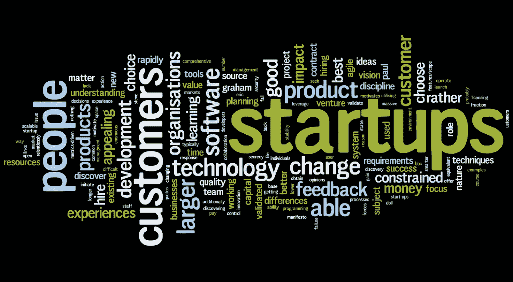

# 人工智能创业公司背后的实际场景

> 原文：<https://medium.datadriveninvestor.com/the-actual-scene-behind-ai-startups-65a783a8c935?source=collection_archive---------15----------------------->

人工智能正在迅速发展，每个人都想从中赚钱，毫无疑问，这是因为需求飙升，也是因为它的辉煌带来了神奇的力量。凭借其提供的各种空间，今天大多数学习人工智能的人都想到创建一家人工智能创业公司，因为他们认为通过创建人工智能产品可以创造很高的市场潜力和收入。但是真的那么容易吗？是否被市场过度炒作？人工智能创业公司的创建实际上涉及到什么？嗯，在这篇文章中，我将尝试涵盖所有这些，我自己有一个构建和营销人工智能产品的经历，这给了我的职业生涯一个新的推动，并激励我继续专注于使用人工智能解决问题并学习更多。

# 知道区别——横向 v/s 纵向 AI 创业公司！

在人工智能创业领域，你可以广泛地选择这两条路径中的一条来开始你的人工智能创业之旅，要么是 HAS(水平人工智能创业)，要么是 VAS(垂直人工智能创业)。

基本上，

*   HAS 遵循研究和学术驱动的方法，专注于解决一个问题，但针对许多行业。通常，谷歌、苹果、亚马逊等大型科技巨头会尝试创建一个横向的人工智能产品，因为它需要一个强大的技术团队来支持产品，而且它确实需要大量的资源，包括人力和财力资源，以成功构建一个横向的人工智能产品。

**示例— Siri**

*   另一方面，增值服务侧重于为特定类型的客户/行业解决问题。像谷歌这样的科技巨头没有时间去解决某个特定行业的具体问题。他们只是觉得不值得，因为对于一个非常特殊的问题，市场可能没有那么大。这些通常是不可持续的，但非常有价值，如果以正确的方式运作，可以增长。由于快速原型开发和可用的开源工具，我们看到许多 vas 涌现出来。

**示例—建立癌症检测系统**

创业市场现在非常火爆，没有比这更好的时机来弄脏你的手，至少尝试一下建立自己的公司，利用人工智能的力量，因为即使你失败了，你也不会有太多损失。

# 建立增值服务的第一条规则:

通常情况下，开发和构建一个人工智能产品看起来很容易，但事实并非如此。你需要记住，无论你的技术有多好，如果它不能解决它想要解决的问题，它就没有任何用处，而且你的客户可能也不关心驱动你产品的神奇的东西。

你需要专注于使用人工智能解决客户的问题，而不是人工智能本身。你需要了解客户面临的困难/问题，并使用人工智能提供解决方案。

在出发之前，问问自己这些问题

*   这有可能吗？
*   我有问题的数据吗？如果不是，就收集数据的时间/成本而言，成本有多高？
*   你的技术是相关的，甚至是首先需要的吗？
*   我的目标客户是谁？我的产品有市场需求吗？
*   谁是我的竞争对手，我将如何与他们不同？

大概创业的时候有很多要考虑的。这并不容易，因此，没有多少人在这个过程中获得成功。

# 为什么增值服务可能是你的一个好选择？

*   你非常清楚你的客户/行业及其需求，因此可以专注于此。
*   您将处理的数据将再次被单独聚焦到一个非常特殊的领域，因此对您来说，聚焦于实际的产品将不会那么令人头痛。此外，通过这种方式，您可以专注于获得更高质量的数据，从而获得更好的模型和更好的产品。
*   它提供了一种垂直化的方法，大公司可能不会加入，因为在他们眼中，这个空间太小众了。
*   增值服务初创公司行动迅速，他们应该建立一个非常好的可持续优势和数据护城河，这不是一个可持续的业务，而是一个有价值的业务。
*   你不需要很强的技术团队来做自己的产品，你甚至可以一个人做(就像我做的！)并更加专注于营销策略/商业计划。
*   开源工具和快速原型将是你的秘密武器(更快地失败，更快地重启！).

总而言之，我可以说，去参加 VAS 真的很有趣，至少尝试一下是值得的，在这个领域你不会有太多损失，而且如果你已经在学习它，你肯定会在实践中增长你的 AI 技能。我希望这篇文章对你有点用，并希望激励你尝试建立自己的人工智能创业公司，谁知道呢，也许你可以获得种子资金并从那里开始建设(我知道这不容易，但仍然不是不可能的)。如果你喜欢，一定要尽可能多的点击拍手按钮。你可以在 Twitter 上关注我，我发布了关于网络开发、移动开发和人工智能的内容。感谢阅读，下次再见。

## 来自 DDI 的相关故事:

 [## 数据科学和软件工程哪个更有前途？

### 大约一个月前，当我坐在咖啡馆里为一个客户开发网站时，我发现了这个女人…

medium.com](https://medium.com/datadriveninvestor/which-is-more-promising-data-science-or-software-engineering-7e425e9ec4f4)  [## 用 7 个步骤解释深度学习

### 和猫一起

medium.com](https://medium.com/datadriveninvestor/deep-learning-explained-in-7-steps-9ae09471721a)