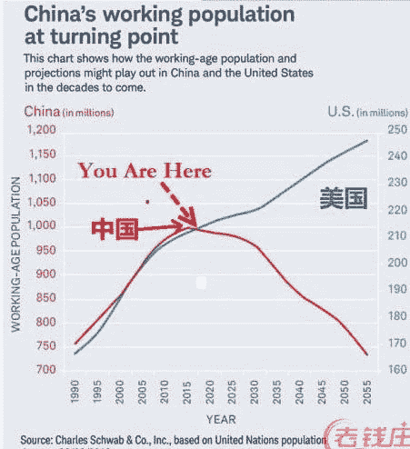
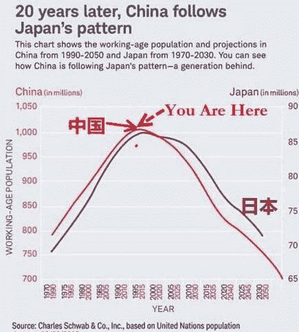

# 老龄化时代——数字企业家如何有所作为

> 原文：<https://medium.datadriveninvestor.com/the-age-of-aging-how-digital-entrepreneurs-can-make-a-difference-2454bbcac76a?source=collection_archive---------31----------------------->

未来的历史学家很可能把我们的时代称为老龄化时代。城市化、生育率下降和死亡率下降在 20 世纪和现在的 21 世纪一直相伴而行。最终结果是世界各地的社会都在老龄化，即老年人(定义为 65 岁以上)的比例比其他群体增长得更快。

日本和许多欧洲国家都是老龄化社会的典型代表，但这个问题确实是全球性的，甚至像中国这样的大国也在经历快速转型。

事实上，在主要发达国家中，美国实际上是唯一的例外，在不久的将来，工作人口预计将继续增加。全球人口结构的快速转变已经带来了一系列挑战。我们如何提高生产力和实现繁荣？我们如何不让工作人口承受过重的税收和社会保障？我们如何照顾越来越多的老年人？

答案很大程度上取决于政策。但是创业公司可以也应该成为解决方案的一部分。虽然有许多努力专注于延缓甚至阻止衰老，但这篇文章将关注的是数字企业家赋予我们更好地管理衰老的能力。

**1)早期诊断——我们可以越来越便宜、越来越快、越来越大规模地进行诊断**

早期诊断显然是预防或延缓疾病全面发展的关键。在过去的十年中，我们作为一个社会真正释放的潜力是更便宜、更快、更大规模地利用人们手中和家庭中设备的爆炸。例如，Healthy.io 让人们能够在肾脏疾病发展成大问题之前检测到它——在棍子上撒尿，它会变色，用你的手机拍照。Neurotrack 在症状出现前 3-5 年诊断阿尔茨海默氏症，通过网站或电话给人们 30 分钟的检查，并跟踪他们的眼球运动。癌症是衰老的圣杯，从圣杯到 Freenome 的各种高调努力正在将真正的人工智能应用于血液测试，以更早地检测肿瘤。

**2)持续监控——我们可以超越手腕上的可穿戴设备**

我们中有多少人想要可穿戴设备只是为了计算步数或测量心率？真正有所作为的是，他们何时能够对真正重要的生物识别技术进行远程实时监控，这对我们的健康产生重大影响。随着组件和计算成本呈指数级下降，除了手腕之外的不同外形也变得更加经济可行。例如，Cossinus 通过放在耳朵里的助听器来测量。谷歌开发出了著名的眼睛隐形眼镜，可以测量你体内的葡萄糖水平。从 Motiv 到 Oura，有许多有前途的初创公司已经开发出戴在手指上的戒指，可以测量从睡眠到情绪的各种指标。

**3)有效的护理——通过利用语音，我们可以变得更聪明、反应更迅速**

更多能和我们交流的智能设备不是未来，而是现在的现实。语音确实从根本上改变了用户界面/ UX，这对那些可能不太适应新技术的老年人来说尤其有意义。直觉机器人公司有一个名为 ElliQ 的机器人，它呆在家里，为老年人提供陪伴——孤独导致抑郁是人类衰老的标志。Alexa 现在可以通过乳房检查与用户交谈，这象征着语音助手在健康方面的潜力。LifePod 不仅被动回应老年人，还主动提醒他们遵守药物治疗。

在这个老龄化的时代，创业公司如何帮助我们，你还有其他想法吗？评论离开。

*这些都是专注于实践见解的短文(我称之为 GL；dr —良好的长度；确实读过)。如果它们能让人们对某个话题产生足够的兴趣，从而进行更深入的探索，我会感到非常兴奋。我在三星的创新部门* [*NEXT*](http://samsungnext.com/) *工作，专注于深度科技领域软件和服务的早期风险投资，这里表达的所有观点都是我自己的。*