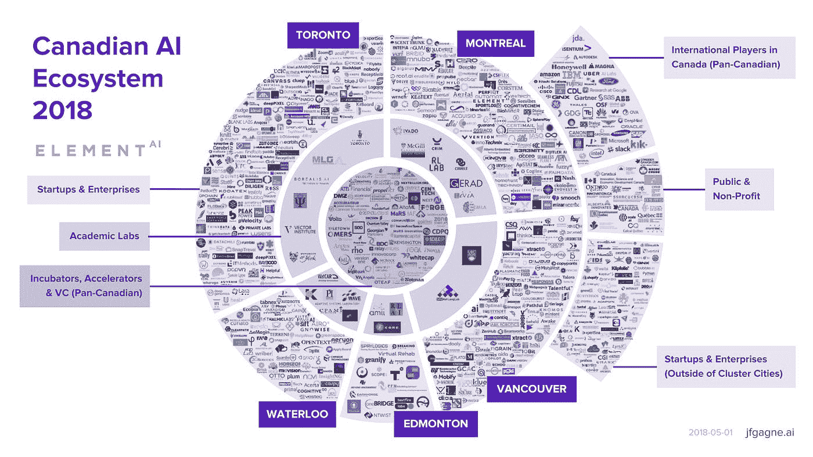
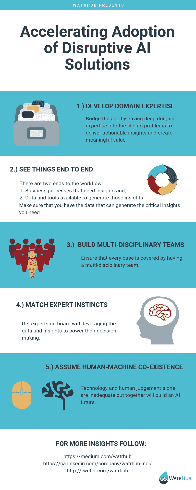

# 人工智能时代:如何赢得人工智能竞赛

> 原文：<https://medium.datadriveninvestor.com/the-age-of-artificial-intelligence-how-to-win-the-ai-race-cd4671a42db6?source=collection_archive---------25----------------------->

## 以下是关于构建基于人工智能的颠覆性商业模式的 5 个独特观点。

人工智能的时代已经来临。人工智能正在破坏每一个业务流程和每一个工作流程。人工智能生态系统正以突出的力量出现在主要城市。大多数专家认为，全球人工智能市场在未来 10 年将价值数十亿美元，中国认为自己的人工智能产业可以价值 1500 亿美元/年。多伦多和蒙特利尔已经成为国际知名的人工智能中心，这两个主要城市涌现了数十家企业和超过 170 家初创公司。

Canadian AI Ecosystem — jfgagne.ai, 2018

这让人想起 20 世纪 90 年代的科技繁荣。新的科技创业公司每天都在涌现，每个大公司都在制定自己的 It 战略。当繁荣结束时，它导致了无法适应时代变化的公司的技术墓地。

在购买者方面，技术崩溃导致了许多价值数百万美元的 IT 项目失败，毁掉了他们的职业生涯。成功的关键是将新技术能力转化为前所未有的新商业价值的能力。

20 世纪 90 年代的科技繁荣和当前的人工智能竞赛有许多相似之处，就像 20 世纪 90 年代一样，在这场人工智能竞赛中，将有赢家和输家。

我们在 [WatrHub Inc.](https://watrhub.com/) ，是一家人工智能驱动的数字智能公司，为水利基础设施提供市场洞察。在短短几年内，我们已经在美国水和废水公用事业市场积累了世界上最大的数据仓库。我们帮助客户回答他们关于市场和销售机会的迫切问题，提出以前不可能获得的新见解。

我们行业中大多数最大的参与者都使用 WatrHub 将他们的销售团队带入分析和精准销售时代。我们不仅构建了一个强大的数据引擎，还想出了如何将数据嵌入到我们客户的工作流中，以帮助他们实现令人信服的结果，例如他们的销售渠道转化率增加了 300%。

通过这次旅程，我们学到了很多关于建立商业 AI 技术的现实。

## 以下是我们对构建基于人工智能的颠覆性商业模式的 5 个独特观点。

## 1.你需要深厚的领域专业知识

数据面临的挑战是，除非它是可操作的，并且实际上是可操作的，否则它是无用的。你可以在数据分析项目上花费数百万美元，但如果它不能产生大多数高管所期望的 3 到 5 倍的投资回报率，那么它就没有意义。真正微调数据并了解什么是有价值和可操作的，什么不是的唯一方法是拥有深入了解客户问题的领域专业知识。

在 WatrHub 的例子中，我们从市场中的 70，000 多个实体、数百个政府数据源和数亿个公共文档中聚合数据。有足够多的数据点让我们忙上一辈子来分析和消化这些数据。这种类型的数据报告没有标准，每个州和每个管辖区的做法都不一样。然而，并不是所有的数据都真正为客户创造了价值，或者以客户能够理解的方式呈现。我们如何弥合这一差距是通过深入了解我们客户的业务和市场。

## 2.你需要从头到尾观察事物的能力

一方面，你有用户正在寻找的关键见解。另一方面，你有数据和工具可以用来产生洞察力。数据相当于原材料的作用，产生的见解是最终产品。当您定义要开发的洞察力时，同时考虑可用于生成这些洞察力的数据也很重要。

在 WatrHub 的案例中，我们必须了解客户的问题，从数据和人工智能的角度来看什么是可能的，集成到用户工作流的最佳方式是什么，并将所有这些整合到一起，成为我们客户的成功解决方案。如果我们不同时考虑所有的事情，我们就会错过解决客户业务需求的关键部分。具体来说，如果我们过度致力于“理解客户问题”，我们将会发现许多实际上无法通过可行的方式获得的数据来解决的问题。如果我们在构建数据引擎上花了太多时间，我们就会花费大量资源来获取数据，而这些数据并没有为我们的客户创造实际价值。

## 3.你需要建立多学科团队来取得成功。

一般来说，行业专家不会非常了解数据，因为他们已经在没有这些新数据功能的情况下工作了几十年，而技术世界正在不断变化。然而，专家将对问题空间和现有的工作流程有深刻的理解。在获取数据、管理数据和产生洞察力方面需要不同的技能。数据科学家会偏向于构建很酷的工具并沉浸在数据中，他们很难退后一步去了解客户的需求。拥有一支带来不同专业知识的多学科团队，可以确保每个基地都得到覆盖。

WatrHub 的团队包括水专家、客户成功经理、数据分析师、软件工程师、产品经理和人工智能工程师。每个人都带来了不同的视角和技能，它们都是我们的产品在市场上取得成功的必要条件。

## 4.人工智能驱动的洞察力必须(最初)与专家的直觉相匹配。

人工智能和大多数数据分析项目面临的挑战之一是，根据定义，它们正在破坏已经根深蒂固多年的业务流程和工作流，并以某种可预测的速度和准确性工作。对以前的过程感到舒适的用户会自然地抵制那些带来风险和不确定性的变化。他们会在数据中找到漏洞，因为就人工智能的本质而言，一开始它不会完美或准确。此外，这些人工智能驱动的见解必须生成用户可以理解的结论。事实是，在您的数据之旅的早期，专家很可能经常是正确的。所以，最初的目标不是得到准确的结果，证明专家是错的。目标是让专家参与使用数据，并提供他们在工作流程和决策中使用数据的专业知识。

在 WatrHub 的案例中，我们正在扰乱水务基础设施市场的销售流程，这一流程已经确立了几十年。我们知道，你不可能把专家排除在等式之外。它们的本能是无价的，人工智能远不能复制或取代它。所以，我们只是他们的加速器。我们的工作是提取我们的用户没有工具或资源去做的关键市场洞察力，以便我们的用户可以更有效地完成他们的工作。

## 5.人工智能驱动的洞察力和人类判断将共存多年。

我们承担了一些 R&D 项目，以“完全自动化”某些功能，我们发现，基于当今可用的技术，我们还没有达到可以取代关键业务流程的人工判断的地步。构建算法来推荐你在网飞上的下一部电影或在亚马逊上的下一次购买是一回事。这些预测不需要在任何情况下都进行人工干预。10%的错误率的影响是微不足道的。

然而，对于大多数关键的业务流程，10%的错误率是致命的。WatrHub 本质上是为客户的销售和营销重点提供见解、预测和建议。水行业的销售成本很高，我们的客户每年在销售上花费数千万到数亿美元。因此，不准确或不相关数据的成本很高，这就是为什么我们建立了一个分析师团队来管理数据，并确保数据在交给客户之前尽可能具有可操作性。我们还建立了反馈循环，以了解哪些数据是可操作的，哪些是不可操作的，这样我们就可以进行优化。

# 这场人工智能竞赛的成功之旅

像许多其他人一样，我们仍然处于人工智能竞赛的初级阶段，怀着成为这场人工智能竞赛赢家的愿望发展和成长。我多年来在 WatrHub 上形成的 5 个观点为你的人工智能竞赛之旅提供了一个很好的起点。如果你已经在这场激动人心的人工智能竞赛中，我希望这 5 个观点是有见地的。我们欢迎有机会与你交换意见。因为商业中的人工智能世界仍然相对较小，它允许我们在这个激动人心的旅程中一起学习和成功。让我们共建一个 AI 未来！

在你的 AI 之旅中，你学到了哪些小技巧？请在这个博客上发表评论或给我们发电子邮件分享 hello@watrhub.com！

数字智能公司 WatrHub Inc .正在开发受客户需求启发的数据集，我们渴望找到新的方法来揭示水行业。

更多 WatrHub Inc .的见解，请关注我们的 [LinkedIn](https://www.linkedin.com/company/watrhub-inc-/) 和 [Twitter](https://twitter.com/watrhub)