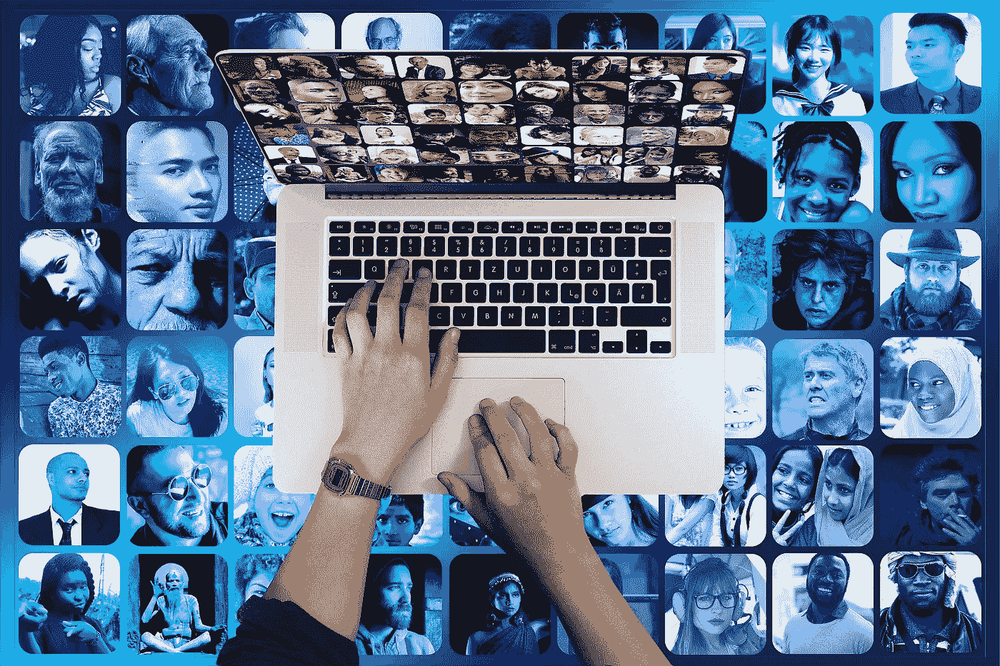

# 民粹主义时代:从“报纸出版商”到“信息内容提供商”

> 原文：<https://medium.datadriveninvestor.com/the-age-of-populism-from-newspaper-publishers-to-information-content-provider-f38728fe1c01?source=collection_archive---------7----------------------->

过去十年，民粹主义在全球舞台上的明显增长主要可以用经济和政治因素来解释，但应特别关注媒体，特别是在线媒体平台。互联网和更加网络化的全球社会为使用社交网络和在线媒体提供了几乎无限的自由，从而重新界定了言论自由的界限。大多数发达社会通过一系列法律法规来定义意见和表达自由的框架，以及媒体中的通信，但当我们谈到互联网作为一种媒体时，情况要复杂得多，因为它具有匿名性、流动性和开放性的固有特征。

社交网络和在线媒体作为一个平台，可以在近乎绝对自由的情况下推广各种各样的信仰，特别适合政治或公共交流，这有利于受众的广度、流动性和以令人难以置信的速度穿插的信息的持续可用性。与此相关的是，我们都有一个问题，即这样一个平台在多大程度上为客观报道、详细分析以及深思熟虑、平衡和建设性的批评和交流留有余地。

 [## 2019 年即将改变世界的技术|数据驱动的投资者

### 很难想象一项技术会像去年的区块链一样受到如此多的关注，但是……

www.datadriveninvestor.com](https://www.datadriveninvestor.com/2019/01/17/the-technologies-poised-to-change-the-world-in-2019/) 

与媒体打交道是我的主要工作，我认为在线媒体和社交网络可以在推进民粹主义方面发挥作用，并促进新兴国家政治意义上的民粹主义思维和表达方式的沟通类型……在线媒体在不断获取和分享信息方面的唯一安全规则似乎是应该实现最大“流量”的规则，即最高数量的点击和“分享”。
我们可以回忆起许多不同国家的在线媒体样本及其对局势的报道——议会反对党成员利用推特表达其对执政党的不当言论的“事件”，反之亦然。其他东南欧国家的许多例子可以表明，在作为大众传播平台的在线媒体和社交网络上发布新闻和信息，可以有助于在公共讨论和对对立政党的批评交流中更广泛地接受民粹主义方法。

由于这些数字平台的性质为实时设置和评论信息和新闻留出了空间，因此必须考虑在线媒体及其用户之间的双向影响。在这种背景下，我们应该始终反思评论的性质，以实现一个更全面的带有强烈民粹主义态度的信息和观点交流的形象。

Image by [Gerd Altmann](https://pixabay.com/users/geralt-9301/?utm_source=link-attribution&utm_medium=referral&utm_campaign=image&utm_content=2679740) from [Pixabay](https://pixabay.com/?utm_source=link-attribution&utm_medium=referral&utm_campaign=image&utm_content=2679740)

新媒体在民粹主义的发展和崛起中的作用是复杂的，但却是无可争议的。在过去的几十年里，媒体、公众和政治言论的工作方式发生了异常的变化，而互联网和新媒体以越来越重要的方式影响着我们接收、寻找和传播新闻和信息的方式。

受众发生了变化，传统媒体面临着不同的用户需求。这种现实导致了从“报纸出版商”到“信息内容提供商”的转变，对互联网盈利的追求，以及对根据“综合新闻编辑室”模式通过制作和发布新闻进行管理的投资兴趣的增长。这种媒体组织模式旨在充分适应环境的相同要求，从而达到最佳效果。
在这里，关键因素是认为与观众的互动是在线媒体空间不可分割的一部分，这种关系不仅改变了媒体的角色，也改变了观众本身以及通过媒体与观众交流的人。

传统媒体及其网络版本，还有社交网络，是民粹主义思想最强大的现代平台。互联网的匿名性在很大程度上提供了速度、广泛的可用性和安全性——所有这些都是发表态度的宝贵工具，这些态度的主要特征是对某些问题的明确和简化的观点。
在一个全球网络化的社会中，这种互联网主导地位严重动摇了人们对政治制度的信心，而“网络”的性质也传播到了社会的各个领域。公民参与的类型、对政治机构/制度的信任程度以及它们之间建立的关系——因社会而异，在这里我们回到了一个允许民粹主义和民粹主义话语发展的空间，特别是在新兴国家。

*我今天提供的陈述(或证词)代表我个人的观点。我是代表我自己，而不是代表我的雇主微软公司。*