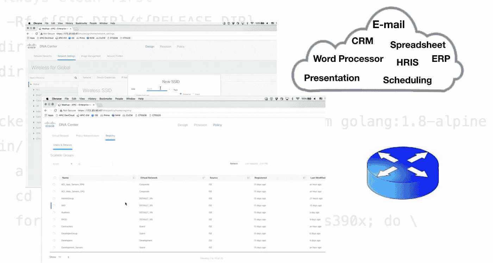
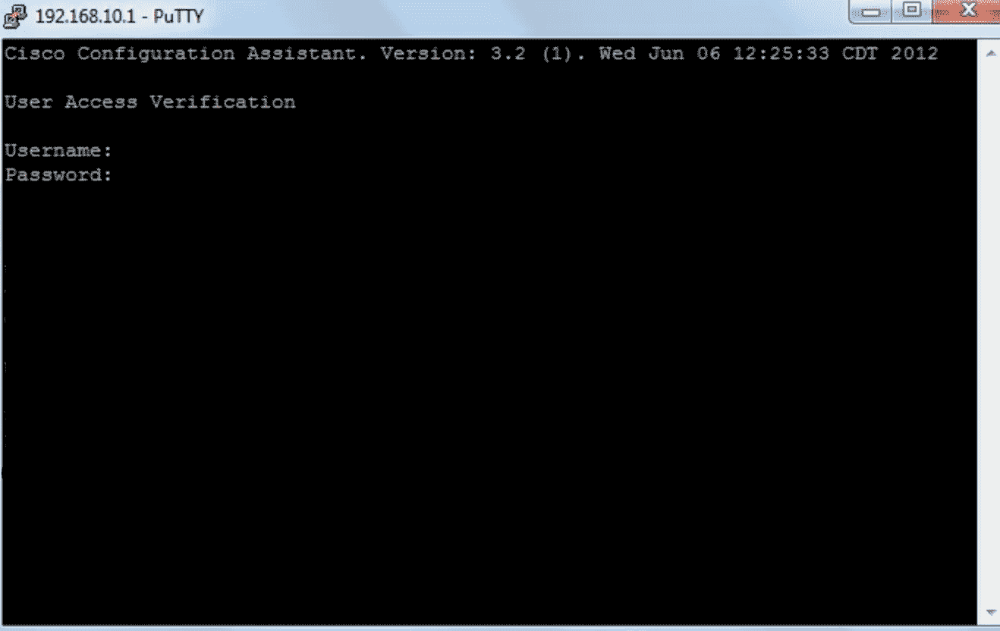
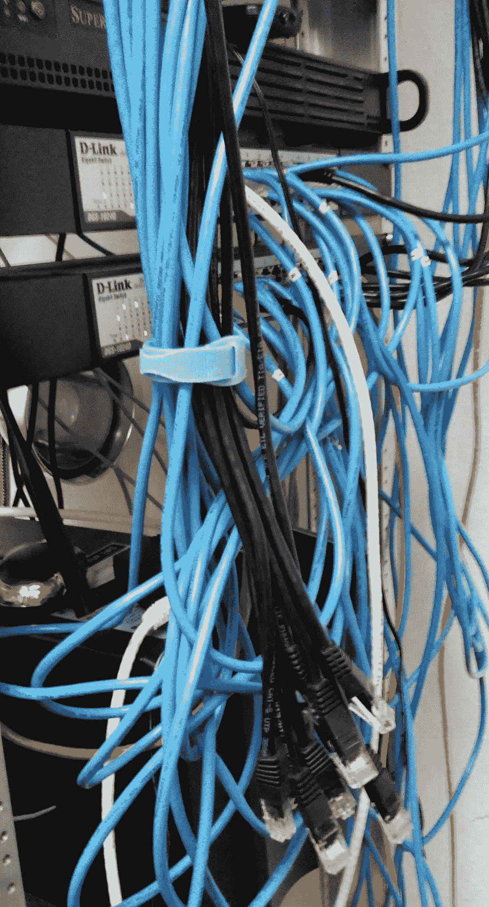
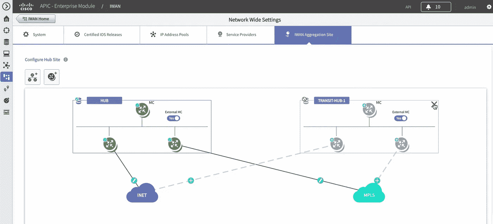

# 软件定义网络的时代

> 原文：<https://medium.datadriveninvestor.com/the-age-of-software-defined-networks-7f31b02dbd10?source=collection_archive---------7----------------------->

## **网络管理、性能和安全性与 SD-WAN 的紧密集成**

当我刚开始做网络工程师时，CLI 是配置、测试或排除设备故障的正确方法(也是专家的唯一方法)。每个工程师都需要知道如何使用命令行，这也出现在认证考试的问题中。这是你必须学习和掌握的东西，否则你将无法在这个领域取得进展。许多比萨饼和汽水罐之后，事情发生了变化，供应商实际上鼓励使用基于 GUI 的系统，而不是 CLI。这听起来很疯狂，从来没有工程师必须使用 GUI 来构建网络。

The good old Cisco CLI from an SSH terminal access window

这一切都归功于 SD-WAN 解决方案(软件定义的广域网)。还记得在路由发生变化时使用 CLI 配置路由、创建新的 VLAN 网段，甚至只是从路由器接口获取信息的日子吗？SD 类型的解决方案使用基于 GUI 的系统使管理更加容易。SD 提供的另一个神奇之处是动态创建网络并即时配置它们，而无需提供额外的物理硬件。这一切都是通过提供网络管理方法的软件实现的。现在它实际上更有意义了，我会解释为什么。

## 数据网络的发展

曾经有一段时间，无论是媒体公司还是金融公司，都对内部 IT 资产进行了大量投资。这些包括硬件(台式机、笔记本电脑、电话、服务器)和软件(操作系统、生产力、商业程序、许可证)。公司开始建立自己的数据中心来存放服务器和网络设备。随着时间的推移，维护这些系统变得越来越昂贵。为网络配置新用户的成本要求为所有相关的应用程序购买新的许可证号。捆绑许可变得很有用，但是当您必须添加比许可池更多的用户时就不那么有用了。为新项目升级硬件和供应新硬件通常不仅成本高昂，而且由于实际交付日期的原因，通常也不及时。

IT 人员无法在一夜之间构建一个新系统，因为他们必须等待部件交付，等待会计部门从领导层获得购买信号。拥有专门的 IT 人员的成本也相当高。为了管理台式机和服务器，也为了帮助台和技术支持，这是必要的。服务台技术人员不仅需要为最终用户提供支持，还需要处理设备故障、管理网络连接和设置物理设备。

On-premise data centers are usually not well maintained compared to the cloud.

IT 经理开始意识到他们在技术上的投资对业务运营有多么重要。如果本地数据中心因停电或不可预见的情况而停机，即使只是几个小时，业务也会蒙受损失。最坏的情况是几天到一周。一些公司甚至不得不忍受更长的时间跨度，因为需要进行故障排除来解决问题。其他系统只是没有正确构建，有许多缺陷。也许对这些本地系统的最大威胁是可能妨碍运营的网络安全攻击。黑客攻击造成的数据泄露也会让公司因窃取信息和政府监管机构的罚款而损失惨重。在那种情况下会有很多麻烦。

## 云计算

云计算的出现改变了 IT 行业的游戏规则。您现在拥有所谓的“基于云”的解决方案，可提供 IaaS(基础架构即服务)、SaaS(软件即服务)和 PaaS(平台即服务)。它提供了一种更经济的方式来使用通过互联网交付给用户的资源，除了一台计算机之外，不需要额外的软件或硬件。这也延伸到平板电脑、笔记本电脑和智能手机等移动设备。云是 IT 部门及时地从互联网上以更具成本效益的方式开发解决方案的一种方式。

Computing on the cloud is as easy as logging into your account and selecting an available service (Source Amazon AWS)

云将为公司节省大量资金，同时也节省了他们交付解决方案的时间。例如，DevOps 团队可以在不到一小时的时间内部署应用程序，而无需安装新的服务器。相反，首席开发人员只需要从云中提供虚拟服务器，通过互联网运行，并为所有团队成员创建用户帐户来访问它。这是 IaaS 在发挥作用。云提高生产力的另一个绝妙方法是应用程序的部署。基于云的生产力套件，如微软的 Office 365，可以立即提供给新用户，并在用户创建时动态应用许可。它也不需要安装客户端软件，因为访问是通过 Azure cloud 的安全 URL 进行的。这是 SaaS 的一个例子。

IT 经理希望削减的另一项成本是他们的互联网连接。这更适用于拥有跨国分支机构或分布在广阔地理区域的大公司。使用 MPLS 的网络链路可能非常昂贵，有时甚至不实用，但它提供了一种连接解决方案。这些电路是专用的分组交换网络，如果提供商一方出现故障，也会造成问题。

如果您可以从云中创建和配置服务器和软件，那么网络设备是否也可以做到这一点？基于软件的网络也可以用在成本较低的网络链路上吗？答案是肯定的，像思科这样的数据网络行业的公司已经提出了易于使用并能及时交付给企业的解决方案。

## 进入 SD-WAN

现在有了 SD-WAN 解决方案(也称为 SDN 或软件定义的网络)，本地系统可以作为混合网络架构与云一起使用。一些公司完全在云上工作，特别是小型办公室家庭办公室(SoHo)企业，否则他们将不得不投资于自己的数据中心和专门的 IT 员工。对于较大的公司，他们的帮助台可以花更多的时间来为最终用户提供技术支持，而不是维护他们自己的系统。就成本效益而言，在内部安装的较少，而在云上构建的较多。这也意味着 IT 人员不用再熬夜工作，因为他们需要管理的设备比以前少了，所以更加安心。云提供商通常会根据 SLA 维护具有高可用性的基础设施。

在混合云架构中，本地设备可以是 Windows 域控制器。然而，这些应用程序是从基于云的服务上运行的，比如 Office 365。SD 解决方案可以将内部站点的身份验证链接到云，支持与 Outlook 等 Offie 套件集成的 Active Directory 权限。因此，它是内部和外部系统的混合，允许使用基于传统的应用程序。一些公司使用 SD-WAN 将分支机构连接到位于总部数据中心的非云服务器。

Configuring an SD-WAN from a GUI (Source Cisco)

以 Cisco 为例，SD-WAN 基本上是将 CPU 密集型任务从路由器中分离出来。相反，任务将从数据平面卸载到使用自己的路由协议(称为 OMP(覆盖管理协议))的不同设备。路由器 CPU 的开销越少，路由设备的吞吐量和可扩展性就越强。这大大提高了他们的表现。

这定义了一个“覆盖网络”，在该网络中，vSmart 设备控制器和 vEdge 路由器之间进行通信。控制平面由与 vManage 控制台交互的 vSmart 控制器处理。通信链路使用 OMP 来共享网络信息。当路由器首次从网络启动时，它们将被定向到 vSmart 控制器，以获取有关其网络的信息。

这也消除了管理和保护网络设备的复杂性。当需求增加时，使用虚拟化的水平扩展有助于增加网络负载。它有助于自动扩展网络，无需管理员花费时间进行配置。支持 App 感知路由策略，可监控电路上的带宽，并允许在配置的电路拥塞或高延迟时切换到更好的连接。对每个 app 电路的带宽进行分析，并进行相应的优化。它将根据每个应用程序确定最佳路径，以获得最佳性能。所有这些都可以通过 vManage 这样的单一管理界面来完成。

这种配置也允许构建容错网络。可以创建网络控制器的实例，不仅可以处理网络负载，还可以为其他控制器提供高可用性和备份。虽然交换机和路由器状态都在硬件中，但控制器可以虚拟化。这意味着它们为所有硬件提供控制点，因此如果出现任何故障，它们将提前知道，并允许它们重新配置网络，将流量定向到另一台设备。

## 支持宽带网络

SD 解决方案出现后，公司正在做的一件事是取消他们使用 MPLS 等专用电路的传统互联网连接。相反，他们可以使用通过电缆甚至 xDSL 运行的商业宽带连接。一个公共交换 IP 网络是所有需要的速度匹配甚至击败传统网络。在云出现之前，这似乎是不可能的，当时 IT 经理需要专用线路连接到其他分支机构。他们在那段时间很快，并提供连接，这是最重要的功能。

对于 SD，思科提供的一个重要特性是他们所说的“网络灵活性”。简而言之，这意味着在向网络添加链接、位置、设备和应用程序时降低复杂性。软件从实际的物理硬件中提供了更多的抽象层。这意味着使用基于 GUI 的网站，只需点击几下鼠标，就可以完成新交换机的部署。然后可以立即启用和部署它。在 SD 之前，IT 人员必须发送需要管理层批准的购买请求。因为这个过程可能需要几天时间。IT 人员还必须等待交换机交付，然后才能进行任何设置。

利用电信和有线电视公司可以提供的当前宽带解决方案，您可以像在专用电路中一样获得高速度(> 10 Mbps)。SD 解决方案还提供了更优化的网络使用，为任何地方的用户提供了最佳的云应用性能。对于必须传输大量数据(音频和视频文件)的后期制作公司来说，这比“运动鞋网络”要好，在“运动鞋网络”中，制作助理必须开车绕着城镇步行将内容从一个工作室传送到另一个工作室进行编辑。

## 增强的安全性

越安全越好。事实上，如果它不安全，就不应该考虑。SD 解决方案提供了更加增强的网络安全设计。由于支持 NGFW 防火墙，这将允许:

> “深度数据包检测**防火墙**，它超越了端口/协议检测和阻止，增加了应用程序级检测、入侵防御，并从**防火墙**外部引入情报。”
> ——克里斯·布鲁克(数据内幕)

安全措施覆盖了从网关到边缘路由器的整个网络。用户、连接的设备、应用程序使用和 SD-WAN 上的所有流量都受到保护。思科定义了一个名为保护伞的安全套件。

为了安全起见，可以使用带有 IPSEC 的 VPN 对流量进行分段。这种划分允许应用程序与其他数据流量分开。高级安全功能，如使用伞式 URL 过滤的带 DNS 层实施的 IPS 和使用“下一代”NGFW 功能的应用感知型企业防火墙，都是其实施方式的示例。威胁防范也得到了加强。

将部署 SD-WAN 架构的公司将希望探索不同类型的可用安全解决方案，因为他们可能需要满足法规遵从性，例如 HIPAA。在这些情况下，可能无法在云上部署与其他公司共享租用的服务器。这将需要提供一个满足该行业数据安全合规性的专用云服务器。

## 印象

我从 Cisco Live 和 Connect 活动以及来自 Amazon 和 Microsoft 等其他提供商的网络研讨会中了解了许多关于 SD-WAN 解决方案如何提供帮助的信息。SD-WAN 或 SDN 也不是思科等厂商的专利。事实上，您可以使用开源解决方案来构建不需要思科设备的网络。虽然理论上看起来不错，但最好还是进行一次演示。我现在明白了，从网络工程师的角度，以及从经理或企业主的角度来看，它是多么有用。除了技术上的改进，它还有助于管理和降低成本。这些都是能够真正影响运营的有利的商业决策。

=================================

***注:这是作者基于经验的观点。这不是本文中提到的任何供应商的付费认可。***

## 来自 DDI 的相关故事:

 [## 数据科学和软件工程哪个更有前途？-数据驱动型投资者

### 大约一个月前，当我坐在咖啡馆里为一个客户开发网站时，我发现了这个女人…

www.datadriveninvestor.com](https://www.datadriveninvestor.com/2019/01/23/which-is-more-promising-data-science-or-software-engineering/)  [## 成为数据科学家所需的 8 项技能——数据驱动型投资者

### 数字吓不倒你？没有什么比一张漂亮的 excel 表更令人满意的了？你会说几种语言…

www.datadriveninvestor.com](https://www.datadriveninvestor.com/2019/02/07/8-skills-you-need-to-become-a-data-scientist/)