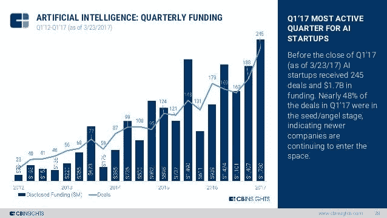
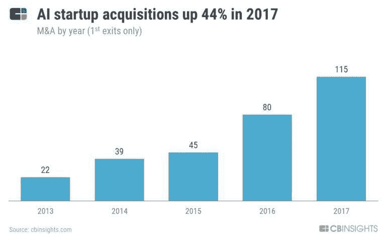

# 人工智能战场——初创公司如何战胜现有公司？

> 原文：<https://medium.datadriveninvestor.com/the-ai-battleground-how-can-startups-win-over-incumbents-58cdbf46c5ca?source=collection_archive---------7----------------------->

一个强大的人工智能通常需要获得足够的数据和计算能力——大公司在这方面具有先天优势。

然而，我们看到越来越多的人工智能初创公司获得了资金，这显然会刺激更多的企业家创办新公司:

现任者对吞并这些初创公司表现出越来越大的兴趣，通常是为了人才和技术的结合:

但是创业公司真的能靠自己赢吗？三种主要方式:

扮演整合者的角色——在一个大公司争夺主导地位的世界里，通常会有一个中立的小团体扮演整合者的角色。规模较小的公司也让紧张的现有公司更加乐于接受这种颠覆。自动驾驶汽车就是一个例子——通用汽车(一家 OEM)收购了 Cruise，Aptiv(德尔福 ie 一级)收购了 nuTonomy，部分原因是害怕与谷歌这样的大公司合作。

**2)合成数据** —没有足够的数据？嗯，模拟一下。即使是大公司也不会有一个包含所有例外的数据集，想想今天没有一家制药公司能够分析所有类型的基因组数据来诊断和治疗癌症。有关更丰富的讨论，请参见之前关于[合成数据的力量和挑战——3 条原则](https://www.linkedin.com/pulse/power-challenges-synthetic-data-3-principles-amit-garg/)的帖子。

创新者的困境——关于这个经典的困境已经写了很多，最重要的是大公司会有一种内在的抗拒去蚕食他们已经建立的业务。这意味着，如果一家初创公司实现了显著的成本或运营优势，那么专注于现有公司核心业务的公司实际上可以取得成功。例如，我们可以说网飞不是一个真正的初创公司，但在 21 世纪初与百视达竞争时，他们肯定是失败者。出于许多原因，他们获得了 10 倍的优势，但其中一个关键原因是一种简单的人工智能形式，通过协作过滤更好地理解了他们的用户口味。

创业公司可以通过人工智能取得成功的其他方式有哪些？评论离开。

*这些都是专注于实践见解的短文(我称之为 GL；dr —良好的长度；确实读过)。如果它们能让人们对某个话题产生足够的兴趣，从而进行更深入的探索，我会感到非常兴奋。我在三星的创新部门工作，该部门名为*[*NEXT*](http://samsungnext.com/)*，专注于 deep tech 中软件和服务的早期风险投资，这里表达的所有观点都是我自己的。*