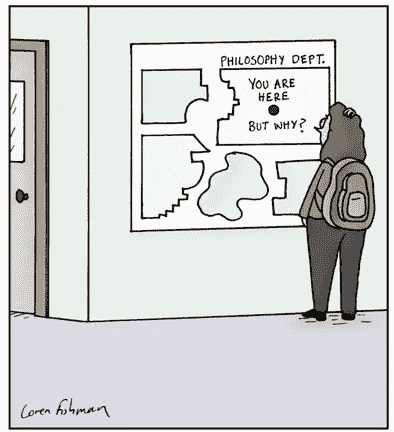

# 健康领域的人工智能前景

> 原文：<https://medium.datadriveninvestor.com/the-ai-landscape-in-health-740c092de0b9?source=collection_archive---------2----------------------->

Image from Pixabay

人工智能正在进入医疗保健和生命科学的每个方面，从研究和药物发现到诊断和疾病管理。[人工智能在这些领域的使用在 2019 年大幅增加](https://www.optum.com/content/dam/optum3/optum/en/resources/fact-sheets/wf1527930-optumiq-ai-survey-data-points-media-fact-sheet-10.4.19a.pdf)。在 Optum 的调查中，62%的世卫组织报告实施了人工智能战略——在 2018 年，只有 33%的人报告实施了人工智能战略。根据对医疗保健高管的同一项调查，选择投资人工智能的公司中有 50%看到了成本节约方面的投资回报。医院和医疗计划预计人工智能投资的回收期为三年，而生物技术高管预计需要五年或更长时间。

在医疗保健和生命科学领域，人工智能不再是一个差异化因素。这是许多公司为了在相对较短的时间内获得收益(收入、客户、储蓄)而进行的投资。此外，鉴于人工智能技术如此广泛，如果你能找到制造产品所需的非常受欢迎的数据科学家，用例和商业模式比人工智能算法更重要。

# 人工智能在健康研究中的应用

迫切需要加快研究，以更好地了解疾病的机制，建立生物标志物，并开发疾病模型。为了做到这一点，科学家们面临着跟上每天涌入的生物医学文献海啸的挑战。浪费时间和研究经费重复已经完成的工作的轶事比比皆是。科学家正在生成前所未有的海量数据，因此需要简化对科学文献中生物背景的访问。我们需要让科学家拥有能够快速吸收、整合和呈现新(旧)知识的人工智能工具。

努力从一般到不同的重点用例。 [Quertle](https://quertle.com) 是一个改进的搜索引擎，旨在通过整合、组织和呈现生物医学文献来简化发现过程。 [Genomenon 的策划者](https://www.genomenon.com/mastermind/)通过搜索数百万篇科学文章来改进变体解释。[独创性途径分析](https://www.qiagenbioinformatics.com/products/ingenuity-pathway-analysis/)试图预测下游效应并识别新的靶标和生物标志物。每一个都为非常大的问题提供了部分解决方案。

自然语言处理最有用。感觉每天都有一种新的语言模式被推向世界。 [OpenAI](https://openai.com) 在过去几周发布了他们梦寐以求的 GPT-2 模型。[这个模型](https://d4mucfpksywv.cloudfront.net/better-language-models/language_models_are_unsupervised_multitask_learners.pdf)是在 40tb 的文本上训练出来的，它可以回答问题，翻译，并在一点提示下写故事。在没有经过专门训练的情况下(尽管准确性不高)，GPT-2 会在提示“ [TL”时总结给定文本；博士](https://www.dictionary.com/e/acronyms/tldr/)。

摘要将是生物医学领域的一个关键用例。许多努力都集中在使用自然语言处理来挖掘 PubMed、Clinicaltrials.gov 和专利。重点是找到正确的数据并呈现在用户面前。推动健康研究的最佳见解将来自许多来源和数据类型的统一，包括已发表的文献、基因组学、基因表达、微生物组、电子健康记录、社会决定因素、社交媒体、可穿戴设备等。自然语言处理将是这种策略的一个重要组成部分，它可以动态地对许多不同形式的数据之间不断发展的实体和关系进行建模。

# 人工智能在药物发现中的应用

AI 正在支持关键用例，以发现新的候选药物，削减成本，降低药物发现渠道的风险，并加快上市时间。药物发现和开发是人工智能在生命科学中的一个重点。这是人工智能的一个复杂领域，有 100 多家初创公司专注于这一领域，同时还有知名制药公司的重要承诺。这些努力涵盖了从使用人工智能到设计新的候选药物，确定药物用途的机会，以及比传统研发更快的功效和毒性的计算机筛选。使用人工智能对患者进行分层，以招募和优化临床试验并分析现实世界的证据，也将改变药物开发的速度和成功率。

谷歌公司的 Calico 实验室正在使用人工智能和其他技术来解决衰老问题。他们更不寻常的项目之一是研究对抗年龄的裸鼹鼠，每个人都应该知道，因为进化是如此怪异(这里的[和这里的](https://www.ncbi.nlm.nih.gov/pmc/articles/PMC5783610/))。前 Calico 实验室首席计算官达芙妮·柯勒创办了自己的公司 [insitro](http://www.insitro.com/) ，以降低药物开发的成本。本着同样的精神，Atomwise 提供*从头开始*药物筛选，其精确度可与湿实验室实验相媲美。

尽管几十年后，量子计算将改变新药候选药物的研究。它将使我们能够设计目前不可能的新药，并通过快速求解毒性和疗效的计算密集型分子相互作用来加速药物管道并降低风险。在[精准医疗](https://www.ncbi.nlm.nih.gov/pmc/articles/PMC6205278/)的情况下，它会让一些复杂的算法进行实时计算，可能是在病人还在办公室的时候。

**人工智能云平台**。有时感觉每个人都有一个算法，概念证明，以及重新调整药物用途或找到关键疾病靶点的合作伙伴。制毒过程可能需要长期的合作。真正的力量将是提供易于使用的工具，让每个人做自己的目标和药物发现。许多公司正在转向这种模式。英国初创公司 Lifebit 提供了一个企业平台，用于在他们自己的安全数据环境中扩展分析。总部位于旧金山的 BlackthornRX 拥有一个专注于神经科学的基于云的计算平台，用于多模态数据收集、整合和大规模分析。

# 诊断和疾病管理中的人工智能

人工智能有可能加速和提高许多疾病过程的诊断准确性。**深度学习**已经被用于创建应用程序，以识别图像和扫描中的疾病模式。基于在[视网膜图像](https://www.mdedge.com/endocrinology/article/163265/diabetes/fda-approves-marketing-retinal-imaging-device-uses-artificial)、[组织切片](https://www.usa.philips.com/healthcare/product/HCPATHXL02/tissuemark-computational-pathology)、 [CT 图像](https://www.radiologybusiness.com/topics/artificial-intelligence/ai-detects-neurologic-events-ct-faster-radiologists)、 [MRI 扫描](https://www.informai.com)、 [x 光](https://www.radiologybusiness.com/topics/artificial-intelligence/ge-healthcare-ai-chest-x-rays-fda-clearance)和[面部特征](https://www.face2gene.com)中的诊断问题开发了应用程序。构建这些应用程序的主要挑战是组装大型数据集，用代表疾病和非疾病的图像或扫描来训练和验证模型。这些应用中的大部分是针对医疗团体的，用于医院和诊所。

许多新的应用都是直接针对病人的。这些深度学习模型正在接受语音、视频、声音、社交媒体活动、可穿戴设备传感器数据、眼球追踪，甚至键盘使用模式的训练。应用程序已经被用于检测异常心律，提醒需要医疗干预的问题。未来的希望是将我们的智能手机变成个人医疗助理，进行被动、不引人注目的监控，并对相关模式发出警报。为了实现这种下一代功能，我们需要能够从个人用户模式中学习的模型，同步来自多个来源的信号，以实时识别异常。为此，在智能手机上训练深度学习模型的能力将变得普遍。

我们看到，在高后果环境中引入人工智能应用程序的挑战，如临床决策支持，在于用户的采用。对于一名医生来说，要信任来自人工智能应用程序的建议并采取行动，他们需要知道该应用程序已经通过临床试验进行了前瞻性验证，他们必须对为什么为特定患者生成预测做出一些解释。FDA 已经定义了基于人工智能的临床决策支持应用的临床试验要求，将软件视为医疗设备。为了应对用户采用的挑战，我们需要让预测更容易解释和理解。**可解释的人工智能**是推动医生采纳的必要焦点。

Cartoon from Loren Fishman

# 结果

医疗保健领域的人工智能预计将从 2018 年的 20 亿美元增长到 2025 年的 360 亿美元。人工智能已经开始为生命科学和医疗保健行业带来重大价值。由于人工智能和自动化，医疗保健的面貌将在未来 5 年内彻底改变。需要对自然语言处理、量子计算、深度学习和可解释的人工智能进行持续投资，以实现人工智能的全部潜力，最大限度地改善人类健康，减少人类痛苦。