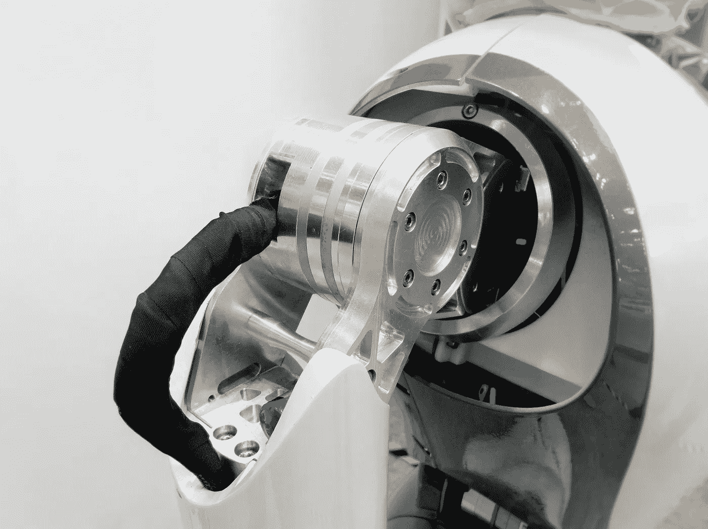

# “人工智能程序将看到你现在:”医疗保健的未来在一个由软件主导的世界

> 原文：<https://medium.datadriveninvestor.com/the-ai-program-will-see-you-now-healthcares-future-in-a-world-dominated-by-software-c7d443858f90?source=collection_archive---------13----------------------->

©Frnck V. on Unsplash

在未来的医疗保健系统中，机器将取代 80%的医生。计算机领域最杰出的思想家和企业家之一，*在 2012 年的一篇文章中的惊人陈述，让读者们大吃一惊。医生的职业选择现在岌岌可危，多年的努力都白费了？*

*没有医生，只有机器？在他的论点中，科斯拉提出“*最好的解决方案(是)摆脱医生和老师，让你的计算机 24/7 全天候工作并保持一致的质量*。”*

* [## 医疗保健的未来正在被一场大型技术入侵所塑造|数据驱动型投资者

### 过去十年，全球经济的所有部门都经历了大规模的数字颠覆，而卫生部门现在…

www.datadriveninvestor.com](https://www.datadriveninvestor.com/2018/11/02/the-future-of-healthcare-is-being-shaped-by-a-big-tech-invasion/) 

他提出“医生算法”或“A 博士”，即使不比前 20%的医生更好，也会与之相当。在实践中，A 医生在诊断和治疗建议方面更胜一筹。他是对的吗？

无声和冷漠的人工智能(AI)正在推动医疗保健的发展，并在此过程中迫使医生重新思考他们的实践方式。人工智能已经成为未来医学和医疗保健的必要条件。

但它并不像科斯拉最初预测的那样奥威尔式，这就是它产生巨大差异的地方。我们当中有谁有足够的天赋来预测任何新技术的未来？然而，有一件事我们是知道的，那就是看医生总是充满压力。

我从来不会带着喜悦跳过医疗预约。我知道“白大褂综合症”会让我的血压飙升，心跳加速，额头冒汗。恐惧从来不是患了致命疾病的问题，但只要走进那个空气中弥漫着消毒剂味道的候诊室，对我来说就足够了。

每当医生认为看到“奇怪”的东西时，就需要排除所有这些诊断和测试，这不会带来任何快乐。考试相对原始；心脏，肺和胃检查，也许耳朵和喉咙和抽血。艾的“备份”*第二意见功能*本可以避免那些不必要的检查，并在这个过程中节省金钱和减轻我的压力。

## AI 将会很好地适应

计算机科学和人工智能(AI)的进步将对患者和从业者产生重大影响。结果，曾经令人恐惧的去医务室的经历可能会减少创伤。机器人可以让人放心，也可以默默高效。《2001:太空漫游》中的哈尔敦促戴夫吃一片压力丸，是吗？哈尔也确信所有的电路都工作正常。一切都归结于编码。

并非所有的医生都认为他们的职业前景黯淡。正如[一位内科医生所说](https://www.sciencedaily.com/releases/2018/09/180918180501.htm)，“*我们坚信我们可以授权提供者使他们的解释和诊断更容易、更快、更好。人工智能不会取代供应商，这是肯定的…然而，很明显，人工智能将增强我们的能力，以完成更多的工作，并减少错误和多余的工作。*

## 受影响最大的医学专业

放射学家是人工智能的主要目标，就好像站在悬崖上，却没有意识到自己将要被推倒。当然，悬崖是人工智能进入图像阅读的入口。然而，AI 并没有消除或降低放射科医生的重要性，而是增强了他们的能力，让越来越多的患者能够快速获得成像信息。患者病例数可能会增加，同时等待读数的时间会减少。

扫描和 MRI 设备模式的出现增加了放射科医生利用人工智能等新技术的需求。未来是光明的，因为 AI 成为他们坚定不移、永远可用的助手，而不是他们的替代品。

一位*经常必须做肺功能测试(PFT)的肺病学家*发现，利用人工智能来解释和匹配症状，在 82% 的情况下做出了[正确诊断。医生认为这是一个令人信服的支持工具，而不是一个与他们的能力相冲突的工具。](https://www.sciencedaily.com/releases/2018/09/180918180501.htm)

哮喘是儿童时期最常见的慢性内科疾病之一，600 万美国儿童患有哮喘。2013 年的数据表明，近 1400 万天的学校学习因哮喘发作而错过。药物治疗、医生出诊、急诊室就诊和住院治疗的费用每年上升到近 600 亿美元。

因此，哮喘似乎是人工智能应用的主要领域。AI [在预测哮喘发作](https://www.technologyreview.com/s/612277/ai-cant-replace-doctors-but-it-can-make-them-better/)方面有着不可思议的未来用途。一种人工智能算法将哮喘发作的患者记录与气候数据进行比较，将能够表明发作最有可能发生的时间。这些数据将为医生提供通过适当地建议患者来抵御攻击的能力。

## 可穿戴传感器和远程医疗出现

[人工智能](https://medicalfuturist.com/medical-specialties-with-the-biggest-potential-in-the-future)将或正在发挥积极作用的医疗专业包括全科医疗，[可穿戴传感器](https://ai-med.io/white-hot-topics-for-ai-in-medicine-monitoring-wearables-imaging/)可以检测各种问题。IBM 有一个[指甲传感器](https://www.youtube.com/watch?v=fYyPx8jw_3k)来监测病人的活动和疾病进展。其他[可穿戴设备](https://www.i-scoop.eu/wearables-market-outlook-2020-drivers-new-markets/)可以监测患者血液中循环的癌细胞、汗液生成和血糖，等等。消费者和医务人员都可以获得数百种商品和应用程序。预计到 2023 年，这个市场将达到 1000 亿美元。

所有专业的患者数据将持续更新。皮肤病学将受益于更准确的活检读数。其他专业，如肿瘤学、外科、眼科、运动医学、康复、胃肠病学、急诊医学和传染病也将受益。具有人类局限性无法比拟的记忆库的大型数据集将提高诊断准确性和治疗建议。

" [*远程医疗*](https://www.healthcarefinancenews.com/news/telemedicine-poised-grow-its-popularity-increases-among-physicians-and-patients) *正在成为医疗保健领域非常受欢迎的产品。最近的一份全球市场洞察报告发现，该行业在 2018 年的价值约为 383 亿美元，预计到 2025 年这一数字将增至 1305 亿美元。医生将会把它看作是他们对抗疾病的另一个医疗武器。*

医疗保健中的人工智能前景光明。随着它进入世界各地越来越多的医疗保健和医疗服务领域，所有患者群体都将受益。在容易安排的预约中，当病人与他们的医生交谈时，手机和电脑屏幕将成为标准。随着医学新时代的到来，驱车 50 英里去看医生将成为遥远的记忆。*