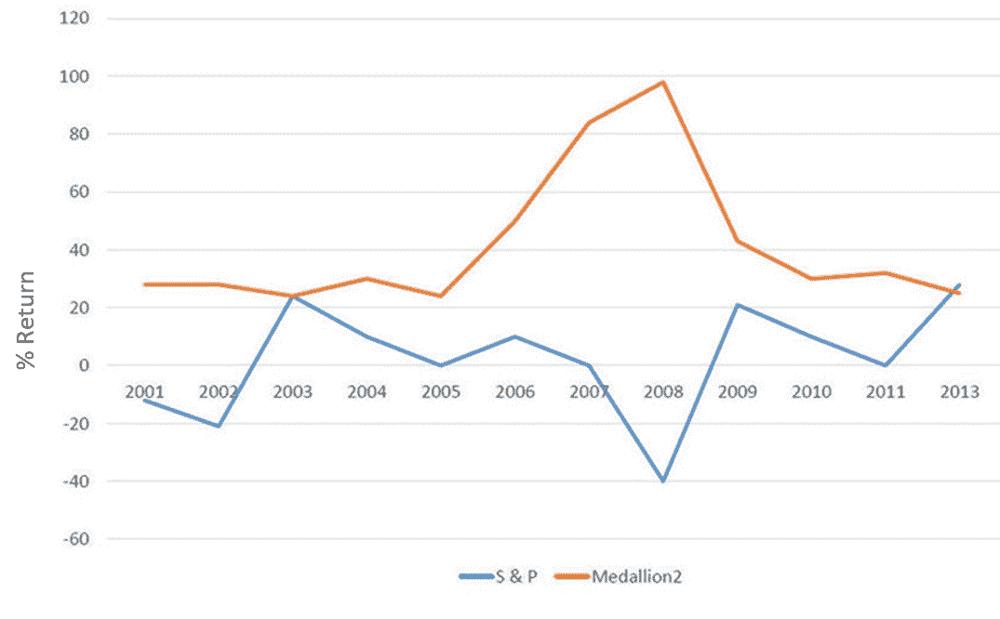
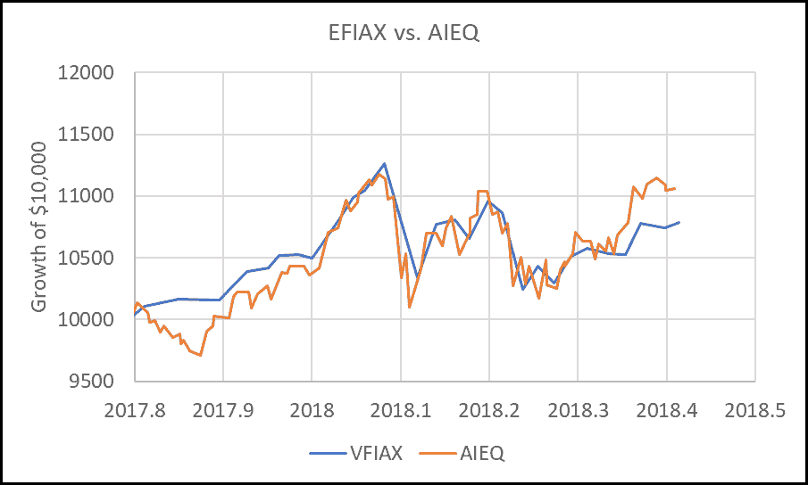
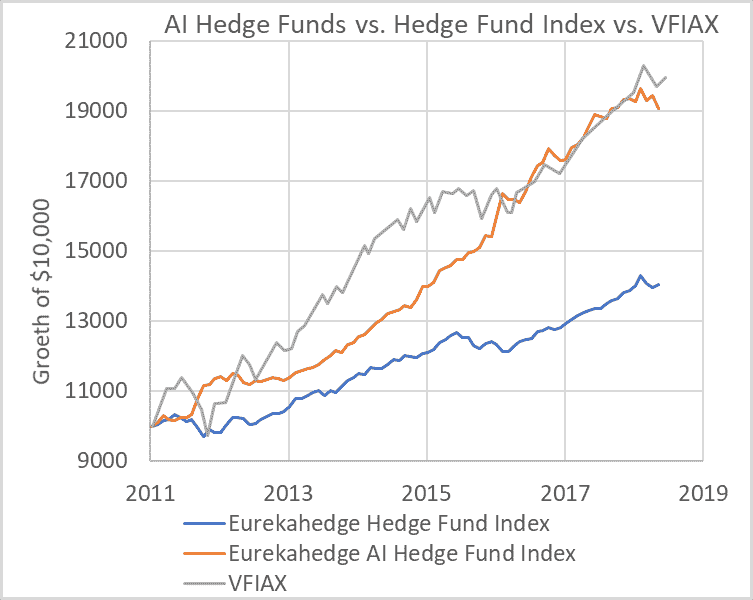

# 人工智能革命，以及如何投资

> 原文：<https://medium.datadriveninvestor.com/the-ai-revolution-and-how-to-invest-7365090bd506?source=collection_archive---------5----------------------->

1997 年，计算机“深蓝”在一场七局四胜的比赛中击败了国际象棋特级大师加里·卡斯帕罗夫，历史上首次证明了机器优于人类最好的棋手。“深蓝”是一个团队十多年工作的成果，该团队包括自己的国际象棋大师。今年早些时候，谷歌提出了一种算法，在 24 小时的“训练”中，它不仅超过了所有人类下棋的水平，还超过了“围棋”，这是一种更复杂的游戏，需要的不仅仅是“蛮力”计算。

更快的计算机和更大的数据集使这些进步成为可能，这些计算机和数据集允许研究人员训练越来越大的“神经网络”——一种机器学习架构，使计算机能够学习“将碎片放在一起”，以完成需要许多抽象层的任务。例如，在为图像识别而训练的神经网络的早期，一个特定的计算单元可以用来检测图片中的边缘——后来，神经网络可以处理这些早期计算单元中检测到的边缘，以便找到这些边缘放在一起时代表人脸。这可能类似于人类大脑的工作方式——当给定一幅图像时，我们不会单独分析每个像素，而是在构建图像所代表的精神画面的过程中，识别边缘等低级模式和面部等中级模式。

根本性的突破是，当有足够大的数据集来“训练”算法时，新方法不再依赖人类对计算机的编程逻辑来告诉它寻找什么。取而代之的是，建立一个神经网络体系结构，计算机实际上学习它需要学习的内容，以便在给定的任务中优化性能。人类不是告诉计算机做什么，而是给它一个目标，并设置一些架构参数(多少层/节点以及几个调整参数的选择)，让机器自己学习。正如“国际象棋”和“围棋”的例子所显示的那样，结果是计算机可以自己想出一些策略，即使对最优秀的人类棋手来说，这些策略最初也是完全神秘和违反直觉的，因此在技巧上胜过他们。

一个非常具体的例子是语言翻译程序，例如像 google translate 这样的程序可以将英语中的一个句子或段落翻译成任意数量的其他语言。这种翻译的一种方法是将语法规则和词典一起输入计算机。这依赖于人类为机器提供大部分逻辑。深度学习的方法是简单地给机器一个由一系列翻译段落组成的“训练集”(例如，这些段落可能来自人类翻译成多种其他语言的书籍)，训练一个神经网络，并让它自己找出所有的逻辑。

这当然导致了大量的猜测和炒作，并不令人惊讶地担心机器将很快接管。毫无疑问，人工智能的进步将对经济的许多方面产生重大影响。当无人驾驶汽车到来时，它本身将带来巨大的社会变革。更广泛地说，人工智能革命可能导致劳动生产率更快的增长，而生产率的提高是经济繁荣的最终源泉。此外，它可以帮助世界上的发达国家克服与老龄化劳动力相关的人口问题。因此，人工智能可能对经济、股票和投资者都有好处。当然，生产率提高和失业之间总是存在矛盾，但自工业革命开始以来，美国经济已经成功应对了这一问题，而且很可能再次如此。

在这篇时事通讯中，我们想解决一个更狭隘的问题:如果人工智能已经更擅长国际象棋和围棋，那么即使是最优秀的人类选手，有什么理由它不会很快也更擅长投资？人类基金经理会不会重蹈恐龙的覆辙，被学会自己挑选投资的人工智能算法取代？作为个人投资者，这对我们意味着什么？

首先，我们需要区分算法投资、机器学习和“深度学习”(使用上述神经网络的领域)。算法投资使用人类设计的算法在资产类别之间分配资金，或根据现有数据选择特定投资。在这种情况下，计算机遵循人类设计的规则。计算机加速了这一过程，消除了一些人类的偏见，但它基本上只是自动化了人类过去可能手工完成的工作。大多数机器人顾问和 smart beta 基金都在练习算法投资。当然，IvyVest 也在进行一种算法投资。我们的算法当然是系统的，并且是“基于规则的”，但规则是由我们设计的，而不是由一个被释放出来自行发现最佳策略的人工智能发现的(我们将有理由解释为什么这在资产配置方面不会特别好)。最简单的算法投资形式可能是指数基金。指数基金有一种算法，告诉它们只需购买基准的资本化加权版本。这里的术语可能会令人困惑，因为在某种程度上，指数基金是大多数人想到“人工智能”时所能想到的最遥远的东西，但因为它仍然是一种系统投资形式，类似指数的策略有时会被归入通用的“定量”类别。

机器学习比算法投资更进了一步。计算机被编程为接收大量数据，并根据人类可能难以发现的趋势改变其算法。计算机快速摄取和分析大量数据的能力使其比人类具有显著优势，但人类程序员仍然更多地控制着机器将寻找的特定“特征”的设计(例如，在设计一个选股应用程序时，你可能会建议股票的价格与自由现金流的比率是许多指标之一，当这些指标放在一起时，可以表示该股票是否值得购买)。在这种情况下，人类在很多情况下仍然可以理解由此产生的算法。

深度学习让程序自己负责。基于所谓的神经网络，计算机吸收大量数据，并以人类可能无法理解的方式修改控制程序。深度学习在许多复杂的任务上已经非常成功，比如语言翻译。这似乎有助于评估选择股票或对市场状况做出快速反应的各种信息。

我们希望能够告诉你人工智能目前如何被用于投资管理，以及它取得了多大的成功。不幸的是，很难确切了解经理们目前是如何使用人工智能的。有许多“定量”基金根据定量算法选择投资，但不清楚其中有多少是真正使用机器学习或深度学习的，而且由于围绕该领域的炒作，如果有助于营销目的，他们所做的任何事情都很可能被打上“人工智能”的标签。

然而，“定量”基金(基于机器学习或深度学习)似乎正在以更传统的基金经理为代价获得资产。彭博新闻最近报道称，非量化对冲基金在 2016 年和 2017 年出现净流出，而量化基金则出现净流入。至少有一只量化基金，由文艺复兴科技公司运营的 Medallion 基金，取得了惊人的成功。图 1 摘自参考文献 1，显示了与标准普尔 500 相比，Medallion 2 基金的表现。请注意，在 2008 年标准普尔 500 崩溃时，它的性能有了大幅提升。不幸的是，我们不知道 Renaissance 是否在使用真正的 AI(机器学习或深度学习)，或者他们是否在使用更传统的人类设计的算法。Medallion Fund 的投资者数量非常有限，其中大部分是 Renaissance 的员工。

图 1:与标准普尔 500 相比，Medallion 2 基金的回报。数据取自参考文献 1。

有一个基金广告说它正在使用人工智能，并向普通投资者开放。“人工智能驱动的股票 ETF”，股票代码 AIEQ，声称它使用 IBM 的沃森挑选股票。是 2017 年秋季开始的新基金。图 2 显示了其迄今为止的表现，但当然现在判断该基金是否会成功还为时过早。在早期，它以微弱优势击败了标准普尔 500。

图 2:与先锋 500 指数基金(VFIAX)相比，AIEQ(一种人工智能驱动的基金)的表现

其他量化基金表现如何？独立数据提供商 Eurekahedge 维护着跟踪各种对冲基金的对冲基金指数。他们的一个指数跟踪在选股中使用人工智能的基金。图 3 显示了 AI 指数与 Eurekahedges 的一般对冲基金指数和标准普尔 500(由 VFIAX 表示)相比的表现。在此期间，AI 指数略微落后于 VFIAX。

图 3:AI 对冲基金指数与一般对冲基金指数和标准普尔 500(用 VFIAX 表示)的比较。

如果计算机在复杂的智力游戏如国际象棋和围棋方面已经比人类好得多，为什么它们，至少根据这些结果，在市场上似乎没有发挥出它们的潜力？

一个因素很可能是真正的深度学习/ AI 需要非常大量的数据。例如，流行的图像识别数据集数以百万计，研究人员仍然抱怨它们不够大。在像国际象棋这样的游戏中，有可能从所有记录的人与人之间的历史游戏开始获得大量的训练集，然后通过让你的算法与其他版本的算法进行对抗来综合扩展这些训练集。

在金融市场上，你唯一能获得如此规模数据集的地方，是当你处理非常短期的交易现象时，这种现象会在几秒到几分钟内解决。这可能是为什么许多非常成功的量化基金，如文艺复兴，在很大程度上利用了这一水平的现象。相反，如果你在训练一个模型，寻找未来 6 个月投资的最佳资产类别，那么在过去 40 年的市场历史中，你实际上只有 80 个不重叠的时期。这是一个太小的数据集，无法进行任何深度学习。

更抽象地说，让计算机能够在像国际象棋这样的游戏中通过“与自己比赛”来学习的是这样一个事实，即游戏可以完全由一组相当小的规则来描述，这些规则控制着游戏如何展开以及你可以做什么和不可以做什么。唯一的变数是你的对手下一步会采取什么行动。金融市场没有对等的规则，每次展现的都可能不同。这就是为什么像资产配置这样的方法更倾向于依赖简单的规则而不是复杂的逻辑。

这是否意味着 AI 在投资中没有作用？绝对不行。在未来几年，人工智能似乎不可避免地将增强和/或最终取代共同基金和对冲基金的人类股市分析师今天所做的许多事情。一个典型的“选股人”很大一部分时间都花在了评估一家公司的业绩上。如果分析师在一家公司公布收益之前确定该公司的表现比市场预期的要好，那么他的公司就可以通过在收益公布之前购买股票而获得巨大的利润。因此，华尔街完全沉迷于“收益预测”。

分析师为确定他们的估计所做的许多分析可以被良好的人工智能增强或取代

*   人工智能可以分析智能手机发出的卫星图像和/或地理位置数据，来测量零售机构的实时交通趋势，而不是在店内检查交通
*   一种复杂的自然语言算法可以分析公司所说的一切，并检测情绪变化，而不是听取公司管理层的盈利电话或演示
*   消费者情绪的变化可以从类似的社交媒体情绪分析中实时检测出来

你可以发挥你的想象力，很容易地想出其他的场景。请放心，这些对任何华尔街公司来说都不新鲜，最聪明和最好的公司已经并正在积极投资这种技术。

当然，这些都不会改变的是试图通过选股来战胜市场的零和逻辑。正如任何公司的人工智能技术变得复杂一样，要获得“alpha”(高于市场的超额回报)，它必须比竞争对手的更好，竞争也不会停止。换句话说，选股/对冲基金领域极有可能迅速变成高盛(Goldman Sachs)对布里奇沃特(Bridgewater)对复兴(Renaissance)对富达(Fidelity)等公司的人工智能军备竞赛。在人工智能领域真正“一流”的公司可能能够在竞争中领先一点，并因此获得超额回报，但实现这一目标所需的投资不会很便宜，保持该领域领先地位所需的额外投资最终可能会消耗掉基金为客户获得的大部分超额回报。

那么，作为个人投资者，你应该如何看待这一切呢？这真的很简单。如果你打算玩人工智能游戏，你需要能够赢得它。如果你只有二等人工智能，你会输给那些拥有一流人工智能、进行更大规模技术投资的公司。除非你是世界上 50 位最好的数据科学家之一，否则你在人工智能游戏中击败其他所有人的几率似乎很小。如果赢不了自己，那就意味着把你的钱委托给一家你认为可以赢的公司。这意味着正确地识别那家公司，并希望他们能够产生的超额利润足以支付他们向你收取的费用，并留下一些额外的盈余来奖励你承担风险。如果你能接触到下一个文艺复兴时期的技术(或者就此而言，如果你能接触到当前的文艺复兴时期的技术)，你或许应该这么做。但是如果你正在读这篇文章，你可能不在那个阵营。

但这没关系，因为市场的“零和”性质有一个好处——当个人投资者面临他们赢不了的游戏时，它给了他们一个很好的策略:不要玩。这是一个很好的策略，因为“不玩”并不意味着“停止投资”。它只是意味着“投资的方式不要试图在顶级人工智能公司的游戏中击败他们。”购买低成本指数基金并专注于资产配置是做到这一点的一个很好的方式——你不会在 Target 的收益是否会超过共识的零和问题上与任何人竞争，你只是通过购买一些 VT 的股票来赚取所有美国股票的市场平均回报率，然后专注于你的投资组合中应该有多少是美国股票而不是其他资产的问题。

换句话说，IvyVest 策略或基本索引等“更简单”的基于规则的策略的好处是，虽然它不使用任何人工智能，但它也相当防人工智能。随着领先的公司用越来越复杂的算法一决雌雄，只要你作为个人投资者能够保持投资，保持低费用，并用像本网站上这样基于规则的动态策略来避免最糟糕的泡沫和熊市，几乎可以保证，随着时间的推移，你最终会击败大多数其他投资者——甚至是那些一头冲进人工智能的投资者。

参考文献 1: Richard Rubin，Margaret Collins，“一家独家对冲基金如何加速其退休计划”，彭博，2015 年 6 月 16 日。

参加[**IvyVest premium**](https://www.ivyvest.com/)两周免费试用—我们的高级订阅服务。您将获得我们基于规则的动态资产分配模型、工具，这些工具将向您展示您需要在自己的折扣经纪账户中购买什么(以及何时重新平衡)来实现它，以及见解深刻的每月简讯，它将让您了解市场上正在发生的最重要的事情。不需要信用卡。 [**现在就开始！**](https://www.ivyvest.com/)

*原载于*[*www.ivyvest.com*](https://www.ivyvest.com/blog/posts/may-newsletter-the-ai-revolution)*。*