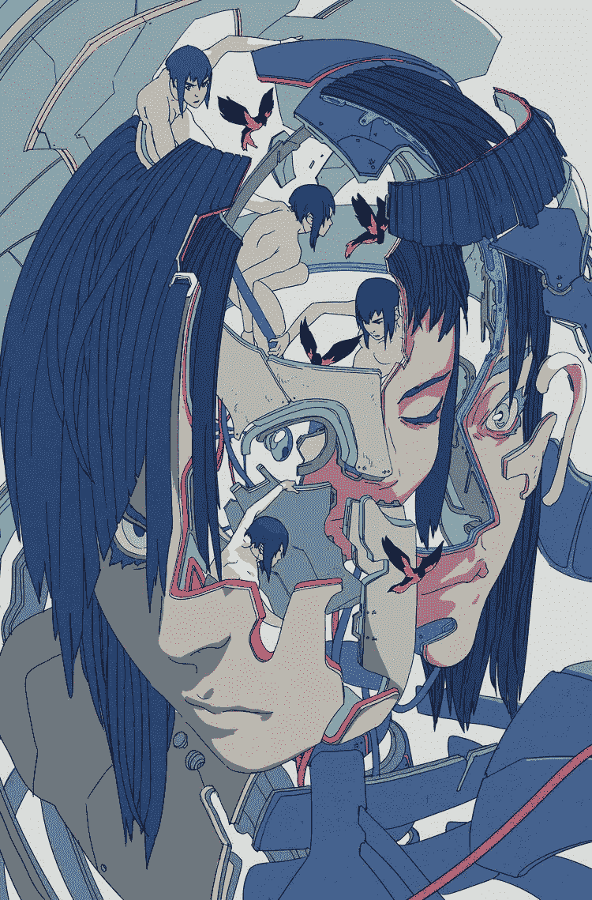

# 有一千张脸的人工智能

> 原文：<https://medium.datadriveninvestor.com/the-ai-with-a-thousand-faces-79d38532686c?source=collection_archive---------33----------------------->

在他的一次演讲中，乔丹·b·彼得森讲述了一个在木头上雕刻印加面具的人的故事。这个人声称自己没有想象力，但偶尔他会清晰地看到面具的每一个细节，并把它刻在木头上。

人们喜欢科技，因为它从不拒绝。

如果你的妻子/丈夫/孩子/朋友永远不会说不，那该有多美好？奴隶制已经被废除，现在我们有了能满足我们大部分愿望的机器。

我们按照自己的形象、
按照自己的需求、
制造机器，而这些需求通常是其他人。
我们建造它们是为了更好地控制我们的生活。

我们的技术变得越先进，我们对它的设想越长远，它就变得越像人类。
像一个带着脸的面具，
从我们的集体潜意识中播种出来。

人工智能是儿童故事的奇特首字母缩写，像匹诺曹和布拉格的假人。

前一段时间，我参加了一个沟通技巧课程
，老师说了一句有趣的话:
“生活中你想要的一切都只能通过别人得到。”今天，这个短语中“人”的概念开始延伸到机器。

这就是为什么无论机器对我们来说多么“遥远和冷漠”，我们与它们的所有互动仍然基于我们的原始情感，
当我们与有血有肉的人类打交道时，我们会有同样的情感。