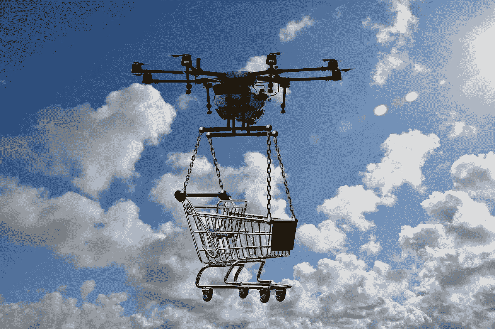
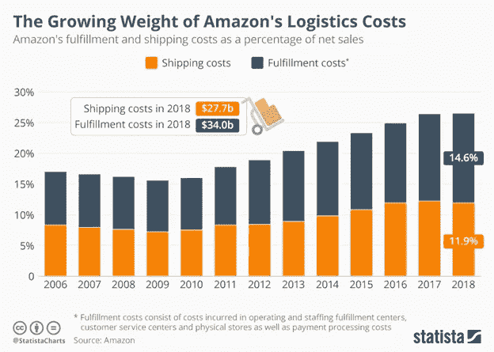
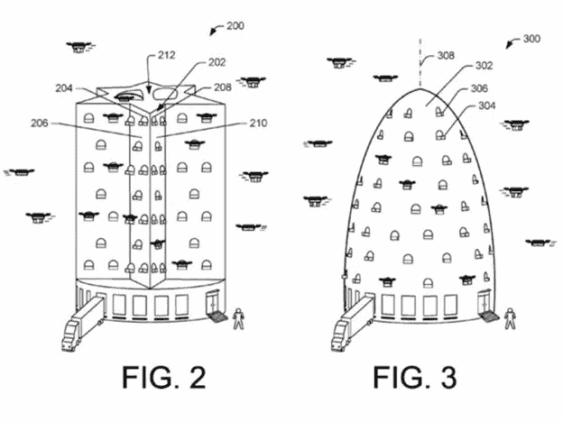

# Amazon.com 空军即将抵达你附近的一个城镇

> 原文：<https://medium.datadriveninvestor.com/the-amazon-com-air-force-is-coming-to-a-town-near-you-e088ee0a68a?source=collection_archive---------4----------------------->

Image credit: Pixabay.com

一段时间以来，亚马逊一直是电子商务世界的典范，它继续进入新的市场，并逐渐主导其中的许多市场。这一切都是从卖书开始的(还记得吗？)，现在它已经过渡到几乎任何可以轻松运输的东西。亚马逊还进军销售 Prime 会员订阅、出版、音乐、视频、在线支付、云存储和其他前沿业务。

虽然这些较新的领域最终可能会超过其主要的在线零售店，但目前来看，电子商务仍是主要支柱。但亚马逊面临的挑战是，尽管几乎一直在关注削减成本和使用自动化，但运送所售商品的成本正在上升，正如 Statista 的图表所示。

Image credit: Statista

这有许多原因，但其中一个原因是其 Prime 会员计划越来越受欢迎，据消费者情报研究伙伴(CIRP)估计，该计划在美国拥有 1.03 亿会员。CIRP 估计，这些 Prime 会员平均每年在亚马逊消费约 1400 美元，而非 Prime 亚马逊购物者平均每年消费约 600 美元。这需要处理和运输大量的包裹，其中许多需要一天或两天的运输时间，因此增加了运输和物流支出。

这让我们想到了将所有这些必需品从仓库运送到你家门口的相关费用。2017 年，亚马逊在运费上花费了 217 亿美元，其中包括处理和分拣、配送中心费用以及空中/地面运输成本。这一金额几乎是 2015 年 115 亿美元运费的两倍。亚马逊及其主要竞争对手已经加大力度减少网上购物者的运输时间，这迫使在线零售商在使用美国邮政、联邦快递、UPS 等之外扩大其航空货运的使用。

亚马逊一直对其大规模扩张的地区仓库感到非常自豪，他们增加了机器人和自动化的使用，以减少处理订单所需的人数和时间。但是，这些仓库需要不断地重新供应新鲜货物，以便运送给消费者。这就是专属货运航空公司能力的用武之地，它降低了第三方的运输成本。

亚马逊一直在建立本地送货的外包实体，开发无人机送货服务，并扩大其专属货运航空公司。这一发展将影响今天的整个货运和包裹递送系统，因为亚马逊是美国最大的电子商务商店。

**亚马逊航空的诞生**

2015 年，亚马逊航空公司(Amazon Air)成立，最初被命名为亚马逊 Prime Air(稍后会有更多关于这一点的变化)，是亚马逊在俄亥俄州辛辛那提附近肯塔基州希伯伦市的专属货运服务的货运航空公司品牌名称。亚马逊使用自有品牌的飞机运营这项送货服务，这些飞机由国际航空运输公司、ABX 航空公司、阿特拉斯航空公司和南方航空公司运营，主要枢纽是辛辛那提/北肯塔基国际机场(CVG)。作为一个很酷的旁注，最初使用的代号是项目史密斯飞船(没有字为什么不使用齐柏林飞船)。

简单来说，亚马逊购买了国际航空运输公司约 20%的股票，并于 2016 年 3 月开始用 20 架波音 767 飞机进行定期运营。第二年，亚马逊在 CVG 购买了一个 920 英亩的设施，并开始建设一个 300 万平方英尺的分拣设施，可停放 100 多架货机。最近，亚马逊宣布，它正在将这个设施扩展为一个价值 15 亿美元的航空货运枢纽，位于它正在全国建设的其他枢纽之上。

随着美国点对点运输路线的增加，它已经稳步增加了更多的飞机，并且在下一年将增加更多的租赁飞机。

2017 年，这家企业更名为亚马逊航空(Amazon Air)，新的无人机送货服务保留了亚马逊 Prime Air 的名称。

**基于无人驾驶飞机的投送力量飞向天空**

这一想法的概念于 2013 年底宣布，并于 2016 年正式确定。它仍在开发中，在美国以外的地方进行试验。

亚马逊首席执行官杰夫·贝索斯在 2013 年 12 月提出计划，小型无人机将用于在顾客下单后 30 分钟内将包裹送到顾客手中(但有一些警告:包裹必须有 5 磅重)。或者更小，适合一定的尺寸，并且在具有无人机功能的亚马逊订单履行中心的 10 英里半径内)。由于多种原因，这种情况还没有发生。但亚马逊正在前进，并决心让这成为现实。

在人口稠密地区安全操作无人机的核心概念比看起来要复杂得多。亚马逊正在开发自己的亚马逊空中交通管理系统。出于安全原因，它计划在海拔 400 英尺以下操作这些无人机，并且需要遵守美国的严格规则。公众仍然非常关注遥控无人机飞越他们的安全性，这是有充分理由的。

根据联邦航空局的指导方针，无人机将在低空飞行(低于 400 英尺)。请记住，与自动驾驶汽车和卡车不同，没有固定的道路或物体可供传感器识别以用于导航，因此 GPS 和无线通信是控制送货无人机的唯一手段(也就是说，直到未来设计出更好的自动驾驶系统，无人机可以自行导航到预定的目的地)。但所有这一切都只是发展道路上的一个小插曲。

**其他领先于亚马逊**

其他公司比亚马逊走得更远，比如 Zipline，它正在卢旺达和加纳使用无人机分发血液和疫苗。这家总部位于加州的公司在全球各地经营配送中心，拥有当地的运营团队，旨在“将药品送到最需要的人手中”。该公司有一个应用程序(你还期望什么？)医生用来按需订购任何需要的药物。送货无人机在 Zipline 的配送中心装载订购的产品，并迅速飞往任何目的地，从固定翼无人机上空降订单(除了配送中心，它不会降落在任何地方)。送货时间不超过 30 分钟，Zipline 声称在任何天气条件下，每个配送中心每天都能支持数百次送货。对于需要医疗保健的欠发达地区的人们来说，这是一个巨大的进步，并为亚马逊和其他无人机送货服务提供了城市地区以外某些类型的送货蓝图。

另一个著名的竞争对手是澳大利亚的 Swoop Aero 公司，它也在飞行。他们还专注于欠发达地区的医疗服务提供市场，如瓦努阿图，在那里建立了三个配送中心，在 9 个不同岛屿的 33 个村庄提供按需医疗服务。这些无人机降落在现场，所以采取不同于 Zipline 的交付方式。

还有许多其他这样的公司已经在测试或飞行送货无人机，这里是已经宣布自己的其他公司的一个非常简短的样本:

空中援助

阿里巴巴/上海 YTO 快递

调情

Flytrex

FPS 分布

医疗综合救援行动(HiRO)

JD.com(中国)

Matternet(由总部位于瑞士的波音公司支持，并与 UPS 和其他公司合作)

Wing(谷歌母公司 Alphabet 的一部分)

翼直升机

**亚马逊玩追赶**

可以说，这是亚马逊的典型情况，因为它是在别人创造市场并找到更好地管理和处理这些利基业务的方法后进入市场的。在美国，现行法规要求无人机飞行高度不得高于 400 英尺。，速度限制在不超过 100，并且必须保持在飞行员的视线范围内。随着无人机飞行管理系统的发展，这种情况将会改变，并可以证明操作的安全性。

此前，亚马逊曾表示，它最终打算在 200 至 500 英尺之间运行。亚马逊表示，它计划飞行重达 55 磅的无人机。在其仓库半径 10 英里的范围内，以每小时 50 英里的速度运送重达 5 磅的包裹。(暂时的)。

2017 年，亚马逊申请了“无人机多级履行中心”专利，该中心类似于蜂巢状的建筑，以支持其无人机舰队(参见蜂巢图)。许多这样的中心将被安置在世界各地的大都市中心。

Credit: Amazon/U.S. Patent Office (two of the various designs submitted)

亚马逊的专利定义了这些建筑如何包含用于无人机着陆和起飞的多层平台。安全机制，如网或泡沫将允许故障无人机也将被设计。

亚马逊在其仓库中已经有了相当智能的机器人和库存管理系统，可以适应支持这些多层结构(而不是单层仓库)。专利中提到的一个更令人兴奋的设计想法是将无人机定位在更高的位置以便起飞，不仅节省了宝贵的电力，还将无人机旋翼对附近居民的一些噪音降至最低。

这些无人机蜂箱需要连接到亚马逊目前在主要城市以外运营的“小村庄规模”仓库中心，可能在无人机的覆盖范围之外(目前)。这意味着，那些即将来到你附近道路上的自动驾驶卡车可能是供应蜂箱中心的运输车辆，更多的机器人和少数人类统治者可能会管理这些。

**终于……**

显然，这种方法在技术上、政治上和财政上都有很多问题需要解决。在严重拥堵的城市中心，无人机蜂箱嗡嗡作响会遇到很多阻力，自动驾驶汽车送货也很可能遇到阻力。但是我们需要从某个地方开始，无人机入侵将会继续。

亚马逊将需要进一步的工作，以更好地将其货运飞机与区域仓库中心整合，然后整合到蜂巢无人机中心。如果它最终成功做到这一点，它可能会接管美国邮政服务，并真正与联邦快递，UPS 和其他此类公司在更大的规模上竞争 B2B 市场。

就在十年前，其中的一些可能看起来像科幻小说，但是，现在，通过将现有的航空平台与更新的平台相结合，它几乎成为现实。