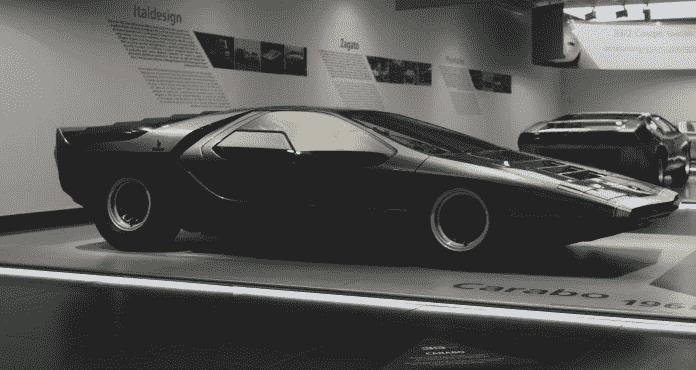
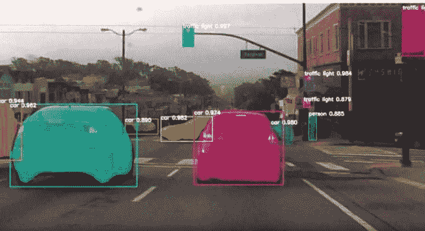
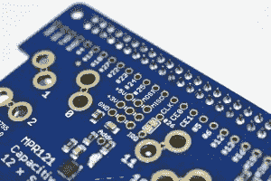
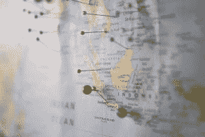
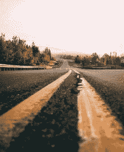
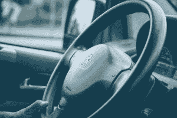

# 自动驾驶汽车的剖析

> 原文：<https://medium.datadriveninvestor.com/the-anatomy-of-self-driving-cars-data-driven-investor-9b415f4b5408?source=collection_archive---------7----------------------->

现代汽车已经存在了一个多世纪，是我们日常生活的基础。尽管汽车已经存在了很长时间，但在使用汽车之前，我们总是必须精通一项至关重要的技能:驾驶。不再是了。汽车行业即将发生巨大的变化，它被命名为自动驾驶汽车。

现在你一定想知道，这些自动驾驶汽车是如何工作的？先是电脑学会了下棋，现在会开车了？？？嗯，自动驾驶汽车使用五个关键组件运行:计算机视觉、传感器融合、定位、路径规划和控制。

 [## 在自动驾驶汽车发生事故的情况下，谁应该承担法律责任？数据驱动的投资者

### 我仍然认为自动驾驶汽车是一种奢侈品，而不是必需品…

www.datadriveninvestor.com](https://www.datadriveninvestor.com/2018/11/02/who-is-legally-accountable-in-the-case-of-an-autonomous-vehicle-accident/) 

# 计算机视觉:视觉提供者

计算机视觉是人工智能的一个分支，它允许计算机观察周围的世界。意识到周围的环境对驾驶至关重要，因此计算机视觉是自动驾驶汽车的主要组成部分之一。

摄像头用于接收汽车周围的图像，这些图像使用卷积神经网络(处理和分类图像的神经网络)分类为车道、车辆和其他项目。颜色、方框和线条用于区分项目，如下所示:

*N.A, N.A. Object detection algorithm result.* [*www.cbinsights.com,*](http://www.cbinsights.com,) *N.A, CB Information Services, Inc, October 31, 2018,* [*https://www.cbinsights.com/research/startups-drive-auto-industry-disruption/*](https://www.cbinsights.com/research/startups-drive-auto-industry-disruption/)*.*

很酷，对吧？然而，光靠视觉不足以让自动驾驶汽车正常运行…

# 传感器融合:结合传感器

传感器融合是指来自其他传感器的数据与来自摄像机的数据相结合。整合不同类型的数据使汽车能够更好地了解其环境，类似于人类使用所有感官来更好地感知周围环境的方式。

自动驾驶汽车上通常有五种类型的传感器:超声波传感器、雷达、摄像头、激光雷达和全球导航卫星系统。超声波传感器、雷达和激光雷达都用于测量到物体的距离。这些传感器之间的区别在于，雷达通常测量到金属物体的距离，而激光雷达测量汽车之间的距离，并为车辆提供 360°能见度。GNSS 传感器是将所有数据收集在一起并允许汽车处理其周围环境的传感器。

现在，转到下一个组件…

# 本地化:确定位置

定位是汽车如何识别它在世界上的位置。这是通过使用来自 GPS、地标位置和来自传感器融合阶段的数据的算法来完成的。有一个从 GPS 数据中提取的初始估计，然后汽车的运动、地标位置和其他数据片段的组合有助于创建位置的最终预测。误差范围可以小到 1 到 2 厘米。

我知道你在想什么。所有这些都很棒，但在恶劣天气下还能工作吗？答案是肯定的！在恶劣天气下，可以使用定位探地雷达(LGPR)来定位汽车。

定位后，你的当前位置是已知的，所以你现在要做的就是到达你的目的地！

# 路径规划:绘制轨迹图

路径规划是不言自明的。它是根据传感器提供的信息绘制汽车到达目的地的路径的组件。利用来自所有传感器的数据，汽车可以预测它是否需要减速、加速、变道或完全停车。

在路径规划阶段完成的另一项任务是预测附近车辆的运动以避免碰撞。在预测了运动之后，汽车决定采取哪种动作是安全的。

最后，最激动人心的部分…

# 控制:消除对人工协助的需求

控制是使车辆能够执行路径规划阶段创建的路线的组件。它处理人类正常驾驶的所有部分，如转动方向盘或踩刹车。

这就是自动驾驶汽车比传统汽车有优势的地方:它们比人类司机驾驶的汽车精确得多。这种额外的精确度可以让自动驾驶汽车比经典汽车更安全。大多数车祸都是由人为错误造成的，所以如果自动驾驶汽车将人类排除在外，事故就会少很多。

# 关键要点

*   自主车辆的五个基本组成部分是计算机视觉、传感器融合、定位、路径规划和控制
*   计算机视觉由摄像头驱动，允许计算机看到
*   传感器融合是将来自其他传感器的数据与来自摄像机的数据相结合
*   传感器融合通常提供测量数据(例如汽车之间的距离)
*   定位使汽车能够识别它在世界上的位置
*   路径规划允许汽车规划一条通向期望目的地的轨迹
*   控制处理人类通常会做的任务(例如，转动方向盘)并执行在路径规划阶段制定的路径

随着自动驾驶汽车的到来，21 世纪的交通运输正在获得急需的补充。这些汽车将使道路比现在安全得多。在下面留下评论让我知道你对自动驾驶汽车的看法！你认为它们是一种改进，会让我们的日常生活变得更容易，还是你仍然更喜欢老爷车？

*原载于 2019 年 11 月 14 日*[*【https://www.datadriveninvestor.com】*](https://www.datadriveninvestor.com/2019/11/14/the-anatomy-of-self-driving-cars/)*。*