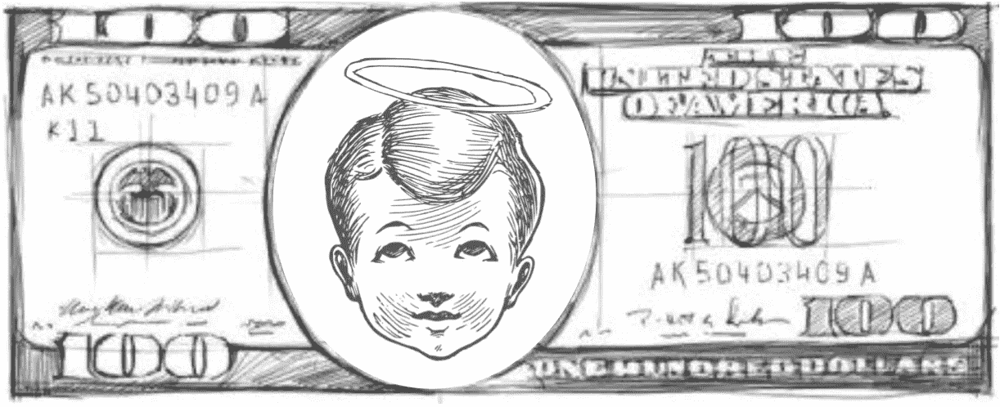

# 天使表演剧本

> 原文：<https://medium.datadriveninvestor.com/the-angel-performance-playbook-eb36464901da?source=collection_archive---------2----------------------->

## **如何掌握天使投资？**

## **天使死了，天使万岁！**

> “天使投资赚钱的关键是说**不**。你会见 100 家公司，对其中 99 家说不。”
> 
> —凯文·罗斯—

## **普通的乔·天使投资人**

谈到风险投资业绩和回报倍数的准确信息，有许多来源，如 [Pitchbook](https://pitchbook.com) 、 [Crunchbase](https://www.crunchbase.com) 、 [CB Insights](https://www.cbinsights.com) 以及其他许多来源。不幸的是，几乎没有关于天使表现的可靠和最新的数据。

尽管如此，还是有一些调查和报告显示了天使投资者的经济表现，特别是由于越来越多的天使基金和辛迪加。在我为这篇文章所做研究中，我收集了 10 个关于天使的事实。

*一、天使平均投资持有期为 4.5 年。*

*二。更大的胜利(退出> 10x)需要超过十年才能实现。*

*三。失败率(exits < 1x)通常在 60%左右。*

*四。整体内部收益率(*[*IRR*](https://www.investopedia.com/terms/i/irr.asp)*)约为 27%。*

*五、* [*套现*](https://www.investopedia.com/terms/c/cashoncashreturn.asp) *倍数站在 2.5 倍，成熟的投资组合表现更好。*

*六。一个普通天使有 11.4 个，资深天使有 14.2 个投资组合公司。*

*七。天使投资者的入场券中值为 2.5 万美元，风险敞口中值为 3.7 万美元。*

*八世。平均 33%的天使投资人在他们的投资组合中做***的后续投资。**

**九。55%的天使投资人以前是初创公司的创始人或首席执行官。**

**十、创业天使写的支票更大，业绩更好。**

*基于以上事实，假设你有足够的资金和足够的毅力，天使投资在潜在 IRR 和回报倍数方面看起来超级有吸引力，非常有吸引力。尤其是如果你把天使投资比作另类资产。*

*尽管如此，喷洒和祈祷不会奏效，你不能简单地撒钱并希望事情会好转，对成功的公司进行有限的后续投资。从长远来看，要取得成功需要很多努力和经验。*

## ***天使投资人经济学***

*为了理解天使投资背后的经济学和理性，解释天使投资组合的财务要求是有意义的。*

* [## 风险投资家在给创业公司播种时会考虑什么标准？数据驱动的投资者

### 2017 年，风险投资资金攀升至十年来的最高水平。你的创业公司目前吸引风险投资的机会是…

www.datadriveninvestor.com](https://www.datadriveninvestor.com/2018/04/20/what-criteria-do-venture-capitalists-consider-when-seeding-a-startup/) 

让我们假设一个天使投资了同样数量的 20000 美元在一个平衡的和精心构建的正好 10 家公司的投资组合中。此外，天使执行深刻的[尽职调查](https://www.investopedia.com/terms/d/duediligence.asp)，并有很强的动手能力，这导致了 50%的较低失败率。他不跟进或[双倍下注](https://www.fool.com/investing/2019/06/03/heres-why-investors-should-double-down-on-their-wi.aspx)，只是为了保持简单和直接。

他是如何实现 27%的内部收益率和 2.5 倍的回报率的？

*I . 10 家投资组合公司中有 5 家将返回 0 美元，它们是完全亏损的。尽管如此，天使仍然能够通过抵消任何资本收益(税务注销)收回一些钱——在这个例子中是 2 万美元。*

*二。10 家投资组合公司中有 3 家将获得平均 3 倍的投资回报，总回报为 18 万美元。*

*三。10 家投资组合公司中有 1 家将获得 5 倍的回报，公平地说，这是一个相当不错的退出。仍然不足以让你停止工作，搬到巴哈马——这家投资组合公司回报 10 万美元。*

*四。10 家投资组合公司中有 1 家将是全垒打，天使们实际上依赖的那家，巨大的 10 倍回报——导致 20 万美元的回报。*

*v .所有 10 家投资组合公司的综合回报将使天使投资者获得其 20 万美元原始投资的 2.5 倍回报倍数，总计 50 万美元。*

的确，这听起来太容易了，难以置信。示例性的 IRR 计算仅在您在 5 至 6 年的时间框架内获得流动性时有效，这将是一种[提前退出的情形](https://thebusinessprofessor.com/knowledge-base/early-exit/)在任何情况下，额外的时间将慢慢吞噬您的 IRR。更重要的是，你高度依赖至少一个[异常值](https://medium.com/ulu-ventures/successful-vcs-need-at-least-one-outlier-to-have-a-well-performing-fund-c122c799dfb3)，在相当短的时间内带来 10 倍的回报。

## **我的天使投资人真人**

到目前为止，我已经在风险投资领域工作了 7 年多，我已经投资了世界各地不同阶段、不同行业和不同垂直领域的早期创业公司。不过，我自己也花了一些时间开始天使投资。

2016 年 11 月，我做了第一笔商业天使投资。从那以后，我投资了 6 位数美元，投资了 2 只基金和 10 家不同垂直行业的公司(例如 FinTech、PropTech、SpaceTech、eHeath)。这是我的投资组合表现一览:

*一、整体投资期 3 年，平均持有期 1.2 年，(如我 2019 年做了 5 笔新投资)。*

*二。我的投资组合中有 58% (7 家)的公司至少获得了一笔外部后续投资。其中，我认购 25% (3)。*

*三。12 项投资中有 11 项仍在运作，一项完全注销，另一项面临风险。3 投资将在未来 6 个月内升值。*

*四。我的投资组合投资回报率为 3.1 倍(1.8 倍现金对现金，1.3 倍现金对股票)。*

五、内部收益率为 81%(现金对现金内部收益率为 27%)。

与“普通的乔·天使投资人”相比，我想我做得很好了。我有更高的投资回报率，更高的内部回报率，极低的失败率(这主要是因为年份)，还有一次提前出局(> 15 倍)。我是单纯的幸运，还是遵循了某种投资策略或假设？

嗯，我来自这个行业，在交易流程、风险投资网络、尽职调查(经验和工具)，当然还有我多年来采用的法律和财务思维方面，我肯定有不公平的优势。

## **天使投资人战术手册**

天使投资是一种不对称的赌注，你可能会输掉所有的钱，但你也可能会获得数倍的回报。最好的天使投资或早期投资能提供令人难以置信的倍数。给你一个突出的例子，[彼得·泰尔从他在脸书](https://www.investopedia.com/articles/insights/082216/how-did-peter-thiel-get-rich-pypl-fb.asp)的 50 万美元早期赌注中获得了 2.200 倍的回报，大约 11 亿美元。

当然，这种情况不会经常发生，尽管在一个 [**幂律**](https://www.forbes.com/sites/ralphbenko/2014/10/13/peter-thiel-we-dont-live-in-a-normal-world-we-live-under-a-power-law/#202c93217a7d) 的世界里，唯一真正重要的事情是你的投资组合中出现一个本垒打投资。你只需要有勇气下大注，对赢家下双倍赌注。

因此，事实上，你必须是幸运的(显然！)，如果你有良好的声誉和企业家精神，这的确会有所帮助，不仅会带来金钱。除了投资之外，一个庞大的风险投资网络和一个强有力的实践方法肯定会提高你交易流程的质量，从而提高你的投资组合中出现全垒打的可能性。

此外，一个平衡且多样化的投资组合会减轻部分风险。例如，我投资了两只基金，因为完全冲销的可能性相当低(好处也是如此)，除了我的直接投资，这是二元的。谈到阶段(从种子期前到首轮融资)和地区(美国、拉丁美洲和欧洲)，我也非常多元化。

**投资组合规模很重要**，这里有一个实际的最佳点。研究表明，在 5 年或更长时间内，拥有 12 至 14 项投资的天使有 75%的机会获得 2.6 倍的投资回报。另一方面，彼得·泰尔建议投资者应该只投资 7 或 8 家有潜力获得 10 倍或更多回报的有前途的公司，遵循幂律启动策略。

最后但同样重要的是，作为天使投资人，你肯定会面临两个主要问题，即**假阳性问题**(你投资并注销的公司)和**假阴性问题**(你错过的赢家，因为你通过了交易)。 [Bessemer Ventures](https://www.bvp.com) 实际上表彰了他们的“[反投资组合](https://www.bvp.com/anti-portfolio)”公司，如苹果、AirBnB、易贝、脸书、Paypal、特斯拉、谷歌——这是一个相当稳固的名人堂，记录了他们没有做过的交易。因此，错过一些大赌注是可以的，只要你没有错过所有的赌注！请记住:

> “从错误中吸取教训是件好事。不如从别人的错误中吸取教训。”
> 
> —沃伦·巴菲特—* 

*有什么想法或问题吗？伸出手来！想要阅读更多？*

*[现代企业家欺诈](https://blog.usejournal.com/modern-entrepreneurial-fraud-c05f2c86a068)*

*[薛定谔的估值问题](https://blog.usejournal.com/schr%C3%B6dingers-valuation-problem-ec5bdbda63a0)*

*[最大化资金分配](https://medium.com/@VC_Truman_Show/maximizing-fund-distributions-4d4d31fea133)*

*[封顶表疯狂](https://medium.com/@VC_Truman_Show/cap-table-madness-62a9750e35f)*

*[*风险投资基金*](https://medium.com/@VC_Truman_Show/venture-capital-fund-amentals-f048c8675d77)*

*[*权益、债务以及介于两者之间的灰色地带*](https://medium.com/@VC_Truman_Show/equity-debt-and-the-grey-zone-in-between-92e65bfde596)*

*[*KPI<kēpərˈfôrməns ˈindiˌkātər>猎人*](https://medium.com/@VC_Truman_Show/kpi-k%C4%93-p%C9%99r%CB%88f%C3%B4rm%C9%99ns-%CB%88indi%CB%8Ck%C4%81t%C9%99r-hunter-b625370126e7)*

# *关于[我自己](https://www.linkedin.com/in/marc-penkala-89697940/)*

**我是一个充满激情、亲力亲为的风险投资家(+7y)、企业家(+7y)、导师和天使投资人。经过 7 年飞行超过 1，000，000 英里，在飞机上花费 1.200 小时，在各大洲查看 1，000 个初创球场，我决定在* [*山地伙伴*](http://mountain.partners/en/) *基于这一极其有益的职业旅程收集一些我的想法。伸出手来！**