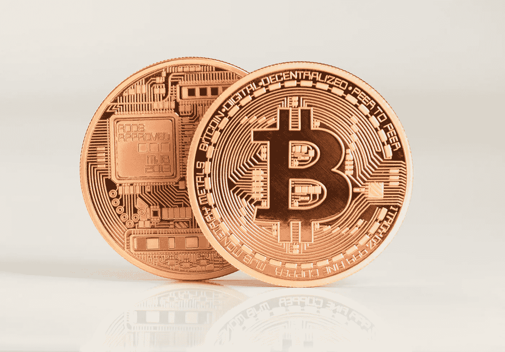
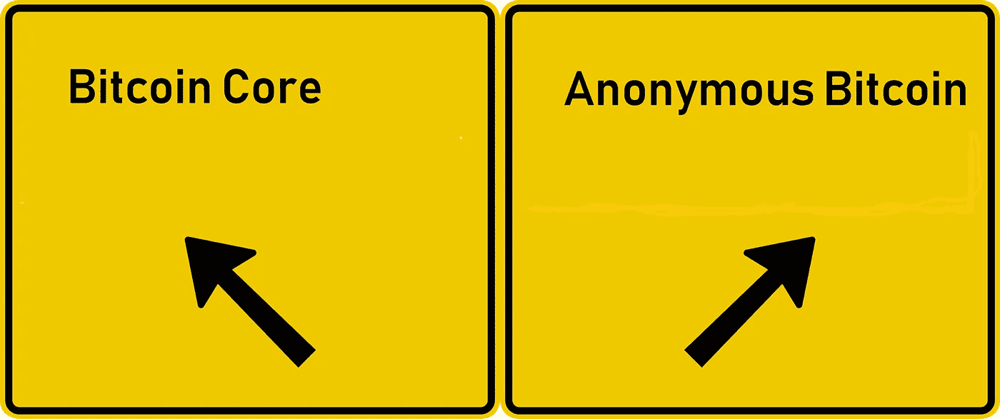

# 匿名比特币硬分叉

> 原文：<https://medium.datadriveninvestor.com/the-anonymous-bitcoin-hard-fork-dda0af9f272d?source=collection_archive---------2----------------------->

**在区块链工业的庞大词汇表中，有一个词被广泛使用，但却不为普通爱好者所知——“硬叉子”**

不要烦恼！

听起来像是一个非常专业的术语，实际上是一个非常简单的概念，与硬币的基本区块链有关。

一个硬叉更多的是一个 ***发育动作*** 。

为了充分理解这个概念——并欣赏“硬分叉”的行为，想象一个开发团队远程工作在一个特定的硬币上，比如说 XCoin。

该团队承诺军用级别的安全性、即时交易和多重交换支持。

然而，在某个地方，团队在各个方面都令人失望地失败了，最终创建了一个需要 5 分钟才能传输的产品，不像承诺的那样安全，不支持超过 2 个密码交换。

**一个典型的承诺过多、交付不足的案例！**

一个晴朗的日子，一个不相关的开发团队——或者上述硬币的一些幻想破灭的成员——决定修复缺陷，并创造一个真正实现承诺的硬币(**在同一个区块链**)。

因为区块链的基本概念是去中心化的开源软件，几乎任何有经验的开发团队都可以一起创造更好的产品——不需要之前开发人员的任何许可或同意！

更重要的是，在 ETH 的 DAO 遭到黑客攻击后，以太坊社区几乎一致投票支持硬分叉，以回滚由一名匿名黑客窃取了价值数千万美元的数字货币的交易。硬分支还允许 DAO 令牌持有者将他们的以太资金返还给他们。

然后，XCoin 被“硬分叉”，生出了上级——姑且称之为——**匿名 XCoin。**

**下面是硬分叉是如何发生的—**

用技术术语来说，硬分叉是“对协议的彻底改变，使以前无效的块/事务有效(反之亦然)。”

换句话说，硬分叉是与区块链早期版本的永久分歧，最新版本将不再接受运行早期版本的节点。

因此——XCoin 区块链的所有运行节点都需要更新或迁移到匿名 xco in 的区块链。由于基本面强劲，矿商没有理由不支持升级版硬币。

本质上，在 XCoin 区块链中创建了一个 ***分支*** :一条路径跟随先前的节点、事务和区块链，另一条路径带有一个新的、改进的区块链。

为了让事情更清楚，让我们来看一个硬分叉的真实例子，一个处理所有方面改进的例子。

2018 年 4 月 29 日，来自佛罗里达州的一个开发团队公布了 Zclassic 和比特币的硬分叉——创造出 [**匿名比特币**](http://www.anonymousbitcoin.io) **。**

根据公告，hard fork 迅速将比特币的交易能力与 Zclassic 的安全功能相结合。

[匿名比特币](http://www.anonymousbitcoin.io)的开发团队说得很清楚——纠正在 BTC 和 ZCL 发现的关键安全风险，并增加新的、改进的功能。

**简而言之——创造更好、更值得信赖、以消费者为中心的加密货币。**

为了使这成为可能，匿名比特币团队将通过使没有升级到新版本协议软件的节点确认的交易无效，来分割 ZCL 和 BTC 区块链的路径。

与以太坊 DAO 不同，这个硬分叉不会解开网络的交易历史。

**[**匿名比特币**](http://www.anonymousbitcoin.io) **的一些特性包括——****

****真正的去中心化** —匿名比特币使用 equihash，一种工作证明算法。**

****真实匿名—** 使用麻省理工学院测试过的 zkSNARK，这是迄今为止最安全的隐私协议。**

****社区驱动—** 社交渠道允许社区提出的想法被考虑在内。**

****Masternodes —** 我们提供押注硬币的能力，激励长期持有者，并允许长期股息式回报。**

****透明性—** 虽然你的消费习惯应该保密，但分叉过程不应该保密。该团队将提供视频更新和定期问答会议，我们准备向世界展示什么是合法的分叉。**

****交易所支持—** 通过我们精心打造的网络，匿名比特币正在与交易量最大的交易所进行谈判。**

**在我的下一篇文章中，我将更详细、更深入地探索比特币，剖析网站、团队成员和比特币技术——以便更有效地研究并为所有加密货币爱好者提供技术建议，关于夏季最期待的**比特币分叉。****

***鼓掌 1 次或 50 次。它帮助我获得曝光率。谢谢大家！***