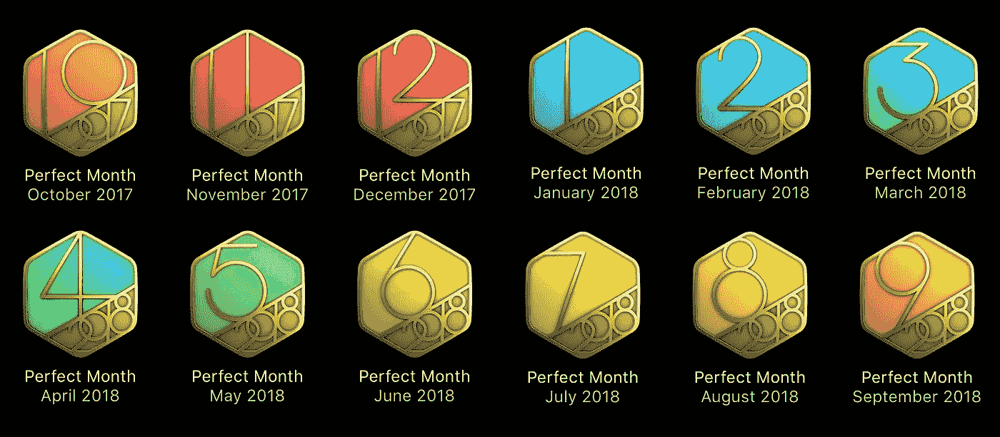
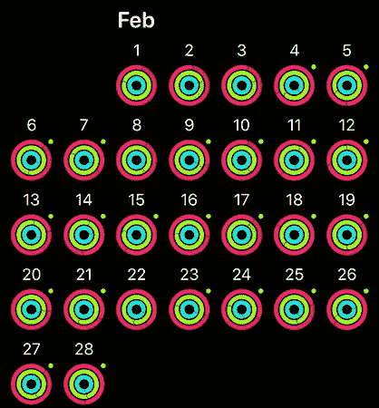

# 苹果手表改变了我的生活——一位 500 天连续运动成就者的评论

> 原文：<https://medium.datadriveninvestor.com/the-apple-watch-changed-my-life-a-review-by-someone-who-just-achieved-a-500-day-move-streak-c0fc24838a1?source=collection_archive---------10----------------------->

我总是努力保持锻炼制度。在我快三十岁的时候，我开始了我的第一个真正的锻炼计划，Beachbody 的 P90X。当时，P90X 对我来说是一个游戏规则的改变者。我从来没有超重过，但我确实有几磅可以减肥。这很累人，但我设法完成了整个 90 天每天一小时的计划，没有跳过很多训练。当时，我处于一生中最健康的状态。

我的成功故事没有持续很久。

随着 P90X 的完成，我不再有常规可循，我开始失去动力。我的动力逐渐下降，以至于我发现自己一周只去一两次健身房。不到一年，我又胖了。我尝试了几种不同的程序，当我看着我的度量来回摆动时，最终失去了希望。出于绝望，我几次试图重做整个 P90X 程序，但我没有第一次那么多空闲时间，最终放弃了。我从未能够复制我最初的结果。

## 进入苹果手表

当最初版本问世时，我买了 Apple Watch，唯一的目的是将其用作健身追踪器。当然，当时有很多其他的，也可以说是更好的追踪器，但我对苹果的生态系统如此投入，以至于我决定购买他们的智能手表。我会每隔一天左右关闭我的戒指，我也取得了一些成就。尽管如此，我的锻炼进度仍然停滞不前。

2017 年 1 月，我决定是时候改变了。在这一点上，我是我有史以来最重的——不是超重，但我有足够的额外重量让我在海滩上感到不舒服。苹果发布了这些特殊的“完美月”成就，我决定 2017 年的目标是获得其中一个徽章。我决定把 2 月作为我的目标，因为我已经错过了我的新年，2 月也是较短的一个月——这在精神上帮助了我。

我把我的运动目标设定为 500 卡路里。最初的几天是最难熬的。我记得我在想度过一周是多么开心，我应该如何奖励自己休息一天，但我坚持了下来。我完成了二月，得到了我的徽章。然后意想不到的事情发生了。我完成了三月..还有 April..然后可能。我停不下来。每天保持 500 卡路里很难，但我坚持了下来。我已经沉迷于关闭那些三色环。

这种新的痴迷对我来说创造了奇迹。尽管我老了 10 岁，但比起 20 多岁完成 P90X 后，我的身材要好得多。我的失眠症消失了。我精力充沛。我感觉身体和精神都很棒。我也开心多了。我还发现，由于我的新锻炼制度，我吃得好多了。

我最初的连胜总共持续了大约 3 个月。我对结果很满意，从来没想过会超过这个记录。一年半后，我现在有了 500 天的运动、锻炼和站立记录。

## 不仅仅是锻炼

虽然我买苹果手表主要是为了锻炼，但我的日常习惯也发生了变化。在手表出现之前，我习惯一直看手机。下面的话是不是听起来很耳熟？

> “哦，我收到了新的通知，让我检查一下我的手机。现在它已经解锁了，让我看看 Reddit、脸书、Instagram 和 Reddit 上的新内容。”

看着那熟悉的场景消失了。突然，我的手机不在我手中。它在我的口袋里，或者我的包里，甚至完全够不着。现在，当我收到通知时，我会看一眼手表，只有当我认为它值得回应时，我才会拿出手机。我感到解放了，尽管事实上我比以往任何时候都更有联系。这次的不同之处在于，我可以控制一个通知是否值得。如今，我每天在手机上的屏幕时间不到一小时。

Apple watch 不仅让我成为了一个更健康的人，还让我戒掉了手机瘾。

## 一些不健康的缺点

虽然我的健康和福祉的整体改善已经超过了门票的价格，但 Apple Watch 作为一个健身追踪器也不是没有一些非常基本的缺陷。

你一天也不能错过。这个最让我讨厌。我真的不明白为什么苹果不允许休息日。休息日是健康锻炼制度的重要组成部分。如果你能指示手表，比如说星期三和星期天是我的休息日，那就太好了。在那些日子里，手表可以去掉锻炼环(或者减少到 15 分钟)，自动降低你的运动目标。

**你病了？太糟糕了**就像没有逃课日一样，如果你想保持连胜，你也不能生病。我在比赛期间确实生病了，我不得不强迫自己做一些伸展运动，下床，这样我就不会错过我的目标。这不是我做过的最健康的决定。

**站立的目标毫无价值**虽然我完全同意人们应该至少每小时起来活动一次，但实施起来相当糟糕。例如，我有时在工作中使用立式办公桌。即使我会一次站一个多小时，有时我还是会达不到我的目标。站立目标实际上是“走动或挥动手臂大约 30 秒”的目标。

怀孕的妈妈们没有什么可做的我妻子在今年 1 月 1 日开始了自己的连胜纪录。她在三月份怀孕了，并且在我们的女儿 11 月底出生之前一直保持着这种状态。有针对孕妇的第三方应用程序，但如果能看到苹果通过一些产前和产后练习以某种方式承认它们，那就太好了。

**显然，睡眠不是健康生活方式的一部分**这款手表将有助于确保你不时地站立、移动、锻炼和呼吸，但它真的不在乎你是否睡觉。有像 Pillow 这样的应用程序可以提供帮助，但是它们太不准确了。苹果现在确实有 [Beddit](https://www.apple.com/shop/product/MUFM2LL/A/beddit-sleep-monitor?referrer=https://www.google.com/) ，所以我怀疑未来会有某种更好的整合。

## 那么下一步是什么？

1 月 1 日我要结束裸奔了。我将在 2018 年结束我完美的一年，但一旦结束，手表就掉了。从精神上来说，保持连续 500 天的记录要求太高了。我生活中没有额外的压力也可以。我现在在一个好地方。锻炼现在是一个根深蒂固的习惯，我根本不可能在短时间内改掉它。