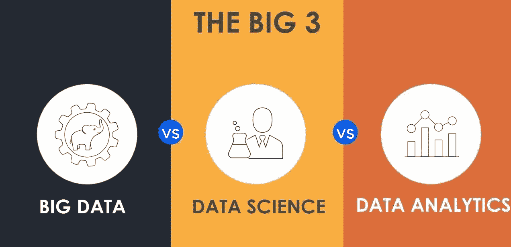

# 大数据集成的应用与问题

> 原文：<https://medium.datadriveninvestor.com/the-application-and-problems-of-big-data-integration-974e33477038?source=collection_archive---------17----------------------->

我们来看看**大数据**这样一个现象。简而言之，它是基于人类互动和行为的大量信息的组合，使用可以影响营销和商业决策的特定安排和趋势。这也是一个可以带来大量技术创新的概念。

严格地说，通过传统技术收集和评估数据是相当困难的。这就是为什么**数据科学**以其质量洞察力脱颖而出。这是一个收集、处理和分析数据的活动领域。在这种情况下，我们同时处理结构化和非结构化数据。这是统计学、数学、编程和问题解决过程以及前沿方法的混合。换句话说，数据科学的使用为研究人员提供了更广泛的结果。

**数据分析**是一门检查数据和原始见解的科学，通过确定大数据应用的最佳方式进行分组。数据分析的目标是识别数据算法和因果链，例如，用户行为或业务的最新趋势。这带来了更全面地做出理性决策和进行计算分析的机会。然而，这需要定义一种方法来跟踪每一个事务，即使是很小的事务，并且将它转换成清晰而有意义的数据类型。

 [## 为什么数据将改变投资管理|数据驱动的投资者

### 有人称之为“新石油”虽然它与黑金没有什么相似之处，但它的不断商品化…

www.datadriveninvestor.com](https://www.datadriveninvestor.com/2019/01/25/why-data-will-transform-investment-management/) 

# 大数据、数据科学和数据分析的应用

## 大数据

*   金融系统。每个以某种方式熟悉金融周转的人都对大数据感兴趣。所有这些活动领域都与一个问题相关联—多结构信息的数量，这些信息也存储在多格式系统中。由于有了大数据，所有的数据都可以得到有效的应用，并达到一个共同的标准。
*   通信。电信服务提供商的主要战略目标是吸引新用户、保持现有客户的兴趣以及与忠诚计划和用户群合作。大数据允许您组合和分析所有用户生成的数据，并基于这些数据做出相关的见解。
*   零售。留在游戏中并取得成功的唯一方法是了解买家的需求。为此，有必要分析公司每天都会遇到的所有数据。

## 数据科学:

*   网络搜索。搜索引擎使用数据科学算法为查询提供最接近的响应。瞬间就搞定了。
*   数字广告。大多数营销工具都基于数据科学算法。它们允许您提高性能指标。
*   推荐系统。这种系统极大地简化了相关产品的搜索并改善了用户体验。许多公司利用这样的平台来推广他们的产品和服务，以客户的需求和问题为导向。在这种情况下，推荐是基于用户搜索历史的。

## 数据分析:

*   医疗保健。医院面临的主要问题是无法同时留住和支持所有患者，同时又不忽视发展机会。而这一切都因不断的财政削减而加倍。因此，使用数据管理工具和特定平台来监控患者的健康状况。这种治疗过程的自动化可以将工作效率提高 1%，也就是说，它将有助于在全球范围内节省大约 630 亿美元。
*   旅游业。数据分析优化购买流程。通过分析从社交平台或搜索历史中获取的数据，你可以根据客户的社交活动或收入水平，提供符合客户需求和关注的一揽子服务，从而获得丰厚的回报。
*   游戏。收集和优化用户信息有助于优化游戏体验。
*   能源管理。如果您希望在关键情况下控制和持续监控设备网络、调度和管理团队，数据分析肯定会派上用场。

# 在业务简化规划中使用大数据技术的优势

*   加快启动新项目的速度
*   增加需求和供应方面的项目成果
*   评估用户满意度，提高客户忠诚度
*   更容易识别和吸引目标受众
*   改善与客户和交易对手的互动
*   优化供应链的整合
*   提高客户服务质量和互动速度

# **大数据技术和方法**

## **大数据科学**

*   分析学
*   大数据算法
*   大数据搜索
*   大数据集成
*   大数据的可视化

## **大数据基础设施和平台**

*   编程系统
*   网络基础设施
*   性能赋值
*   输入输出和数据管理
*   存储系统
*   资源管理

## **大数据安全和政策**

*   管理政策
*   数据保密
*   数据安全
*   大数据归档和保存
*   大数据来源

## **大数据应用**

*   大规模大数据应用
*   数据流
*   社交网络中的大数据

# 大数据集成

数据集成最纯粹的形式是将来自不同来源的数据精确地、系统地组合成有用的、有价值的信息。
这不仅仅是将数据从一个地方转移到另一个地方或将多项数据资产转移到单个存储中，而是让数据变得更有意义、更全面。

数据集成在构建企业数据仓库而不是执行仅在源系统中可用的分析中是必不可少的。数据集成还涉及其他重要的子领域:

*   数据迁移
*   企业应用/信息集成
*   主数据管理

# 大数据发展可能出现的 5 个问题

像脸书这样的大公司总是发现需要访问全球信息以进行适当的信息传播。这样做的主要问题是，公司可能会发现识别相关信息很困难。

此外，对于在线公司来说，这更像是一场竞赛，以确定如何以最佳方式准确地使用所获得的信息。这通常包括提供密码、支付信息和地址等个人信息的安全性，以确保隐私。因此，在线公司需要采取必要的措施，为所有相关方提供最佳的在线体验。

如上所述，该方法的应用对规模组织来说是有意义的。然而，大数据对于小型企业来说也是可以接受的。私营企业家或当地法律实体将把这项技术应用到他们的活动中。当然，这并不意味着高信息量的过程。但是，这是为未来增长和竞争力的增强绘制算法的有效方法。需要访问大量信息的主要在线公司可能会将大数据分析应用于营销和存储目的。以下是能影响大数据营销和发展的五个烦恼。

## 缺乏才能

如果没有发现最优秀的个人才能和技能，任何多年来成功的企业都不可能成功。试着想象你自己在一艘几乎没有训练的宇宙飞船里，任务控制中心说你该起飞了。这正是当今公司面临的挑战，他们面临着难以找到能够最大限度利用技术进步的训练有素的员工的噩梦。

不幸的是，以前遇到过这种情况的企业不得不暂时关闭他们的网站，有些甚至因为无法向客户提供服务而永久关闭。在大数据应用方面取得成功的公司通过培训员工提出了快速解决方案，尽管这不是最具成本效益的方法。

## 存储和安全问题

如今，许多公司的信息量激增(粗略估计为 20%)，因此出现了严重的存储问题。例如，苹果是使用云计算作为增加存储的方法的公司，而谷歌出于同样的目的使用数据湖。
两者共同需要注意的是，两者都是大数据从业者。正确储存应考虑某些要求:

*   所使用的存储设备应该能够处理大量的信息，并且能够控制时间延迟
*   存储设备应该有增长空间
*   应根据所需数据分析的规模，通过应用输入/输出操作来执行有关信息的程序。

分析是市场营销应用中可以展开的一个重要方面。除此之外，还有黑客攻击、病毒和信息丢失等安全问题需要妥善处理。安全是一个易受影响的问题，可能会造成大破坏，甚至意外地导致破产。

应配备存储设施，以提供必要的保护，避免任何一方访问受限信息或利用这一机会。

## 处理

在宏观和个人层面上，正确的处理是至关重要的。你想保护储存在手机上的数据，是吗？同样的想法在这里也很重要。

存储和访问是两个独立的过程，两者都对数据的处理负责。拥有多个部门(营销、财务、人力资源、研究)的组织拥有不同的数据源，当这些数据源与外部数据源(社交媒体；脸书、谷歌、雅虎)，这就变成了一个复杂的问题。

在这种情况下，没有多少人能够想出适当的系统来促进不同系列的数据。

## 收集价值

根据上面提供的知识，能够访问大数据的企业仍然发现从大数据中获取价值是一项挑战。从业务角度来看，大数据在一定程度上未能带来显著的投资回报(ROI)。
然而，随着时间的推移，我们将在几个部门看到急需的发展:结构、人才、分析工具和能力，这些将使组织在从数据中获取价值方面占据上风。此外，一些达不到这一标准的公司仍将继续应用旧方法，直到大数据的投资回报开始提供更多东西。