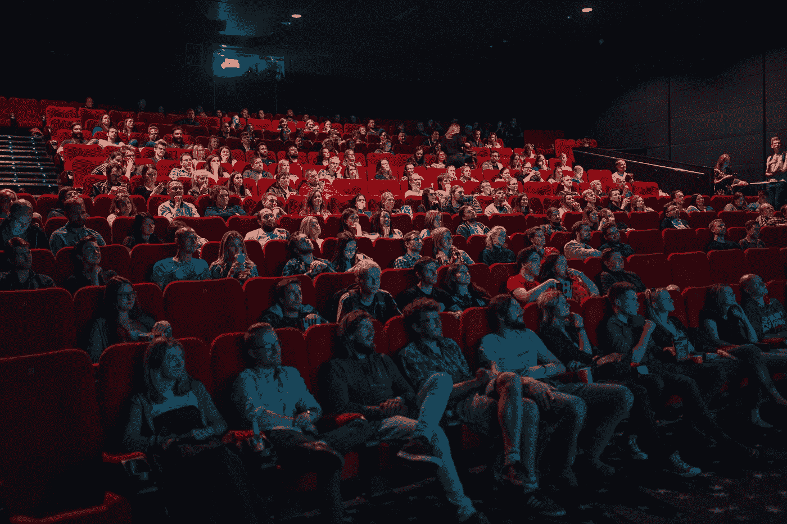

# 人工智能的应用

> 原文：<https://medium.datadriveninvestor.com/the-applications-of-ai-2492a089f571?source=collection_archive---------1----------------------->

你可能听说过人工智能，在新闻中看到过，甚至可能做过一些研究。你已经听说了这是一项了不起的技术，将会改变我们的生活…但是你真的知道为什么吗？AI 对我们的未来意味着什么？

人工智能是一种相对较新的技术，旨在让机器像人类一样工作。这意味着它可以应用于无数行业，下面列出了一些最有前途的行业。

# 运输

还记得那些你被堵在路上的时候吗？我们有一个解决方案，而且比你想象的更流行……自动驾驶汽车！市场上已经有许多半自动汽车，但全自动汽车也开始出现。自 2009 年以来，Waymo 的自动驾驶汽车一直在发展中，目前正在亚利桑那州进行测试。优步也在试验自动驾驶出租车，最近重新上路。这些汽车使用人工智能的计算机视觉和机器学习方面来导航道路。它们是有益的，因为它们可以帮助减少事故，也给乘客时间做工作，因为他们不必开车。同样，汽车中的另一个人工智能应用如此受欢迎，大多数人几乎不会想到它:… GPS。GPSs 使用人工智能找到到达目的地的最快和最容易的路线。他们考虑距离和交通等因素，然后找出最佳路线。

 [## 挑战你对人工智能和社会的看法的 4 本书——数据驱动的投资者

### 深度学习、像人类一样思考的机器人、人工智能、神经网络——这些技术引发了…

www.datadriveninvestor.com](https://www.datadriveninvestor.com/2019/02/28/4-books-on-ai/) 

# 卫生保健

看起来好像没有计算机在医疗保健中的应用，但今天实际上有人工智能医疗保健产品在使用！首先，有人工智能计算机程序可以识别某些类型的疾病。这可以帮助患者更快地获得关于他们医疗状况的结果，或者完全消除去诊所的旅行。人工智能也对基因组学产生了巨大影响。通过使用人工智能对基因组进行测序，我们能够在相同的时间内收集更多的数据，因为它可以比人更快地读取和处理数字。在基因组学中使用人工智能的另一个例子是[深度基因组学](https://www.deepgenomics.com/)。他们是一家公司，目前正致力于利用人工智能根据患者的基因构成来确定最佳药物。人工智能还可以用于医院，帮助监控病人，如果病人的病情发生变化，可以更好地通知医生。

# 金融

很多人都在纠结财务问题，无论是在工作和娱乐之间平衡金钱，还是进行正确的投资。幸运的是 AI 在这里帮助你解决所有的财务需求。人工智能不仅可以帮助平衡资金，还可以帮助防止欺诈。它能比人类更快地意识到你的账户何时被入侵，并且还能首先帮助提高安全性。一家目前财务状况良好的公司是 Wealthsimple。他们是一家使用人工智能根据你的风险水平和金额来投资你的钱的公司。

Photo by [Willian Justen de Vasconcellos](https://unsplash.com/photos/3DvIZQ0q7hM?utm_source=unsplash&utm_medium=referral&utm_content=creditCopyText) on [Unsplash](https://unsplash.com/search/photos/explore?utm_source=unsplash&utm_medium=referral&utm_content=creditCopyText)

# 探测

对人类来说，太空探索一直是一项危险的活动，因为很多事情都可能出错。这就是为什么我们依靠机器人去太空为我们探索。有一段时间，我们不得不从地球上控制机器人，这很棘手，因为如果它不断地传递信息，它很容易与控制器失去联系或更快地耗尽电量。这就是为什么我们使用像美国宇航局的*好奇号*月球车这样的机器人，将人工智能集成到系统中。他们使用计算机视觉来移动和识别岩石，然后用激光轰击它们，这样他们就可以分析灰尘并学习。这意味着他们每天只需向地球传输一次或两次，从而节省大量电池和时间。人工智能在探索中的另一个应用是 [OceanOne](https://cs.stanford.edu/group/manips/ocean-one.html) 。这是一个小型机器人，它潜入水下探索对人类有危险的地方。机器人收集并记录它所看到和感受到的数据，然后发送给人类进行分析。虽然机器人在陆地上由人类控制，但它仍然使用 AI 进行计算机视觉。

# 劳务

“嘿，谷歌，在 youtube 上播放堡垒之夜舞曲”

"阿莱克莎，启动入侵模式。"

是的，这些都是人工智能在个人服务中的例子。这些类型的机器人旨在为你服务，让你的生活更轻松。他们使用机器学习来学习你的偏好，以便下次可以变得更快、更有效。他们也用它来理解你要他们做什么。聊天机器人也是如此。许多公司使用聊天机器人来加快客户服务，节省员工的时间。这两种类型的设备通常比人类的答案更快，因为人类可能不太了解情况，必须查找答案，但机器可以快速访问互联网，几乎立即找到答案。个人服务的另一个应用也可以是受益 app。这方面的一个例子可能是心理健康应用程序。他们使用机器学习来找出什么对你改善健康有效，以便他们可以给出更个性化的建议和提示。

Photo by [Krists Luhaers](https://unsplash.com/photos/AtPWnYNDJnM?utm_source=unsplash&utm_medium=referral&utm_content=creditCopyText) on [Unsplash](https://unsplash.com/search/photos/movie-theatre?utm_source=unsplash&utm_medium=referral&utm_content=creditCopyText)

# 娱乐

特效。是的，我们都喜欢我们的特效，比如汤姆·克鲁斯从爆炸的直升机里跳出来……但是你有没有想过，“他是怎么从爆炸的直升机里跳出来的？！？！?"答案是 AI。想象一下，如果有人每次扔出一个火球都要单独画一个。这部电影要花很长时间才能上映。这就是为什么我们保存了火球的图纸。我们可以使用 AI 将它们插入到电影中，并消除粗糙的边缘。这只是人工智能在电影中的一个应用，另一个是 IBM 的人工智能系统，它制作了电影预告片。他们用其他电影预告片的例子训练该系统，然后将它用于一部名为*摩根*的恐怖电影。该系统是成功的，预告片类似于任何其他恐怖电影预告片。人工智能在娱乐领域的另一个应用是个性化体验，这与个人服务略有联系。个性化体验就像网飞能够根据你已经观看的内容预测你下一步想看什么。这对许多网飞上瘾者来说是一个非常有用的工具。；)

# 外卖食品

*   AI 在很多不同的行业都有无数的机会。
*   如今，许多应用程序已经在使用，而我们却没有意识到这一点。
*   人工智能可以通过医疗保健或金融来提高生活质量，但它也可以通过娱乐或个人服务来提高生活质量。
*   人工智能将以积极的方式改变我们的生活方式。

我希望你喜欢我这篇关于人工智能应用的文章！请在下面留下你喜欢的或者我可以改进的评论！

如果你想了解更多关于人工智能的知识，可以看看我的[文章](https://medium.com/datadriveninvestor/the-science-behind-a-modern-day-craze-artificial-intelligence-ec8c0bd9b2da)！