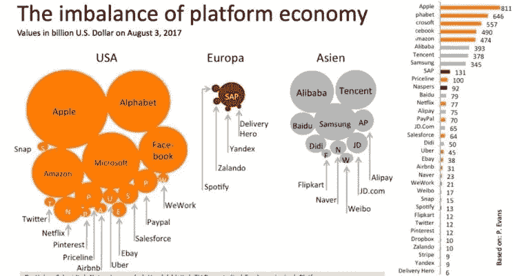
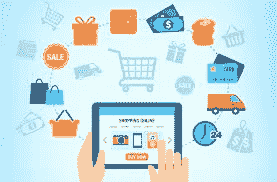

# 平台的套利！

> 原文：<https://medium.datadriveninvestor.com/the-arbitrage-of-platforms-35de078ed5a4?source=collection_archive---------2----------------------->

世界上一些最大的科技公司通过成为平台获得了大量财富。 简单来说，一个平台促成了各方之间的互动或交易。平台越来越变得比同行业的公司更有价值，这些公司限制他们提供产品或服务。想想零售业(亚马逊诉沃尔玛)或酒店业(Airbnb 诉万豪)。

在本文的过程中，我们将尝试探索为什么平台正在缓慢但稳定地成为未来的“商业模式”,然后就供应是否能在平台上长期持续进行头脑风暴。

 [## 金融科技初创公司正在颠覆全球银行业|数据驱动的投资者

### 传统的实体银行从未真正从金融危机后遭受的重大挫折中恢复过来…

www.datadriveninvestor.com](https://www.datadriveninvestor.com/2018/10/20/fintech-startups-are-disrupting-the-banking-industry-around-the-world/) 

基本的已经足够了。让游戏开始吧。

> **为什么品牌，尤其是直接面向消费者的品牌，希望与平台合作？**

乍一看，使用平台作为你的分销渠道是非常合理的。

结果证实了你的信念——即使初始投资很少，你也会看到收入的巨大增长。更好的是，你可以享受已经吞噬了所有人的互联网带来的便利。你不需要掌握复杂的物流流程或建立自己的保质期或担心差别定价。

你不需要担心为 Andriod 和 iOS 用户构建不同的应用程序，管理主题，托管服务器，雇佣工程团队进行调试，或者担心构建和维护互联网平台的其他一千个挑战。这些平台为你做脏活累活，让你开始在平台上销售产品/服务的体验变得近乎无缝。

[Source](https://media.licdn.com/dms/image/C4D12AQGWYvNpDV2Djg/article-cover_image-shrink_600_2000/0?e=1568851200&v=beta&t=lILD6UaJmDv-6okHAz7UQ7DxTIsdj23Td8_zBmg8Od8)

销售团队将关注每一个细节，在入职过程中为您提供帮助。一些平台还可以帮助你获得贷款，用于储存初始库存，在建立之后，你可以获得他们通过资本密集型折扣获得的无限量客户。一切似乎都很完美，你会诅咒自己忽略了那个平台。

毕竟， ***Zomato*** 每月有[3800 万](https://entrackr.com/2019/04/zomato-claims-38-mn-monthly-orders/)订单，而[优步每天有***1400 万***](https://www.businessofapps.com/data/uber-statistics/)次出行。

> **他们错在哪里？**

这些平台本质上都是科技公司。他们雇佣了成千上万的工程师来优化网站/应用程序的每一部分，并从你的行为中衡量每一个可能的指标。这为大多数用户提供了愉快的体验，并最终吸引了巨大的有机流量。这种有机的流量使得品牌更容易马上接触到顾客。

平台通常是一个巴里·邦兹式的大型类固醇行业——Zomato 是类固醇食品，而 Flipkart 是类固醇零售。这对于许多在数字时代无法提升自身能力的品牌来说是一剂良药。前期成本和初始资本投资更少，短期体验也很棒，但长期影响可能会比在肚子上捅刀子更痛苦。

平台可能在一个垂直行业中运作，但通常不受行业规则的约束。一家典型的快速消费品公司习惯于与杂货店和批发商合作，他们的利润比你最喜欢的夏季零食还要少。这类快速消费品公司拥有一支训练有素的分销商大军，他们冷酷无情，拿破仑会为此感到骄傲。每天，这些员工都会走进商店重新进货，如果他们能够通过偷走货架上的额外一英寸来削弱竞争对手，他们就拥有了吹嘘的权利。如果你看看交通，生活有点艰难。在这里，个人是典型的品牌，尽管相似，他们的斗争有点困难。他们需要一大早醒来，第一个到达热点，第一个排队向客户推销自己。

然而，平台上的交易是一种全新的游戏，因此有一套不同的规则。供应不是为了货架空间或成为队列中的第一名而竭尽全力，而是为了更好的评论和关键词排名而战。这是因为你可以简单地在几分钟内上线，而不需要亲临现场。这样，在城市的任何地方，你都可以比闪电侠更快地为某人提供司机服务。

然而，没有多少供应商理解新规则，而且令人震惊的是，他们也不愿意学习这些规则。一旦你开始在一个平台上提供你的产品/服务，你对价格的控制是有限的，大多数平台会给你有限的消费者信息。因此，作为平台模式运营的成本和收益一样真实。

> **推动“自有商业”**

互联网将力量从供应转移到需求，谁能更好地管理需求，谁就能笑到最后。自有商业正在推出、收购或授权全新的品牌，拥有相同的目标人群。

姓名。电子邮件。生日。周年纪念——如果你是平台上的“供应商”,你什么也得不到。在你和你的顾客之间有一堵虚拟的墙。你不能与他们直接交流，更不用说考虑围绕它建立一个社区了。如果你是一家制作公司，并在网飞的 ***、*、T3]获得了你的内容的许可，那么你很可能已经输掉了这场战争。**

[Source](https://blog.prisync.com/airplanebody/uploads/2016/06/guide_tips_ecommerce_platform.png)

平台正在进入自有商业时代。他们构建漂亮的技术能力来吸引和留住 it 客户。然后[用它来推广](https://www.linkedin.com/posts/pratyushchoudhury_data-productmanagement-technology-activity-6550701734568783872-YiD8)其他公司的产品，建立一个讨人喜欢的品牌，收集用户行为数据，并围绕它建立受众情报。管道的尽头是利用观众的智慧来制造自己的产品。这些产品可以通过不断的改进和迭代销售给现有的受众。

这是一种非常网飞的方式，它用这种方式创造了世界上最昂贵的房地产——他们的主页。它不仅控制它，甚至不把它出租给任何人，使它成为专有广告。

> **品牌能否在这些平台上建立可持续发展的品牌？**

在平台上建立可持续品牌的关键在于拥有尽可能多的关键基础设施。投资并创建一个你自己的网站，即使创建一个网站的前期成本很高，也会有真正的长期收益。这些好处通常值得前期投资，因为创造难忘的品牌体验可以减少竞争，提高利润，并加速数据收集/访问高速数据。

平台的吸引力是真实的，很难忽视拥有大量客户的预制平台的好处。但是为了短期的丰厚数字而牺牲比黄金更有价值的第一方数据是不值得的。

此外，重新定位现有受众比寻找新的受众更容易。但是如果你能成功地找到一个，比赛场地就变平了。从长远来看，拥有更多数据和能力来更有效地利用数据的人将会是赢家。有了适当的数字能力，他们可以用它来进行精确定位。如果处理得当，这将降低客户获取成本——这是 Vistara 的剧本中的一张卡片。品牌可以利用庞大的数据宝库来引导客户找到高度相关的文章。品牌可以将人们引向他们拥有和管理的网站，而不是将流量引向平台的登录页面，这将降低完成交易的成本。

有趣的是，平台上的卖家也更有可能在那里做广告，这将有助于平台增加广告收入，同时帮助他们的核心业务(通常基于微薄的利润)增长更快。

然而，这听起来容易做起来难。管理一个网站/应用程序可以让你接触到有价值的高速数据，但其真正的价值只能由能够使用绩效营销分析和预测分析的团队来利用。只有在大规模应用分析以识别隐藏模式(如客户人口统计和客户心理特征)后，这些数据才能转化为大量价值。好处是更高的客户终身价值，以及对客户从发现到购买的整个过程的完全控制。

**第 101 课:**如果你希望在一个平台上销售，千万不要把所有的资源都放在一个平台上。在多个平台上展示自己。

**第 102 课:**尽管负债累累，但你不能也不应该忽视平台。

再上几堂课，也许你就能获得工商管理学士学位。

> **结束语**

品牌需要改进他们的数字能力，不应该过于依赖一个平台。他们应该努力做到自给自足。在实现自给自足的过程中，他们需要建立自己的网站/应用程序，尝试并控制客户体验，并拥有从发现到销售的端到端客户旅程。

***免责声明:*** 请注意，我不是专家，这些仅仅是我的观点。*请不要把它们当成任何专业建议*。采取的任何行动都应该有你自己自愿和深思熟虑的研究和专业指导的支持。

击掌声，👏，按钮，如果你想鼓励一个 22 岁的作家。请记住，您需要登录才能计算您的掌声。

— — — — — — — — — — — — — — — — —

这里表达的观点是我自己的，并不反映我的任何雇主的观点，无论是现在还是过去。