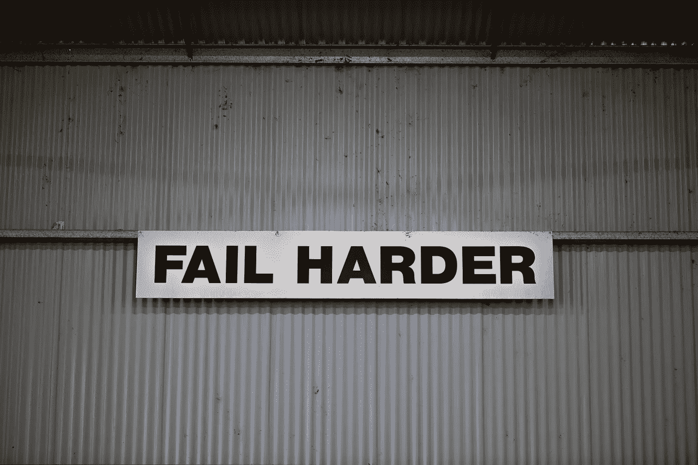
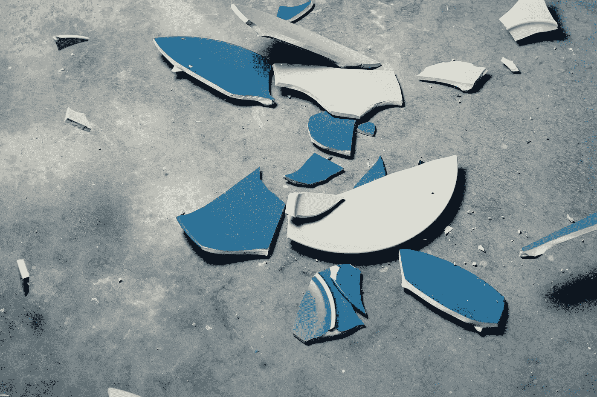
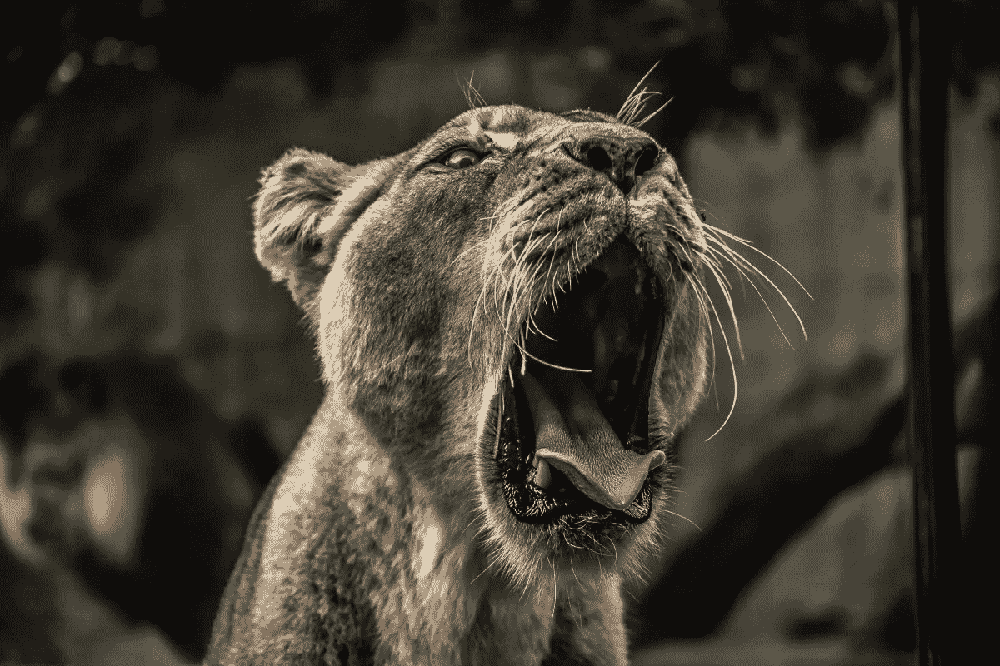

# 失败的艺术

> 原文：<https://medium.datadriveninvestor.com/the-art-of-failing-7251a6db5f0f?source=collection_archive---------6----------------------->

Photo by [Julian Dutton](https://unsplash.com/@julian_dutton?utm_source=unsplash&utm_medium=referral&utm_content=creditCopyText) on [Unsplash](https://unsplash.com/s/photos/fail?utm_source=unsplash&utm_medium=referral&utm_content=creditCopyText)

让我们从一个简单的事实开始

> “每个人都会失败，不管他们是谁，做什么”

我想可能不是这样的，如果你认识一个人(无论是同学、同事，还是一个鼓舞人心的人物)，他似乎只会收获回报，而且似乎永远不会改掉这个习惯，那就更不是这样的了。

 [## 在创业之旅中，拥抱学习|数据驱动的投资者

### 好像建立一个数百万美元的公司还不够困难，企业家必须额外照顾他们的…

www.datadriveninvestor.com](https://www.datadriveninvestor.com/2018/10/16/on-the-entrepreneurial-trek-embrace-the-learning/) 

让我试着告诉你一个小秘密。

他们确实失败了。

是的，他们有。

但是他们已经通过自己的艰辛学会了要么在胜利中扭转失败，要么通过更大的胜利来摆脱失败。因此，虽然你的命运似乎是失败，即使你可能正在努力工作，他们只是不断超越。

**但是他们是怎么做到的呢？**

这些人到底是怎么做到的？他们拥有什么样的力量？为什么我不是这样的…听起来很熟悉？

> “在你失败之后，最有可能的是，**消极的自我对话开始了”**

你把你的思想逼到一个角落，用许多负面的问题欺负它，它没有答案。生成的答案来得很快，并且与问题的性质相同。你越是推动你的思想，它就越会吸引你的能量，但仍然只是在态度上反映你的问题。几秒钟后，你剩下的只有沮丧、悲伤和憎恨。当你发现继续下去毫无意义时，你立刻放弃了你试图做的事情。

为了给“失败的艺术”的教学建立一个基础，让我们从分解这个介绍开始。

## 每个人都会失败

Photo by [chuttersnap](https://unsplash.com/@chuttersnap?utm_source=unsplash&utm_medium=referral&utm_content=creditCopyText) on [Unsplash](https://unsplash.com/s/photos/fail?utm_source=unsplash&utm_medium=referral&utm_content=creditCopyText)

不管你是谁，你从哪里来，你做什么或者你做了多久，你最终都会失败。但是不要误会，你想失败。

为什么？为什么我会想失败？

**获得经验。**

获得知识的回报，知识只属于实践者，而不属于观察者。

这就像期待成为最好的画家，仅仅是通过观察米开朗基罗、梵高、波洛克、沃霍尔和其他杰出的艺术家。

不，你需要拿起画笔，全身心地投入，必要时甚至用自己的血汗去画，否则，你只是别人作品的旁观者。

不要误解我的意思，你可能会受到启发并获得新的想法，并不是生活中的所有事情都是靠推墙实现的(让一些问题自己解决也很重要，或者只是让解决方案来找你，因为过度工作会导致另一个精神障碍)，但这不会在你的肌肉记忆中产生技能，也不会在你的大脑中产生印记。

## 但是为什么我们害怕失败呢？

想象一下这个场景。你站在一座山的边缘，脚下是一个峡谷，你看不到尽头。

你会跳吗？

我猜你不会，因为你已经从一个小得多的高度摔下来，这给你带来了很大的痛苦和折磨。从山上掉下来很可能会要了你的命。

所以你的身体会让你颤抖，恶心，并试图让你远离跳跃。

为什么？

为了保全你的生命。

我们的身体，只是肉和骨头，没有我们人类在这个星球上度过的岁月中获得的所有知识，以及我们已经完善的技能，我们仍然只是由肉和骨头组成的身体。

这些身体被创造出来是为了生存，就像自然界的其他动物一样。你需要满足你的基本需求，你需要生存。

Photo by [Samuel Scrimshaw](https://unsplash.com/@samscrim?utm_source=unsplash&utm_medium=referral&utm_content=creditCopyText) on [Unsplash](https://unsplash.com/s/photos/sabre-tooth?utm_source=unsplash&utm_medium=referral&utm_content=creditCopyText)

所以在史前时代，当我们的祖先总是担心被大型猫科动物吃掉或者自己没有食物吃的时候，这种反射帮助我们生存下来。然而今天，当我们生活舒适，不必害怕被利刃杀死时，我们仍然以同样的方式作出反应，但对不同的冲动作出反应。

> “你的大脑无法区分剑齿猫和最后期限”

所以看起来我们的处境很尴尬。

我们下一步做什么？

我们需要重新诠释失败。我们不能再看剑齿虎了，那里根本没有。

但是，怎么做呢？

> “**只有凭着信心，一跃到底，意识到我们落在一个柔软的垫子上，而不是参差不齐的岩石上。”**

这似乎不自然，但这确实是唯一的办法。你必须打破你的既定模式，向你的大脑展示，看似巨大的危险其实什么都不是。你内心的恐惧是不合理的，是建立在错误的想法上的。你做得越多，你的大脑就越不会试图阻止你。

当然，第一次它不会相信你，你必须不断给它同样的刺激，让它慢慢理解。就像教孩子一样。

好吧，但是我们从哪里开始？

我会说，从小事做起。那些对你没有太大影响的东西，慢慢地建立起你的道路。坚持做下去，保持动力，选择你能战胜恐惧的机会。

你害怕公开演讲吗？也许甚至从写博客开始，以这种方式表达自己可能是第一步，因为公共演讲创伤可能与潜在的相似性恐惧有关(人们会喜欢我做的吗？我做得好吗？)，而你需要学会放下所有的质疑，只为自己而做:)

另一个很好的练习是，从至少一次软弱开始，做一些超出你舒适区的事情，或者只是纯粹的尴尬。

为什么？

因为你会突破你的忍耐极限，在乎别人对你的看法，然后放手。在公共汽车上大笑，在街上跳舞，任何你认为是疯狂的事情，如果你身边的人会做的话。

失败的教训是，如果你认为你能想到的任何创新者都没有失败，那你就错了。但事实是，你尝试得越多，失败的次数就越多，但达到目标的几率也就越高。你可以看看 https://killedbygoogle.com，看看谷歌尝试了多少次，失败了多少次。相信我，如果不是这样，就不会是现在这样了。

你可以在埃隆·马斯克、史蒂夫·乔布斯和许多其他人身上看到同样的行为。

他们选择一个他们想去的地方，然后就去了。他们尝试过，也失败过，他们把失败当成成长，当成知识，因为如果他们没有这样做，他们仍然是在起点。

> **“把失败当成知识，把成功当成辛苦得来的奖励”**

## **消极的自我对话**

Photo by [Tim Gouw](https://unsplash.com/@punttim?utm_source=unsplash&utm_medium=referral&utm_content=creditCopyText) on [Unsplash](https://unsplash.com/s/photos/thinking?utm_source=unsplash&utm_medium=referral&utm_content=creditCopyText)

这是另一个史前机制，一直坚持到今天。想象一个场景，你会吃腐臭的食物。你会生病，会抽筋，会经历巨大的痛苦，但你也会经历一个质疑的过程:“我为什么要吃它？”，“为什么我要这样对自己？”，“下次吃什么我会谨慎的”。

在某些情况下，这样做是有意义的。但是我们自然会在任何情况下使用它。因此，每当你发现自己有负面想法时，试试这个小技巧

慢慢深呼吸，尽可能深，保持几秒钟(对初学者来说 4-5 秒应该足够了)。当吸入新鲜空气时，试着带上微笑，这会给你一点内啡肽，因此情绪转换会更容易。

慢慢呼出。你可以重复这个过程，给你的血液重新供氧，在你的身体里创造更多的正能量。

然后构思一个积极的想法，并重复给自己听，比如“下次我会摇滚！”“我感谢这次经历，下次我会做得更好！”，以锚定积极的态度面对看似糟糕的情况。

慢慢地，你会开始改变失败的心理形象，从一个问题变成机会。

你看到了吗？你不是注定要输的，实际上，我们都注定要以自己的方式赢，嫉妒其他生物只会在你自己的身体中产生不平衡/不和谐。是的，你的同事可能在他所做的事情上做得更好，但是我们并不都一样，他可能缺乏同情心，他可能没有你那么深的浪漫关系，他可能和你一样想要你所拥有的。这就是为什么你永远不应该回头看别人，而应该只看自己。

我昨天在哪里，我今天在哪里，我明天想去哪里，这与我想从我的生活和梦想中得到的东西一致吗？

这是让你真正快乐的方式:)