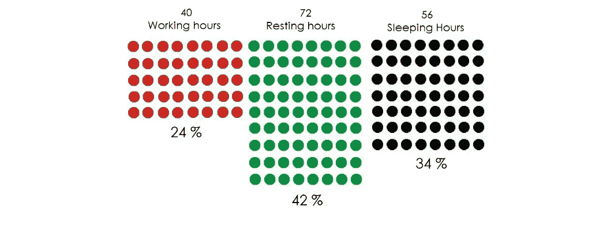

# IT 咨询的艺术

> 原文：<https://medium.datadriveninvestor.com/the-art-of-it-consulting-1677844298d9?source=collection_archive---------7----------------------->

让我们诚实地面对自己，做一名软件或系统工程师是非常累人的工作，尤其是如果你几年前才刚刚开始的话。每天我们都有新的任务要完成，我们知道我们以前从未做过，我们没有测试它，我们不知道如何以及从哪里开始…尽管如此，我们的方法论中缺乏的不是我们方式的独创性，也不是我们工程技能的熟练程度，而是一个真正的组织框架，它将围绕我们职业生活的每一个元素放在正确的位置，指定要追求的正确工具和方法。

问题不在于我们是否有必要的知识或组织…我们总是有必要的知识，因为我们可以访问互联网。但真正的问题是，我们是否有正确的方法来获取所有这些知识，组织和综合它们，以成为我们的工程方式。

在几年的时间里，我一直试图获得必要的知识来组织我的软件工程生活，这完全是一团糟。在新的软件和项目之间，需求、客户的需要、会议、架构变化、我不断忘记的程序和我不断遇到的错误，一次又一次，每次都让我头疼。所有这一切让我改变了做事的方式，安定下来，想出更好的方法去接近它们。我是一名软件和系统工程师，所以基本上框架或一套指导方针是为我制定的，也可以根据你的需要进行相应的调整。

 [## 数据科学和软件工程哪个更有前途？数据驱动的投资者

### 大约一个月前，当我坐在咖啡馆里为一个客户开发网站时，我发现了这个女人…

www.datadriveninvestor.com](https://www.datadriveninvestor.com/2019/01/23/which-is-more-promising-data-science-or-software-engineering/) 

# **时间管理**

你在有限的**时间**内完成了有限的**任务**。从这个意义上说，我们把一天中的时间分为两类，空闲时间和忙碌时间。我们两者兼顾，试图增加我们的空闲时间，减少我们的忙碌时间。

假设你睡了 8 个小时，你也休息和工作了 8 个小时。你将把一天分成三部分。从数学上来说，你应该在一周的大部分时间里休息。合乎逻辑。但是我们完全没有这种感觉，我们感觉自己在持续工作……*有什么问题？*

很明显！你从来没有一天工作 8 小时，你从来没有一天睡 8 小时，你基本上，从来没有休息过。你总是在想那封邮件、那个任务、那个问题等等……这意味着你总是把事情搞得一团糟，在应该工作的时候休息(或者有时睡觉工作)，在应该睡觉的时候工作。这从来不是数字的问题，而是你在办公室呆了多长时间！但这是一个专注和质量的问题。

所以规则很简单，把每个元素放在正确的位置。**该工作的时候工作，该睡觉休息的时候睡觉休息；**并且尽可能的让事情保持这种秩序，因为这个世界太混乱了。

## **忙碌时间**

当你工作的时候，你很忙。一天 8 小时，有时更多。你必须知道这种时间推移是什么，这样你才能将必要的工作任务放到正确的框架中。但是别忘了，你不应该在这个时间段之外忙碌。如果你觉得你通过了，那么你需要修改你的任务管理。

My tasks organization using **Evernote**

我最喜欢的在一段时间内组织任务的工具是**爱因斯坦矩阵**，非常有用。Evernote 是一个非常强大的任务进度跟踪和笔记组织工具。正如你在图片上看到的，我把每一个大的任务分成更小的任务，然后跟踪每一个任务，直到我有一个完整的检查任务表。

我不能谈论任务而不说出**脚本任务。**我天生就是个程序员，我不能撒谎说**如果我不得不做一件事情不止一次，我会自动完成**。我有一长串 Python 和 Shell 脚本，用来做重复的事情。

*(如果你碰巧像我一样，是一名软件和系统工程师，这里有一套自动化脚本可能对你有用:*[https://github.com/sbaiidrissiyoussef/Automation_Scripts](https://github.com/sbaiidrissiyoussef/Automation_Scripts))

记住，在这段时间里，你并不总是 100%地工作。有时候，你完成了任务，就没事干了。这就是你必须投资的地方。预见未来的工作，准备一些任务，做一些你知道以后要做的程序。或者像我一直做的那样写剧本。重要！

## 静止时间

这是你不工作的时间。但这也是你娱乐的时候，你和朋友聚会的时候，你躺在沙发上看网飞的时候，你熟睡的时候。这意味着这是你的私人时间，你是唯一有权定义它的人。你最好明智地使用它。

# **知识管理**

专家是知道正确事情的人，拥有完美的工具和那些奇异的文件。这不是秘密，要成为更好的工程师，你需要更好的工具。我说的是 3 种工具:**、**、**文档、软件。**

## **技能**

这些都是你掌握的东西。你烂熟于心的理论，你重复了一千遍的程序……总之，你的*知识*。当你需要向某人证明什么的时候，如果它们是完美的，就会有所不同。你越熟练，你就越有异国情调。尤其是如果你的知识在你的头脑中非常有条理(*图式*)，并且有文档记录。

## 证明文件

官方文件、书籍、程序、文章、网站……这些都应该有条理。作为一名软件工程师，你必须一遍又一遍地查阅那些参考资料，阅读它们，复制这一部分或者模仿这一部分。通过把它们放在你的手掌心，你会变得如此快速和高效。因此，保持这些文件的组织性和可访问性。

***Typora*** 是一个强大的工具，可以创建技术文档，将其导出为 pdf 格式，或者通过创建自己的 **Gitbook 在线发布。**

*(我的 Gitbook 获取更多灵感:*[*https://sbaiidrissiyoussef . git book . io*](https://sbaiidrissiyoussef.gitbook.io)*)*

## 软件

加油！我应该在 2019 年底谈这个吗？说真的！每当我让某人通过 SSH 访问服务器，而他们使用 Putty，忘记 IP 地址或密码时，我都会很生气。我的天啊！完善你的工具。

我使用 **Visual Studio 代码**或 **Sublime Text** 作为 IDE，也用它编译我的 *python 代码*。用 Evernote 做笔记，让它们随处可见(桌面和手机)。使用 **Typora、**编写技术文档，使用 **MobaXterm、**访问 SSH 服务器，还可以使用其嵌入式 ftp 服务器通过 LAN 共享内容，或者使用其嵌入式 X11 服务器显示 gui。

这只是每个工程师在启动计算机之前应该拥有的基本工具的一个小列表。保留安装介质，当你想在新电脑上工作时，在开始之前安装它们，相信我，它们会为你服务的。

# 身份管理

你有简历吗？当然，这是个什么问题。你的简历是最古老的身份管理版本，呈现你不在时的 ***工程师角色*** 。那一页纸应该展示你是谁。但是我的朋友，很沮丧。我们在 2020 年，技术和社交虚拟化的峰会就在这里，所以利用它为你的优势。

如果你的简历出现在任何地方，任何地方，在你睡觉的时候播放，而不是一个静态的单页，你给出了一个完整的活生生的你自己，会怎么样？这叫做**品牌化，**作为一名技术人员，你应该做得比任何人都好。

## 专业社交媒体

利用社交媒体为自己谋利。我更喜欢用 LinkedIn 制作一份正式的简历，展示我的经历、证书……但也可以通过定期发布一些帖子让别人一直看到我。这是要学的第一课:

> 数量重于质量是打造品牌的第一步。

你应该发布各种技术。相关的东西，连接到人，喜欢和反应他们的帖子。被视为一个活跃的人。每天花 10 分钟发布一些东西，就一个出版物。10 分钟应该够了，*量大于质。*记住。

**StackOverFlow** 也是我们一直在使用的强大工具。我们总是面临错误，我们一直在谷歌上搜索我们的技术资料，但我们也自己找到了那些仍然没有答案的问题的解决方案。为什么不贴在那个线程上呢？也许会对别人有帮助。不要自私，回到那个线程，发布你的解决方案。

Github 是你的技术数据库。你应该提交你所拥有的每一个程序，你所创建的每一个项目，并让它们留在那里。人们会看到它，只要你有机会，就用它来推销自己。这是你技能的现场展示。*你知道 python 吗？很好，给我们看看代码。*

## **个人社交媒体**

我知道，我们并不都生活在这种精通技术的生活中，我们显示器上唯一的东西就是一行行的代码。不。老实说，我很少在工作时间之外写代码，当我写的时候，我试图创造一个没有分心的氛围，忘记其他一切。

from Instagram of @morgan.codes

然而，重要的是将你的这一部分打上烙印并公之于众。只花你一天中的 5 分钟，创造出你的这个*形象*，在 **Instagram** ，在**脸书**，在**抖音上分享它。**写灵感贴，分享一些小技巧或者给出建议。

记住！*数量多于质量。*你发布的内容越多，你作为技术专家的形象就越深地印在你的追随者的脑海中。它会成为你。你不需要一直编码，你只需要更多的分享你自己的这一部分。我个人受到一些了不起的人的启发，比如 [TiffInTech](https://medium.com/u/57c57d8b8e3c?source=post_page-----1677844298d9--------------------------------) 。她在 **Instagram、**上出色地展示了自己，她让全世界都知道编码是她生活中重要的一部分，让它被铭记并鼓舞人心。

> 你是谁和你做什么不再有什么区别。——加里·维

轮到你了。遵循这些小提示，让你内心最好的工程师版本茁壮成长。相信我，事情会改变的。是时候提升自己了。

感谢您的阅读，如果您还没有这么做，请在 **Instagram** 上关注我，[https://www.instagram.com/sbaiidrissiyoussef/](https://www.instagram.com/sbaiidrissiyoussef/)

*~~作者:* **优素福·斯拜·伊德里西**