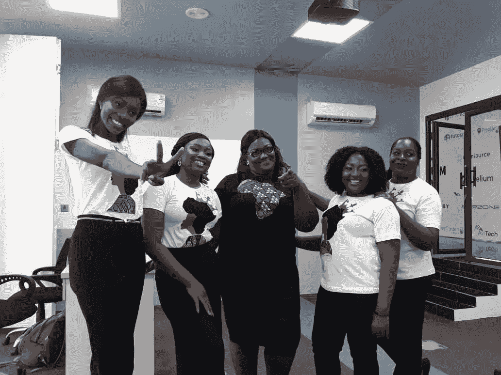
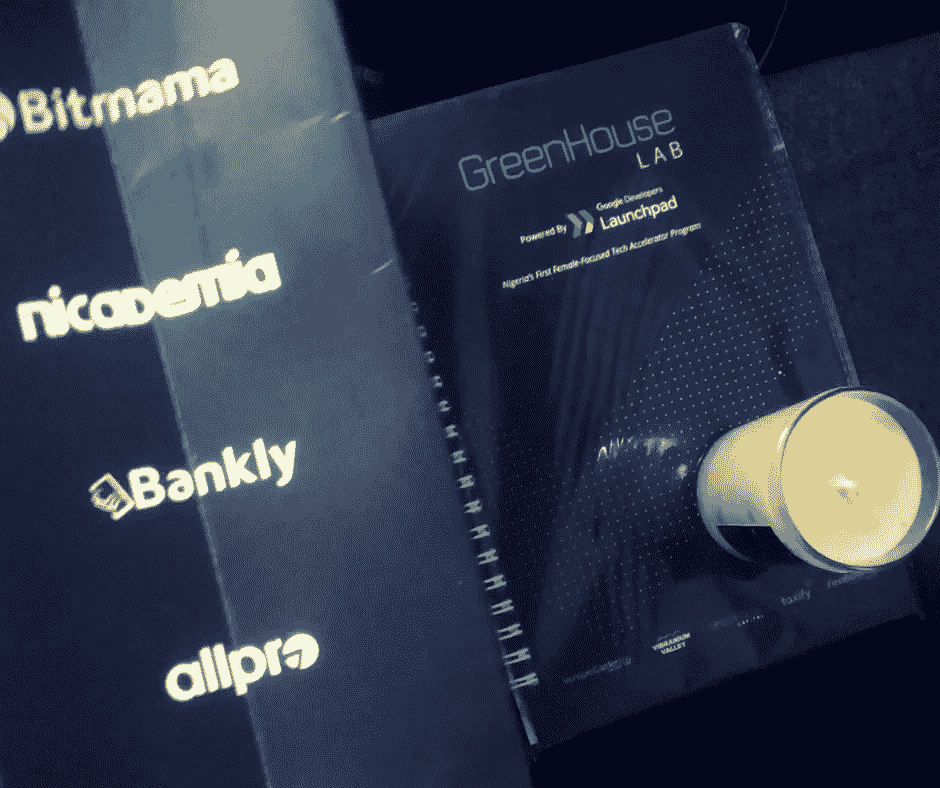

# 科技活动中的网络艺术，3 分钟指南

> 原文：<https://medium.datadriveninvestor.com/the-art-of-networking-at-tech-events-a-3-minute-guide-f89f21a9b52e?source=collection_archive---------14----------------------->

Demo Day Group Photo #demochella

我昨晚去了德莫切拉。

> 太棒了。

温室实验室正在进行演示。尼日利亚女性聚焦技术加速器。该方案旨在使女企业家具备在新兴非洲市场快速发展和扩大公司规模所需的技能、资源和支持。

过去，女性仅获得 0.2%的风投资金。有趣的是，温室实验室显示人才无处不在，但机会却不在。

这些女性正在解决现实问题，从团队[班克利](http://www.bankly.ng/#)到[安普兹](http://https`://ampz.tv)、 [ALLPROTECH](http://www.allprotech.co/) 、 [BITMAMA](http://www.bitmama.io/) 和[尼卡德米娅](http://www.nicademia.com/)。昨晚他们有机会争取到至少 10 万美元的投资。

到目前为止，我最开心的时刻是看我的朋友孙铁麟和弗雷德投球。它们是一种基于凭证的支付解决方案，面向尼日利亚以及最终非洲的无银行账户和瘦文件客户。

另一个高潮是与阿莱西亚·巴尔杜奇的谈话。她是拉各斯 Seedspace 的总经理。这是一个学习、工作和生活的环境，让科技企业家能够应对我们这个世界面临的复杂挑战。

上周，我给拉各斯的 30 个工作场所发了电子邮件，寻求合作，她给了我重要的反馈。

与她本人的会面让我对网络有了不同的看法。不强制要求别人介绍你。

你可以找到任何你需要联系的人。

谷歌和 Linkedin 已经为我们做了 90%的工作。

> 我以前很怕冷不防打电话，但是真的很管用。

我认为人们去参加科技活动是为了接受和提出请求。交换号码，寻求帮助。所有这些都很棒，但在社交网络的核心，要想做好，你必须准备好增加价值。

坐在与你同路的投资者、朋友和同事中间。从同伴、导师那里得到一个建议；既然他们不是超人。

他们有血有汗。

我肯定他们也会哭。

> 作为一名初创公司的首席执行官，我睡得像个婴儿。我**每 2 小时醒来**一次**哭**。''
> 
> 本·霍洛维茨。

我和科技公司的创始人坐在同一张桌子上，他们做着大胆的事情和开创性的想法，比如 Riby Finance、T2 和 Allprotech。

如果[班克利](https://bankly.ng)和其他创业公司可以做到，你也可以。

这给了我急需的燃料。这让我意识到我不是镇上这一带唯一的疯子。以企业家的名义挑战极限和冒险。

无论处于哪个成长阶段，每个企业家都需要经常建立关系网。这给了你建立业务的实用技巧。这是真正的艰苦学校。在建立伟大企业的旅程中，你需要建议。

一流的建议。你需要学习骗局的艺术。科技活动中的人际关系网提供了利用每个参与者的思想、存在和氛围的杠杆。

> 人际网络给你街头智慧

我认为科技活动中最好的搭讪方式应该是

"你是如何在 5 个国家发展你的创业公司的？"

> 不

"你能把我介绍给投资你们公司的人吗？"。

被介绍是好事，但我正在学习把关系当作转变，而不是交易。

社交不仅是为了会见潜在客户，也是为了保持更新。它给你一个清晰的机会去思考、创造和与志同道合的人互动。

总之，这里是我在德莫切拉的夜晚要记住的要点。

1.伸出手，冷不防打电话还是管用的。

2.每个企业家都需要街头智慧。

3.听着，听着，再听一些。

我很享受昨晚，它让我爱上了创业的喧嚣。

伟大的事情是艰难的…伟大的事情需要时间。

谢谢蒋曦儿小姐和温室实验室在礼品袋里的香薰蜡烛。

Goody bag from Demochella

> 我喜欢香味蜡烛。

