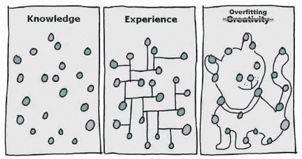
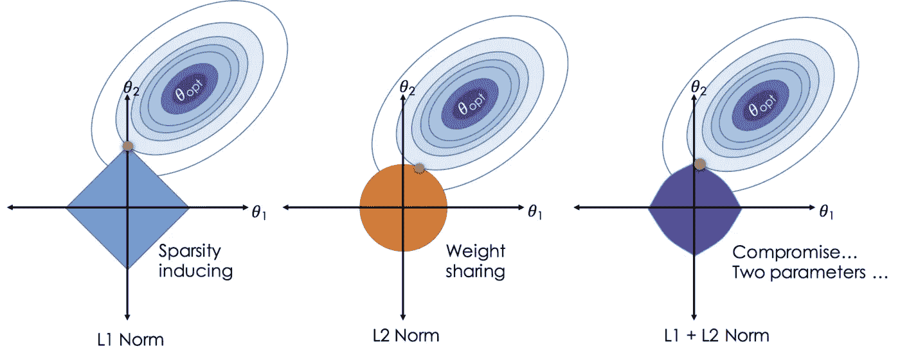

# 正规化的艺术

> 原文：<https://medium.datadriveninvestor.com/the-art-of-regularization-caca8de7614e?source=collection_archive---------7----------------------->

## 当你的模型拒绝概括时该怎么办…

欠拟合和过拟合是建立机器学习模型时最常见的问题。可以看看我之前的博客了解更多([https://medium . com/datadriveninvestor/bias-variance-trade-off-FB 5 fa 4c 8 ab 56](https://medium.com/datadriveninvestor/bias-variance-trade-off-fb5fa4c8ab56))。这篇博客讨论了过度拟合的问题，以及如何使用一种称为正则化的技术来解决这个问题。

Credits : [https://pinterest.com](https://in.pinterest.com/pin/201817627035330933/visual-search/?x=15&y=8&w=479&h=251)

**正则化是一种回归形式，它将系数估计值约束或缩小到零。这种技术不鼓励学习更复杂或更灵活的模型，以避免过度拟合。**

 [## DDI 编辑推荐:5 本机器学习书籍，让你从新手变成数据驱动专家…

### 机器学习行业的蓬勃发展重新引起了人们对人工智能的兴趣

www.datadriveninvestor.com](https://www.datadriveninvestor.com/2019/03/03/editors-pick-5-machine-learning-books/) 

有三种类型的正规化:

1.  **L1 正则化还是 L1 范数:**

*   也称为套索正则化/面板化通过将高系数设置为 0 来执行最小绝对收缩(最小可能收缩)和选择运算符(执行要素选择)。
*   它不适用于分类变量。要在分类变量上使用 L1，你可能需要使用一种叫做组合套索的东西。但即使在分组套索中，它也只会选择 1 个类别，而忽略分组变量中的其余类别。

**2。L2 正则化还是 L2 范数:**

*   也称为岭正则化/惩罚或 Tikhnov 正则化，它在不强制归零或消除特征的情况下最小化成本函数
*   在应用岭回归之前，您可能需要通过使变量达到相同的比例来对变量进行归一化。

**3。弹力网:**

*   这种正则化同时实现了套索和脊正则化。
*   这是最好的正则化类型，当有疑问时可以使用，因为它是分段线性的。

[https://towardsdatascience.com/regression-analysis-lasso-ridge-and-elastic-net-9e65dc61d6d3](https://towardsdatascience.com/regression-analysis-lasso-ridge-and-elastic-net-9e65dc61d6d3)

*如果你喜欢我的文章，并且正在用浅显易懂的数学知识寻找更多关于数据科学的帖子，请在 medium 上鼓掌或关注我。如果你有疑问，你可以在 LinkedIn 上联系我(*[https://www.linkedin.com/in/aishwarya-nair-21091994/](https://www.linkedin.com/in/aishwarya-nair-21091994/)*)。谢谢你一路读到这里，请继续关注！*